# Next.js 中的路由和数据获取

> 原文：<https://betterprogramming.pub/routing-and-data-fetching-in-next-js-aa3c7f3e2481>

## 基于文件的路由器和动态路由使用指南

马特·邓肯在 [Unsplash](https://unsplash.com?utm_source=medium&utm_medium=referral) 上的照片。

在本文中，我们将涵盖:

*   如何渲染不同路线上的特定组件？
*   静态生成和服务器端生成的区别。
*   用`getStaticProps`提取数据。
*   用`getStaticPaths`获取数据并动态生成路线。
*   通过`getServerSideProps`获取服务器端的 API 数据。

# 介绍

有一天，一个客户雇佣你在 React 为他们建一个网站。这些是他们的要求:

*   不应该是传统的单页 web app。相反，该网站应该有单独的页面，将在各自的路线上呈现。
*   因为网站应该是静态的，所以性能是最重要的。

“没问题，”你告诉他们。“我之前已经用过 [React 路由器](https://medium.com/better-programming/react-routers-explained-ff89153a6405)。这项工作将毫不费力。”但是，既然是静态网站，你希望网站的性能暴涨。"我如何建立一个高性能的网站？"你扪心自问。

经过一番研究，你发现有一个框架叫做 [Next.js](https://nextjs.org/) 。

## 什么是 Next.js，应该在什么时候使用？

Next.js 的诞生导致许多开发人员从 plain React 跳槽到 Next.js。当然，肯定有什么东西使它与众不同，对吗？

对此，我的回答是肯定的。根据这篇[堆栈溢出](https://www.notion.so/NextJS-217a86d17f094fcb8b5fec13b383a6c9#e70d0cb76421435d8d18f6db3273505c)的帖子，这个库利用了一个易于使用的路由系统，允许程序员在特定的路由上显示特定的组件。此外，它还支持服务器端渲染。这种方法允许加载时间随时间分布，从而提高性能。此外，根据[Lee Robinson](https://www.youtube.com/watch?v=rtgbaKBhdkk)(next . js 的撰稿人)的说法，这项技术可以让你在每页的基础上灵活地使用服务器端或客户端渲染。

您可能想知道，“那么为什么不在 React 路由器中使用普通 React 呢？没有必要学习另一个框架。”对此，我的回答是，简单来说，如果你的应用变得更大更复杂，性能就会退居二线。如果你的应用程序运行缓慢，没有人会想使用它。Next.js 通过缩减 JavaScript、缓存构建和其他技术来确保最大的响应能力，从而解决了这个问题。

简而言之，它使路由更容易，并确保您的静态网站的最高性能。

现在让我们把脚弄湿。作为第一步，我们将学习简单的基于文件的路由。

# 基于文件的路由

## 设置

要初始化项目，请运行以下终端命令:

终端命令写入

导航到项目的`/pages`目录。在那里，找到`index.js`文件。在`/pages/index.js`中，找到`Home`组件:

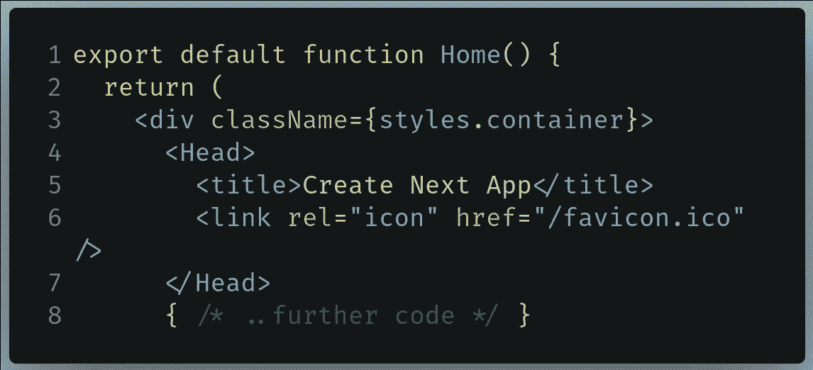

要在/pages/index.js 中查找的代码

将其替换为以下内容:

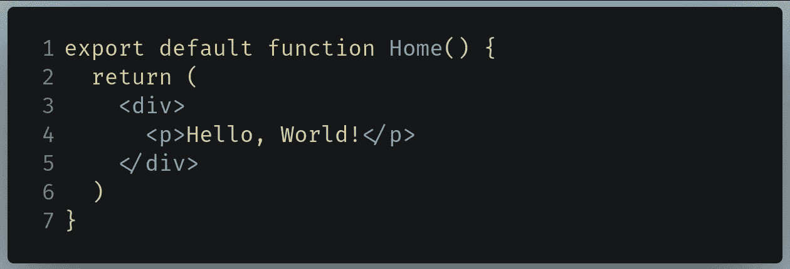

在/pages/index.js 中替换的代码

使用以下命令运行代码:

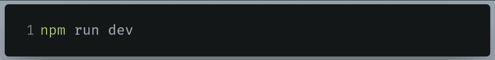

运行代码的终端命令

要查看输出，请转到`localhost:3000`。这将是结果:

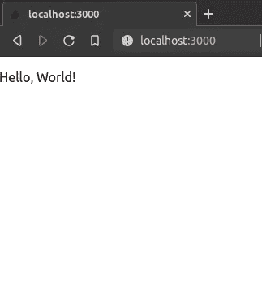

代码的输出

完成后，让我们继续为我们的应用程序创建简单的页面。

## 创建页面

Next.js 中的每个页面都由一个 React 组件驱动。为了创建页面组件，Next.js 依赖于`/pages`目录。此外，这些页面与其文件名相关联。例如:

*   当你转到`/about`路径时，`pages/about.js`中的组件被渲染。
*   同样，如果您转到`/contact`路径，Next.js 会呈现位于`pages/contact.js`中的组件。
*   此外，如果导航到`/todo/helloworld.js`，浏览器中将显示`pages/todo/helloworld.js`中的组件。
*   当你转到`/`(根)目录时，`pages/index.js`中的组件被渲染。
*   如果转到`/todo`，将显示`todo/index.js`中的 React 组件。

*注:* `*index.js*` *文件是此规则的例外。*

既然我们已经讨论了这个概念的工作原理，现在让我们用代码实现它。

在您的`/pages`目录中，创建一个名为`about.js`的文件。在那里，编写以下代码:

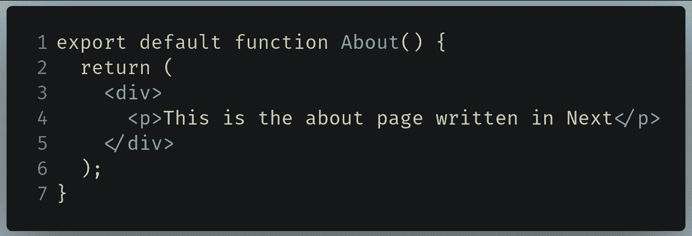

要写入/pages/about.js 的代码

*   第 1 行:创建`About`组件，然后导出它，以便它可以在项目中使用。

运行代码。这将是输出:

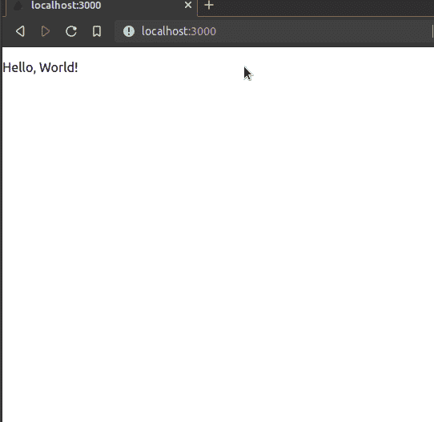

代码的输出

如您所见，我们的代码有效！当我们导航到`/about`目录时，`pages/about.js`组件被呈现到页面上。

如前所述，我们甚至可以编写代码在应用程序中实现子路由。为此，在`/pages`目录中创建一个名为`contact`的文件夹。在`contact`目录中，创建一个名为`index.js`的文件。在`/pages/contact/index.js`文件中，编写以下代码:

要写入/pages/contact/index.js 的代码

现在让我们在`/pages/contact`目录中创建另一个名为`helloworld.js`的组件。在`/pages/contact/helloworld.js`中，编写下面这段代码:

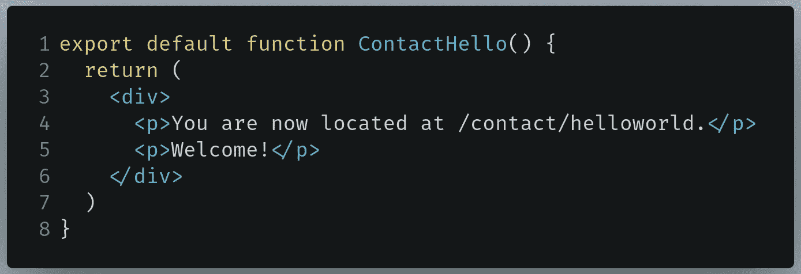

要在 pages/contact/helloworld.js 中编写的代码

运行代码。这将是结果:

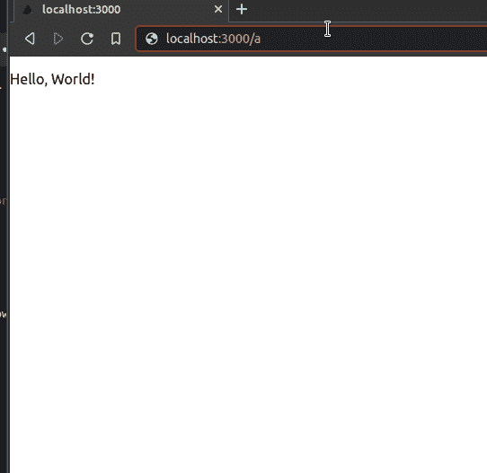

代码的输出

如您所见，我们的代码有效！当用户导航到`/contact`路线时，渲染`contact/index.js`文件。但是，当客户端转到`/contact/helloworld`路径时，`ContactHello`组件会显示自己。

从我们需要编写的代码量来看，显然 Next.js 让开发人员在我们的项目中编写路由代码变得非常容易。

在下一节中，我们将学习动态路由的基础知识。

## 动态路由

让我们假设你的网站上有一个各种人的联系信息的目录。在这种情况下，您可能希望用`/contact/{id}`格式对您的路线进行编码，其中`{id}`是包含列表中特定人员的 ID 的参数。例如:

*   `contact/1`显示列表中第一个联系人的信息。
*   以类似的方式，`contact/2`给我们第二次联系的数据，等等。

那么我们该怎么做呢？一个可能的解决方案是让我们的`/pages`目录具有以下文件结构:

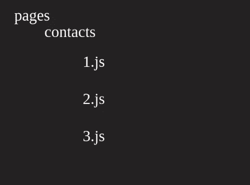

处理三个联系人项目

当然，那可能有用。但是，如果我们有数百个联系人项目呢？这将使得为更多的联系人编写更多的代码变得极其乏味和耗时。幸运的是，Next.js 已经有了这样的系统。

在您的`pages/contact`文件夹中，创建一个名为`[id].js`的文件。这个`[id].js`文件将在用户导航到`/contact/{id}`路线时呈现，其中`{id}`是一个参数。

在`/pages/contact/[id].js`中，编写以下代码:

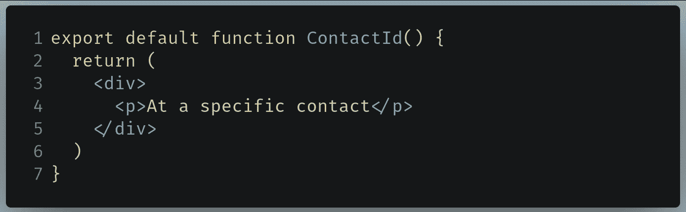

要写入/pages/contact/[id]的代码。射流研究…

现在运行代码。这将是结果:

代码的输出

如您所见，当我们导航到`/contact/{id}`页面时，我们的组件被渲染。这意味着我们的代码有效！

但是，还有一个问题:我们如何提取`{id}`参数？这就是`useRouter`挂钩的用武之地。

## 用户外部挂钩

`useRouter`钩子本质上告诉我们关于 URL 的信息(例如，用户当前所在的路线或参数)。在本文中，我们将只关注参数。

在`/pages/contact/[id].js`中，找到下面这段代码:

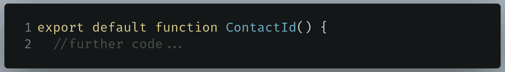

要在/pages/contact/[id]中查找的代码。射流研究…

现在将其替换为以下内容:

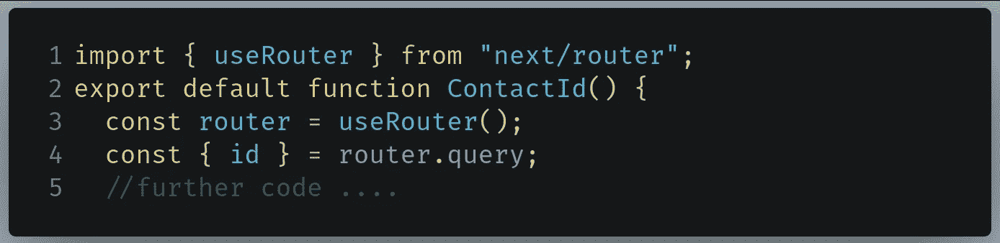

用 in /pages/contact/[id]替换的代码。射流研究…

*   第 1 行:导入`useRouter`挂钩。
*   第 3 行:创建一个`useRouter`实例，它将为我们提供关于当前路线中有哪些参数的数据。
*   第 4 行:使用[对象析构](https://www.javatpoint.com/es6-object-destructuring)从位于`useRouter`实例中的`query`对象中提取`id`参数。

现在剩下的就是显示 ID 了。在`/pages/contact/[id].js`中，找到你的`return`块:

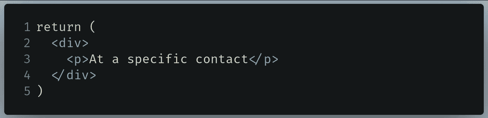

要在/pages/contact/[id]中查找的代码。射流研究…

现在像这样替换它:

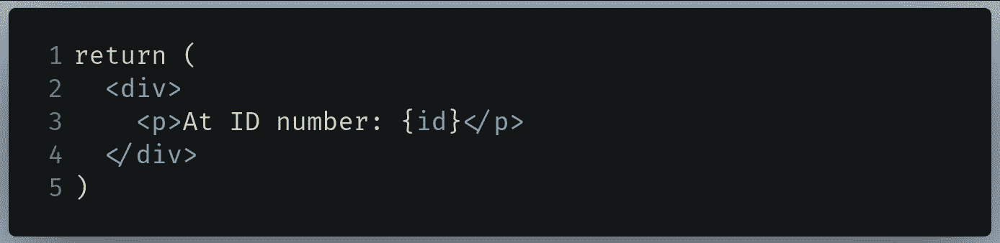

用 in /pages/contact/[id]替换的代码。射流研究…

*   第 3 行:显示当前的`id`参数。

运行代码。这将是结果:

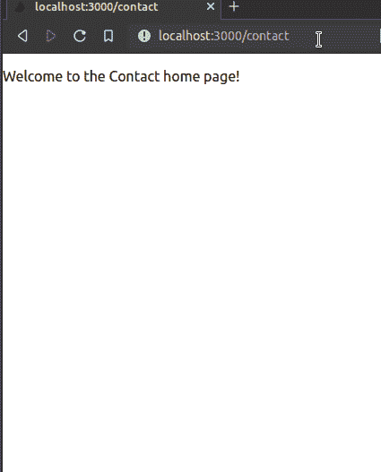

代码的输出

太好了！我们的代码有效。如您所见，我们的页面显示了当前的`id`参数。

我们现在已经完成了这一部分。在本文的下一部分，我们将学习如何通过 Next.js 框架从 API 获取数据。

最终，`/pages/contact/[id].js`应该是这样的:

[*本节 GitHub 回购*](https://github.com/HussainArif12/next-file-routing)

# 从外部 API 获取数据

## 设置

这个过程与上一节类似。然而，我们的存储库的名称被设置为`next-api-fetch`。

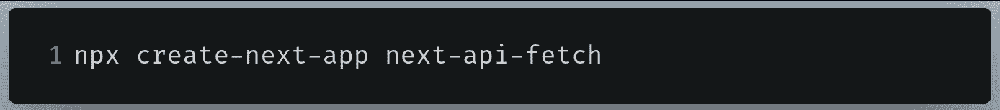

初始化 repo 的终端命令

完成后，我们将首先了解服务器端生成和静态生成的区别。

## 静态侧发电

假设您正在从[待办事项 API](https://jsonplaceholder.typicode.com/todos) 获取数据，并显示所有项目:

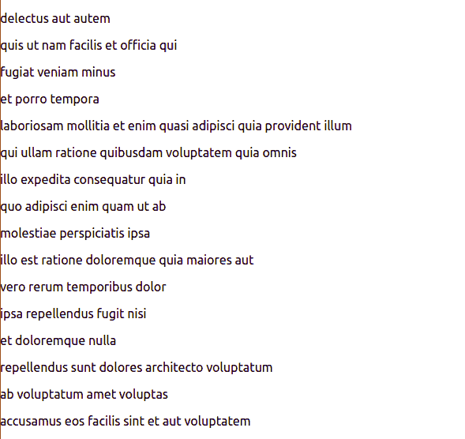

待办事项 API 中的项目列表

当您告诉 Next.js 构建这个页面时，JavaScript 代码被编译并转换成 HTML，如下所示:

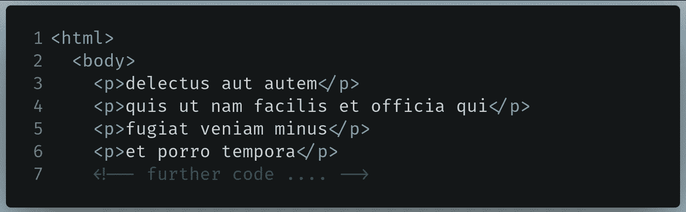

转换的 HTML 代码

这些 HTML 代码是提供给用户的，而不是在每次请求时都呈现 JavaScript。因此，渲染过程很快。

此外，由于这个待办事项 API 中的项目是静态的(它们不会很快改变)，静态生成是一个很好的用例。

现在让我们了解一下服务器端生成。

## 服务器端生成

作为一个例子，让我们使用这个[体育 API](https://www.thesportsdb.com/api.php) 来获取实况足球比赛的比分。在这里，数据是实时变化的。因此，Next.js 缓存这段代码的结果是没有意义的，因为它会在用户每次刷新页面时发生变化。

在这种情况下，服务器端生成非常合适。

总之，对于不经常变化的数据使用静态生成，而对于经常变化的数据使用后者。

现在我们已经了解了生成的方法，让我们了解一下`getStaticProps`方法。

## 使用 getStaticProps 提取

顾名思义，`getStaticProps`方法使用静态端生成。我们将使用[待办事项 API](https://jsonplaceholder.typicode.com/todos) 。

在`pages/index.js`中，在文件末尾写下以下代码:

*   第 1 行:导出`getStaticProps`函数。
*   第 2 行:在 To-Dos API 上执行一个`fetch`函数，并将原始数据存储到`res`变量中。
*   第 3 行:将原始数据转换成 JSON 并存储到`todos`变量中。
*   第 5 行:将转换后的数据作为道具发送。

我们现在已经将提取的数据导出为道具。最后一步是显示它。

在`/pages/index.js`中，找到下面这段代码:

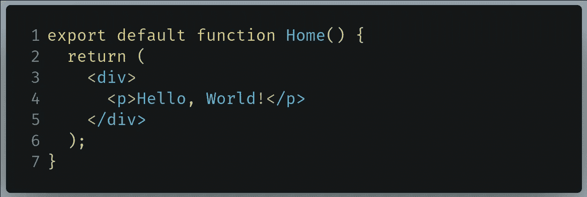

要在/pages/index.js 中查找的代码

用下面的代码片段替换它:

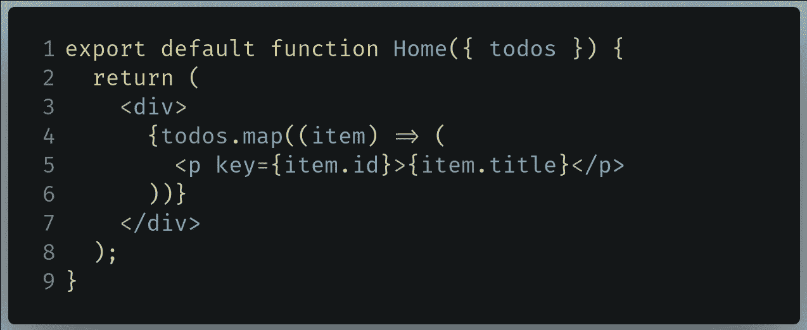

在/pages/index.js 中替换的代码

*   第 1 行:引入作为道具从`getStaticProps`方法接收的`todos`对象。
*   第 4 行:在数组上使用`map`方法，显示每一项的`title`字段。

运行代码。这将是结果:

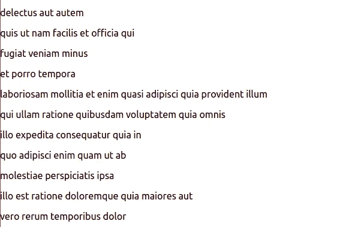

代码的输出

如您所见，我们的代码有效！我们能够在页面上显示所有的项目。

最后，`pages/index.js`应该是这样的:

在一个理想的世界中，我们希望我们的每一个项目将我们带到一个单独的页面，在那里显示它的其余属性。为了实现这一目标，我们可以这样做:

*   使用一个`[Link](https://nextjs.org/docs/api-reference/next/link)`组件，以便每个项目都是“可点击的”
*   当一个项目被点击时，它会把我们带到另一个带有`/todo/{id}`路径的页面，其中`id`是待办事项列表项目的 ID。
*   在`/todo/{id}`页面，对 ID 字段为`{id}`的待办事项执行`fetch`请求。
*   在`/todo/{id}`页面上显示该项目的所有字段。

现在让我们用代码实现它。在`/pages/index.js`中，首先将`Link`导入到您的项目中，如下所示:

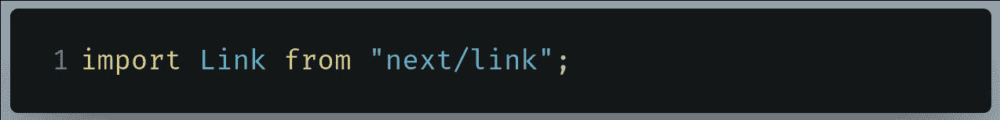

要写入/pages/index.js 的代码

现在，在同一个文件中找到下面这段代码:

要在/pages/index.js 中查找的代码

像这样改变它:

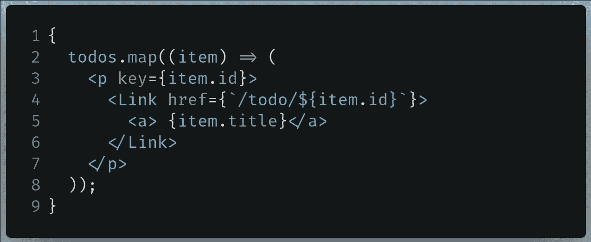

在/pages/index.js 中替换的代码

*   第 4 行:使用`Link`组件将用户重定向到`/todo`路线以及作为参数的`id`字段。Next.js 中的`Link`元素类似于`a`标签。
*   第 5 行:显示该项目的`title`字段。

运行代码。这将是结果:

代码的输出

如您所见，我们的代码有效！我们的项目会将我们重定向到适当的位置。然而，当我们点击这些项目中的任何一个时，我们会遇到一个错误。这是因为我们还没有处理这些路线。

剩下的就是实现动态路由，多亏了 Next.js 框架，这简直是小菜一碟。在下一节中，我们将通过`getServerSideProps()`函数应用嵌套和动态路由。

## 使用 getServerSideProps 提取

`getServerSideProps`函数使用服务器端生成来获取数据。这是因为我们希望在请求时获取我们选择的待办事项。

在您的`/pages`目录中，创建一个名为`/todo`的文件夹。在`/pages/todo`文件夹中，创建一个名为`[id].js`的文件。

在`/pages/todo/[id].js`中，编写下面这段代码:

*   第 1 行:接收从`getServerSideProps`函数中作为道具接收的`todo`对象。
*   第 4-6 行:显示`todo`对象的属性。如果`completed`字段为`true`，则应勾选复选框。
*   第 11 行:导出`getServerSideProps`方法。该函数中的`context`参数包含关于 URL 和其他属性的信息，您可以在文档中了解更多关于[的信息。](https://nextjs.org/docs/basic-features/data-fetching)
*   第 12 行:获取关于特定待办事项的数据。我们可以通过使用包含 URL 参数值的`context.params`对象来做到这一点。这里，我们正在访问`id`参数的值。
*   第 19 行:将提取的数据导出为道具。

运行代码。这将是结果:

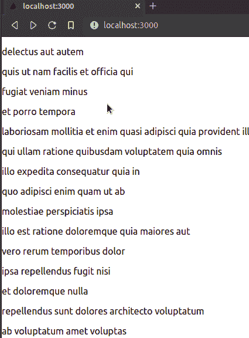

代码的输出

太好了！如您所见，我们的代码是有效的。我们能够点击任何项目，这给我们提供了关于特定待办事项的进一步信息。

在下一节中，我们将学习`getStaticPaths`功能。

## 使用 getStaticPaths 生成路径

虽然我们的网站功能如预期，但仍有一个问题:如果用户试图导航到一个不存在的待办事项怎么办？比如他们想去`localhost:3000/todo/4300`怎么办？显然，在我们的例子中，没有带有`4300`的`id`的项目。在这种情况下，我们想要抛出一个`404: Page not found`错误。

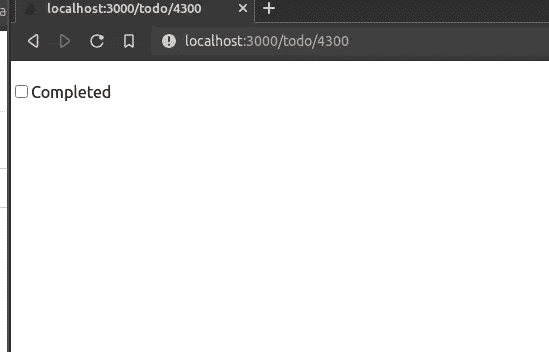

我们想在这里抛出一个错误。

为了解决这个问题，我们需要告诉 Next.js 应该呈现什么路径。这就是`getStaticPaths`的用武之地。该功能使用静态侧生成，并与`getStaticProps`方法配合使用。

在`/pages/todo/[id].js`中，找到下面这段代码:

将`getServerSideProps`功能重命名为`getStaticProps`，如下所示:

作为最后一步，在`pages/todo/[id].js`的末尾编写以下代码:

*   第 1 行:导出`getStaticPaths`函数。
*   第 5 行:创建一个包含 API 中所有待办事项的`id`字段的`paths`数组。
*   第 9 行:返回`paths`对象。这实际上告诉 Next.js 将呈现什么路径。
*   第 10 行:`fallback`标志告诉 Next.js 如果用户转到一个不支持的路径(例如，如果他们试图用`4300`的`id`获取一个待办事项，即使它并不存在)时抛出一个错误。

运行代码。这将是结果:

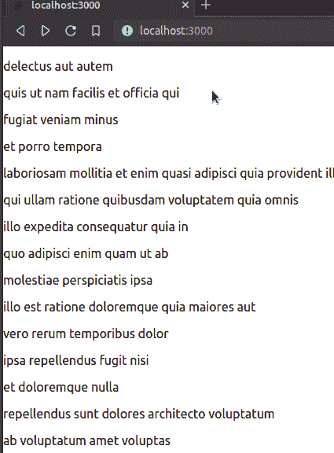

代码的输出

如您所见，我们的代码输出和以前一样。

但是试着去`localhost:3000/todo/250`。由于没有带有`250`的`id`的项目，现在会抛出一个错误。

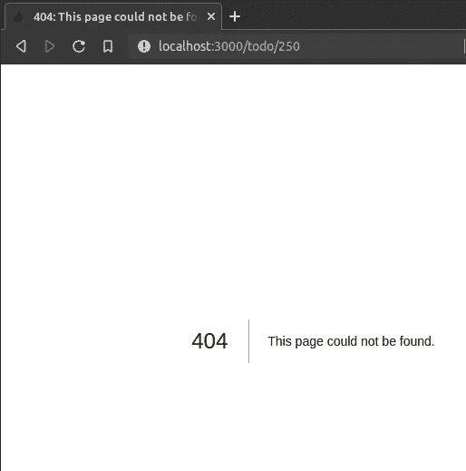

在不支持的页面上引发错误

太好了！如您所见，我们的代码是有效的。

我们甚至可以通过`getStaticPaths`功能减少生成路径的数量。转到`/pages/todo/[id].js`并找到以下代码:

像这样改变它:

*   第 7 行:只会生成两条静态路径。否则，将抛出一个`404: Page not found`错误。

运行代码。这将是结果:

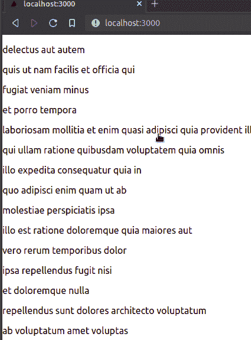

代码的输出

太好了！如你所见，我们成功了。只生成了两条动态路径。

最后，`/pages/todo/[id].js`应该是这样的:

[*本节 GitHub 回购*](https://github.com/HussainArif12/nextjs-data-fetching)

# 延伸阅读和 GitHub Repos

## GitHub 仓库

*   [基于文件路由的回购](https://github.com/HussainArif12/next-file-routing)
*   [数据取数回购](https://github.com/HussainArif12/nextjs-data-fetching)

## 更多资源

*   [Next.js —网络忍者的页面和路线](https://www.youtube.com/watch?v=zktJ8-k0JDc&list=PL4cUxeGkcC9g9gP2onazU5-2M-AzA8eBw&index=2)
*   [Next.js —网忍者 getStaticProps](https://www.youtube.com/watch?v=zueyEdRZQlk&list=PL4cUxeGkcC9g9gP2onazU5-2M-AzA8eBw&index=10)
*   [next . js—官方文档中的数据获取](https://nextjs.org/docs/basic-features/data-fetching)
*   [Next.js 通过 Traversy 媒体获取数据](https://youtu.be/mTz0GXj8NN0?t=1876)

# 结论

Next.js 已经成为博客框架市场的顶级竞争者，这是理所当然的。它不仅允许我们构建高性能和可伸缩的 React 应用程序，而且它还实现了路由，对开发人员来说没有任何麻烦。难怪它在 [Traversy Media 的视频](https://youtu.be/VfGW0Qiy2I0?t=1724)中被描述为 2021 年要学习的惊人框架。

如果您在学习本教程的过程中遇到任何困难，请解构并使用代码示例，以便您可以完全掌握主题。谢谢你坚持到最后！

下一篇文章:[用 Next.js 和 Strapi](/build-your-personal-blog-with-next-js-and-strapi-e092bf11d3db)
创建你的个人博客上一篇文章:[在 React With Framer Motion 中创建动画](/create-amazing-animations-in-react-using-framer-motion-34c803f60c6f)