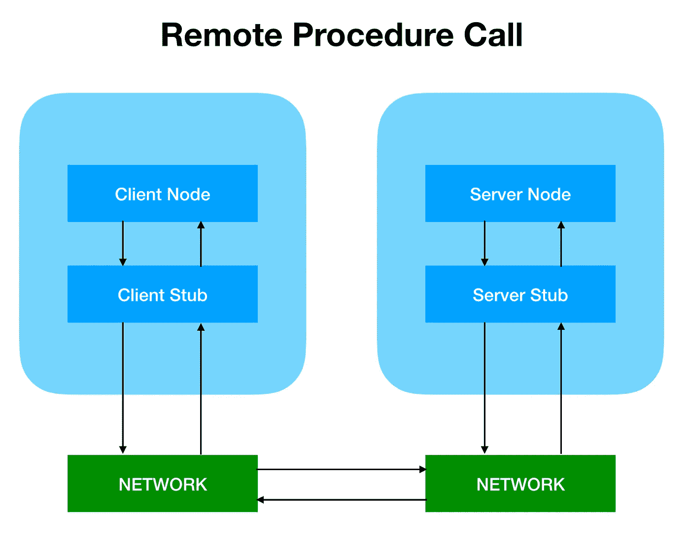

# Golang 中的 RPC 是什么？

> 原文：<https://betterprogramming.pub/rpc-in-golang-19661033942>

## Go 中远程过程调用概述


图片由 [Ishan @seefromthesky](https://unsplash.com/@seefromthesky?utm_source=unsplash&utm_medium=referral&utm_content=creditCopyText) 在 [Unsplash](https://unsplash.com/s/photos/network?utm_source=unsplash&utm_medium=referral&utm_content=creditCopyText) 上拍摄

# 什么是 RPC？

*远程过程调用* (RPC)是分布式计算中的子程序。RPC 的远程实现类似于本地调用，但通常并不相同。RPC 通常要求将对象名、函数名或参数传递给远程服务器，然后服务器将处理后的结果返回给客户端(请求-响应)。RPC 可以通过 TCP、UDP 或 HTTP 协议进行通信。



Golang 中有三种类型的实现，即:

*   `net/rpc`
*   `net/rpc/jsonrpc`
*   `gRPC`

# net/rpc

[Golang 官方文档](https://golang.org/)使用`net/rpc` 包中的`encoding/gob`作为编码或解码方法，支持 TCP 或 HTTP 协议。但是因为`gob`编码只在 Golang 中使用，所以只支持用 Golang 编写的服务器端和客户端交互。

服务器端的例子`net/rpc`:

```
package mainimport ( "fmt" "log" "net" "net/rpc")type Listener int type Reply struct { Data string}func (l *Listener) GetLine(line []byte, reply *Reply) error { rv := string(line) fmt.Printf("Receive: %v\n", rv) *reply = Reply{rv} return nil}func main() { addy, err := net.ResolveTCPAddr("tcp", "0.0.0.0:12345") if err != nil { log.Fatal(err) } inbound, err := net.ListenTCP("tcp", addy) if err != nil { log.Fatal(err) } listener := new(Listener) rpc.Register(listener) rpc.Accept(inbound)}
```

在这个例子中，我们注意到`GetLine`函数被添加到了`Listener`中。该函数将返回一个`error`类型，同时期待来自客户端的内容行和回复。它也必须是一个指针，所以声明一个`Reply`结构来存储相应的`Data`。

在主函数中，首先我们使用`net.ResolveTCPAddr`和`net.ListenTCP`建立一个 TCP 连接，监听来自所有地址的 12345 端口。最后，我们使用`rpc.Register`注册要监听的连接，接受来自上述 TCP 连接的所有请求。

客户端示例`net/rpc`:

```
package mainimport ( "bufio" "log" "net/rpc" "os")type Reply struct { Data string}func main() { client, err := rpc.Dial("tcp", "localhost:12345") if err != nil { log.Fatal(err) } in := bufio.NewReader(os.Stdin) for { line, _, err := in.ReadLine() if err != nil { log.Fatal(err) } var reply Reply err = client.Call("Listener.GetLine", line, &reply) if err != nil { log.Fatal(err) } log.Printf("Reply: %v, Data: %v", reply, reply.Data) }}
```

客户端将使用`rpc.Dial`建立到服务器和端口的连接，这是一个无限的`for`循环，带有`ReadLine`函数，接受来自接收端口的输入。如果其间的线路有任何中断，这将触发`client.Call`并启动`GetLine`功能。通过这个过程，`reply`将被存储在数据库中，我们可以用`reply.Data`将它调用出来(基本上，这意味着我们输入的就是我们在输出中得到的)。让我们试着运行代码:

```
❯ go run simple_server.go
Receive: hi
Receive: haha❯ go run simple_client.go
hi
2019/12/05 18:19:14 Reply: {hi}, Data: hi
haha
2019/12/05 18:19:15 Reply: {haha}, Data: haha
```

# net/rpc/jsonrpc

`net/rpc`只支持 Golang，所以 Go 库在跨语言平台中使用`net/rpc/jsonrpc`支持 RPC。要实现与上面相同的应用程序，我们只需更改`main()`函数中的`rpc.Accept`。

服务器端的例子`net/rpc/jsonrpc`:

```
import "net/rpc/jsonrpc"func main() { addy, err := net.ResolveTCPAddr("tcp", "0.0.0.0:12345") if err != nil { log.Fatal(err) } inbound, err := net.ListenTCP("tcp", addy) if err != nil { log.Fatal(err) } listener := new(Listener) rpc.Register(listener) for { conn, err := inbound.Accept() if err != nil { continue } jsonrpc.ServeConn(conn) }}
```

客户端示例`net/rpc/jsonrpc`:

```
func main() { client, err := jsonrpc.Dial("tcp", "localhost:12345") //Only change this if err != nil { log.Fatal(err) } in := bufio.NewReader(os.Stdin) for { line, _, err := in.ReadLine() if err != nil { log.Fatal(err) } var reply Reply err = client.Call("Listener.GetLine", line, &reply) if err != nil { log.Fatal(err) } log.Printf("Reply: %v, Data: %v", reply, reply.Data) }}
```

`json-rpc`基于 TCP 协议，目前尚不支持 HTTP 方法。结果将与上一个示例相同:

```
❯ go run simple_server.go
Receive: hi
Receive: haha❯ go run simple_client.go
hi
2019/12/05 20:20:19 Reply: {hi}, Data: hi
haha
2019/12/05 20:20:20 Reply: {haha}, Data: haha
```

请求中的 JSON 对象有两个对应的结构:`clientRequest`和`serverRequest`。

```
type serverRequest struct { Method string           `json:"method"` Params *json.RawMessage `json:"params"` Id     *json.RawMessage `json:"id"`}type clientRequest struct { Method string         `json:"method"` Params [1]interface{} `json:"params"` Id     uint64         `json:"id"`}
```

我们可以在其他编程语言中使用这个结构来发送消息。让我们在命令行中尝试一下:

```
❯ echo -n "hihi" |base64  # Parameters must be base64 encodedaGloaQ==~/strconv.code/rpc master*❯ echo -e '{"method": "Listener.GetLine","params": ["aGloaQ=="], "id": 0}' | nc localhost 12345{"id":0,"result":{"Data":"hihi"},"error":null}
```

# gRPC

`jsonRPC`可以支持其他语言但不支持 HTTP 方法的事实限制了它在现实生活中的应用。因此，对于生产环境，我们通常使用像`Thrift`或`gRPC`这样的替代方法来克服这个问题。

gRPC 是 Google 推出的一个高性能、广泛使用的开源 RPC 框架。它主要是为基于 HTTP/2 标准协议的现代应用程序中的并发性而设计的。它是用 Protobuf 序列化协议开发的，支持 Python、Golang 和 Java 等流行语言。

# 原蟾蜍

[*Protobuf*](https://en.wikipedia.org/wiki/Protocol_Buffers) 是 Protocol Buffers 的缩写，其中是 Google 的语言中立、平台中立、可扩展的序列化结构化数据的机制，类似于 XML 或 JSON 格式。它重量轻、速度快，非常适合在 RPC 网络中存储数据或交换数据。

首先，安装 Protobuf:

```
❯ brew install protobuf❯ protoc --versionlibprotoc 3.7.1go get -u github.com/golang/protobuf/{proto,protoc-gen-go}
```

然后，根据 [proto3](https://en.wikipedia.org/wiki/Protocol_Buffers) 写入样本数据:

```
syntax = "proto3";package simple;// Requestmessage SimpleRequest {string data = 1;}// Responsemessage SimpleResponse {string data = 1;}// rpc methodservice Simple { rpc  GetLine (SimpleRequest) returns (SimpleResponse);}
```

上面例子中的`request`和`response`只有一个`data`字符串。`Simple`服务只有一个以`SimpleRequest`为输入的`GetLine`方法，它返回`SimpleResponse`。让我们试一试:

```
❯ mkdir src/simple❯ protoc --go_out=plugins=grpc:src/simple simple.proto❯ ll src/simpletotal 8.0K-rw-r--r-- 1 xiaoxi staff 7.0K Dec 05 21:43 simple.pb.go
```

这成功地在`src/simple`下创建了一个`simple.pb.go`文件来支持 gRPC。

# 如何使用 gRPC

首先，安装 gRPC:

```
❯ go get -u google.golang.org/grpc
```

然后，将`src/simple`导入代码:

```
package mainimport ( "fmt" "log" "net" pb "./src/simple" "golang.org/x/net/context" "google.golang.org/grpc")type Listener intfunc (l *Listener) GetLine(ctx context.Context, in *pb.SimpleRequest) (*pb.SimpleResponse, error) { rv := in.Data fmt.Printf("Receive: %v\n", rv) return &pb.SimpleResponse{Data: rv}, nil}func main() { addy, err := net.ResolveTCPAddr("tcp", "0.0.0.0:12345") if err != nil { log.Fatal(err) } inbound, err := net.ListenTCP("tcp", addy) if err != nil { log.Fatal(err) } s := grpc.NewServer() listener := new(Listener) pb.RegisterSimpleServer(s, listener) s.Serve(inbound)}
```

我们注意到`pb "./src/simple"`是作为一个包导入的，并被重命名为`pb`。

`GetLine`功能的第一个参数是`context.Context`。第二个参数是`*pb.Simple-Request`(请求在`.proto`文件中定义)。该函数将返回`(*pb.SimpleResponse, error)`，其中`pb.SimpleResponse`对应于`.proto`文件中的定义。另一方面，尽管`SimpleRequest`和`SimpleResponse`在`.proto`文件中是骆驼文，但使用时需要大写。

客户端:

```
package mainimport ( "bufio" "log" "os" pb "./src/simple" "golang.org/x/net/context" "google.golang.org/grpc")func main() { conn, err := grpc.Dial("localhost:12345", grpc.WithInsecure()) if err != nil { log.Fatal(err) } c := pb.NewSimpleClient(conn) in := bufio.NewReader(os.Stdin) for { line, _, err := in.ReadLine() if err != nil { log.Fatal(err) } reply, err := c.GetLine(context.Background(), &pb.SimpleRequest{Data: string(line)}) if err != nil { log.Fatal(err) } log.Printf("Reply: %v, Data: %v", reply, reply.Data) }}
```

首先，使用`grpc.Dial("localhost:12345", rpc.WithInsecure())`建立连接。然后使用`pb.NewSimpleClient`创建一个新的`simpleClient`实例，格式为`XXXClient`。(XXX 之前在`.proto`文件中定义，用于`service Simple`中的`simple`)。

使用以下命令来使用 RPC:

```
reply, err := c.GetLine(context.Background(), &pb.SimpleRequest{Data: string(line)})
```

`GetLine`在`.proto`文件(`rpc GetLine(SimpleRequest) returns (SimpleResponse)`)中定义。第一个参数是`context.Background()`。第二个参数是`request`。因为线是`[]byte`型的，所以需要转换成`string`。响应`reply`是`SimpleReponse`的实例，可以从`reply.Data`获得:

```
❯ go run grpc_server.go
Receive: hi
Receive: Haha
Receive: vvv❯ go run grpc_client.go
hi2019/12/06 07:57:48 Reply: data:"hi" , Data: hi
Haha
2019/12/06 07:57:51 Reply: data:"Haha" , Data: Haha
vvv
2019/12/06 07:57:53 Reply: data:"vvv" , Data: vvv
```

在这篇文章中，我们解释了 RPC(远程过程调用)和 Golang 中的三种实现类型。此外，我们还介绍了`net/rpc`、`net/jsonrpc`和`grpc`的代码示例。编码快乐！