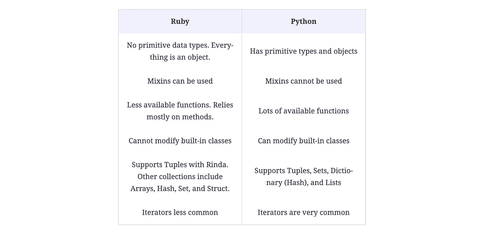

# Python 程序员的 Ruby:如何进行转换

> 原文：<https://betterprogramming.pub/ruby-for-python-programmers-how-to-make-the-switch-770dc1aae974>

## 帮助您从 Python 过渡到 Ruby 的介绍


作者图片

Ruby 是一种通用的、动态的、开源的编程语言，专注于简单性和高效性。Ruby 经常被拿来和 Python 比较。—许多开发人员说，如果你已经了解 Python，学习 Ruby 会更容易，因为有相似之处。然而，这两种语言也有很大的不同。

我们创建了这个基本介绍来帮助你从 Python 过渡到 Ruby。我们将讨论它们的主要区别，然后深入了解 Ruby 的语法，这样您就可以很快掌握代码。

以下是我们今天要讲的内容:

*   Ruby vs Python
*   主要代码差异汇总
*   你好，鲁比世界
*   Ruby 语法快速指南
*   Ruby 下一步要学什么

# Ruby vs Python

Ruby 和 Python 都是流行的编程语言，以其速度、简单性和用户友好的语法而闻名。这两种语言都是灵活的、面向对象的、动态的，并且有许多有用的框架和库，特别是对于 web 应用和 web 开发*(例如 Ruby 的* [Ruby on Rails](https://www.educative.io/blog/ruby-on-rails) 或者 Python 的 [Django](https://www.educative.io/blog) )。

Ruby 是一种高级解释编程语言，由 Yukihiro Matsumoto 于 1995 年创建。他的目标是开发一种面向对象的脚本语言，改进当时的其他脚本语言。

Ruby 还支持函数式编程，并以类似于人类书面语言而闻名，这使得它很容易学习。

Python 是一种解释型高级通用语言，由吉多·范·罗苏姆创建，目标是代码可读性。Python 因其强大的标准库而广受欢迎。



## 职业

两种语言都被大公司使用。使用 Python 的公司包括 YouTube、Instagram、Spotify、Reddit、Dropbox。Ruby 在 Hulu、Basecamp、GitHub 和 Airbnb 都有使用。Ruby 开发人员的薪水也往往比 Python 开发人员高。StackOverflow 的 2020 年调查列出了 Ruby 的全球平均工资为 7.1 万美元，Python 为 5.9 万美元。

> 【Ruby 和 Python 的年薪都高于其他软件开发语言，包括 PHP、JavaScript 和 Java。

## 机器学习

Python 目前是机器学习(ML)和人工智能(AI)的首选语言，因为它有丰富的库和可视化工具。Ruby 确实提供了一些有竞争力的选项，但是在它与 Python 比肩之前还有很长的路要走。因此，如果你想从事数据科学方面的工作，Python 是不二之选。

## Web 框架

Ruby 和 Python 的主要 web 框架 Django 和 Ruby on Rails 非常相似。两者都基于经典的模型-视图-控制器(MVC)模式，并且都提供了相似的存储库(Python 的 PyPi 和 RubyGems 的 Ruby)。两个框架都表现很好，也很容易学习。

## 测试环境

测试驱动开发(TDD)对于 Ruby 和 Python 来说都是相当标准的，但是 Ruby 确实提供了*行为驱动开发(BDD)* 而 Python 没有，这在某些情况下可能是有用的。

## 社区

这两种语言都有大型的活跃社区，但是 Python 的社区更大一些，因为 Ruby 的开发工具 Ruby on Rails 是最受欢迎的。两个社区似乎都同样积极和支持。

Ruby 的一个好处是有独特的 Ruby 论坛和工作论坛，因为这种语言在某些方面更加专业化。

# 主要代码差异汇总

既然我们已经在高层次上理解了 Ruby 和 Python 之间的区别，那么让我们深入了解它们之间的主要代码差异。我们已经编译了与 Python 不同的主要内容。

在 Ruby 编程语言中:

*   字符串是可变的
*   你可以制造常数
*   大多数方法调用的括号是可选的
*   只有一个可变列表容器(`Array`)
*   没有“新风格”或“旧风格”的类
*   只有`false`和`nil`评估为假，其他都是`true`
*   您永远不会直接访问属性——相反，我们使用方法调用
*   我们用`elsif`代替`elif`
*   我们用`require`代替`import`
*   我们使用混合而不是多重继承
*   `yield`执行作为最后一个参数传递的另一个函数，然后继续
*   我们使用`public`、`private`和`protected`进行访问

# 你好，鲁比世界

既然我们已经了解了 Ruby 和 Python 在代码级别上的不同，那么让我们看看一些实际的 Ruby 代码，从经典的 Hello World 程序开始。看看下面，注意 Ruby 的语法有多简单:

```
puts "Hello World!"
```

这里，`puts`关键字用于打印。记住，Ruby 代码可读性很强，是为了模仿英语口语而设计的。

但是还有一个更简单的方法。Ruby 自带一个名为 Interactive Ruby (IRB)的内置程序，可以显示你输入的任何语句的结果。这是学习 Ruby 的最好方法。首先，打开 IRB:

*   **macOS:** 打开终端并键入`irb`。按回车键。
*   Linux: 打开一个架子，键入`irb`并按回车键。
*   **窗口:**从开始菜单打开交互式 Ruby(参见 Ruby 部分)

如果您键入:

```
"Hello World"
```

您将获得以下内容:

```
irb(main):001:0> "Hello World"
=> "Hello World"
```

第二行告诉我们最后一个表达式的结果。我们可以使用之前学过的`puts`命令打印出来。

```
irb(main):002:0> puts "Hello World"
Hello World
=> nil
```

这里，`=> nil`是表达式的结果，因为`puts`总是返回`nil`。

# Ruby 语法快速指南

现在让我们快速回顾一下 Ruby 的语法基础，它可能与你在 Python 中所熟悉的有所不同。当你阅读时，注意 Ruby 的不同和相似之处。

## 变量赋值

在 Ruby 中，你使用赋值操作符`=`给一个变量赋值，就像这样:

```
puts number = 1
```

这里列出了 Ruby 中不同种类的变量:

*   局部变量(`something`)
*   实例变量(`@something`)
*   常量(`Something`或`SOMETHING`)
*   全局变量(`$something`)

## 标识符和关键字

关键字和标识符类似于 Python。标识符区分大小写，可以由字母数字字符和下划线`_`组成。

Ruby 的保留关键字包括以下内容:


## 用线串

在 Ruby 中，字符串是引号内的字符序列`" "`。我们也可以使用单引号。

您可以用加号`+`连接字符串。

```
puts "snow" + "ball"
```

**输出:**滚雪球

在 Ruby 中，将一个字符串乘以一个数字会使一个字符串重复那么多次。

```
puts "Ruby" * 3
```

**产量:** RubyRubyRuby

Ruby 字符串的一些重要方法包括:

*   `size`
*   `empty?`
*   `include?`
*   `gsub`
*   `split`

> ***Pro 提示:*** *Ruby 的百分号* `*%*` *快捷键可以与字符串和数组*一起使用
> 
> `%w`将创建一个字符串数组
> 
> `%i`用符号创建数组
> 
> `%q`将创建一个不带引号的字符串

## 混杂

在 Ruby 中，可以通过用`=>`给一个值分配一个键来创建一个散列。我们用逗号分隔这些键/值对，并用花括号括起来。

```
{ "one" => "eins", "two" => "zwei", "three" => "drei" }
```

这定义了一个具有三个键/值对的散列，因此我们可以使用三个不同的键(字符串`"one"`、`"two"`和`"three"`)来查找三个值(字符串`"eins"`、`"zwei"`和`"drei"`)。

Ruby 哈希的一些重要方法包括:

*   `key?`
*   `fetch`
*   `merge`
*   `new` *(为默认值)*

## 排列

在 Ruby 中，我们通过用逗号分隔值并用方括号将列表括起来来创建数组，如下所示:

```
[1, 2, 3]
```

注意: Ruby 数组总是保持它们的顺序

和 Python 一样，你可以用数组做各种各样的事情。最重要的方法如下:

*   `size`
*   `empty?`
*   `push` / `pop`
*   `join`
*   `flatten`

这里有一个交集操作符`&`的例子，它查找数组的交集部分:

```
puts ([1, 2, 3] & [2, 3, 4])
```

**输出:** 2 3

## 圆括号

在 Ruby 中，括号和分号不是必需的，但是我们可以使用它们。然而，我们遵循这些基本规则:

*   请务必在方法参数中使用括号:`def foo(a, b, c)`
*   务必使用括号来更改操作的优先级:`(a.size + b.size) * 2`
*   定义没有参数的方法时不要使用括号:`def foo`

## 评论

有三种主要的方法可以给 Ruby 程序添加注释。

```
# Single line comment# Multiple
# Lines=begin
Block fashion
Commenting
=end
```

## 方法

在 Ruby 中，我们使用`def`关键字后跟`method_name`来定义方法。它以关键字`end`结束。

```
def method_name
# Statement 
# Statement 
.
.
end
```

我们将参数传递给括号中的方法。

```
def method_name(var1, var2, var3)
# Statement 
# Statement 
.
.
end
```

## 班级

在 Ruby 中，我们使用关键字`class`后跟类名来创建类:

```
class Class_nameend
```

***注:*** *你的类名第一个字母应该是大写字母。*

在 Ruby 中，对象是用`new`方法创建的。

```
object_name = Class_name.new
```

## 条件式

条件语句与大多数其他语言相似，只是略有不同。看看下面的例子，了解一下它们在 Ruby 中的样子。

```
number = 5if number.between?(1, 10)
  puts "The number is between 1 and 10"
elsif number.between?(11, 20)
  puts "The number is between 11 and 20"
else
  puts "The number is bigger than 20"
end
```

**输出:**数字在 1 到 10 之间

***注:****`*elsif*`*`*else*`*语句是可选的。您可以有一个没有* `*elsif*` *或* `*else*` *分支的* `*if*` *语句，一个只有* `*else*` *的* `*if*` *语句，或者您可以有一个带有一个或多个* `*elsif*` *语句的* `*if*` *语句。***

**Ruby 也有处理条件语句的简写方式。所以，我们可以写这段代码:**

```
**number = 5if number.odd?
  puts "The number is odd."
end**
```

**不如这样代替:**

```
**number = 5
puts "The number is odd." if number.odd?**
```

# **Ruby 下一步要学什么**

**现在，您已经了解了 Ruby 的基础知识以及它与 Python 的不同之处，您可以开始讨论更高级的主题了。我们建议接下来学习以下概念:**

*   **Ruby 继承**
*   **使用 Ruby 库**
*   **嵌套数组**
*   **红宝石块**

***快乐学习！***