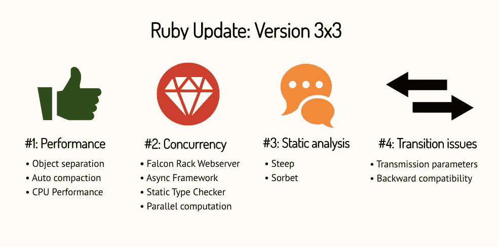

# Ruby 有自己的 2020 年新年决心

> 原文：<https://betterprogramming.pub/ruby-has-its-own-2020-new-years-resolution-77b801dfaacc>

## 剧透:它想快 3 倍

照片由[达维德·扎维亚](https://unsplash.com/@davealmine?utm_source=unsplash&utm_medium=referral&utm_content=creditCopyText)在 [Unsplash](https://unsplash.com/s/photos/rails-snow?utm_source=unsplash&utm_medium=referral&utm_content=creditCopyText) 上拍摄

称赞 Ruby 是创业公司、原型和 MVP 的伟大语言是我们在软件工程领域最近的历史中经常遇到的事情。Ruby on Rails 是 Ruby 的首选框架，通常被称为*启动技术*。它是为了保证快速发布而创建的，也是同类框架中的第一个**。许多其他玩家，如 PHP 和 Python，在他们的框架中复制了 RoR 原则。**

然而，当谈到建设大型项目时，许多人会认为 RoR 是一个不错的选择。缺乏灵活性、执行时间和可伸缩性是目前这项技术正在解决的一些问题。

好消息是，即将发布的新的 Ruby 3.0 版本将是一个巨大的游戏改变者。Ruby 创始人已经承诺，从 2020 年开始，Ruby 将会快三倍！

关于 Ruby 如何死去的谣言这次可能会被平息。让我们直奔主题，看看这个红宝石新年决心会给我们带来什么。

# Ruby 版本与性能相关的亮点

## 内存性能

Ruby 内存使用的一个遗留问题是，随着对象的创建和清除，它们会使堆碎片化。这意味着我们会出现内存漏洞，因为使用的堆页比需要的多。

这个 Ruby 3x3 版本附带的新垃圾压缩器(GP)将处理这个问题。方法是固定一些对象，其余的可以移到堆中。另外值得注意的是，在这个版本中，将完全支持自动压缩。在 Ruby 2.7 中，[压缩可以手动触发](http://engineering.appfolio.com/appfolio-engineering/2019/3/22/ruby-27-and-the-compacting-garbage-collector)。

## CPU 性能

一个叫马卡罗夫的家伙，在 Ruby 2.4 版本中对散列进行了性能改进，现在又面临性能挑战。这一次他承担了一个叫做 [RLT MJIT](https://github.com/vnmakarov/ruby/tree/rtl_mjit_branch#readme) 的大项目。

这个雄心勃勃的项目应该会带来显著的性能提升。现有的 YARV 指令被新的 RLT 指令集完全取代。新的轻量级 MJIT 将从 RTL 指令中产生 C 代码，然后用现有的编译器编译成本机代码。

然而，这种全新的寄存器传输语言(RTL)需要对 Ruby 的内部进行重大重写。可能需要几年时间才能让所有东西都足够稳定，可以合并到 Ruby 中。我们只需要等待，看看他们是否会发布新的 Ruby 3.0 和那些主要的改变。

# 我们如何衡量它？

照片由 [Siora 摄影](https://unsplash.com/@siora18?utm_source=medium&utm_medium=referral)在 [Unsplash](https://unsplash.com?utm_source=medium&utm_medium=referral) 上拍摄

说到人类，我们大多数人都倾向于减肥和增肌。几个月后，很容易检查我们的新年决心是成功的还是又一次虚假宣传。然而，当我们需要确认一种编程语言的改进时，事情就有点不同了。我们需要比刻度尺或卷尺稍微复杂一点的工具。

[opt 胡萝卜](https://github.com/mame/optcarrot#readme) 就是你要找的东西。它是 Ruby 3x3 发布的官方基准。这个项目是一个用纯 Ruby 编写的任天堂模拟器。项目描述中提到的目标如下:

> “具体目标是一个 NES(任天堂娱乐系统)模拟器，在 Ruby 2.0 中以 *20 fps* 工作。一个原始的 NES 以 60 帧/秒的速度工作。如果 Ruby3x3 成功了，我们就可以和 Ruby 一起享受一场 NES 游戏了！”

不管我们喜不喜欢任天堂游戏，我很确定我们希望看到 Ruby 在实际操作中加速。仔细看看 [Rails Ruby Bench](https://github.com/noahgibbs/rails_ruby_bench) 项目。这是一个基于使用大型、高度并发的 Rails 应用程序检查 Ruby 性能的基准测试。

# 还有什么？

亚历克斯·莫尔古诺夫在[斯洛博达工作室](https://sloboda-studio.com/)拍摄的图片

除了性能之外，新的 Ruby 3.0 版本还打算提供其他一些很棒的东西。在这个新的 3x3 时代，许多不完美的地方应该被修复。并发性、静态分析和转换问题是目前正在解决的一些主要问题。

# 包裹

请记住，关于 Ruby 3.0 的发布日期以及它将为我们带来什么，还没有任何官方声明。谣言足够强大，让我们相信它应该在 2020 年 1 月甚至更早看到光明。我们可以等待并为最好的结果欢呼。

最后，我将引用 Matz 关于 3.0 Ruby 版本热门话题的一些直白的话。给你！

**表现:**“任何语言都不够快。”—马茨

**并发:**“我后悔加了线程。”—马茨

**静态分析:**“我讨厌测试。”—马茨