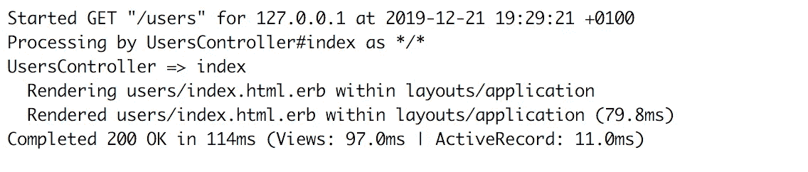
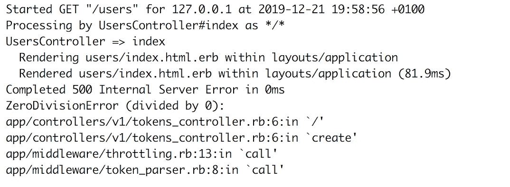
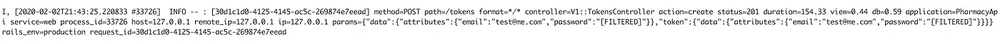

# Ruby on Rails 中的单行日志记录

> 原文：<https://betterprogramming.pub/ruby-on-rails-single-line-logging-5a76852de1d2>

## 将生产环境的日志消息大小减少到每个请求一行

马库斯·斯皮斯克在 [Unsplash](https://unsplash.com?utm_source=medium&utm_medium=referral) 上的照片

日志记录是任何软件应用程序最重要的特性之一——它必须得到支持。应用程序日志是帮助我们理解软件行为的重要信息来源。例如，web 应用程序的正确应用程序日志应该能够回答关于传入请求和响应、应用程序错误和警告的问题。

在 Rails 中，默认的日志记录系统非常有用，它提供了我们需要的关于 web 请求、错误甚至错误异常跟踪的信息。Rails 的默认日志格式清晰易读——您可以看到请求开始的时间、响应代码、响应时间等等。这里有一个例子:

# **问题**

Rails 默认的日志记录系统和日志格式将为同一个请求生成多行日志消息。在上面的例子中，rails 生成了六行来记录单个请求。线路数量取决于请求和 rails 配置。例如，rails 将为用于呈现请求响应的每个视图生成一条日志线。此外，在出现错误或异常的情况下，异常堆栈跟踪也会以多行格式生成。

虽然默认的 rails 日志格式是可读且易于理解的，但它会生成许多日志行来描述单个请求，这种行为会增加应用程序生成的日志的大小和数量。这种行为有一些缺点:

*   生成的日志将会很大，这增加了存储日志的成本，尤其是在将日志发送给第三方(如 [logz.io](https://logz.io/) )的情况下。
*   解析日志是一项挑战，需要复杂的配置，因为解析脚本需要考虑多行日志。

在本文中，我们将带您修改 Rails 应用程序的日志系统，使其生成单行日志。

# **Rails 日志级别**

Rails 默认的日志级别是`debug`。这意味着所有日志消息都将被写入日志文件，包括调试日志消息和用于 web 请求的 SQL 查询。但是，生产环境不应该是这种情况。在生产环境中将日志级别更改为`info`将有助于减少生成的日志数量。要激活它，需要将下面一行添加到`config/environments/production.rb`配置文件中:

通过这一更改，我们可以使用环境变量`LOG_LEVEL`配置 Rails 应用程序日志级别。生产环境的默认日志级别仍然是`debug`，但是，它不再是硬编码的了。

# **将 Lograge 与 Rails 集成**

[***log rage***](https://github.com/roidrage/lograge)*是一个 Ruby gem，它提供了一种简单而直观的方式来将 rails 多行日志信息重写为单个日志行。*

将 Lograge 与 Rails 应用程序集成是一个简单的过程。用 [**Lograge**](https://github.com/roidrage/lograge) **来集成和定制 rails 日志消息需要做一些修改。**

*   **将 Lograge gem 添加到应用程序依赖关系**:这可以通过将以下代码行添加到 rails 应用程序`Gemfile`然后执行`bundle install`来完成:

*   **启用配置日志存储支持**:我们将使日志存储支持可配置，而不是将开关硬编码到日志存储。为此，将下面几行添加到应用程序配置文件中的路径`config/applicaion.rb`下:

*   `LOGRAGE`:这个环境变量将用于打开和关闭日志范围支持。
*   **添加自定义变量:**默认情况下 Lograge 消息不包括主机和请求的 IP。但是，可以将这些变量和其他变量集成到 Lograge gem 生成的日志消息中。将下面的函数添加到`app/controllers/application_aontroller.rb`中的 Rails `ApplicationController`会将四个变量(`host`、`remote_ip`、`IP`和`x_forwarded_for`)添加到 Lograge 日志事件:

*   **创建 Lograge 初始化器**:为了完成 Lograge 集成，我们需要为 Lograge 创建一个初始化器，并用所需的配置项对其进行配置。初始化器应该创建在 Rails 应用程序根目录下的路径`config/initializers`下。以下代码片段可用作 Lograge 的默认配置:

初始化器文件从启用 Lograge 库开始(这取决于我们上面介绍的环境变量)。然后定义了与 Lograge 集成的基本控制器。最后，它定义了需要包含在日志消息中的属性。

默认的 Lograge 日志格式是键值格式，但是，Lograge 支持其他格式，如 JSON 和 Logstash。支持的日志格式的完整列表可以在 Lograge [repo](https://github.com/roidrage/lograge) 上找到。

应用上述配置并启动 rails 应用程序后，rails 日志将如下所示:

# **结论**

将 rails 日志格式从默认的多行日志转换为单行日志是一个好主意，尤其是对于生产环境。这一改变将帮助我们减少生成日志的数量，并改进和简化日志解析脚本。