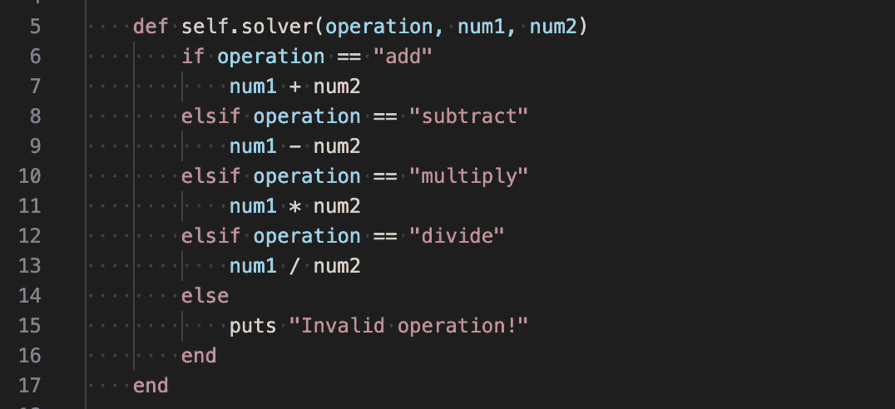
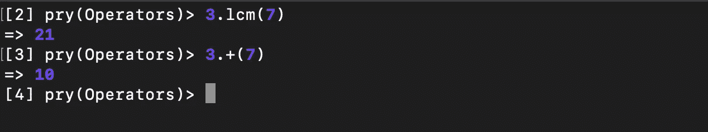
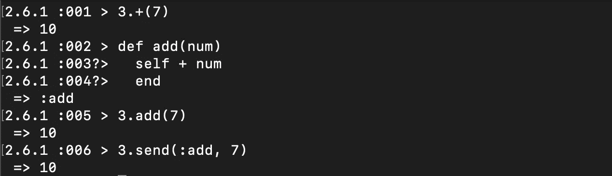
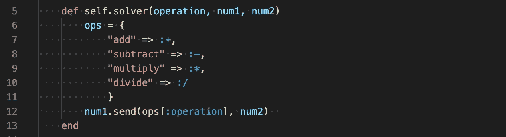

# 在 Ruby 中将数学运算符存储在哈希表中

> 原文：<https://betterprogramming.pub/ruby-storing-math-operators-in-hashes-322026169ab4>

## 利用 Ruby 符号

由[沃尔坎·奥尔梅斯](https://unsplash.com/@volkanolmez?utm_source=unsplash&utm_medium=referral&utm_content=creditCopyText)在 [Unsplash](https://unsplash.com/s/photos/maths?utm_source=unsplash&utm_medium=referral&utm_content=creditCopyText) 上拍摄

前几天晚上，我在编写代码时遇到了一个有趣的问题。在花了一些时间探索互联网的深度后，我决定写一个快速的帖子来分享我的发现。谁知道呢，也许有一天你会发现它会派上用场！

乍一看，这不是一个很难解决的问题。我们需要一个方法，它传递三个参数——一个数学运算(字符串形式)和两个数字——然后执行数学运算并返回结果。在这个问题中，我们有一些离散的简单数学运算符，所以我们可以用 if-else 语句轻松地解决它，就像这样:

这是…很好。它完成了工作，这是不容小觑的，但就是感觉笨重。这里有很多重复的代码，if-else 语句似乎不适合我们已经知道值的工作。

如果我们尝试哈希呢？大概是这样的:

可悲的是，快速旋转一下`pry`就会发现这并不那么简单:

进入[这个帖子](https://stackoverflow.com/questions/8437497/can-ruby-math-operators-be-stored-in-a-hash-and-applied-dynamically-later)是我在栈溢出上发现的。事实证明，我们在 Ruby 中用作数学运算符的字符实际上是*本身的*方法！不仅如此，我们还可以使用与最小公倍数方法相同的语法:

太神奇了！

对于我们试图解决的问题来说，一个好消息是，由于 Ruby 识别以符号形式存储的方法名，我们现在有办法将我们的操作符放在 hash 中了！

看起来很搞笑，但是很管用。现在，我们将如何使用这个方法来存储一个符号呢？嗯，事实证明`.send`方法非常适合这种情况。send 方法的执行就像许多基本的 ruby 语法一样。例如:

幸运的是，最大的区别在于，send“调用由符号*标识的方法*，并向其传递任何指定的参数”([ruby-doc.org](https://ruby-doc.org/core-2.7.0/Object.html#method-i-send))。不仅如此，在我们的例子中，它允许我们抽象出方法，直到我们得到我们的参数。

那不是比那堆假设更清楚吗？

我确信这个问题有很多其他的解决方案，但是我认为这个方案很简洁，可能对其他情况有用。

对于那些想研究其他 Ruby 零碎东西的人，请注意:

*   从同一个堆栈溢出帖子:显然 Ruby 实际上把`!=`求值为`==`，然后翻转结果，所以你不能直接运行`!=`(它对上面的解决方案不起作用)。
*   相反，如果您将方法存储为字符串，该解决方案也是可行的。我不确定我是否喜欢它，主要是因为一种很难解释的感觉，Ruby 更喜欢这个。有一天，当我成为一个聪明的老程序员时，我将能够通过一些花哨的速度测试或关于语言如何编写的讨论来证实或否认这一点。
*   我喜欢这种基本的东西。关于这个话题，[加里·伯恩哈特不久前做了一个 4 分 17 秒的搞笑演示](https://www.destroyallsoftware.com/talks/wat)，讲述一些基本特质。