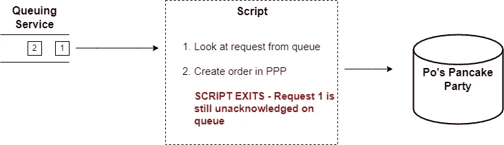
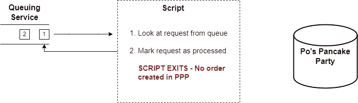
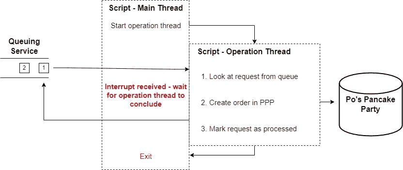

# 中断后退出前完成 Ruby 方法

> 原文：<https://betterprogramming.pub/ruby-tip-how-to-finish-a-method-after-an-interrupt-before-exiting-c29950c129f4>


托马斯·博尔曼斯在 [Unsplash](https://unsplash.com?utm_source=medium&utm_medium=referral) 上拍摄的照片

恭喜你！你被一家前途光明的初创公司 ***录用了，这是一家炙手可热的公司*** 。你的任务是找到最好的新推文，给作者送去煎饼。不要担心收入:我们稍后会解决这个问题。


你创业的防弹商业模式。[来自 Pexels 的 Ash 拍摄的煎饼照片](https://www.pexels.com/photo/pancake-with-sliced-strawberry-376464/)

你的生意取决于你的蛋糕是新鲜出炉的。没人喜欢冷煎饼。冷煎饼是你被雇来解决的关键问题。请允许我解释。

热门蛋糕雇佣寻找推特的英语专业学生，他们将推特提交给网络应用程序。然而，辛勤工作的煎饼厨师网络依赖于一个古老的工作站程序，名为*阿宝的煎饼党* (PPP)。Po 的软件通过本地网络 API 接受新订单，然后通过 telnet 和信鸽的混合方式将订单分发给你的厨师。

不知何故，你不得不从互联网到 PPP 获得订单，但你可以肯定，通过你的防火墙将公共互联网流量转发给一个 15 年前的专有软件不会带来任何好处。所以你想出了一个不同的方法。

# 该计划

因为你不想把 PPP 暴露在互联网上，所以你需要一个中介在网上查询一些新订单，然后插入 PPP。您可以查询 web 应用程序，但是您必须弄清楚您的 web 应用程序将如何跟踪哪些订单被输入 PPP。

相反，你设置网络应用程序来使用在线排队服务，比如亚马逊 SQS。您将通过运行在 PPP 工作站上的一个连续循环的 Ruby 脚本来查询队列。该脚本执行以下操作。

1.  **获取请求:**查询在线队列中的新订单请求。当队列服务响应时，它还会对其他查询隐藏一分钟的请求(例如，对脚本的其他副本)。SQS 称之为*可见性超时。*
2.  **创建订单:**收到消息后，通过 PPP 的本地网络 API 创建订单
3.  **确认请求:**将队列中的请求标记为已处理，这样当可见性超时过期时，它将不会被重新处理。


总的来说，这种实现可能类似于以下内容:

```
❯ ruby naive.rb      
[INFO 2022-04-04 20:53:02 -0400] #--- Starting Worker Program ---#
[INFO 2022-04-04 20:53:02 -0400] Start operation, iteration 0\. Part one: Eg. we might long poll for messages here
[INFO 2022-04-04 20:53:07 -0400] Operation part two. Eg. we might process messages here.
[INFO 2022-04-04 20:53:08 -0400] Operation part three. Eg. we might acknowledge the message as processed here.
[INFO 2022-04-04 20:53:09 -0400] Operation, iteration 0, complete.
[INFO 2022-04-04 20:53:09 -0400] Start operation, iteration 1\. Part one: Eg. we might long poll for messages here
...
```

简单。

# 秘诀——我们的动力

等等。如果第 2 步“创建订单”成功，但脚本在第 3 步“确认”之前崩溃或退出，该怎么办？我们已经创建了订单，但是将请求留在了请求队列中。

当我们开始备份脚本时，我们会重新处理消息。我们至少会创建两个订单。



好吧，如果我们改变行动的顺序呢？我们可以在收到消息后立即将其标记为已处理，然后*在 PPP 中创建一个订单。*

但是，如果崩溃发生在我们确认请求之后，但在我们创建订单之前，将不会创建任何订单。有人吃不到煎饼了！



你决定送两份薄煎饼比不送要好，并坚持原来的操作顺序。但是每条推特上有多个煎饼订单并不理想。如果脚本 a)在代码的这个“关键部分”崩溃或 b)退出，就会出现这种重复的问题。

好消息是:这个问题涉及的所有参与者(Hot Cakes web app、SQS 和阿宝的煎饼党)都是相当成熟的程序，不太可能有影响你的脚本的突破性变化或错误。只要你能让脚本在第一时间工作，它很可能会继续工作。脚本崩溃不太可能。

脚本退出的可能性很大。每当工作站重新启动或有人试图退出 ruby 脚本时，就会发生这种情况。然而，脚本出口也在您的控制之下！在退出之前，一个表现良好的操作系统会给你一个信息，给你一个清理的机会。所以，至少对于正常的退出，你*应该*能够在退出程序之前完成临界区的处理。

> 这里的“正常”退出意味着操作系统给程序一个优雅退出的机会。在 UNIX bash 中，这些情况是程序被发送 [SIGINT、SIGTERM 或 SIGQUIT](https://www.baeldung.com/linux/sigint-and-other-termination-signals) 而不是 SIGKILL 或 SIGSTOP。如果你是一个 Windows 用户，这就是当你关闭一个程序(优雅的退出)和当你得到程序不响应对话框并点击“现在结束”的区别。

如果我们中途退出程序，它看起来像这样:

```
❯ ruby naive.rb      
[INFO 2022-04-04 20:53:02 -0400] #--- Starting Worker Program ---#
[INFO 2022-04-04 20:53:02 -0400] Start operation, iteration 0\. Part one: Eg. we might long poll for messages here
[INFO 2022-04-04 20:53:07 -0400] Operation part two. Eg. we might process messages here.
[INFO 2022-04-04 20:53:08 -0400] Operation part three. Eg. we might acknowledge the message as processed here.
[INFO 2022-04-04 20:53:09 -0400] Operation, iteration 0, complete.
**[INFO 2022-04-04 20:53:09 -0400] Start operation, iteration 1\. Part one: Eg. we might long poll for messages here
^Cnaive.rb:5:in `sleep': Interrupt
        from naive.rb:5:in `operation'
        from naive.rb:29:in `<main>'**
❯
```

# 明显的、有缺陷的方法

当 Ruby 收到操作系统的退出系统时，它抛出一个`[SignalException](https://www.exceptionalcreatures.com/bestiary/SignalException.html)`。主线程跳转来处理该异常。您可以通过包装中断抛出时正在执行的块来`rescue`它。

尽管如此，您已经中断了方法的执行，执行转移到了您的 rescue 块。这不能解决我们的问题！

```
❯ ruby signal_trap.rb 
[INFO 2022-04-04 20:49:22 -0400] #--- Starting Worker Program ---#
[INFO 2022-04-04 20:49:22 -0400] Start operation, iteration 0\. Part one: Eg. we might long poll for messages here
[INFO 2022-04-04 20:49:27 -0400] Operation part two. Eg. we might process messages here.
[INFO 2022-04-04 20:49:28 -0400] Operation part three. Eg. we might acknowledge the message as processed here.
[INFO 2022-04-04 20:49:29 -0400] Operation, iteration 0, complete.
[INFO 2022-04-04 20:49:29 -0400] Start operation, iteration 1\. Part one: Eg. we might long poll for messages here
**^C[WARN 2022-04-04 20:49:33 -0400] #--- Received interrupt ---#**❯
```

另一个选择是添加一个`at_exit`块。当程序响应中断而退出时，该块中的代码将执行。

这种方法稍微紧凑一些，但是有和信号陷阱一样的问题:中断程序仍然会中断我们代码的执行，并跳转到`at_exit`块。这还是不能解决我们的问题！

```
❯ ruby at_exit.rb                                                                                                     
[INFO 2022-04-04 21:00:40 -0400] #--- Starting Worker Program ---#
[INFO 2022-04-04 21:00:40 -0400] Start operation, iteration 0\. Part one: Eg. we might long poll for messages here
[INFO 2022-04-04 21:00:45 -0400] Operation part two. Eg. we might process messages here.
[INFO 2022-04-04 21:00:46 -0400] Operation part three. Eg. we might acknowledge the message as processed here.
[INFO 2022-04-04 21:00:47 -0400] Operation, iteration 0, complete.
[INFO 2022-04-04 21:00:47 -0400] Start operation, iteration 1\. Part one: Eg. we might long poll for messages here
**^C[WARN 2022-04-04 21:00:48 -0400] #--- Received interrupt ---#
at_exit.rb:5:in `sleep': Interrupt
        from at_exit.rb:5:in `operation'
        from at_exit.rb:35:in `<main>'**❯
```

# 解决方案

这两种方法都不起作用，因为它们不能阻止主线程跳出执行来处理中断。相反，我们需要将方法的执行从主线程中分离出来，这样它仅仅是被中断所暂停。



要做到这一点，我们可以使用第二个线程来运行我们的“不可中断”方法，避免中断处理。然后，我们可以通过等待不间断方法的完成，在`at_exit`块中“清理”我们的程序。

```
❯ ruby at_exit_uninterruptable.rb 
[INFO 2022-03-12 12:52:21 -0500] #--- Starting Worker Program ---#
[INFO 2022-03-12 12:52:21 -0500] Start operation, iteration 0\. Part one: Eg. we might long poll for messages here
[INFO 2022-03-12 12:52:26 -0500] Operation part two. Eg. we might process messages here.
[INFO 2022-03-12 12:52:27 -0500] Operation part three. Eg. we might acknowledge the message as processed here.
[INFO 2022-03-12 12:52:28 -0500] Operation, iteration 0, complete.
**[INFO 2022-03-12 12:52:28 -0500] Start operation, iteration 1\. Part one: Eg. we might long poll for messages here
^C[WARN 2022-03-12 12:52:30 -0500] #--- INTERRUPT RECEIVED ---#
[WARN 2022-03-12 12:52:30 -0500] Waiting for current iteration to complete. Interrupt again for immediate (unsafe) termination.
[INFO 2022-03-12 12:52:33 -0500] Operation part two. Eg. we might process messages here.
[INFO 2022-03-12 12:52:34 -0500] Operation part three. Eg. we might acknowledge the message as processed here.
[INFO 2022-03-12 12:52:35 -0500] Operation, iteration 1, complete.
[INFO 2022-03-12 12:52:35 -0500] #--- ITERATION COMPLETED. EXITING SAFELY ---#
delay_script_exit.rb:51:in `join': Interrupt
        from delay_script_exit.rb:51:in `<main>'**❯
```

有用！

如果你想在退出时得到更漂亮的输出，而不是 stacktrace，你也可以通过一个`SignalException`陷阱来暂停线程。

```
❯ ruby signal_trap_uninterruptable.rb
[INFO 2022-04-04 21:12:23 -0400] #--- Starting Worker Program ---#
[INFO 2022-04-04 21:12:23 -0400] Start operation, iteration 0\. Part one: Eg. we might long poll for messages here
[INFO 2022-04-04 21:12:28 -0400] Operation part two. Eg. we might process messages here.
[INFO 2022-04-04 21:12:29 -0400] Operation part three. Eg. we might acknowledge the message as processed here.
[INFO 2022-04-04 21:12:30 -0400] Operation, iteration 0, complete.
**[INFO 2022-04-04 21:12:30 -0400] Start operation, iteration 1\. Part one: Eg. we might long poll for messages here
^C[WARN 2022-04-04 21:12:33 -0400] #--- INTERRUPT RECEIVED ---#
[WARN 2022-04-04 21:12:33 -0400] Waiting for current iteration to complete. Interrupt again for immediate (unsafe) termination.
[INFO 2022-04-04 21:12:35 -0400] Operation part two. Eg. we might process messages here.
[INFO 2022-04-04 21:12:36 -0400] Operation part three. Eg. we might acknowledge the message as processed here.
[INFO 2022-04-04 21:12:37 -0400] Operation, iteration 1, complete.
[INFO 2022-04-04 21:12:37 -0400] #--- ITERATION COMPLETED. EXITING SAFELY ---#**❯
```

就是这样！我们已经捕获了信号中断，并在退出之前等待不间断操作完成。编码快乐！

如果您想了解“不间断信号陷阱”解决方案的完整代码，这里有: