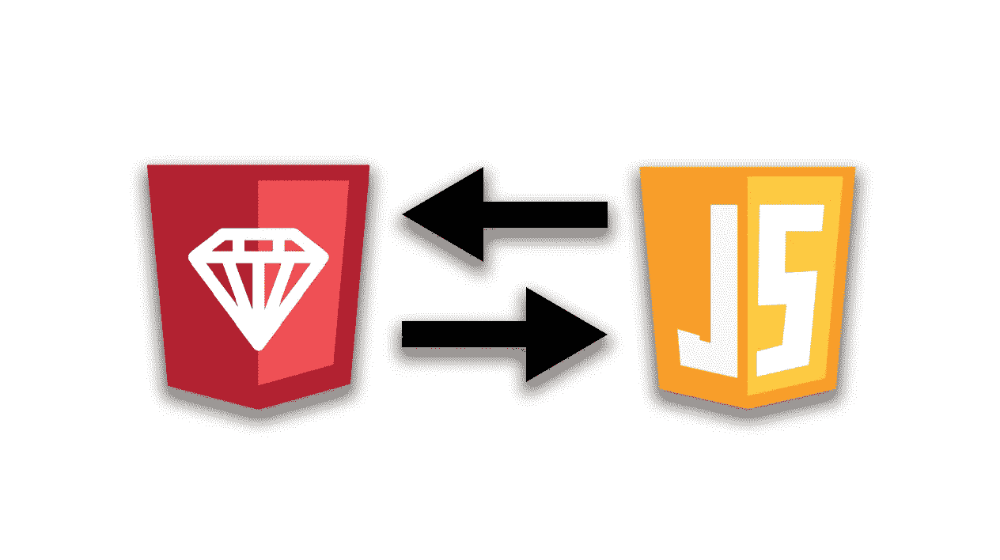

# 从 Ruby 到 JavaScript——换帽子

> 原文：<https://betterprogramming.pub/ruby-to-javascript-switching-hats-2fa5ec22142a>

## 进入正确的顶部空间

## 减少语法、命名约定和命名错误。



欢迎来到我的新系列“换帽子”创建的目的是在从编写 Ruby 转换到编写 JavaScript 或相反的转换之前，作为快速阅读的桥梁。本文旨在帮助您避免在 JavaScript 代码中使用 Ruby 语法、命名约定、大小写惯例和术语，或者相反。

# Ruby + JavaScript 的相似之处

大多数(如果不是所有)编程语言都有某种形式的整数、浮点、布尔、数组和散列。尽管一些编程语言在如何称呼散列上有所不同，但是 Ruby 和 JavaScript 似乎在这些名称上意见一致。

*(Python 喜欢把哈希称为字典)*

# Ruby + JavaScript 的区别

Ruby 和 JavaScript 以及大多数其他语言遵循相同的概念。存储信息的变量和常量封装要运行的代码块的函数，为更多语义代码引用创建对象模板的类。Wile Ruby 将*可调用的*代码块称为*方法，* JavaScript 更喜欢称它们为*函数。下面列出并描述了 ruby 和 JavaScript 之间更多的语法差异。*

# 命名规格

## 变量

在 Ruby 中命名变量时，通常会使用“蛇格”。这意味着你用下划线`my_example = "string"`分隔单词。而 JavaScript 使用“骆驼大小写”。也就是除了第一个单词`likeThisExample = “str”`以外的每个单词首字母大写的做法。

## 常数

在 Ruby 中声明常量时，没有使用声明性的单词，所以通常的惯例是每个单词都大写，同时仍然使用`snake_case` `EXAMPLE_ONE = "string"`。在 JavaScript 中，有一个声明性单词`const`，但是我们遵循与上面 Ruby 例子完全相同的大写和蛇形大写约定。

## 类别(对象)

在这两种情况下，类都被认为是常量，因为类就像是以后要创建和引用的对象的模板，所以我们的模板不应该改变，但属性值会改变。在这种特殊情况下，JavaScript 和 Ruby 遵循相同的大小写和命名约定。*驼峰式*，但是所有的常量也应该以大写字母开头`MyClassNameExample`。

# 变量

## 声明变量

红宝石:

```
variable_name = "this is my ruby string"
```

JavaScript:

```
var variableName = "This is my Javascript string"
```

用`var`声明一个 Javascript 变量并不常用，因为这样声明一个变量会创建一个“全局变量”这通常是不好的做法，通常意味着您需要重构

更常见的是，在最佳实践中，您会用`let` *声明一个 Javascript 变量。*这在当前作用域*内创建了一个变量(如果你在一个函数内声明了一个 let，它将只在那个函数内可用)。*

```
let variableName = "this is my javascript string"
```

## 分配新值

Ruby 和 JavaScript 都以完全相同的方式给变量赋值，但是使用了不同的命名约定。

红宝石:

```
variable_name = "this is my NEW ruby string"
```

JavaScript:

```
variableName = "this is my NEW JavaScript string"
```

# 方法= >函数

Ruby 使用*方法*，JavaScript 使用*函数*。两者的功能基本相同(双关语，lol)。

您可以在括号内传入参数，并在其作用域内调用函数/方法。

为了声明一个 Ruby 方法，我们使用了`def`关键字

```
def my_method_name(arguments)
  #method body here
end# or ------------------------def myMethodName(args){
  #method body here
}
```

⚠️(不是最佳实践)
为了声明 JavaScript 函数，我们声明性地使用了`function`。

```
function myFunctionName(args){
  //Function body here
}
```

✅(best 实践)

```
const myFunctionName = (args) => {
  //Function body here
}
```

# If 语句 If 语句

Ruby 和 JavaScript if 语句的功能基本相同。语法略有不同。您将在下面的 Ruby 示例中看到，它不要求我们的比较语句放在括号中，而我们的 JavaScript 代码却需要。

红宝石:

```
if my_int <= 0
  # Do this
elsif my_int > 0
  # Do this instead
else
  # if all else fails do this
end 
  # don't forget your end keyword
```

JavaScript:

```
if (myInt <= 0){
  // Do this
} else if (myInt > 0){
  // Do this instead
} else {
  // If all else fails do this
}
```

# 对象+类

红宝石:

```
class MyRubyClass
  #Class body here
end
```

(注意在 Ruby 类中，我们使用了声明常量的大小写。以大写字母开始，以驼色大写字母继续)

JavaScript:

```
class MyJavascriptClass{
  //Class body here
}
```

## 初始值设定项= >构造函数

红宝石:

```
class MyRubyClass
  @@all = []
  def initialize(args)
    @name = args.name
    @@all.push(self)
  endend
```

JavaScript:

```
class MyJavascriptClass{
  constructor(args) {
    this.name = args.name
    MyJavascriptClass.all.push(this)
  }
}MyJavascriptClass.all = []
```

这应该让你的大脑适应新的编码环境。无论是 Ruby 还是 JavaScript，你的错误都会被减轻。

感谢阅读《换帽子》！