# 在 AWS 上运行免费的 VPN 服务器

> 原文：<https://betterprogramming.pub/run-a-free-vpn-server-on-aws-e8a6c1c153a>

## 设置运行 OpenVPN 服务器的 EC2 实例


图片来源:[prive visuals](https://unsplash.com/@privecstasy)on[Unsplash](https://unsplash.com)

AWS 在其核心服务中内置了一个令人敬畏的防火墙，可以很容易地用来确保只有某些端口对外界开放。我们可以采取的一个额外步骤是运行一个 VPN 服务器，作为我们受保护的 AWS 资源(如 EC2、RDS 等)的网关。

然后，我们可以通过撤销通过 VPN 服务器的访问来关闭对 AWS 资源的直接访问。如果您需要撤销前雇员的访问权限，这非常有用。

AWS 现在提供了一个[托管 VPN 服务](https://aws.amazon.com/vpn/)，但是这项服务每月至少要花费 72 美元，当你的 VPN 服务大量流量的时候甚至会更贵。许多较小的组织不需要托管服务的所有功能，只需花费 EC2 实例的成本就可以运行他们自己的 VPN 服务器。您甚至可以使用免费层，这样第一年就不必为 EC2 实例支付任何费用。

# 第一步。创建 VPN 安全组

概述:安全组允许您的服务器在私有云中相互通信，同时向外界公开特定端口。我们将创建一个安全组来允许 VPN 访问我们的 VPN 服务器。我们将假设您的所有其他 AWS 资源都是默认安全组的成员，并且默认安全组不允许来自外界的访问。

在`[https://aws.amazon.com](https://aws.amazon.com)`登录，在搜索框中输入 EC2，点击目标进入 EC2 仪表盘。

从 EC2 仪表板中，单击安全组:


图片来源:作者

单击创建安全组:

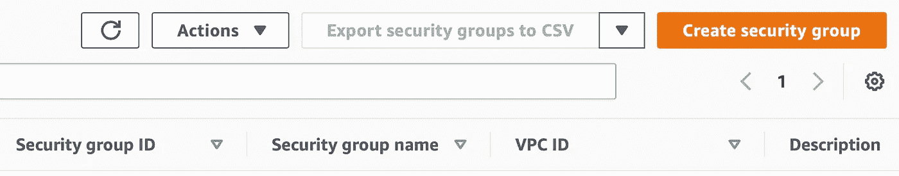

图片来源:作者

输入 VPN 的名称和描述，并在端口`22`、`443`、`943`和`1194`上指定以下入站规则。

**注意**:端口`1194`的协议是 UDP。

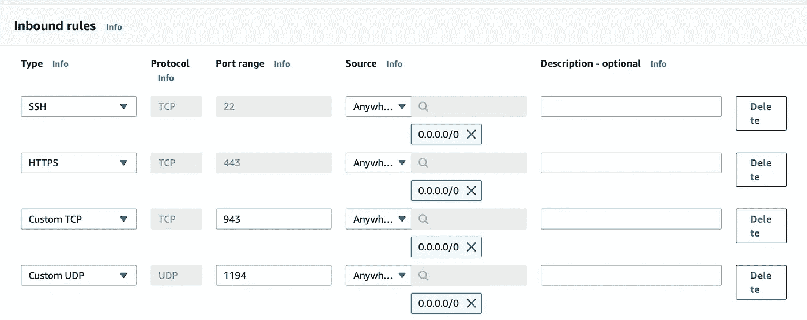

图片来源:作者

**注意**:如果您的团队使用的 IP 地址是静态的，您可以通过在您的规则源中指定一个 IP 地址范围来增加另一层安全性。但是，如果您希望您的团队能够从任何 IP 进行连接，您会希望让源代码在任何地方都是开放的，因为他们可能在酒店、家里、咖啡馆等地方工作。

# 第二步。创建 EC2 实例

返回 EC2 仪表板，然后单击启动实例:

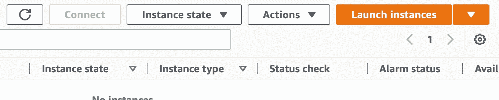

图片来源:作者

选择 Ubuntu(当然，你可以选择几乎任何其他运行 OpenVPN 的操作系统，但本教程是为 Ubuntu 量身定制的)

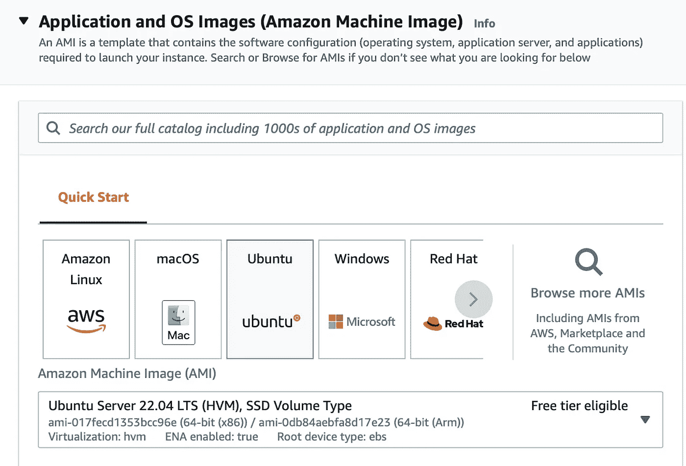

图片来源:作者

选择 t2.micro:

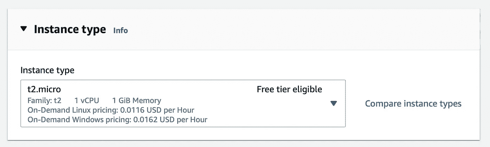

图片来源:作者

**注意**:您可以使用 nano 实例代替 micro 实例，但是 nano 实例不符合自由层的条件。

在网络设置部分，选择您的默认 VPC 并禁用自动分配公共 IP 选项。然后，选择您的默认安全组和您在上面为 VPN 创建的安全组。

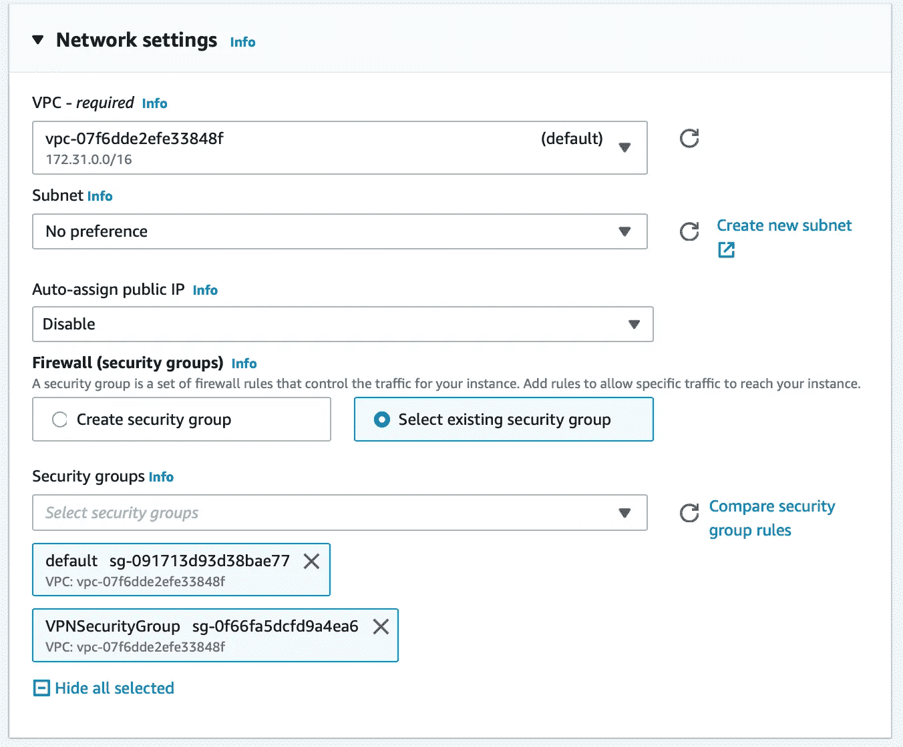

图片来源:作者

单击启动实例

# 第三步。禁用源/目标检查

从实例列表中，选择 VPN 实例，然后从下拉菜单中选择操作->网络->更改源/目标检查。

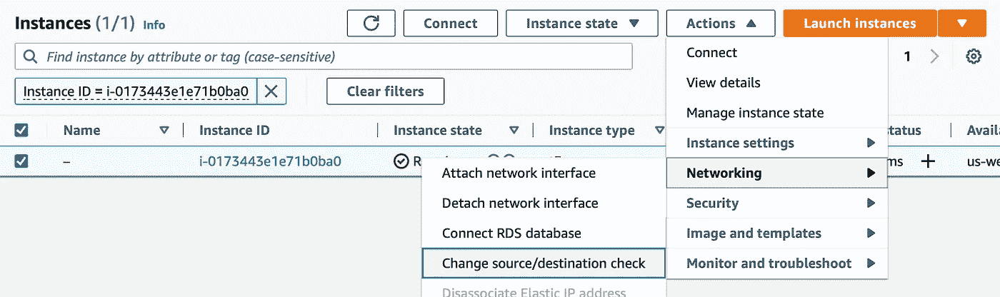

图片来源:作者

选择停止，然后单击保存。这是必要的，否则，您的 VPN 服务器将无法连接到您的其他 AWS 资源。

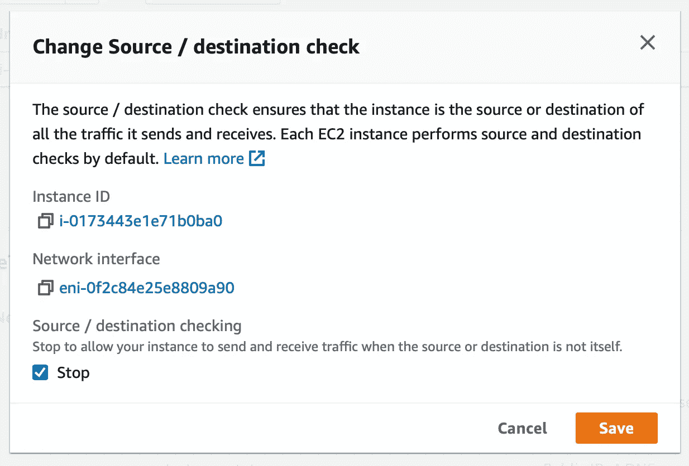

图片来源:作者

# 第四步。创建一个弹性 IP 地址

概述:当 EC2 实例停止并重新启动时，公共 IP 地址会发生变化。我们希望 VPN 服务器的 IP 地址保持静态，所以我们将使用弹性 IP 地址。

从 E2C 控制面板中，选择弹性 IPs:

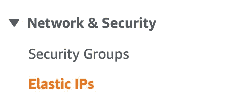

图片来源:作者

单击分配弹性 IP 地址:

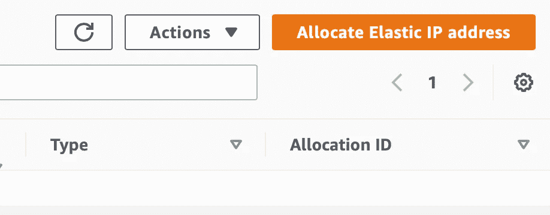

图片来源:作者

记下您的新弹性 IP 地址，因为这将是您的 VPN 服务器的公共 IP 地址。我们稍后将这个地址称为`PUBLIC-IP-OF-VPN-SERVER`。

选择您刚刚创建的 IP 地址，然后单击关联弹性 IP 地址:

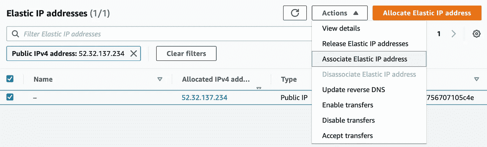

图片来源:作者

然后，选择弹性 IP，并从下拉菜单中单击关联地址。

选择您在上面创建的 EC2 实例，然后单击“关联”:

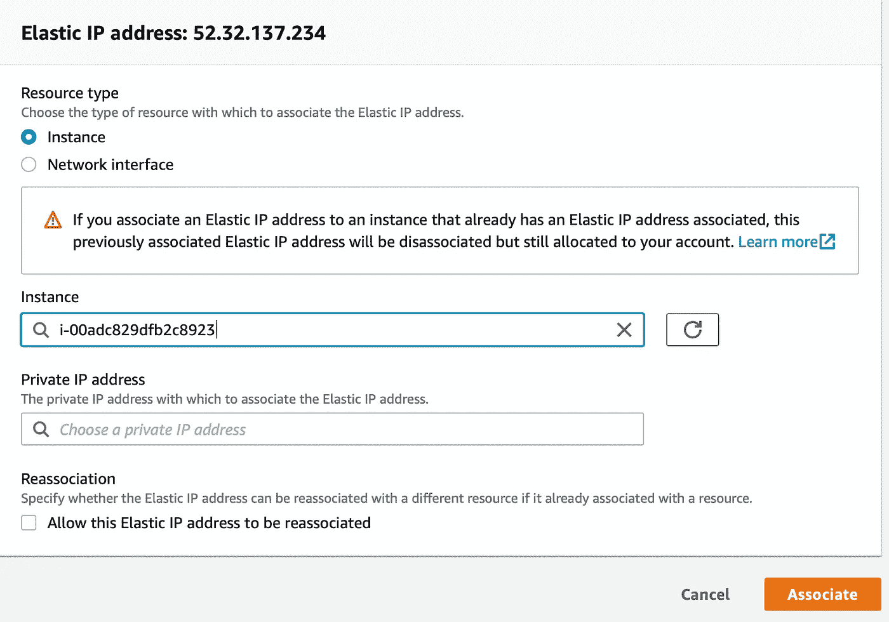

图片来源:作者

# 第五步。安装和配置 OpenVPN 服务器

SSH 到您的 VPN 服务器:

```
$ ssh ubuntu@PUBLIC-IP-OF-VPN-SERVER
```

下载我们的助手脚本并设置默认配置:

```
$ git clone https://github.com/redgeoff/openvpn-server-vagrant
$ cd openvpn-server-vagrant
$ cp config-default.sh config.sh
```

编辑`config.sh`并输入您的配置。注意:`PUBLIC_IP`应该等于您在上面创建的弹性 IP 地址。

```
$ nano config.sh
```

切换到根目录:

```
$ sudo su -
```

你现在要更新 Ubuntu 了。

注:系统会提示您几次，当您提示时，请按`Enter`键。

```
$ /home/ubuntu/openvpn-server-vagrant/ubuntu.sh
```

现在，安装 OpenVPN。

注意:你会被提示几次，当你这样做时，按`Enter`键。

```
$ /home/ubuntu/openvpn-server-vagrant/openvpn.sh
```

此时，OpenVPN 服务器正在运行。

# 第六步。添加路线

必须将路由添加到服务器，以便您小组的客户端知道将哪些流量路由到 VPN 服务器。

您可以通过返回到 EC2 实例列表，单击一个目标实例，并识别私有 IP 来确定正确的子网。


您的网络将是私有 IP 的前两部分，并附加零，例如`172.31.0.0`。

在 VPN 服务器上，编辑`/etc/openvpn/server/server.conf`并添加如下内容:

```
push "route 172.31.0.0 255.255.0.0"
```

然后，使用以下命令重新启动 VPN 服务器:

```
$ systemctl restart openvpn-server@server.service
```

# 第七步。授予访问您的 VPN 的权限

注意:我们假设您仍然通过 SSH 登录到 VPN，并以 root 用户身份登录。

运行以下命令，并确保将下面的`client`替换为您的用户/客户端的唯一名称。

```
$ /home/ubuntu/openvpn-server-vagrant/add-client.sh client
```

然后，您将在以下位置找到配置文件

```
~/client-configs/files/client-name.ovpn
```

您需要将此文件提供给团队中连接到 VPN 的个人。SCP 下载这个很方便。来自 vpn 服务器的 ovpn 文件。

你的团队可以使用各种 VPN 客户端，比如 [Tunnelblick](https://tunnelblick.net/) (OS X)和 [OpenVPN](https://openvpn.net/community-downloads/) (Linux、iOS、Android 和 Windows)。安装其中一个客户端后，他们应该能够通过双击。ovpn 文件。

注意:一旦连接到 VPN，您的用户将希望使用您的 AWS 资源的私有 IP。您可能希望使用 nslookup 从 AWS 提供的 AWS 自定义域名中查找 IP 地址。您可能希望使用 Route 53 来创建路由到私有 IP 的子域记录。

# 第八步。撤销对您的 VPN 的访问

注意:我们假设您仍然通过 SSH 登录到 VPN，并以 root 用户身份登录。

运行以下命令，并确保用您的用户/客户端的唯一名称替换下面的`client`。

```
$ /home/ubuntu/openvpn-server-vagrant/revoke-full.sh client
```

# 解决纷争

如果您的 VPN 客户端报告 TLS 握手失败错误，那么这很可能是因为您的 VPN 安全组(步骤 1)不正确。确保您指定了正确的端口和协议——一个常见的问题是没有为端口`1194`指定 UDP。

*原载于 2022 年 11 月 15 日 https://redgeoff.com**[*。*](https://redgeoff.com/posts/free-vpn-aws-2022/)*