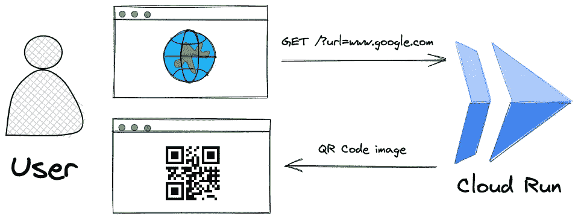
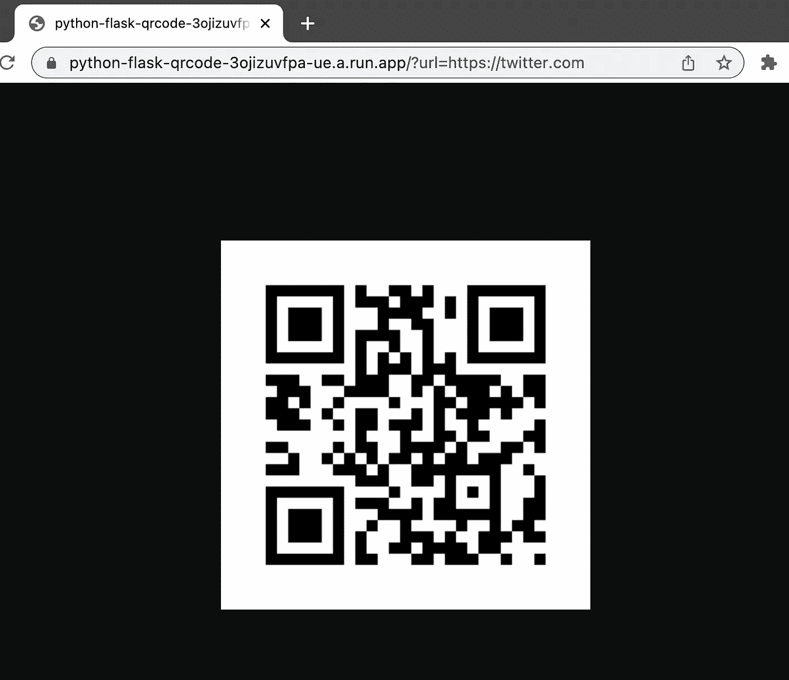

# 在 Cloud Run 上构建二维码生成器

> 原文：<https://betterprogramming.pub/run-a-qr-code-generator-on-cloud-run-8196725ab52f>

## 在本教程中，我们将使用 Python 构建一个二维码生成器，并将其部署到 Google 云平台上的 Cloud Run，它将返回二维码来响应 HTTP 请求。


[Cloud Run](https://cloud.google.com/run/) 是一个托管平台，可以让你直接在 Google 可扩展的基础设施上运行容器。一个常见的用例是拥有一个响应 web 请求的容器，Google 允许您使用他们的 run.app 域，或者您可以使用自己的自定义域。此外，还有一个非常慷慨的免费层，允许每月高达 200 万次的免费请求。

在本教程中，我们将构建一个 web 应用程序，它将接受一个`url`参数并返回一个 QR 码 png 图像。该应用程序将使用 Dockerfile 文件打包，并将在云上运行。



QR 码生成器解决方案概述

# 创建 QR 码生成器

该解决方案的第一步是编码我们的 QR 码生成器。为此，我们将使用现有的 Python 库 [qrcode](https://pypi.org/project/qrcode/) 。

在您的项目目录中，创建一个名为`main.py`的文件，其中[包含以下内容](https://github.com/davelms/python-flask-qrcode/blob/main/main.py)。我们将在后面讨论这是在做什么。

```
import io
import os
from flask import Flask, request, send_file
import qrcodeapplication = Flask(__name__)def generate_qr(url):
    qr = qrcode.QRCode(version=1,
                error_correction=qrcode.constants.ERROR_CORRECT_L,
                box_size=10,
                border=4)
    qr.add_data(url)
    qr.make(fit=True)
    img = qr.make_image()
    return img@application.route("/")
def r_qrcode():
    url = request.args.get('url', default='https://www.google.com')
    img_buf = io.BytesIO()
    img = generate_qr(url)
    img.save(img_buf)
    img_buf.seek(0)
    return send_file(img_buf, mimetype='image/png')# run the app.
if __name__ == "__main__":
    application.run(debug=True, 
                    host="0.0.0.0", 
                    port=int(os.environ.get("PORT", 8080)))
```

在同一个目录中定义你在`requirements.txt`中的依赖关系:

```
Flask==2.1.2
gunicorn==20.1.0
qrcode[pil]==7.3.1
```

为了在本地测试代码，用`pip install -r requirements.txt`安装所有的依赖项，用`python main.py`运行应用程序。你应该可以在 [http://127.0.0.1:8080/](http://127.0.0.1:8080/) 点击终点，看到一个二维码。


https://www.google.com 的二维码

默认情况下，这个代码会生成一个“https://www.google.com”的二维码。您可以通过提供一个 url 参数为其他站点生成二维码，例如 [http://127.0.0.1:8080/？twitter 的 url=https://twitter.com](http://127.0.0.1:8080/?url=https://www.twitter.com) 。

现在它工作了，让我们稍微讨论一下代码。

我们使用二维码库为给定的 url 生成二维码。这个函数将以字节序列的形式返回图像(png 格式)。

```
def generate_qr(url):
    qr = qrcode.QRCode(version=1,
                error_correction=qrcode.constants.ERROR_CORRECT_L,
                box_size=10,
                border=4)
    qr.add_data(url)
    qr.make(fit=True)
    img = qr.make_image()
    return img
```

然后，我们需要定义我们的烧瓶路线。我们获取 url 参数并调用我们的`generate_qr`函数。这都是在内存中管理的——我们不使用本地磁盘——所以图像字节存储在一个缓冲区中，然后使用 Flask 内置的`send_file`方法返回。

```
@application.route("/")
def r_qrcode():
    url = request.args.get('url', default='https://www.google.com')
    img_buf = io.BytesIO()
    img = generate_qr(url)
    img.save(img_buf)
    img_buf.seek(0)
    return send_file(img_buf, mimetype='image/png')
```

# 部署到云运行

现在我们已经完成了我们的 QR 码生成器解决方案，我们需要将它打包成一个容器映像并进行部署，以便人们可以访问它。

第一步是生成一个`Dockerfile`来构建容器映像。在与前面相同的目录中，创建包含以下内容的文件。

```
FROM python:3.10-slimENV PYTHONUNBUFFERED TrueENV APP_HOME /app
WORKDIR $APP_HOME
COPY . ./RUN pip install --no-cache-dir -r requirements.txtCMD exec gunicorn --bind :$PORT --workers 1 --threads 8 --timeout 0 main:application
```

您可以使用 gcloud SDK 通过一个命令`gcloud run deploy`构建您的映像并将其部署到 Cloud Run。第一次运行这个命令时，您将被询问一系列问题，接受默认值并回答 Y 来启用工件注册。作业完成后，您将看到以下输出:

```
Done.                                                                                                                                                  
Service [python-flask-qrcode] revision [python-flask-qrcode-00002-zaz] has been deployed and is serving 100 percent of traffic.
Service URL: [https://python-flask-qrcode-3ojizuvfpa-ue.a.run.app](https://python-flask-qrcode-3ojizuvfpa-ue.a.run.app)
```

这是您的 url，所以在浏览器中尝试一下，您应该会看到与本地测试相同的结果。



您可以导航到[云运行控制台](https://console.cloud.google.com/run)来查看日志、指标和修订历史。

我们构建了一个二维码生成器，部署到 Cloud Run。本教程的所有[源代码都可以在 GitHub 上获得。](https://github.com/davelms/python-flask-qrcode)

```
**Want to Connect?**Please follow me on [Twitter](https://twitter.com/davelms) and connect on [LinkedIn](https://www.linkedin.com/in/davelms/)
```