# 使用 AWS Fargate 和 CI/CD 运行计划任务

> 原文：<https://betterprogramming.pub/run-a-scheduled-task-using-aws-fargate-with-ci-cd-fe77f20aeb2b>

## 你听说过 cron jobs，但是让我们来谈谈 cron 表达式

如果你需要用任何语言运行你自己的脚本，以预定的方式或者用特定的指令重复运行，这是为你准备的。

在许多应用程序中，通常在数据可视化应用程序中，我们需要在固定的时间、日期或间隔运行一些代码。这些代码块可以进行 API 调用，从数据库中获取数据，进行一些处理，或者做任何你想做的事情。

在这里，您将了解一种根据预定义的时间表运行这样一个脚本的简单方法。

Cron jobs 是一个流行的作业调度器，它提供了一个实用程序，用于在[类 Unix](https://en.wikipedia.org/wiki/Unix-like)计算机[操作系统](https://en.wikipedia.org/wiki/Operating_system)中调度任何类型的任务。当我们使用 cron 作业时，要记住的一件重要事情是 *cron 表达式。*

cron 表达式通常用于定义任务应该何时运行。系统中使用的 cron 表达式有不同的变体，如 [Jenkins](https://jenkins.io/) 、 [Kubernetes CronJob](https://kubernetes.io/docs/concepts/workloads/controllers/cron-jobs/) 、 [Fargate 调度任务](https://aws.amazon.com/about-aws/whats-new/2018/08/aws-fargate-now-supports-time-and-event-based-task-scheduling/)等。使用前一定要检查它的说明。

让我们进入主题。

我们都希望尽可能简单高效地安排重复性任务。在每个复杂的项目中，更新数据、接收数据或类似的用例都需要这样做。

有了 AWS Fargate，就有可能拥有编排好的集群，您可以在其上运行 Docker 容器中的任务。

# 开始之前，您需要

*   詹金斯的[服务器安装完毕。](https://jenkins.io/download/)
*   带有 GitHub 存储库的 GitHub 帐户。
*   如果您使用的是企业 GitHub 帐户，首先您需要生成私钥和公钥( [*ssh-keygen*](https://www.ssh.com/ssh/keygen/) )。
*   向 Jenkins 服务器添加凭据。
*   通过在那里添加您的公钥来配置您的 GitHub 帐户。
*   在你的电脑上设置 Docker。Docker docs 会给你更多这方面的信息。
*   AWS 帐户。
*   要调度的脚本的 Dockerfile。

# **什么是 AWS Fargate？**

对于不了解 AWS Fargate 的人，这里有一个介绍。

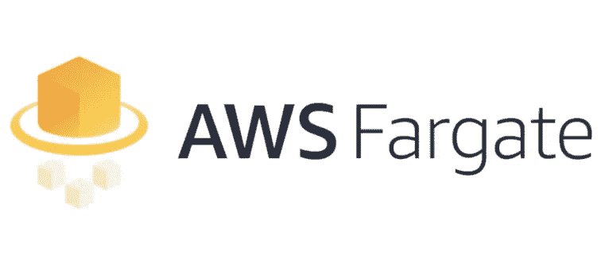

AWS Fargate 服务

> **"** AWS Fargate 是亚马逊 ECS 的一个计算引擎，它允许你运行[容器](http://aws.amazon.com/what-are-containers)，而不必管理服务器或集群。
> 
> 有了 AWS Fargate，您不再需要供应、配置和扩展虚拟机集群来运行容器。这消除了选择服务器类型、决定何时扩展集群或优化集群打包的需要。
> 
> AWS Fargate 消除了您与服务器或集群交互或考虑它们的需要。Fargate 让您专注于设计和构建您的应用程序，而不是管理运行它们的基础设施。**——**[https://aws.amazon.com/fargate/](https://aws.amazon.com/fargate/)

在 Fargate 发布之前，使用 Amazon ECS 的唯一方法是提供一个由 Amazon 管理的 EC2 实例集群(用于软件、更新和配置)。

面临的问题包括集群的成本、任务的扩展以及配置和维护有效的自动扩展系统以避免缺乏足够的容器资源。

AWS Fargate 允许将所有这些管理开销交给 AWS，即通过只为实际执行时间付费来启动基于容器的服务。不需要担心底层集群，因为 AWS 会处理得很好。

# **什么是亚马逊 ECS？**

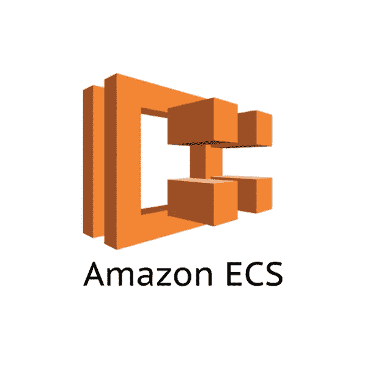

AWS 弹性集装箱服务

[弹性容器服务](https://aws.amazon.com/ecs/) (ECS)是一个 AWS 服务，它处理 EC2 集群中的 Docker 容器编排。它是 Kubernetes、 [Docker Swarm](https://docs.docker.com/engine/swarm/) 和其他也处理伸缩的编排服务的替代方案。

其中的一个关键特性是，Amazon ECS 允许您在 Amazon EC2 按需实例、保留实例或 spot 实例上使用托管或定制调度程序运行批处理工作负载。

因此，当 containers 在 Amazon[EC2 spot instances](https://aws.amazon.com/ec2/spot/)上运行时，与按需价格相比，我们将获得高达 90%的折扣。除此之外，你可能有很多理由使用亚马逊 ECS。

# **什么是 AWS ECR？**

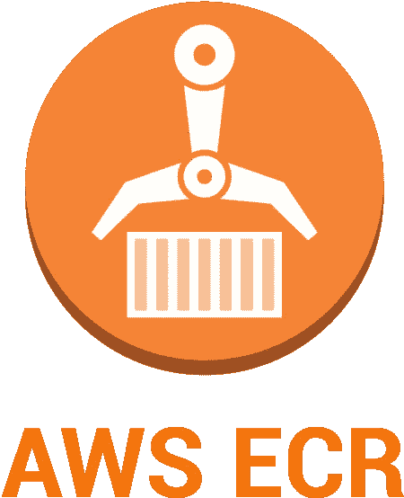

*亚马逊弹性容器注册处(ECR)*

在这个过程中，我们也将使用 AWS Fargate。因为我们在部署脚本时使用 Docker，这需要调度，所以这是一种更简单的方法。

> “Amazon Elastic Container Registry(ECR)是一个完全托管的 [Docker](https://aws.amazon.com/docker/) 容器注册表，它使开发人员可以轻松地存储、管理和部署 Docker 容器映像。”——【https://aws.amazon.com/ecr/ 

使用 ECS 时使用 ECR 的另一个原因是，由于 ECR 和 ECS 是集成的，它减少了我们必须经历的工作流程。

因此，从这里开始，我将使用一步一步的方法来描述如何在 AWS Fargate 中使用 CI/CD 调度脚本。如果您已经完成了这些步骤的先决条件，那么您已经配置了 Jenkins 服务器、GitHub repo 和 AWS 帐户。

# 第一步

*   用正确的名称在 ECR 中创建一个存储库。

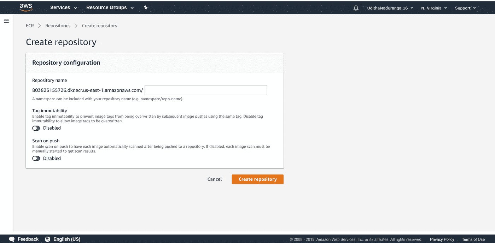

在 ECR 中创建回购

*   您可以使用此处显示的切换来激活标签不变性或在推送图像时扫描。

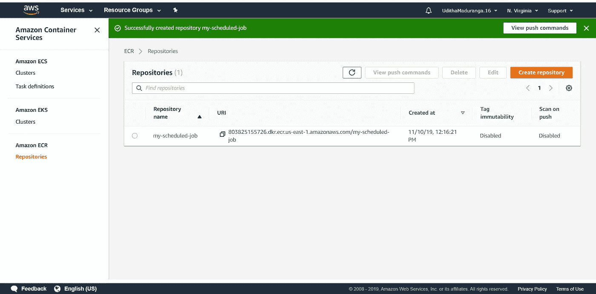

# 第二步

*   在 Jenkins 上创建一个新项目作为自由式项目。

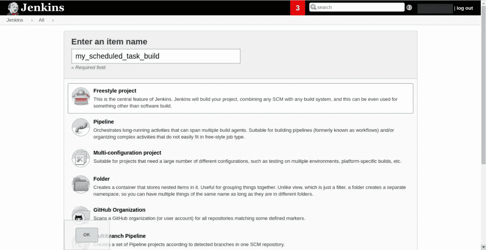

*   配置 Jenkins 管道以从 GitHub repo 获取源代码，并将 Docker 映像推送到 ECR 中的 repo。(转到*源代码管理*部分→选择选项 *Git。*)

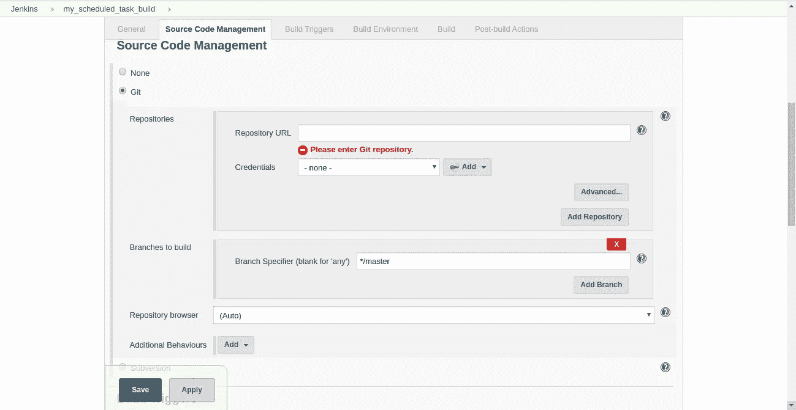

*   如果您已经使用我前面提到的 ssh-key 对配置了 Jenkins 和 GitHub，那么在*凭证*下拉列表中，您将找到之前配置的密钥。
*   您可以指定想要从中获取代码的分支，这在 CI/CD 中很方便。
*   转到您的 ECR，单击您创建的存储库。然后点击*查看推送命令* 按钮。

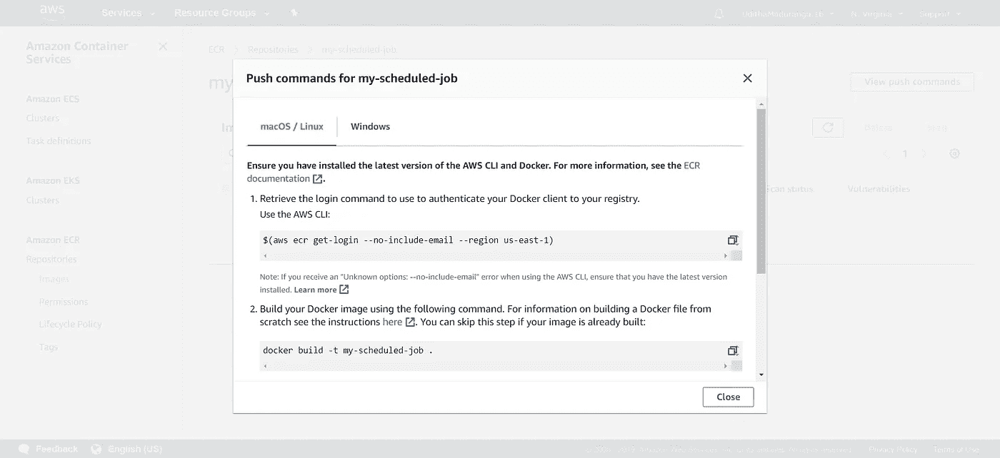

*   接下来，我们应该将 ECR 报告中指定的推送命令交给 Jenkins。(转到*构建*部分→点击*添加构建步骤* →从下拉菜单中选择*执行 shell* 。)

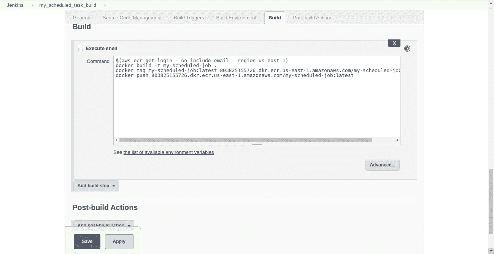

*   当你完成配置后，你可以点击*应用*，然后*保存*。现在管道完成了。

# 第三步

*   转到 AWS ECS 并创建集群。

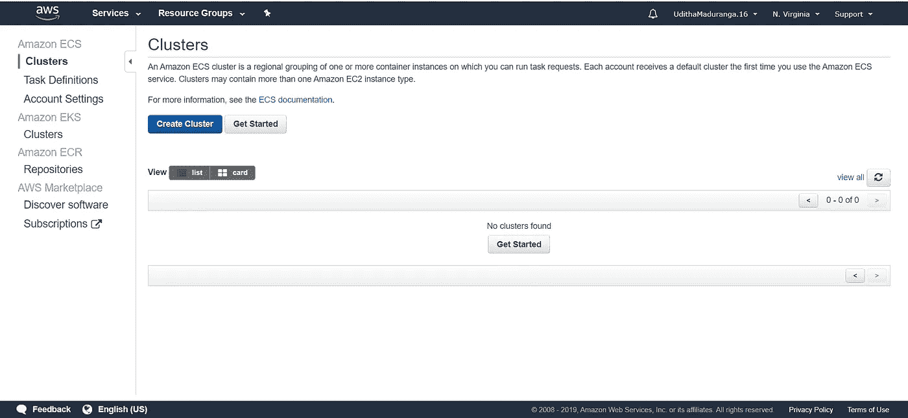

*   您可以从以下选项中选择*仅联网*。

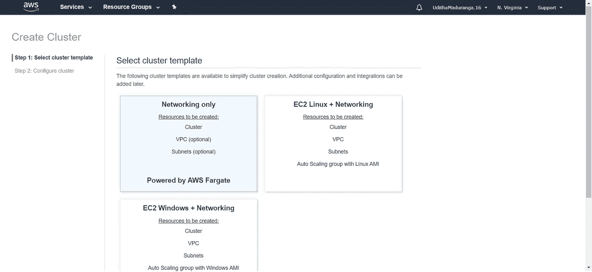

*   然后，您必须为您的集群和任何其他配置命名，比如创建一个新的 VPC、标记和启用容器洞察。

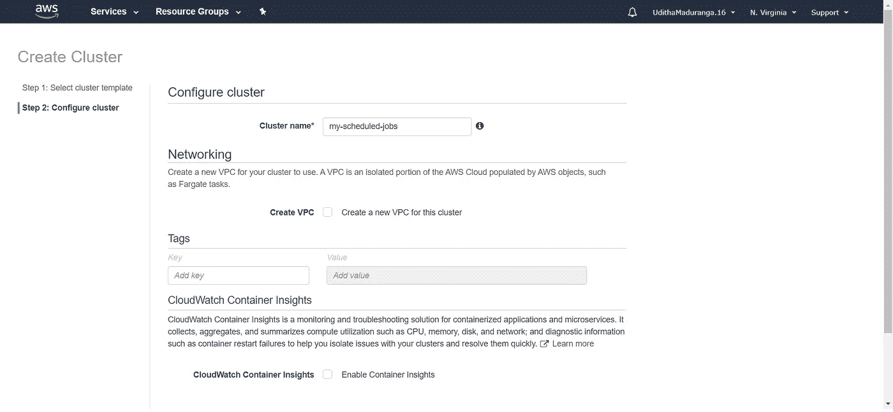

*   一旦您按下*创建* 按钮，集群将被创建，您可以查看集群。

# 第四步

*   创建任务定义。

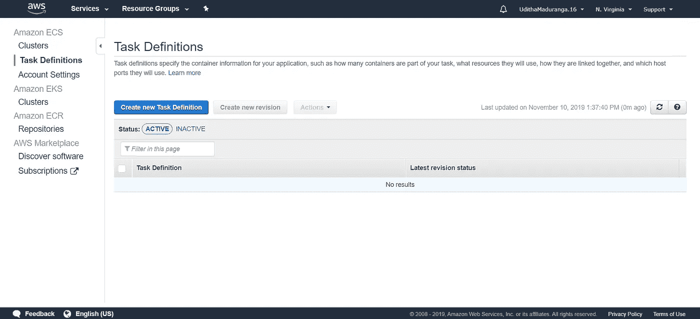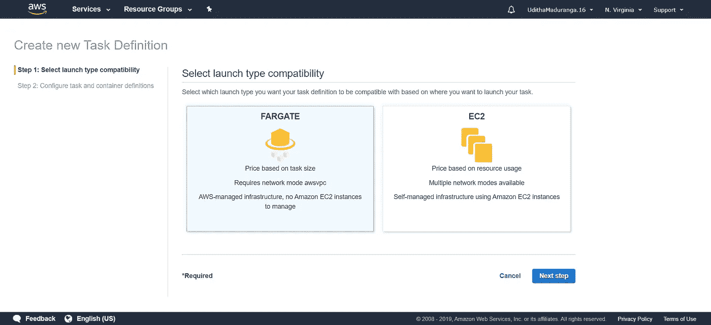

*   现在开始在下面的视图中配置任务定义。在这里，您可以根据您的任务大小指定 IAM 角色、任务内存和任务 CPU。

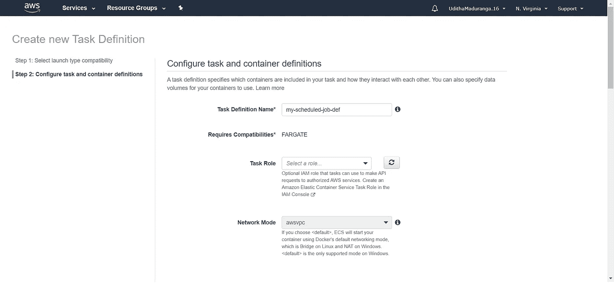

*   当你在配置时，你也必须在下面的视图中配置容器，我们在点击*添加容器*按钮后得到这个视图。

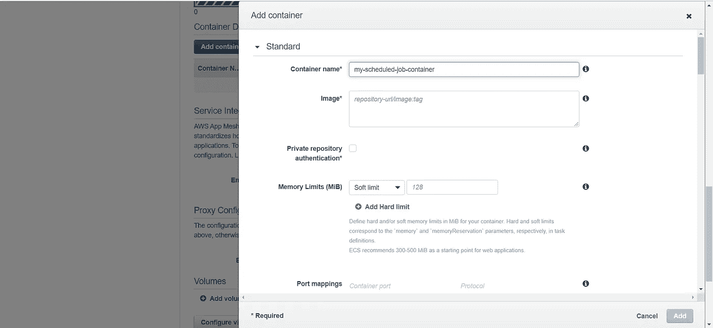

*   这里，存储库 URL/image 标签应该取自您在 ECR 中创建的存储库。其他配置，比如添加内存限制、端口映射和配置 env 变量，也可以在这里完成。

# 第五步

*   最后一步是创建一个调度任务，给出调度信息。(转到亚马逊 ECS 下的*集群*→选择您创建的集群→点击*计划任务* 标签→点击表格顶部的*创建* 按钮。)

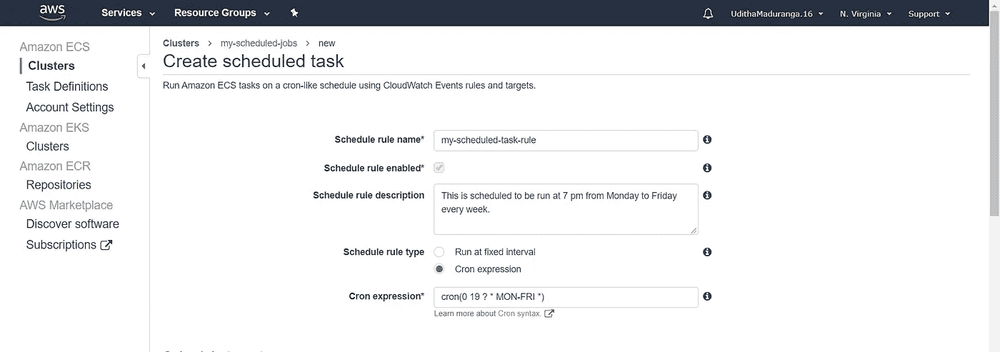

*   在这里您可以选择*调度规则类型。* 您可以根据需要选择*定期运行*或 *Cron 表达式*。这里，我们使用了 cron 表达式。你可以在这里获得更多关于 cron 表情的信息。
*   如果向下滚动，您将能够看到更多关于目标的配置。您应该从下拉菜单中选择 *Fargate* 作为启动类型和您创建的任务定义。
*   也可以在这里配置 VPC 和安全组。

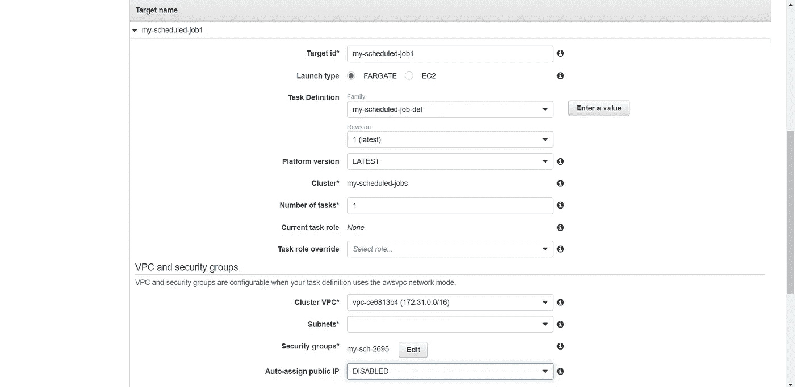

*   完成配置后，您可以在*计划任务*选项卡下查看您的计划任务。

所以现在您可以对您的脚本进行更改，然后将它推送到您在 Jenkins 中配置的分支。然后，一旦您通过点击 *Build* 使用 Jenkins 构建了图像，Docker 图像将被推送到带有标签的 ECR。

然后，一旦完成，计划的作业将根据您指定的规则运行。您还可以做的一件事是添加 GitHub webhook，这样管道将完全自动化。

请分享你的结果、观察、疑惑和想法。下一次再见！