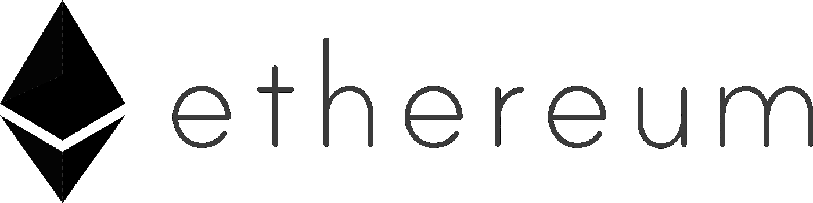
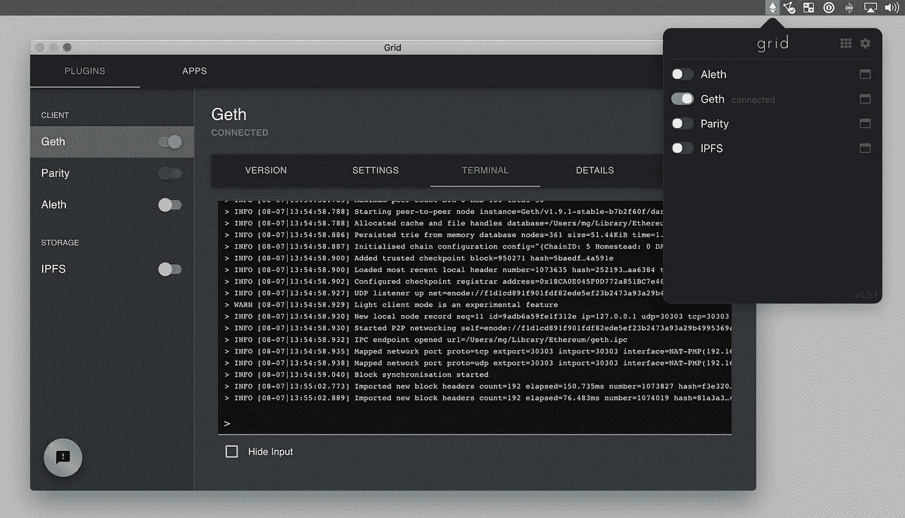

# 在外部 SSD 上运行 Debian 上的以太坊节点(2019 年末)

> 原文：<https://betterprogramming.pub/run-an-ethereum-node-on-linux-late-2019-b37a1d35800e>

## 快到 2020 年了，你应该运行自己的以太坊节点了



*特别感谢*[*Gregoire jean mart*](https://twitter.com/gregjeanmart)*撰写的* [*教程*](https://kauri.io/article/9695fcca217f46feb355245275835fc0) *让我开始运营自己的 node，并激发我写这篇文章。在他的许可下，大部分关于外部固态硬盘的指南都直接取自他的教程。谢谢！*

节点跑者是以太坊众多无名英雄之一。尤其是现在要求已经大大降低，成为一名节点运行者比以往任何时候都更容易。您可以在首选机器的后台运行您的节点，而不会牺牲功能。我希望这个指南能够全面地指导您如何开始运行。

您不仅可以开始运行，还可以看到如何将 MetaMask 连接到您的节点，以及如何在 Geth 上运行 Swarm 节点。

本文假设您至少模糊地知道以太坊是什么，或者您已经阅读了许多解释以太坊的优秀文章中的一篇。它还假设您运行在 Linux 上(为基于 Debian 的发行版编写，在其他版本的 Linux 中，命令和位置可能会有所不同)。

**注意:**我们指的是运行一个完整的节点(在 Etherean 中)，意思不是一个轻客户端，也不是一个归档节点。在整篇文章中，我们称之为“运行一个节点”。

# 内容

## 什么是以太坊节点？

## 运行 Geth 节点的分步指南

## 要求

## 更新:在我们开始之前，先说几句以太坊网格

## 安装和同步

*   设置外部 SSD
*   安装和设置 Go
*   安装 Geth
*   与 Geth 同步

## 连接元掩码

## 运行一个群节点

# 什么是以太坊节点？

*注意，这个解释有些简化。*

在以太坊区块链发生的事情的记录分布在全世界。这样，任何人都可以访问以太坊的整个历史，并对照其他记录验证他们正在访问的历史事实上是真实的。维护区块链历史的这些副本之一(并且每当有新块时更新它)被称为*运行节点*。该节点是您的历史副本。

当任何人想要进行交易时，他们将此广播到一个节点。然后，该节点将该事务广播给网络上的其他节点。由于拥有自己的节点的这一点和其他好处，严肃的 dApp 项目倾向于拥有自己的节点。这也是挖掘器可以看到哪些事务正在队列中等待挖掘到下一个块的方式。类似地，新挖掘的块被传输到一个节点，然后在整个系统中传播。

如果你是一个正在运行的节点，这意味着你将有一份以太坊区块链的历史副本，并将与其他节点保持联系，了解网络上发生的事情。

# 运行 Geth 节点的分步指南

# 要求

首先，我们应该看看你的计算机是否有它所需要的。

我在网上的理解是，如果你在电脑上运行，你的 CPU 应该不是问题。如果你运行的是树莓 Pi 之类的，我建议你看一下[这个](https://kauri.io/article/9695fcca217f46feb355245275835fc0)教程。

硬盘是更重要的考虑因素。虽然可以使用硬盘驱动器同步到链，但建议使用 SSD。建议至少 500GB。随着 Geth 的改进，我可以证明它不需要成为内部驱动器——通过 USB 连接的外部 SSD 就可以了。就统计数据而言，我看到你应该至少有 50MB/s(写/读)。如果你想知道你的硬盘能做什么，Gregoire 在他的[教程](https://kauri.io/article/9695fcca217f46feb355245275835fc0)中有关于基准测试你的系统的指导。

(您可能想知道 50MB/s 够用多久。虽然以太坊区块链确实随着时间的推移有了很大的增长，但是随着 Eth 2.0/Serenity 的推出，每个节点需要存储的数据量应该会减少。截至 2019 年 11 月，我的节点大小大致为 175 GB。即使增长速度加快，Eth 2.0 和分片暂时不会到来，我相信 500GB 应该还能坚持一段时间。当然，得一整 TB 也没什么不好，尤其是你还想跑 Swarm 的时候。)

至于互联网连接，我猜你需要至少 10 兆比特/秒，以便不妨碍使用你的电脑做其他事情。如果您在笔记本电脑上运行，并且有时会有较慢的连接，我会假设您可以在较慢的区域暂停运行您的节点，并在超过 10 Mbits/s 时同步备份。

最后，有点耐心。即使进行了所有的加速，初始同步也很容易需要三天以上的时间。好的一面是，我们将把它变成一个后台进程，所以它不需要你太多的关注。

# 更新:在我们开始之前，先说几句以太坊网格

在我发现[以太坊网格、](https://grid.ethereum.org)和官方以太坊基金会项目之前，我写完了这篇文章，以制作一个易于使用的、用于运行节点的光滑 GUI，而不仅仅是 Geth——看起来他们已经预装了一堆不同的客户端。这是他们的 GitHub 的截图:



我没有接触过 Grid，我不知道它的系统需求是什么，也不知道它的运行有多流畅。我无意冒犯，但我发现在区块链和世界其他地方一样，捷径有时需要更长的时间，所以您可能仍然想按照教程，让您的节点以“艰难的方式”运行。即使你打算使用 Grid，你可能会发现下面关于设置外部 SSD 和安装 Go 的说明很有用。

从命令行运行 Geth 的另一个原因可能是附加一个群节点。Grid 承诺为插件提供一个应用商店，他们正计划提供点击启动功能，但他们还没有提供这一功能(截至 2019 年 11 月，请随时检查是否有任何变化)。可能从命令行将 Swarm 节点连接到 Geth runnning on Grid 就像将 Swarm 连接到“常规”Geth 节点一样简单，但不幸的是，我不知道。

尽管有这些劝阻，我还是想强调一下，Grid 看起来非常漂亮，是以太坊基金会的项目。这可能是一个很好的起点，甚至可能比本教程更容易体验。

# 安装和同步

## **设置外部固态硬盘**

*(特别鸣谢是为了*[*Gregoire jean mart*](https://twitter.com/gregjeanmart)*——这一段很大程度上抄袭了他的优秀* [*教程*](https://kauri.io/article/9695fcca217f46feb355245275835fc0) *用于在树莓 Pi 上运行一个节点。)*

如果您正在运行外置 SSD，下面是一些设置它的步骤。使用`sudo fdisk -l`定位驱动器。以下是该命令的输出示例:

```
Disk /dev/sda: 931.5 MiB, 1000204886016 bytes, 1953525168 sectors Disk model: Kingston FF01BT2
Units: sectors of 1 * 512 = 512 bytes
Sector size (logical/physical): 512 bytes / 4096 bytes
I/O size (minimum/optimal): 4096 bytes / 4096 bytes

(...)

Disk /dev/sdb: 465.8 GiB, 500107862016 bytes, 976773168 sectors
Disk model: Portable SSD T5 
Units: sectors of 1 * 512 = 512 bytes
Sector size (logical/physical): 512 bytes / 512 bytes
I/O size (minimum/optimal): 512 bytes / 512 bytes
```

在这种情况下，`/dev/sdb`是您的外部固态硬盘。我们将以此为例向前推进，所以如果你的 SSD 在不同的位置，用你从`fdisk`收集到的任何位置替换`/dev/sdb`。

如果需要对驱动器进行(重新)分区，请使用以下方法。这将擦除硬盘上的所有内容。将内容备份到其他地方，然后继续:

```
sudo mkfs.ext /dev/sdb
```

出现提示时，按“y”。

我们将手动安装 SSD(用冒号(:)分隔的用户名和组替换`user:group`——如果您不知道组，请在终端中输入`groups`并使用第一个选项):

```
sudo mkdir /mnt/ssd
sudo chown -R *user*:*group* /mnt/ssd
sudo mount /dev/sdb /mnt/ssd
```

我们希望固态硬盘在启动时自动挂载。键入`sudo blkid`并获取与 SSD 相关联的`UUID`(在`/dev/sdb`或您的 SSD 所在位置的那个)。把它抄下来，我们马上就需要它。

```
sudo nano /etc/fstab
```

添加以下内容(确保在粘贴 UUID 的位置后留出一个空格):

```
UUID=***Paste UUID from blkid here*** /mnt/ssd ext4 defaults 0 0
```

不重新启动，更改不会生效，所以如果你想继续运行，你需要重新启动。完成后，您可以输入以下内容来查看计算机是否确实安装了 SSD:

```
df -ha /dev/sdb
```

输出应包括`/dev/sdb`安装在`/mnt/ssd`上。

## 安装和设置 go

我们将运行 Geth，这是一个用 Go 编写的以太坊客户端，所以我们需要设置 Go。下面列出的 Go 版本是我写这篇文章时的最新版本，但是你可以去 Golang 的[网站](https://golang.org/dl/)看看是否有更新的版本。我们假设一个普通的 64 位架构。如果你遇到了麻烦，请查看网站。启动和运行可能会很痛苦，因此我们将尝试简化这一过程:

```
cd ~/Downloads
wget [https://dl.google.com/go/go1.13.5.linux-amd64.tar.gz](https://dl.google.com/go/go1.13.4.linux-amd64.tag.gz)
sudo tar -C /usr/local -xvf go1.13.4.linux-amd64.tar.gz
```

**注:**这里假设`go1.13.5`是 Go 的最新版本(截止到本次更新(2019 年 12 月 8 日)就是这种情况)。你可以在这里[查一下](https://golang.org/dl/)看看是否还是这种情况。如果有更新的版本，您可以删除`1.13.5`，用最新的稳定版本替换它。

我们需要设置环境变量。有多种方法可以做到这一点，但这里有一个:

```
sudo nano /etc/profile
```

这将在`/etc/profile`文件上打开纳米文本编辑器。(如果你没有 Nano，`sudo apt install nano`应该可以在类似 Debian 的系统上使用。如果您在不同的 Linux 上，请替换为友好的邻居软件包管理器。)

在文件的底部，添加以下内容:

```
export PATH=$PATH:/usr/local/go/bin
```

按 Ctrl+X，打 Y，回车保存。

```
sudo source /etc/profile
```

这应该让它加载。如果您在终端中键入`go version`，您应该会看到类似于`go version go1.13.5 linux/arm`的输出。如果没有，你就进入了故障诊断的奇妙世界，祝你好运！你可能需要清除 Go 并重新安装，但是你可以试着在网上找到一些有用的关于你遇到的错误的信息。

## 安装 Geth

导航到您想要存储 Geth 源代码的文件夹。

```
export GO111MODULE=on
go get -d github.com/ethereum/go-ethereum@v1.9.9
**This may take a minute, don't worry
go install github.com/ethereum/go-ethereum/cmd/geth
```

**注:** `@1.9.9`告诉 go 下载 1.9.9 版本，这是截止到本次更新(2019 . 12 . 8)的最新稳定 Geth 版本。你一定要在这里查看看看最新的稳定发布版本号是多少——它会在页面顶部用大号字体显示，用最新的稳定发布版本替换`1.9.9`。

此时，您可能会发现 Go 安装中的各种问题。如果发生这种情况，请参见上文和更广泛的互联网。

```
sudo mv $GOPATH/bin/go-ethereum/build/bin/geth /usr/local/bin
```

现在`geth version`应该输出关于你当前安装的信息。如果是的话，恭喜你！你安装了 Geth。

我们来做一个有权限的数据目录。(这里假设你使用的是安装在`/mnt/ssd`上的外置硬盘，否则就用内置硬盘替换——类似于`/dev/sda1`):

```
sudo mkdir /mnt/ssd/ethereum
sudo chown -R *user*:*group* /mnt/ssd/ethereum
```

## 与 Geth 同步

如果一切顺利，我们就可以开始运行 Geth 和 syncing 了。

在加速与链的当前状态的初始同步方面已经有了很大的进步，甚至还有更酷的东西正在开发中。这意味着你想利用一种特殊的同步模式，这种模式可以将初始同步缩短到几天。尝试以下方法:

```
geth --syncmode fast --cache 1024--datadir /mnt/ssd/ethereum
```

(如果它占用了太多内存，请尝试调低`--cache`标志。`--cache 256`工作正常，但是需要几天时间来同步，而`--cache 1024`可能只需要几天时间。在 8GB 内存下，我的系统在`--cache 256`时不受影响，如果这有所帮助的话。)

如果一切顺利，应该会有一个相当稳定的输出流。这很好，但是按 Ctrl+C 来停止它，因为我们只是检查它是否工作。我们不希望您每次启动时都必须手动重启 Geth，所以我们将把它变成一个系统进程(再次声明，经许可复制自 Gregoire Jeanmart。)

```
sudo nano /etc/systemd/system/geth.service
```

进入 Nano 后，键入以下内容(和以前一样，用您的用户名和组替换`user`和`group`)。):

**格式说明:**从`ExecStart`开始的行直到`/mnt/ssd/ethereum`之后才结束。我想不出在一行中得到它的方法，嵌入一个要点会在结尾之前切断脚本。

```
[Unit]
Description: Geth Node
After=network.target auditd.service
Wants=network.target
[Service]
WorkingDirectory=/home/*user*
ExecStart=/usr/local/bin/geth --syncmode fast --cache 256 --datadir mnt/ssd/ethereum
User=*user*
Group=*group* Restart=always
RestartSec=5s[Install]
WantedBy=multi-user.target
RequiredBy=swarm.service
Alias=geth.service
```

(同样，上面的缓存设置为 256。如果您正在运行一个专用的节点，或者有大量的 RAM，您可能应该将它增加到 1024 甚至 2048。此外，我会建议你在同步后拔掉`--syncmode fast`标志。)

Ctrl+X，然后 Y 和 Enter 保存更改。下面将重新加载系统守护进程，现在将包括`geth.service`，然后启动`geth`，然后将其标记为在启动时启动的服务:

```
sudo systemctl daemon-reload
sudo systemctl start geth
sudo systemctl enable geth
```

您可以检查日志以查看 Geth 是否正在运行:

```
sudo tail -f /var/log/syslog
```

Ctrl+C 退出。Gregoire 在他的[教程](https://kauri.io/article/9695fcca217f46feb355245275835fc0)中有很多关于同步本质的信息(这一节叫做‘同步’)，还有另外一个完整的[教程](https://kauri.io/article/5ab5c4d558e04a73accebc652ef2246b)关于如何建立一个日志并导入到 Google Sheets(或类似的)中，里面有很棒的图表。我会一字不差地把它抄出来，所以我要让你，这位了不起的新节点运行者，自己去检查一下。

*注意:以下两个部分指的是节点完全同步时的情况，包括块和状态。(详见 Gregoire 的文章。)同步状态可能需要很长时间。格雷瓜尔似乎在不到四天的时间里就做到了，而我似乎经历了更艰难的时间。放心吧！你(r 处理器)可以做到。接下来的几节是您可以使用完全同步的节点做的两件很酷的事情。*

# 连接元掩码

你现在有了自己的节点，所以你应该用它做一些很酷的事情。我们要做的第一件事是分散你的元掩码。(如果您还没有[元掩码](https://metamask.io)，您应该会得到它。)你看，MetaMask 通过连接到 Infura 来开箱即用，in fura 是一种巨型节点，有些人运行它以便其他人可以查询它。换句话说，你必须信任 Infura，而我们太愚蠢了，在完全不需要的时候不会这么做。(无意冒犯，Infura，你很牛逼。)您的机器上已经有了一个节点，所以无论如何，去调用 Infura 获取信息是相当愚蠢的。

具体怎么做取决于你的浏览器。([这里有一个来自 StackExchange 的回答](https://ethereum.stackexchange.com/a/77032/27270)本节基于。)基本思想是 Geth 需要对来自浏览器中 MetaMask 扩展的跨域 RPC 请求开放。你需要再次打开`geth.service`——`sudo nano /etc/systemd/system/geth.service`，并添加到`ExecStart`。

## **Chrome/Brave**

```
--rpc --rpccorsdomain="chrome-extension://nkbihfbeogaeaoehlefnkodbefgpgknn"
```

如果这不起作用，你可能需要遵循我们将在 Firefox 和 Tor 中描述的类似过程。搜索如何获得 Chrome 扩展 ID。

## **火狐/Tor**

首先，确保你有元掩码，并且它没有被禁用(你可以去地址栏的`about:addons`看看)。打开一个新标签，在 URL 中输入`about:memory`。点击**显示内存报告**中的测量。向下滚动到**其他测量**，这里有一个浏览器扩展部分。(或者直接按 CTRL+F 搜索`metamask`。)您应该会看到类似下面的内容，但都在一行上(又是格式问题):

```
Extension([id=webextension@metamask.io](mailto:id=webextension@metamask.io), name="MetaMask", baseURL=moz-extension://f3a66ea7-df4d-4731-80db-de45a4abebd6/
```

*(由* [*带给你这个*](https://stackoverflow.com/a/51283520/7913944) *关于 StackOverflow 的回答。)*

以`f3a66ea7-df4d-4731-80db-de45a4abebd6`为例`moz-extension`，将以下内容添加到`/etc/systemd/system/geth.service`中的`ExecStart`:

```
--rpc --rpccorsdomain="moz-extension://f3a66ea7-df4d-4731-80db-de45a4abebd6"
```

您需要重新加载 Geth 以使更改生效:

```
sudo restart geth
```

现在来看 MetaMask。打开 MetaMask，在**网络**菜单中选择 **Localhost 8545** 。MetaMask 应该连接到您的节点，并且您正在使用自己的节点浏览 Web3！

# 运行一个群节点

Swarm 是以太坊所属技术平台的一部分。这是一个分散存储系统，很像 IPFS。一旦你和这个链同步了，你应该多做一点，配置 Swarm。最终，目标是托管数据将产生利润(把它想象成出租你的硬盘空间)，但不要期望很快就能看到任何利润。话说回来，您漂亮的固态硬盘上还有额外的空间，让我们开始吧:

```
go get -d github.com/ethersphere/swarm@v0.5.4
go install github.com/ethersphere/swarm/cmd/swarm
```

这假设`0.5.4`是最新的稳定版本(并且`GO111MODULE`被设置为`on`，如果不是，您可以在 shell 中键入`export GO111MODULE=on`)。检查[这里的](https://swarm-gateways.net/bzz:/swarm.eth/downloads/)是什么最新的稳定版本，用最新的稳定版本替换`0.5.4`。

让我们将 Swarm 可执行文件移到您的`bin`中，这样您就可以从命令行调用它，而不需要整个路径，就像我们对 Geth 所做的那样。我不能保证你的设置和我的一样，但我是这样做的:

```
sudo mv $GOPATH/bin/swarm /usr/local/bin
```

如果失败了，看看 Swarm 可执行文件在哪里。

您应该能够在控制台中键入`swarm version`并获得输出。您需要一个由您的 Geth 节点注册的帐户:

```
geth account new --datadir /mnt/ssd/ethereum
```

*这假设您使用的是节点的位置* `*/mnt/ssd/ethereum*` *，按照上面连接外部 SSD 的说明。如果您正在使用不同的位置，请将它放在* `*--datadir*` *之后，如果您正在使用默认位置，请将* `*--datadir*` *标志完全关闭。*

系统会提示您输入密码。记住这个密码很重要，因为一旦丢失就无法恢复。将输出复制到一个文件中，放在一个合适的位置，并使用合适的名称(不一定要使用下面的路径和文件名)，我们很快就会用到这个文件:

```
touch *~/path/to/data.txt*
```

(据我所知，文件不需要以`txt`结尾。)您可能希望限制对此的权限。

将密码复制到文件中。再说一次，我们很快就需要这个。

## 关于满群和轻群节点的一句话

在我们开始之前，简单说一下。Swarm 和以太坊一样有一个满和轻节点的概念。一个完整的节点应该几乎一直在线，这样它就可以为它存储的内容提供服务。这意味着，如果您在笔记本电脑上运行，您可能希望运行一个 light node。你可以从 Swarm 上接收内容，但是不要指望可以提供服务。如果是这种情况，在这里将标志`--lightnode`添加到任何以`swarm`开始的命令。

```
swarm --bzzaccount ***Paste address***
```

系统会提示您输入密码。粘贴它，输出应该确认 Swarm 正在运行，但更酷的是，如果你将浏览器指向 http://localhost:8500 ，你应该会看到 Swarm 网关。如果您不能使用，请不要担心。eth 域，是因为我们还没有配置 ENS。

如果您看到错误，不要气馁。它们不一定意味着节点不工作。我收到了以下三种类型的大量错误，我被告知可以安全地忽略它们，并且它们将在未来从最终用户日志中删除:

```
ERROR netstore. Get can not retrieve chunk
ERROR not forwarding request, origin node is closer to chunk than this node base
ERROR dropping peer with DiscSubprotocolError
```

(我可能是在关闭节点的时候才拿到第三个。)

Ctrl+C out，因为我们也要把它变成一个系统进程:

```
sudo mv $GOPATH/bin/swarm /usr/local/bin
sudo nano /etc/systemd/system/swarm.service
```

在 Nano 中，添加以下内容。和之前的 Geth 服务脚本一样，我不能把所有的`ExecStart`都放在一行中，尽管应该这样。用您的用户名和组替换`user`和`group`，就像您对`geth.service`所做的那样，并输入您在 Geth 中为`address`生成的地址，以及使用`--password`标志的带有您的密码的文件的路径。

```
[Unit]
Description=Swarm Node
After=network.target auditd.service
Wants=network.target
Requires=geth.service[Service]
WorkingDirectory=/home/*user*
ExecStart=swarm --ens-api /mnt/ssd/ethereum/geth.ipc --bzzaccount *address* --password */path/to/password.txt*
User=*user*
Group=*group*
Restart=always
RestartSec=5s

[Install]
WantedBy=multi-user.target
Alias=swarm.service
```

*如果您限制了对密码文件的权限，请确保该服务具有访问该文件的适当权限。*

你会看到我们增加了 ENS 支持。请注意，在您的 Geth 节点完全同步之前，ENS 支持将不起作用。我目前正在尝试验证到底需要同步什么。目前在我的系统上进行的实验似乎表明，只有块头是不够的，您可能需要下载所有存储的状态。如果您想知道您的进度，您可以使用 Geth 控制台(`geth attach /mnt/ssd/ethereum/geth.ipc`，或者您的路径是什么)，并输入`eth.syncing`。如果它返回`false`，那么你就同步了所有的状态。否则你会得到一个有数据的对象。不过，如果您的 ENS 还没有解决，也不用担心。当你完全赶上时，它应该工作。

我们在启动时加载、启动和启动我们的服务的几个快速命令:

```
sudo systemctl daemon-reload
sudo systemctl start swarm
sudo systemctl enable swarm
```

祝贺你——你正在你的电脑后台为一个去中心化的网络做出巨大贡献！