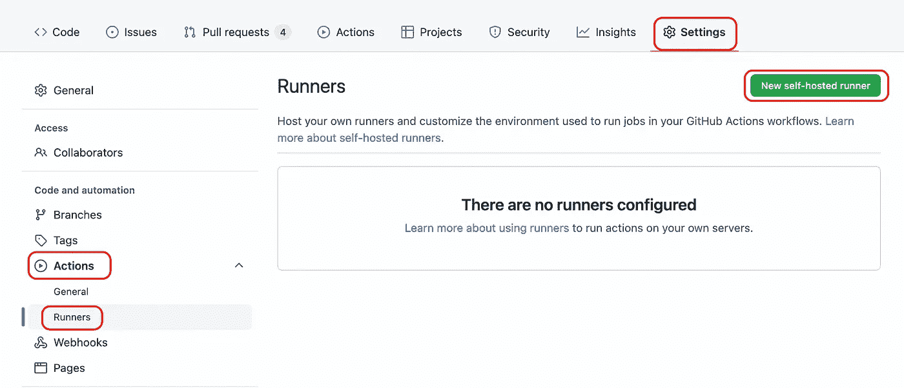
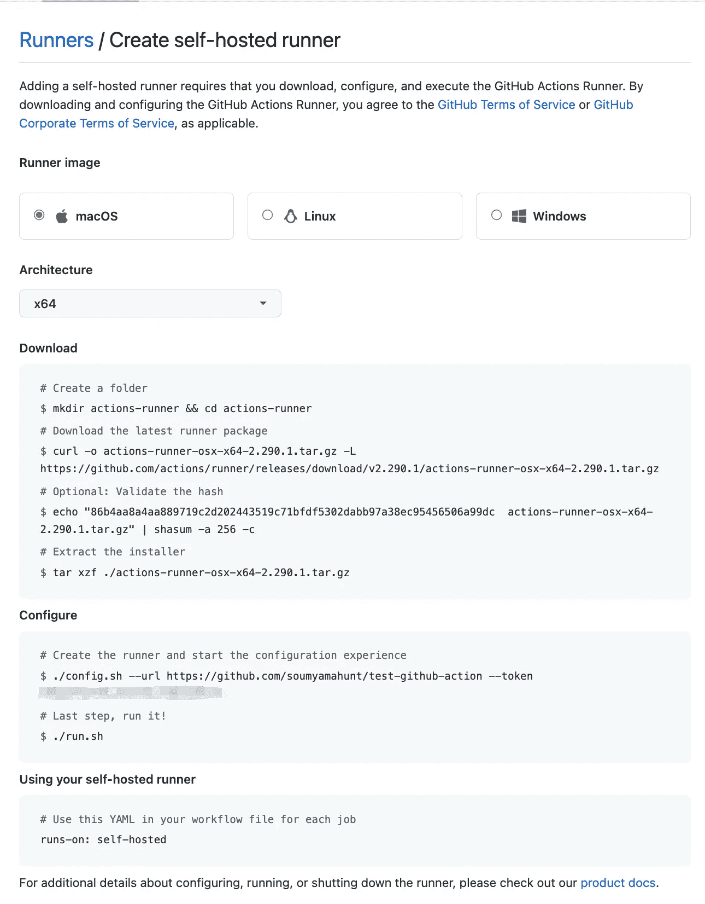
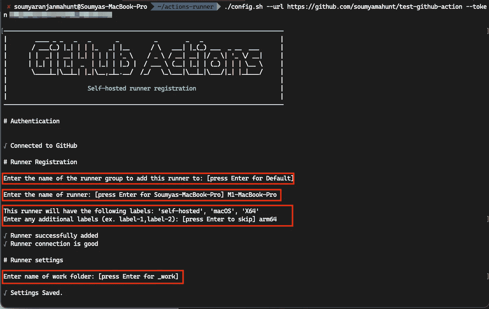
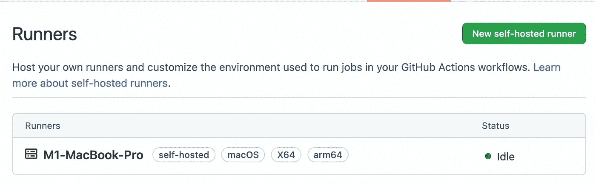

# 在苹果 M1 Mac 上运行 GitHub Actions 自托管 macOS 运行程序

> 原文：<https://betterprogramming.pub/run-github-actions-self-hosted-macos-runners-on-apple-m1-mac-b559acd6d783>

## 第 2 部分:使用 M1 Mac 来驱动您自己的 iOS CI/CD 管道


在本系列的第 1 部分中，我们看到了使用苹果硅机器创建自托管的微软 Azure 的 DevOps 代理。

对于那些正在使用 GitHub actions 的人来说，在这篇文章中，我们将为 GitHub actions 自托管的运行者介绍使用基于 M1 的机器的过程。

# 准备安装

首先，您需要镜像 GitHub 托管的运行程序的配置，以避免将来出现任何错误。为此，创建一个名为 **runner** 的用户帐户，并将该帐户添加到管理组:

重新启动后，您的新用户帐户将准备就绪。从现在开始，使用这个帐户来配置和运行我们的自托管 runner。

> 注意:你需要安装一些必备的工具，比如 **git** 如果还没有安装的话，还需要[在你的苹果 M1 机器](https://support.apple.com/en-us/HT211861)上安装 Rosetta 2。

# 设置和配置跑步者

您可以在存储库级别、组织级别或企业级别创建自托管运行程序。为此，导航至所需级别的**设置**选项卡。从侧边栏导航中选择**动作**，接下来选择**跑步者**选项并点击**新的自托管跑步者**。



当您这样做时，您将看到一个视图，其中包含安装命令和示例用法，如上所示。从这里，只需打开一个终端，并按顺序运行命令。在运行 **config.sh** ，时，您将在终端中看到以下对话:



在这里，选择您的跑步者组和名称或接受默认值。您可以选择为您的跑步者提供额外的标签，标签的用法将在后面解释。然后，您可以自定义工作文件夹或接受默认值`_work`。

最后，您需要配置额外的环境变量，以确保动作在您的自托管 runner 上正常工作。最重要的是`ImageOS`和`XCODE_12_DEVELOPER_DIR` / `XCODE_11_DEVELOPER_DIR`。对于`ImageOS`，您需要提供操作系统名称(此处为 macos)和版本，格式为 **macos*version*** ，即`maos12`。对于`XCODE_*_DEVELOPER_DIR`，提供适用版本`/Applications/Xcode_12.5.1.app/Contents/Developer`的 Xcode 开发者目录的路径。您可以在**中添加这些变量。runner 文件夹中的 env** 文件。如果您的操作需要额外的环境变量，您也可以在这里添加它们。

这样，您就可以最终执行 **run.sh** 脚本，它将出现在您的新 runner 目录中。

# 确认成功

一旦你完成了设置，你应该在终端上看到输出，运行者已经启动，并且**正在监听任务**。然后你可以在你的浏览器中导航到你的 GitHub 库，点击**设置**标签，然后选择**动作**，然后在侧边栏中再次选择**跑步者**，在那里你会看到你新关联的跑步者带有一个绿点，状态为**空闲**，如下所示。



现在，要在您的自托管运行器上运行操作，您需要像这样修改您的工作流文件`[jobs.<job_id>.runs-on](https://docs.github.com/en/actions/using-workflows/workflow-syntax-for-github-actions#jobsjob_idruns-on)`属性:

在自承载流道的数组中，可以提供在配置过程中提供的附加标签。提交更改后，您可以享受自托管带来的性能提升。

# 配置工具缓存

许多设置动作下载工具并将其存储在**/Users/runner/hostedtoolcache**的工具缓存文件夹中。您可以使用 [homebrew](https://brew.sh/) 管理所需的工具，并使用以下 python 脚本将安装的工具链接到您的工具缓存文件夹:

使用 GitHub actions，您可以通过在`.env`文件中提供上述脚本路径到`ACTIONS_RUNNER_HOOK_JOB_STARTED`环境变量，在每个作业之前运行这个脚本。通过这样做，您可以确保在执行任何作业之前，已安装的工具将始终在工具缓存中可用。

# Sudoers 构型

如果您的操作需要 root 权限，您可以通过键入`sudo visudo`来配置您的`sudoers`文件。如果你的 runner 只用于私有库(由于 runner 的[安全性](http://If your tasks require root privileges, you can configure your sudoers file by typing sudo visudo. You can add the following line in this file to allow root privileges without prompting for a password, however, this is not advisable due to potential security risks:)，这是 GitHub 提供的默认推荐)，你可以在`sudoers`文件中添加下面一行:

```
runner ALL=(ALL) NOPASSWD: ALL
```

或者，您可以添加限制应用程序级别，以便这些应用程序不需要密码提示。例如， [setup-unity](https://github.com/kuler90/setup-unity) 动作需要`hdiutil`的 root 权限，在这种情况下，您可以将`hdiutil`添加到无密码提示中，如下所示:

```
runner  ALL= NOPASSWD: **/bin/****hdiutil**# Or your additional applications with arguments:runner  ALL= NOPASSWD: **/bin/****hdiutil,**/your_dir/your_bin your_args
```

# 都准备好了吗？

不幸的是没有，虽然这是大多数操作所需的基本设置，但有些操作可能需要预装更多的附加工具。幸运的是，这些操作在它们的文档中指定了这些需求。

如果我遗漏了什么，请随时指出，并继续关注本系列的第 3 部分，在那里，我将讨论优化管道以获得更高性能的不同步骤。