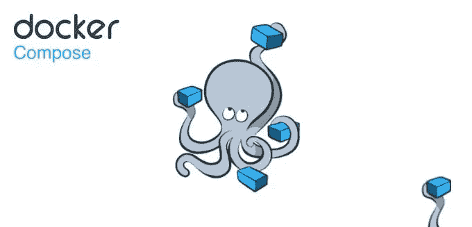

# 使用 Docker Compose 运行多个容器

> 原文：<https://betterprogramming.pub/run-multiple-containers-with-docker-compose-9297957f7a3c>

## 并排执行多个容器而不互相干扰



docker 撰写

# Docker 是什么？

Docker 受到欢迎有多种原因。其中之一是创建快速且易于部署的便携式容器。

正如在他们的[网站](https://www.docker.com/resources/what-container/)上提到的:“容器是将你的代码和任何其他依赖项打包在一起的东西，这样它就可以可靠地跨多个平台部署”。

这些容器可以在您的 Windows、Mac 和 Linux 上本地运行。其次，像 AWS 或 Azure 这样的主要云系统确实支持开箱即用。最后，它可以在任何可以安装和运行它的托管空间上使用。如果你想学习更多的 Docker 基础知识，并且需要 docker CLI 的备忘单，我在这里[写了一篇关于它的介绍性文章](https://www.daveops.co.in/post/docker-a-beginner-s-cheat-sheet-2022)。

这里我们将深入了解一些高级特性，比如运行多个容器。

# Docker 撰写

使用 docker-compose，可以用一个 YAML 文件配置和启动多个容器。如果您正在使用包含多种技术的技术堆栈，这将非常有帮助。举个例子，如果你正在做一个需要 MySQL 数据库、python for AI/ML、Node.js 进行实时处理的项目。NET 来提供 API。为每个团队成员建立这样的环境是很麻烦的。Docker 借助 compose 缓解了这个问题。

# 了解 Docker 撰写

`docker compose`是一个 YAML 文件，我们可以在其中配置不同类型的服务。然后，随着一个简单的命令，所有的集装箱都建立和发射。主要包括 3 个步骤

*   为每个项目生成一个 docker 文件。
*   在`docker-compose.yml`文件中设置服务。
*   点燃容器。

我们现在要为上面的问题陈述实现一个解决方案。

# 先决条件

人们可能希望安装所有的技术来运行上面讨论的 MySQL、Python、NodeJS 等技术栈。NET 和 PHP。相反，你所需要的是一个 docker 引擎运行。docker 的最新版本安装了 docker-compose。目前，不需要其他安装。

# 路标

在我们开始之前，先简单介绍一下我们要做的事情。我们将逐一解决每项技术。对于每种技术，我们将创建一个示例应用程序(除了 MySQL)并为每种技术创建一个 Dockerfile。然后我们将这个 docker 文件指向我们的 docker-compose YAML 文件。最后，我们将配置 docker-compose，以便每个应用程序做它应该做的事情。

在我们开始创建一个名为 super-app 的文件夹之前。其次，创建一个`docker-compose.yml`文件。在这个文件中，我们将配置所有的应用程序。所以让我们开始吧！

对于那些对代码感兴趣的人，你可以访问这里的[库。](https://github.com/shenanigan/super-app-docker)

# 如何用 Docker 配置 MySQL

在您的`docker-compose.yml`文件中设置以下内容。

```
version: '3.4'
services:
  super-app-db:
    image: mysql:8.0.28
    environment:
      MYSQL_DATABASE: 'super-app'
      MYSQL_ROOT_PASSWORD: '$SuperApp1'
    ports:
      - '3306:3306'
    expose:
      - '3306'
```

在`services`部分，我们将列出所有需要配置的应用类型。首先，我们配置了一个`super-app-db` 服务，该服务从 8.0.28 版本中提取 MySQL 的 docker 映像。接下来，我们指示容器创建一个名为`super-app`的数据库，默认用户为`root`，密码设置为`$SuperApp1`。

最后，由于 MySQL 的默认端口是 3306，我们将其映射到容器的端口 3306，并公开该端口以供访问。

一旦上面的文件被创建，运行下面的命令来创建你的 docker 镜像，并把它作为一个容器运行。

```
docker compose up
```

MySQL 图像将被拉，然后 docker 将旋转一个容器来运行这个图像。可以通过 MySQL 客户端连接 MySQL 服务器进行验证。如果没有，不用担心，我们将在下面看到如何通过我们的应用程序连接到它。只要容器没有被删除，表就会被持久化。

让我们配置下一个应用程序节点。

# 如何用 Docker 配置 NodeJS

我们将创建一个非常简单的 express 节点应用程序。为此，在我们的`super-app`文件夹中创建一个名为`node`的文件夹。在*节点*文件夹中添加以下三个文件`server.js` *、* `package.json` *和* `Dockerfile`。

`server.js` *:*

```
const server = require("express")();
server.listen(3000, async () => { });
server.get("/super-app", async (_, response) => {
    response.json({ "super": "app" });
});
```

`package.json` *:*

```
{
    "name": "super-app-node",
    "dependencies": {
        "express": "^4.17.1"
    }
}
```

`Dockerfile` *:*

```
# Download the slim version of node
FROM node:17-slim# Set the work directory to app folder. 
# We will be copying our code here
WORKDIR /node#Copy package.json file in the node folder inside container
COPY package.json .# Install the dependencies in the container
RUN npm install# Copy the rest of the code in the container
COPY . .# Run the node server with server.js file
CMD ["node", "server.js"]# Expose the service over PORT 3000
EXPOSE 3000
```

这里我们创建了一个节点应用程序，当我们在浏览器中点击`localhost:3000/super-app`时，它会返回 JSON。现在，我们不会直接从这个文件夹运行项目。

相反，返回到您的`super-app` 文件夹，并将下面几行添加到您的`docker-compose.yml`文件中。

```
super-app-node:
    build: ./node
    ports:
      - "3000:3000"
```

我们只是提到创建一个名为`super-app-node`的服务。我们还将容器端口映射到主机端口 3000。最后，运行下面的命令来运行您的两个容器，即 MySQL & NodeJS。

```
docker compose up
```

现在，如果你点击`localhost:3000/super-app`，你会看到一个回应`{“super”:”app”}`。同时你的 MySQL 服务也是。耶！我们已经使用 docker-compose 文件成功创建了两个容器。

下一个应用程序。让我们创建一个与数据库交互并返回字符串列表的. NET 应用程序。

# 如何配置。带有 Docker 的 NET 6.0

我们想要。NET 应用程序来连接数据库。其次，它将通过 GET API 从数据库中获取数据，并在浏览器中显示出来。为此，在我们的`super-app` 项目中创建一个名为`dotnet`的. NET 项目。

由于写下创建和设置项目的所有步骤对于这个博客来说将是相当冗长的，并且也使这篇文章专注于 docker，所以一篇单独的[文章](https://arjavdave.com/2022/04/17/code-first-entity-framework-core-mysql/)是关于如何实现上述目标的。

[文章](https://arjavdave.com/2022/04/17/code-first-entity-framework-core-mysql/)提供了使用 EF Core 创建连接到 MySQL 数据库的. NET 6 应用程序的分步说明。EF Core 是一个对象关系映射器，用于数据库和代码之间的通信。 ***注意:*** *忽略先决条件部分，因为我们已经有一个 MySQL 服务器在 docker 中运行。*

## 。网络应用变化

由于项目将在它们自己的容器中运行，它们不能通过`localhost` url 进行通信。因此为了。NET app 与 MySQL 通信，需要更新连接字符串。为此，打开`appsettings.json`和`appsettings.Development.json` 文件，并将`DefaultConnection` *中*服务器*的`localhost`替换为`super-app-db`。*

最后，容器中的应用程序不需要 HTTPS 重定向。因为 HTTPS 应该由服务器处理，所以从`Program.cs`中删除下面一行。

```
app.UseHttpsRedirection();
```

## 码头工人

一旦项目建立并运行，就应该使用 Dockerfile 和 docker-compose 配置它在 docker 中运行。在`dotnet`文件夹中用以下内容创建`Dockerfile` 。

```
#Get the SDK image to build and publish the project
FROM mcr.microsoft.com/dotnet/sdk:6.0 AS build-env
WORKDIR /app# Copy everything
COPY . ./# Restore as distinct layers
RUN dotnet restore# Build and publish a release
RUN dotnet publish -c Release -o out# Build runtime image
FROM mcr.microsoft.com/dotnet/aspnet:6.0
WORKDIR /app#Copy the build file to the app directory
COPY --from=build-env /app/out .
ENTRYPOINT ["dotnet", "dotnet.dll"]#Expose the port for communication
EXPOSE 80
```

现在回到 docker-compose.yml 文件，添加下面的内容。

```
super-app-dotnet:
    build: ./dotnet
    ports:
    - "8080:80"
```

这里，我们将主机的端口 8080 绑定到容器的端口 80。目前就这些。执行下面的命令来启动所有的容器。

```
docker compose up
```

最后，在浏览器中点击 [localhost:8080/api/job](http://127.0.0.1:8080/api/job) 。GET API 将从数据库中获取作业列表。

# 如何用 Docker 配置 Python

到目前为止，您可能已经猜到在我们的`super-app`文件夹中创建了一个 *python* 文件夹。

其次，创建我们项目需要的三个文件，分别是`ai-ml.py`、`requirements.txt`和`*Dockerfile*`，内容如下。

`ai-ml.py`:

```
import matplotlib.pyplot as plt
import pandas as pd
from scipy import signalif __name__ == "__main__":
    print("All working good")
```

`requirements.txt`:

```
pandas
scipy
matplotlib
```

`Dockerfile`:

```
# Get the python image
FROM python:3.7.13-slim# Switch to app directory
WORKDIR /app# Copy the requirements in to the app
COPY requirements.txt ./# Install dependencies
RUN pip install --no-cache-dir -r requirements.txt# Copy everything else
COPY . .#Run the python script
CMD [ "python", "./ai-ml.py" ]
```

最后，回到`docker-compose.yml`文件，添加下面的内容。

```
super-app-python:
    build: ./python
```

就这么简单。因为这只是一个简单的脚本，它将运行一次，然后容器将退出。但是容器的日志将显示*所有工作正常*打印出来。这就是 Python 的全部内容。

# 如何用 Docker 配置 PHP

用 docker 设置 PHP 是最简单的。创建两个文件`index.php`和`Dockerfile` *，如下图。*

`index.php` *:*

```
<?php echo "I am running in a container."; ?>
```

`Dockerfile` *:*

```
# Get the php apache image
FROM php:8.0-apache# Switch to app directory
WORKDIR /var/www/html# Copy everything
COPY . .EXPOSE 80
```

最后，将以下内容添加到`docker-compose.yml`。

```
super-app-php:
    build: ./php
    ports:
    - "8000:80"
```

最后，用`docker compose up`再次点燃所有容器。当你点击 [http://localhost:8000](http://localhost:8000) 时，一条好消息说*“我正在一个容器中运行。”*会出现。

这是最终的[库](https://github.com/shenanigan/super-app-docker)，包含所有 other 文件和其他设置。

# 结论

Docker 是一个很棒的容器化工具，通过 docker-compose 它变得更加强大。它允许并排运行多个容器，而不会相互干扰。它应该在知识库的工具库中。