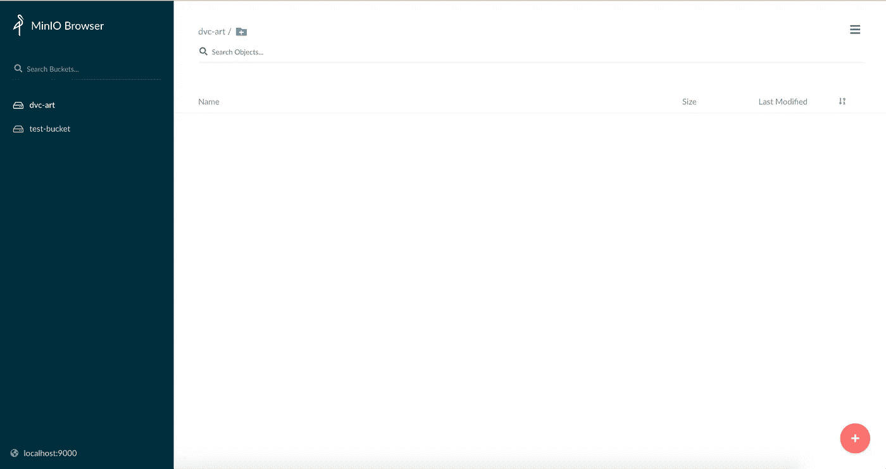
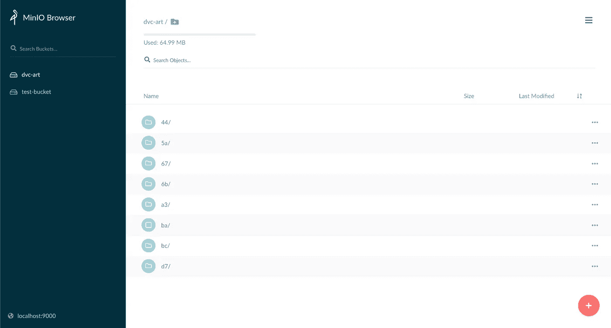

# 使用 MinIO 在本地运行 DVC 机器学习管道的 S3

> 原文：<https://betterprogramming.pub/run-s3-locally-with-minio-for-dvc-machine-learning-pipeline-7fa3d240d3ab>

## 开始使用对象存储的最便宜和最快的方法。


照片由[丹尼尔·伊德里](https://unsplash.com/@ricaros?utm_source=medium&utm_medium=referral)在 [Unsplash](https://unsplash.com?utm_source=medium&utm_medium=referral) 上拍摄

对象存储是文件系统之上的抽象层，有助于通过 API 处理数据。最广为人知的工具是 AWS S3，但是还有许多其他的解决方案允许它在私有网络上运行。在本文中，我们将介绍一种叫做 MinIO 的工具。

在我看来，MinIO 是开始使用对象存储的最便宜和最快的方法。它与 S3 兼容，易于部署、本地管理，并且可以根据需要进行升级。如果你的项目处于早期阶段，MinIO 可能会派上用场。

# 安装 MinIO 服务器

在本文中，我们将部署 MinIO 并在其上执行一些简单的任务。现在有很多不同的方式来运行它，但我们更喜欢建立一个 Docker 容器并在其上运行 MinIO。

为了构建容器，我们将使用 docker-compose。在这里，我受到了一个优秀的回购 [kafka-to-s3](https://github.com/github-ismail-chafai/kafka-to-s3) 的启发，其中 MinIO 被用来嘲笑 s3 从 Kafka Connect 接收的数据。`docker-compose.yml`文件定义如下:

这里我们定义了两个服务:`minio`和`aws`。在`minio`中，我们定义要安装的发布版本和运行服务器的命令，这允许我们通过暴露的端口`9000`访问 MinIO UI。我们还定义了`aws-cli`映像来在本地构建 S3 存储。我们用 URL `http://minio:9000`访问 MinIO 并定义区域`eu-west-1`。我们还定义了运行服务器后登录 UI 的密钥。

保存清单后，我们在同一个目录中运行`docker-compose up`。下载并构建映像后，我们会看到消息称`minio`已启动并运行，已连接到 S3。通过访问 URL `http://localhost:9000`，使用之前创建的登录名和密码，我们可以访问 UI。



## 链接 MinIO 服务器作为 DVC 远程存储

我们回到我们在[上一篇文章](/build-production-ready-ml-workflow-with-dvc-and-s3-cdd9c95bf19)中描述的例子。

但这一次，我们将设置我们的提升 MinIO 服务器作为 DVC 的远程存储。首先，我们需要创建一个名为`dvc-art`的桶来推送数据。这个桶类似于 AWS S3 的那个。但是在 MinIO 的情况下，我们需要在 DVC 的配置文件中明确地对它进行认证。让我们设置 DVC 遥控器。首先，添加名为`dvc-art`的新遥控器。

```
dvc init
dvc remote add -d minio s3://dvc-art
```

添加有关存储 URL 和凭据的信息以访问 MinIO 服务器。

```
dvc remote modify minio endpointurl [http://localhost:9000/minio/](http://127.0.0.1:9000)
dvc remote modify minio2 access_key_id minioadmin
dvc remote modify minio2 secret_access_key minioadmin
```

设置好遥控器后，我们将能够在`.dvc/config`文件中看到这些修改。

我们的项目和 MinIO 储物件已经准备就绪。我们将运行在上一篇文章中构建的 ML 管道来生成带有中间特征化数据集的文件。

```
dvc repro
```

现在，我们可以将创建的数据文件推送到模拟的 S3 存储器。

```
git add .
git commit -m "run pipeline"
dvc push -r minio2 data/*
```

推送的数据应该以下列格式出现在 MinIO UI 中:



也可以使用以下命令从远程位置提取存储的数据来进行访问:

```
dvc pull -r minio2 data/*
```

# 最后的想法

在本文中，我们通过提升 MinIO 对象存储服务器在本地模拟了 S3 存储。我们还将其定义为 DVC 管道的远程存储，并从机器学习项目中推送/拉出数据。

感谢阅读这篇文章。

# 参考

*   [https://docs.min.io/docs/deploy-minio-on-docker-compose](https://docs.min.io/docs/deploy-minio-on-docker-compose)
*   [https://docs.min.io/docs/minio-docker-quickstart-guide.html](https://docs.min.io/docs/minio-docker-quickstart-guide.html)
*   [https://the database me . de/2022/03/20/I-do-it-on-my-own-then-self-hosted-S3-object-storage-with-minio-and-docker/](https://thedatabaseme.de/2022/03/20/i-do-it-on-my-own-then-self-hosted-s3-object-storage-with-minio-and-docker/)