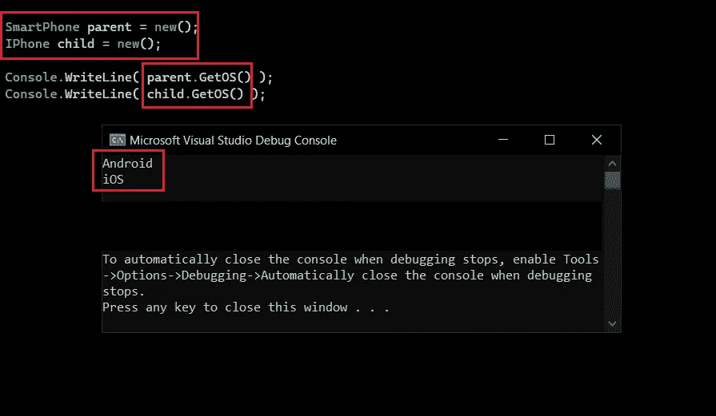
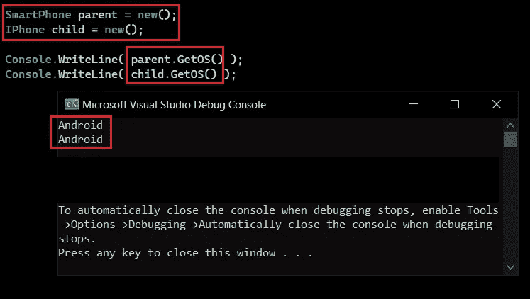
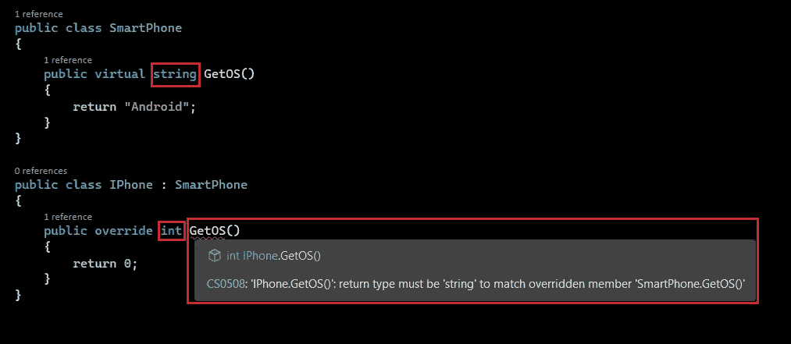
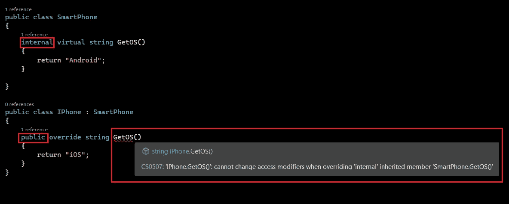
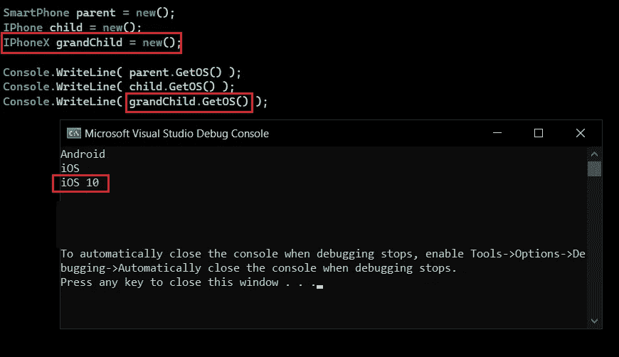
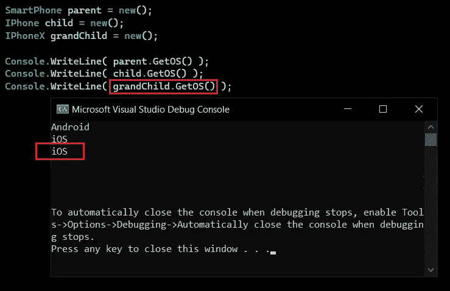
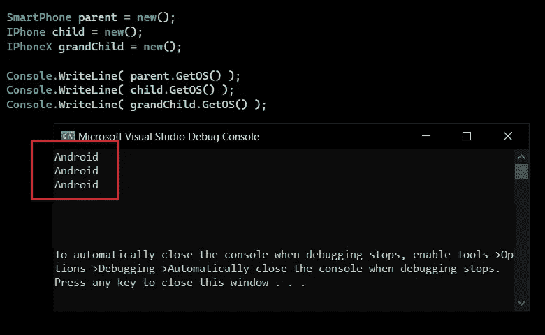

# C#中的运行时多态性

> 原文：<https://betterprogramming.pub/run-time-polymorphism-in-c-6f9687857ba6>

## 掌握多态性概念


由[法尔扎德·纳兹菲](https://unsplash.com/@euwars?utm_source=medium&utm_medium=referral)在 [Unsplash](https://unsplash.com?utm_source=medium&utm_medium=referral) 上拍摄的照片

在上一篇文章中，我们看到了什么是[方法重载](https://medium.com/better-programming/compile-time-polymorphism-in-c-f5ca6934cc55)以及我们如何实现它。方法重写是方法重载久违的兄弟，但是它们之间有一个根本的区别。

这是多态性系列的第 2 部分，在这里我们将深入探讨多态性。以下是拼图的三个部分。

1.  [编译时多态性](/compile-time-polymorphism-in-c-f5ca6934cc55)
2.  运行时多态性
3.  [方法隐藏/隐藏](https://medium.com/@RikamPalkar/method-hiding-in-c-d653f822ab33)

我们将比较重写和重载，这不仅可以澄清这两者之间的混淆，还可以更好地理解重写。

> 重载意味着有多个行为，而重写意味着改变行为。

以下是重载和重写之间的主要区别。

1.  在方法重载中，我们必须改变签名，而在方法覆盖中，我们必须保持相同的方法签名，包括`return-type`和`access specifier`，这是一种可重用的技术。意思是，用完全相同的签名重新定义子类中的父类方法。
2.  方法可以在同一个类中重载，也可以在子类中重载。尽管重写方法只能在子类中被重写，但是如果您试图使用相同的签名重写同一类中的方法，您将得到如下所示的编译时异常。

**异常:**类型`‘class name’`已经定义了具有相同参数类型的成员`‘method name’`。

**最重要的规则:**你只能覆盖`virtual`或`abstract`方法，这意味着父类需要用`‘virtual’`或`‘abstract’`关键字修饰一个方法，让子类可以覆盖。您不能覆盖不是`virtual`或`abstract`的方法。

开始编码吧！

> **规则 1:** 方法签名应该匹配，包括`return-type`和`access specifier`。

清单 1:被覆盖的方法 GetOS()

让我们用它们的`type`调用这些方法，看看这是否有效？

正如你在下图-1 中看到的，父`class SmartPhone` 的一个实例正在调用它的`GetOS()`版本并打印消息`“Android”` ，而子`class Iphone`的一个实例正在调用它的`GetOS()`版本并打印消息`“iOS”`。这是因为我们已经成功地覆盖了`class IPhone`中的方法`GetOS()`。



图 1:父类和子类对象调用各自的 GetOS()方法

注意:如果你没有在子类中定义一个方法，那么子类对象将调用父类的方法。如果您有类似清单 2 的代码，那么您将得到类似 image-2 的输出。

清单 2:方法 GetOS()没有在子类中被覆盖

在下图 2 中，可以看到父类对象和子类对象都在调用父类对象版本的`GetOs()`



图 2:父类和子类对象调用父类的 GetOS()方法

让我们看看下面的几个错误场景，理解它们很重要！！

> **错误场景 1:** 如果我试图用不同的`return type`覆盖一个方法会发生什么？

我得到了下面的异常！

> **异常:** `‘IPhone.GetOS()’`:返回类型必须是“字符串”才能匹配被覆盖的成员`‘SmartPhone.GetOS()’`



图 3:不同返回类型的编译时异常

> **错误场景 2:** 如果我试图用不同的`access specifier`覆盖一个方法会发生什么？

我得到了下面的异常！

> **异常:** `*‘IPhone.GetOS()’*`:返回类型必须为‘string’才能匹配被覆盖的成员`*‘SmartPhone.GetOS()’*`



图 4:不同访问说明符的编译时异常

> **错误场景 3:** 如果我试图覆盖一个不是`virtual`或`abstract`的方法会发生什么？

我当然得到了下面的例外！

> **异常:** `*‘IPhone.GetOS()’*`:返回类型必须是“字符串”才能匹配被覆盖的成员`*‘SmartPhone.GetOS()’*`


图 5:重写非虚方法时抛出编译时异常

在这里，你可能会说我可以简单地跳过子类中的 override 关键字，是的，你可以，但那样它就不是一个被覆盖的方法了。这将是一个属于`type ‘IPhone’`的独立方法。

这叫做方法隐藏，当父类和子类有相同的方法名，相同的签名，没有`‘virtual’` 或`‘abstract’`关键字，那么子类隐藏父类方法的实现。

让我们再看一个场景，这也是面试问题之一。如果你有多级遗传呢？类似于清单 3:

清单 3 : SmartPhone

New grandchild 【 has its own version of 【 , So with the object of 【 we get its version of 【 .



Image 6: Grandchild is calling its own implementation of GetOS()

The real question is, what if grandchild 【 doesn’t have a version of the overridden method? so with its object, will it refer to parent’s 【 or grandparent’s 【 ? Let’s find out.

Listing 4 draws this scenario.

Listing 4: Grandchild missing overridden method



Image 7: Grandchild refers to the immediate overridden method

Remember this hierarchy of preferences : Local ->直接父类->它们的父类->直到基类。

如果你看一下，孙子女最终调用了其父版本的`GetOS()`。这是因为如果被覆盖的方法存在，孙首先在自身中查找。如果不存在，那么它将转到父方法，查看是否存在被覆盖方法的版本。因为它确实存在于父类中，所以它停止了搜索并访问了该方法。

好吧！！现在我们知道它在`override`的情况下访问 immediate 方法，但是当方法是`virtual`时会发生什么呢？让我们看看。

考虑以下场景:

清单 5:孙子女可以访问 2 个虚拟方法

同样的规则也适用于这里，它寻找直接的父节点并试图解决问题。在下图中，您可以看到`IPhoneX`也在打印`“iOS”`，它是`GetOS()`的父版本。


图 8:孙子引用了父方法的直接虚拟方法

为了好玩，让我们也删除`GetOS()`的父版本。

清单 6:孙子女可以访问祖父母的虚拟方法



图 9:孙子女指的是祖父母的直接虚拟方法

现在它已经到达了基类`SmartPhone`并且找到了具有匹配签名的方法，它停止了搜索并打印了输出“`Android”`”。

现在我们知道了重载和重写的不同方法。以及在重写方法时应该避免什么，以及如何成功地重写它。

```
**Want to Connect?**Hit me up on [LinkedIn](https://www.linkedin.com/in/rikampalkar).
```