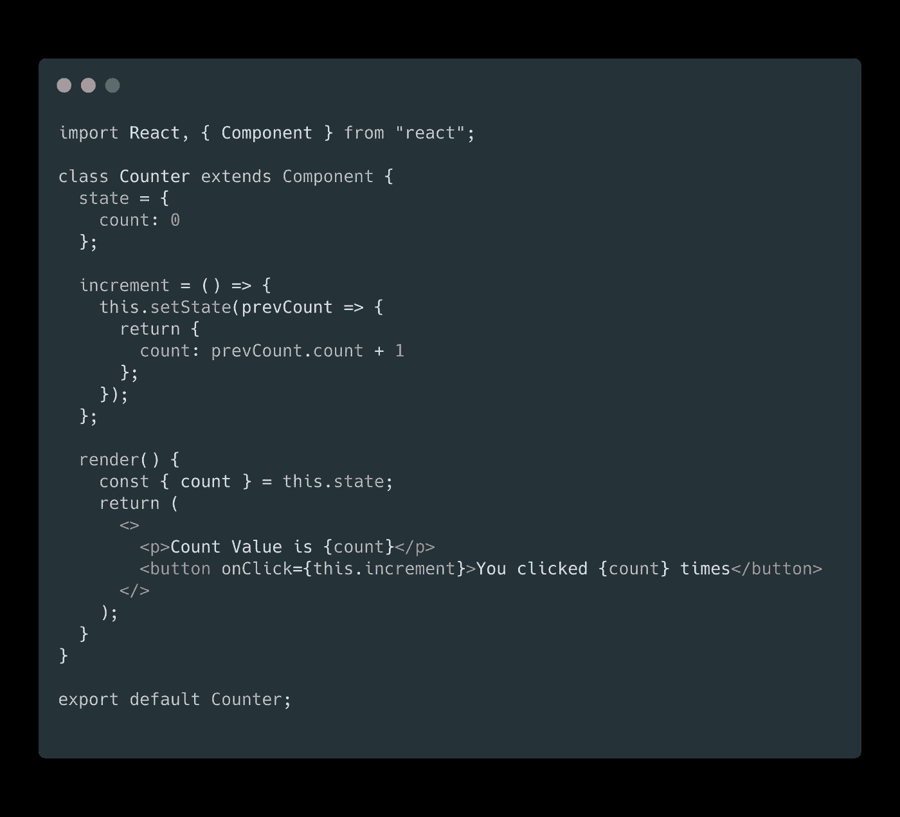
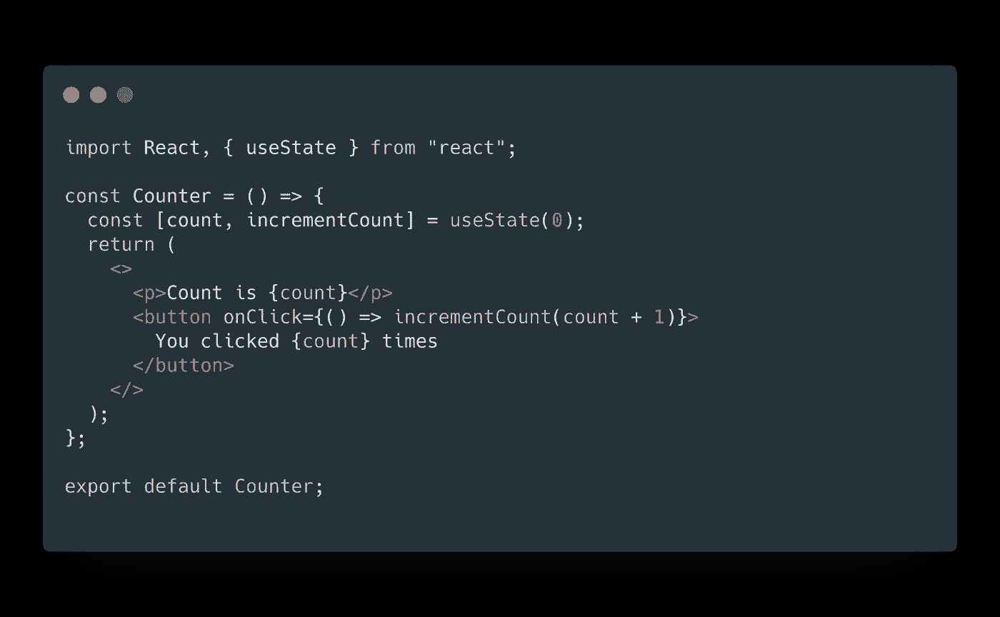
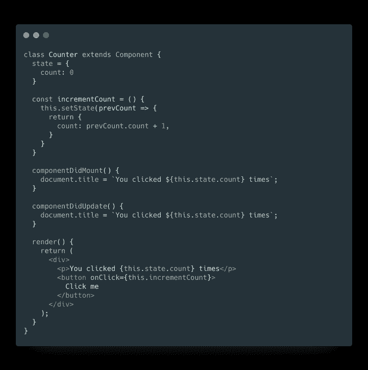
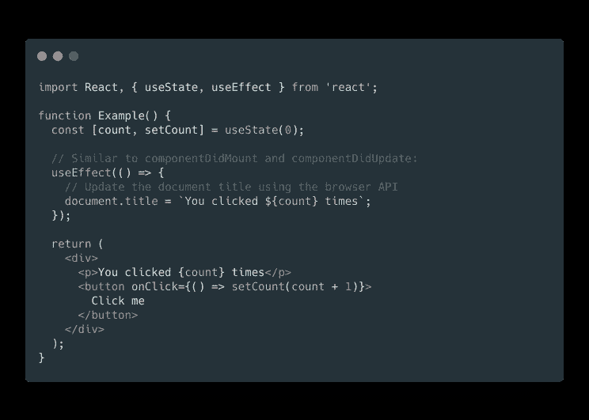
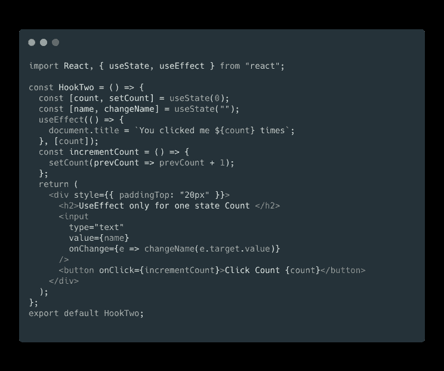
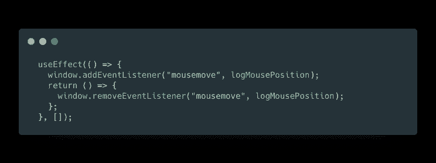
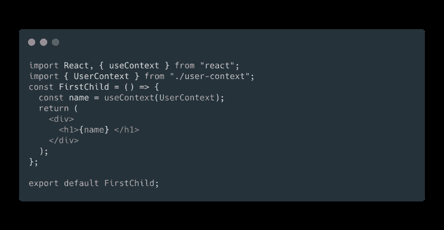
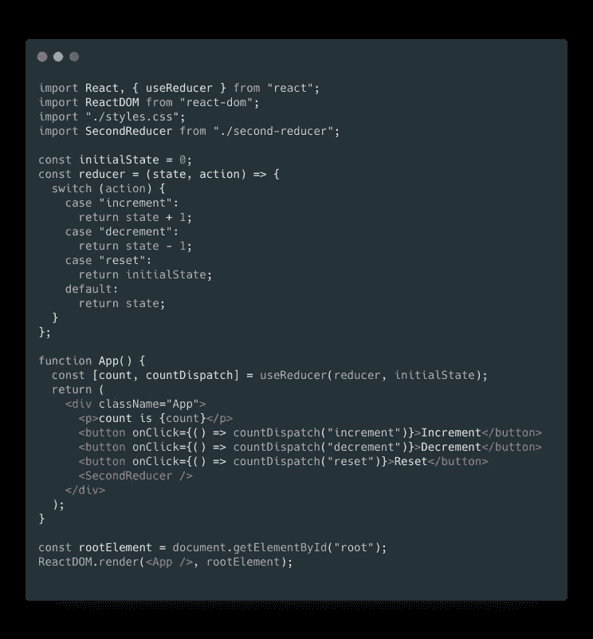
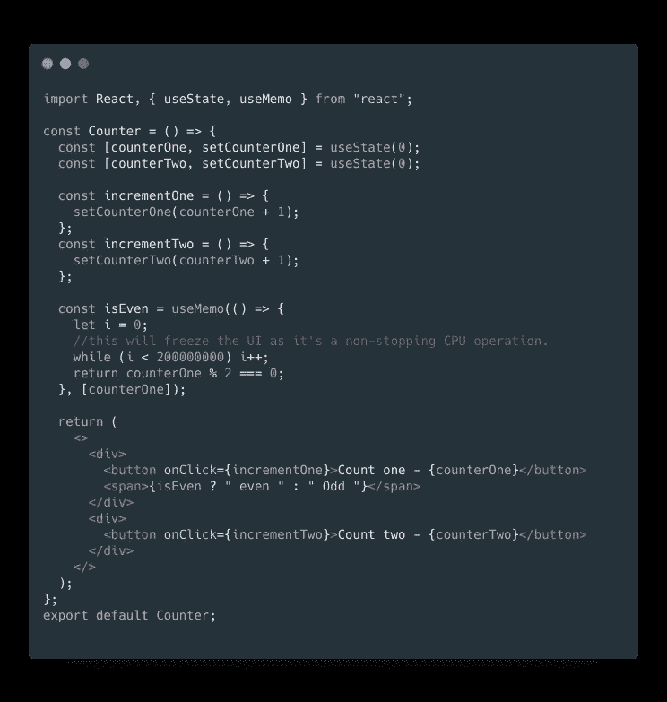

# 最重要的反应挂钩的概述

> 原文：<https://betterprogramming.pub/rundown-of-the-most-important-react-hooks-5c9ec4cac5a2>

## 比较功能组件和基于类的组件的速度和性能


钩子解决了 React 中各种各样看似不相关的问题，这些问题是我们五年来编写和维护成千上万个组件时遇到的。

无论您是在学习 React、日常使用它，还是更喜欢使用具有相似组件模型的不同库，您都可能会认识到其中的一些问题。

# **反应钩的先决条件**

钩子是 React 16.8 的新增功能。在此版本之前，它不可用。关于 React 的一点知识就足够理解 React 钩子了。

# 为什么反应钩

我们经常不得不维护一些组件，这些组件开始时很简单，但后来却变成了一堆难以管理的有状态逻辑和副作用。

每种生命周期方法通常都包含一些不相关的逻辑。例如，组件可能在`componentDidMount`和`componentDidUpdate`中执行数据提取。

然而，同一个`componentDidMount`方法也可能包含一些建立事件监听器的不相关逻辑，清理在`componentWillUnmount`中执行。

一起改变的相互相关的代码被分开，但是完全不相关的代码最终被组合在一个方法中。这使得引入错误和不一致变得太容易了。

在许多情况下，不可能将这些组件分解成更小的组件，因为有状态逻辑无处不在。测试它们也很困难。这是许多人喜欢将 React 与单独的状态管理库结合起来的原因之一。

然而，这通常会引入太多的抽象，需要您在不同的文件之间跳转，并且使得重用组件更加困难。

为了解决这个问题，Hooks 允许您将一个组件拆分成更小的功能，这是基于哪些部分是相关的(比如设置订阅或获取数据)，而不是基于生命周期方法强制拆分。

您也可以选择用一个 reducer 来管理组件的本地状态，使其更具可预测性。

## **钩子快如闪电**

钩子非常快，因为如果你创建两个组件，一个是使用钩子管理状态的功能组件，另一个是基于类的组件。

我们将在这两个组件中制作一个基本计数器，以比较它们的速度和性能。第一个是基于类的组件，它只是执行一个计数器逻辑。



我们使用 Chrome 开发工具中的审计检查了这个基于类的组件的性能，结果是 95%。



参考此处的代码

在功能组件中使用钩子将性能提高到 98% ，比基于类的组件高 3%。

我们使用计数器的简单逻辑，它显示了 3%的差异。而且，如果组件中的逻辑很大，性能差异会更大。

# 反应钩

React 钩子有很多，包括`useState`、`useEffect`、`useContext`、`useReducer`、`useMemo`、`useCallback`、`useRef`、`useImperativeHandle`、`useLayoutEffect`、`useDebugValue`，你可以创建自己的定制钩子。

我们将浏览其中的一些，并将它们与没有挂钩的基于类的组件进行比较。

## **使用状态挂钩**

我们已经在上面的计数器逻辑中看到了一个`useState`钩子的基本例子。

`useState`钩子返回一个数组，其中第一个元素是状态名，第二个元素是修改状态值的函数。在`useState`中，我们传递状态的初始值。

```
const [count , setCount] = useState(0)
```


参见此处的代码[和](https://codesandbox.io/s/basic-of-hooks-i7v3d)

这就是 React 钩子管理状态以存储值的方式，类似于基于类的组件。

功能组件的代码比基于类的组件要小得多。基于类的组件可以执行相同的逻辑，如下所示:


您可以看到，与基于类的组件相比，React 挂钩将代码减少到简单计数器逻辑的一半。

## 使用效果挂钩

`useEffect`钩子用于处理功能组件中的生命周期方法。

如果你熟悉 React 类的生命周期方法，你可以把`useEffect`钩子看作是初学者的`componentDidMount`、`componentDidUpdate`、`componentWillUnmount`和`getDerivedStateFromProps`的组合。

它有助于将逻辑写在一个地方。但是 Dan Abramov 已经多次重复说`useEffect`不应该作为这些生命周期方法*的替代而被引入，只能是* **。**

如果你把`useEffect`和那个心智模型一起使用，你以后会很困惑。相反，他建议将`useEffect`视为一个当依赖数组中的值发生变化时运行副作用的地方。

`useEffect`是一个回调函数，我们可以给第二个元素一个依赖数组，它可以包含任何东西，比如变量、道具、状态等等。，我们必须在上面运行`componentDidUpdate`。

React 组件中有两种常见的副作用——不需要清理的副作用和需要清理的副作用。



这是一个使用基于类的组件使用`componentDidMount`和`componentDidUpdate`的基本例子，基于计数值改变页面的标题。这是先前计数逻辑的扩展。



这就是我们如何用钩子执行相同的逻辑。它将代码长度减少了将近一半，同时也提高了效率。

当我们有不止一个状态，并且我们必须只在特定的状态改变时使用`useEffect`钩子时，依赖数组就出现了。

在下面的例子中，我们有两个状态计数和名称，只有当我们的计数值改变时，我们才需要更新文档标题。这就是为什么一个依赖数组只包含`count` **。**



此处完成代码

前面，我们看了如何表达不需要任何清理的副作用。然而，有些影响确实如此。

例如，我们可能想要设置对外部数据源的订阅。在这种情况下，清理是很重要的，这样我们就不会引入内存泄漏！

对于像`componentWillUnmount`*这样的清理函数，每个效果都可能返回一个在它之后清理的函数。*

**

*参考这个例子，它使用`useState`和`useEffect`钩子以 HH:MM:SS 格式计算第二天的剩余时间。*

*[代码链接](https://codesandbox.io/s/timer-71ivn)*

## *使用上下文挂钩*

*接受一个上下文对象(从`React.createContext`返回的值)并返回该上下文的当前上下文值。*

*当前上下文值由树中调用组件上方最近的`<MyContext.Provider>`的`value`属性决定。*

```
*const value = useContext(MyContext)*
```

*当组件上方最近的`<MyContext.Provider>`更新时，这个钩子将触发一个重新渲染，将最新的上下文`value`传递给那个`MyContext`提供者。*

*如果你熟悉钩子之前的上下文 API，`useContext(MyContext)`相当于类中的`static contextType = MyContext`，或者相当于`<MyContext.Consumer>`。*

*`useContext(MyContext)`仅让您*阅读*上下文并订阅其更改。您仍然需要树中的一个上面的`<MyContext.Provider>`来*提供*这个上下文的值。*

**

*[如需完整代码，请参考此链接](https://codesandbox.io/s/usecontext-hook-09gjc)*

## *useReducer 挂钩*

*`useState`的替代方案。接受类型为`(state, action) => newState`的缩减器，并返回与`dispatch`方法配对的当前状态。(如果你熟悉 Redux，你已经知道这是如何工作的。)*

*当您有涉及多个子值的复杂状态逻辑或者下一个状态依赖于前一个状态时，`useReducer`通常比`useState`更好。*

*`useReducer`还允许您优化触发深度更新的组件的性能，因为您可以向下传递*调度*而不是回调。*

**

*此处完成代码*

*有两种不同的方式来初始化`useReducer`状态。您可以根据使用情况选择其中之一。最简单的方法是将初始状态作为第二个参数传递，下一个参数由 lazily 传递。*

## ***u** seMemo 挂钩*

*如果您需要缓存被调用函数的结果，那么`useMemo`就会出现。这有助于性能优化。*

*`useMemo`是一个钩子，当其中一个依赖关系改变时，它将重新计算缓存的值。这种优化避免了每次渲染时的昂贵计算。*

**

*在此完成代码[和](https://codesandbox.io/s/usememo-hook-jl8jf)*

*在上面的例子中，由于`useMemo`，只有当`counterOne`递增时`isEven`操作才会发生。*

*如果`useMemo`不存在，即使`counterTwo`被改变也会发生，并且当我们在`isEven`功能中添加一个繁重的操作时，它会降低效率。*

*将来，React 可能会选择“忘记”一些以前记忆的值，并在下次渲染时重新计算它们，例如，为屏幕外组件释放内存。*

*编写您的代码，使其在没有`useMemo`的情况下仍然可以工作，然后添加它以优化性能。*

*如果你需要缓存一个函数，`useCallback`就出现了。它还用于性能优化。*

## ***定制挂钩***

*构建自己的钩子可以让您将组件逻辑提取到可重用的函数中。*

*自定义钩子是一个 JavaScript 函数，它的名字以`use`开头，可以调用其他钩子。要全面了解定制挂钩，请参考此[文档](https://reactjs.org/docs/hooks-custom.html)。*

*我希望你喜欢读我的第一篇文章。*