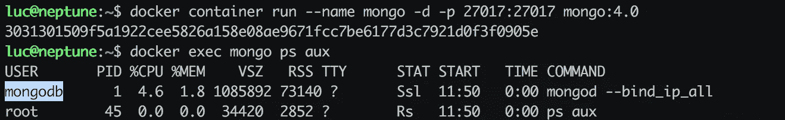
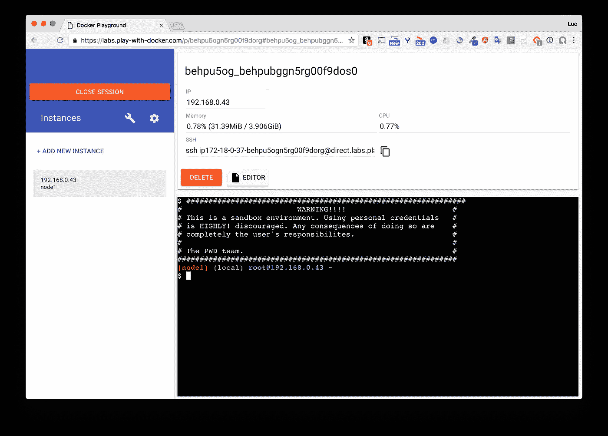

# Docker 提示:用非根用户运行容器

> 原文：<https://betterprogramming.pub/running-a-container-with-a-non-root-user-e35830d1f42a>

## 方法和示例



# TL；速度三角形定位法(dead reckoning)

运行容器的一个最佳实践是使用非 root 用户启动流程。这通常通过使用[docker 文件](https://www.docker.com/)中的`USER` 指令来完成。但是，如果该指令不存在，并不一定意味着该进程以 root 用户身份运行。

## 基本原理

默认情况下，容器中的根与主机上的根(`uid 0`)相同。如果一个用户设法从一个容器中以根用户身份运行的应用程序中脱离出来，他就能够以相同的根用户身份访问主机。如果容器运行时使用了不正确的标志，或者在读/写中绑定了主机文件夹，则获得这种访问权限会更容易。

## 运行 MongoDB 容器

如果你还不知道，我强烈推荐用 Docker 试试[的玩法。也被称为 *PWD* ，这是一个在线游乐场，你可以测试所有最新的 Docker 功能，而不必在本地安装任何东西。一旦到了 PWD，你就可以创建一个实例，你会觉得自己好像在一个 Linux 虚拟机的外壳里。](http://play-with-docker.com)



**注意:**在幕后，您将有一个 shell，但是在一个安装了 Docker 守护进程的 Alpine 容器中。这就是所谓的 *DinD* ，对于 Docker 中的 Docker，因为 Docker 守护进程在一个容器中运行自己。

在终端中，让我们运行一个基于 [MongoDB](https://www.mongodb.com/) 映像的容器:

```
[node1] (local) root@192.168.0.13 ~
$ docker container run -d -p 27017:27017 --name mongo mongo:4.0
8cce38822a23bbacb5349c5af63c50f1d2e371029f5b6332b1144fcc4f8cb723
```

并从主机上检查哪个用户运行了`mongod` 流程:

```
[node1] (local) root@192.168.0.13 ~
$ ps aux | grep mongo
 1143 **999** 0:00 mongod --bind_ip_all
```

从上面的输出中，我们可以看到由`uid 999`标识的用户是拥有`mongod`流程的人。让我们检查主机上的现有用户:

```
$ cat /etc/passwd
root:x:0:0:root:/root:/bin/bash
bin:x:1:1:bin:/bin:/sbin/nologin
daemon:x:2:2:daemon:/sbin:/sbin/nologin
adm:x:3:4:adm:/var/adm:/sbin/nologin
lp:x:4:7:lp:/var/spool/lpd:/sbin/nologin
sync:x:5:0:sync:/sbin:/bin/sync
shutdown:x:6:0:shutdown:/sbin:/sbin/shutdown
halt:x:7:0:halt:/sbin:/sbin/halt
mail:x:8:12:mail:/var/spool/mail:/sbin/nologin
news:x:9:13:news:/usr/lib/news:/sbin/nologin
uucp:x:10:14:uucp:/var/spool/uucppublic:/sbin/nologin
operator:x:11:0:operator:/root:/bin/sh
man:x:13:15:man:/usr/man:/sbin/nologin
postmaster:x:14:12:postmaster:/var/spool/mail:/sbin/nologin
cron:x:16:16:cron:/var/spool/cron:/sbin/nologin
ftp:x:21:21::/var/lib/ftp:/sbin/nologin
sshd:x:22:22:sshd:/dev/null:/sbin/nologin
at:x:25:25:at:/var/spool/cron/atjobs:/sbin/nologin
squid:x:31:31:Squid:/var/cache/squid:/sbin/nologin
xfs:x:33:33:X Font Server:/etc/X11/fs:/sbin/nologin
games:x:35:35:games:/usr/games:/sbin/nologin
postgres:x:70:70::/var/lib/postgresql:/bin/sh
cyrus:x:85:12::/usr/cyrus:/sbin/nologin
vpopmail:x:89:89::/var/vpopmail:/sbin/nologin
ntp:x:123:123:NTP:/var/empty:/sbin/nologin
smmsp:x:209:209:smmsp:/var/spool/mqueue:/sbin/nologin
guest:x:405:100:guest:/dev/null:/sbin/nologin
nobody:x:65534:65534:nobody:/:/sbin/nologin
dockremap:x:100:101:Linux User,,,:/home/dockremap:/bin/false
```

没有带`uid 999`的用户，这就是为什么在前面的命令中没有用户名可以映射到这个 uid 的原因。

## Dockerfile 文件

这是用于构建 MongoDB 4.0 映像的 Dockerfile 文件:

[](https://github.com/docker-library/mongo/blob/36a011c5f198ad05c47310284795ad029d8340ba/4.0/Dockerfile) [## docker-图书馆/mongo

### MongoDB 的 Docker 官方形象包装。在…上创建一个帐户，为 docker-library/mongo 的发展做出贡献

github.com](https://github.com/docker-library/mongo/blob/36a011c5f198ad05c47310284795ad029d8340ba/4.0/Dockerfile) 

在这个文件中，没有用户指令，但是我们可以看到在图像中创建了一个新的`mongodb` 用户，并将其添加到同时创建的`mongodb` 组中。这就是以下指令的用途:

```
RUN groupadd -r mongodb && useradd -r -g mongodb mongodb
```

由于 docker 文件中的用户指令没有指定该用户，因此在映像构建期间不会使用该用户；一切都是用 root 做的。

但是，如果我们仔细看看 docker 文件的末尾，我们可以看到`ENTRYPOINT` 和`CMD` 指令。

```
ENTRYPOINT ["docker-entrypoint.sh"]CMD ["mongod"]
```

您可能知道，这两条指令的组合定义了当容器从 mongo 映像启动时运行的命令。该命令如下所示:

```
$ docker-entrypoint.sh mongod
```

## 入口点

现在让我们来看看`docker-entrypoint.sh file`的代码:

[](https://github.com/docker-library/mongo/blob/36a011c5f198ad05c47310284795ad029d8340ba/4.0/docker-entrypoint.sh) [## docker-图书馆/mongo

### MongoDB 的 Docker 官方形象包装。在…上创建一个帐户，为 docker-library/mongo 的发展做出贡献

github.com](https://github.com/docker-library/mongo/blob/36a011c5f198ad05c47310284795ad029d8340ba/4.0/docker-entrypoint.sh) 

文件开头的下面这段代码非常有趣。这是由于`gosu` 实用程序，执行流程的用户从`root` 变为`mongodb` 的部分。

```
# allow the container to be started with ` — user
# all mongo* commands should be dropped to the correct user
if [[ “$originalArgOne” == mongo* ]] && [ “$(id -u)” = ‘0’ ]; then
    if [ “$originalArgOne” = ‘mongod’ ];
        then chown -R mongodb /data/configdb /data/db
    fi 
    # make sure we can write to stdout and stderr as “mongodb”
    # (for our “initdb” code later; see “ — logpath” below)
    chown --dereference mongodb “/proc/$$/fd/1” “/proc/$$/fd/2” || :
    exec **gosu** mongodb “$BASH_SOURCE” “$@”
fi
```

**注意:**我们可以在 docker 文件中看到，`gosu` 实用程序是创建映像时安装的软件包之一。

## 基于 Ubuntu 的图像

Dockerfile 文件中的第一条指令表明 [ubuntu:xenial](https://ubuntu.com/) 是基本映像，mongo 映像就是从这个映像创建的。

让我们运行一个基于 Ubuntu 的交互式容器，并列出现有用户:

```
$ docker container run -ti ubuntu:xenial

root@9e367c3d9ca1:/# cat /etc/passwd
root:x:0:0:root:/root:/bin/bash
daemon:x:1:1:daemon:/usr/sbin:/usr/sbin/nologin
bin:x:2:2:bin:/bin:/usr/sbin/nologin
sys:x:3:3:sys:/dev:/usr/sbin/nologin
sync:x:4:65534:sync:/bin:/bin/sync
games:x:5:60:games:/usr/games:/usr/sbin/nologin
man:x:6:12:man:/var/cache/man:/usr/sbin/nologin
lp:x:7:7:lp:/var/spool/lpd:/usr/sbin/nologin
mail:x:8:8:mail:/var/mail:/usr/sbin/nologin
news:x:9:9:news:/var/spool/news:/usr/sbin/nologin
uucp:x:10:10:uucp:/var/spool/uucp:/usr/sbin/nologin
proxy:x:13:13:proxy:/bin:/usr/sbin/nologin
www-data:x:33:33:www-data:/var/www:/usr/sbin/nologin
backup:x:34:34:backup:/var/backups:/usr/sbin/nologin
list:x:38:38:Mailing List Manager:/var/list:/usr/sbin/nologin
irc:x:39:39:ircd:/var/run/ircd:/usr/sbin/nologin
gnats:x:41:41:Gnats Bug-Reporting System (admin):/var/lib/gnats:/usr/sbin/nologin
nobody:x:65534:65534:nobody:/nonexistent:/usr/sbin/nologin
systemd-timesync:x:100:102:systemd Time Synchronization,,,:/run/systemd:/bin/false
systemd-network:x:101:103:systemd Network Management,,,:/run/systemd/netif:/bin/false
systemd-resolve:x:102:104:systemd Resolver,,,:/run/systemd/resolve:/bin/false
systemd-bus-proxy:x:103:105:systemd Bus Proxy,,,:/run/systemd:/bin/false
_apt:x:104:65534::/nonexistent:/bin/false
```

现在让我们创建一个虚拟用户和组:

```
root@9e367c3d9ca1:/# groupadd -r mygrp && useradd -r -g mygrp myuser
```

并再次列出用户:

```
root@9e367c3d9ca1:/# cat /etc/passwd
root:x:0:0:root:/root:/bin/bash
daemon:x:1:1:daemon:/usr/sbin:/usr/sbin/nologin
bin:x:2:2:bin:/bin:/usr/sbin/nologin
sys:x:3:3:sys:/dev:/usr/sbin/nologin
sync:x:4:65534:sync:/bin:/bin/sync
games:x:5:60:games:/usr/games:/usr/sbin/nologin
man:x:6:12:man:/var/cache/man:/usr/sbin/nologin
lp:x:7:7:lp:/var/spool/lpd:/usr/sbin/nologin
mail:x:8:8:mail:/var/mail:/usr/sbin/nologin
news:x:9:9:news:/var/spool/news:/usr/sbin/nologin
uucp:x:10:10:uucp:/var/spool/uucp:/usr/sbin/nologin
proxy:x:13:13:proxy:/bin:/usr/sbin/nologin
www-data:x:33:33:www-data:/var/www:/usr/sbin/nologin
backup:x:34:34:backup:/var/backups:/usr/sbin/nologin
list:x:38:38:Mailing List Manager:/var/list:/usr/sbin/nologin
irc:x:39:39:ircd:/var/run/ircd:/usr/sbin/nologin
gnats:x:41:41:Gnats Bug-Reporting System (admin):/var/lib/gnats:/usr/sbin/nologin
nobody:x:65534:65534:nobody:/nonexistent:/usr/sbin/nologin
systemd-timesync:x:100:102:systemd Time Synchronization,,,:/run/systemd:/bin/false
systemd-network:x:101:103:systemd Network Management,,,:/run/systemd/netif:/bin/false
systemd-resolve:x:102:104:systemd Resolver,,,:/run/systemd/resolve:/bin/false
systemd-bus-proxy:x:103:105:systemd Bus Proxy,,,:/run/systemd:/bin/false
_apt:x:104:65534::/nonexistent:/bin/false
**myuser:x:999:999::/home/myuser:**
```

我们可以看到新用户被创建为`uid 999`，这是从一个新的`ubuntu:xenial`映像中创建的第一个用户的 uid。这个 uid 就是我们之前看到的用于运行`mongod` 流程的 uid。提醒一下:

```
[node1] (local) root@192.168.0.13 ~
$ ps aux | grep mongo
 1143 **999** 0:00 mongod --bind_ip_all
```

## 基于阿尔卑斯山的图像

应用程序映像不一定基于`ubuntu:xenial.`很多都基于 [Alpine](https://alpinelinux.org/) (专注于安全的微小分布)。

让我们从一个新的 alpine 容器中添加一个新用户，并检查它的 uid。

```
$ docker container run -ti alpine:3.8
/ # adduser -D myuser
/ # cat /etc/passwd
root:x:0:0:root:/root:/bin/ash
bin:x:1:1:bin:/bin:/sbin/nologin
daemon:x:2:2:daemon:/sbin:/sbin/nologin
adm:x:3:4:adm:/var/adm:/sbin/nologin
lp:x:4:7:lp:/var/spool/lpd:/sbin/nologin
sync:x:5:0:sync:/sbin:/bin/sync
shutdown:x:6:0:shutdown:/sbin:/sbin/shutdown
halt:x:7:0:halt:/sbin:/sbin/halt
mail:x:8:12:mail:/var/spool/mail:/sbin/nologin
news:x:9:13:news:/usr/lib/news:/sbin/nologin
uucp:x:10:14:uucp:/var/spool/uucppublic:/sbin/nologin
operator:x:11:0:operator:/root:/bin/sh
man:x:13:15:man:/usr/man:/sbin/nologin
postmaster:x:14:12:postmaster:/var/spool/mail:/sbin/nologin
cron:x:16:16:cron:/var/spool/cron:/sbin/nologin
ftp:x:21:21::/var/lib/ftp:/sbin/nologin
sshd:x:22:22:sshd:/dev/null:/sbin/nologin
at:x:25:25:at:/var/spool/cron/atjobs:/sbin/nologin
squid:x:31:31:Squid:/var/cache/squid:/sbin/nologin
xfs:x:33:33:X Font Server:/etc/X11/fs:/sbin/nologin
games:x:35:35:games:/usr/games:/sbin/nologin
postgres:x:70:70::/var/lib/postgresql:/bin/sh
cyrus:x:85:12::/usr/cyrus:/sbin/nologin
vpopmail:x:89:89::/var/vpopmail:/sbin/nologin
ntp:x:123:123:NTP:/var/empty:/sbin/nologin
smmsp:x:209:209:smmsp:/var/spool/mqueue:/sbin/nologin
guest:x:405:100:guest:/dev/null:/sbin/nologin
nobody:x:65534:65534:nobody:/:/sbin/nologin
**myuser:x:1000:1000:Linux User,,,:/home/myuser:**
```

正如我们在这里看到的，一个`alpine` 图像中第一个用户的 id 是 1000，不同于一个`ubuntu` 图像的`uid 999`。如果我们在`alpine` 图像中添加一个用户，并使用该用户运行一个流程(例如，使用 owner 文件中的用户指令)，我们将看到`uid 1000`是流程的所有者。让我们试一试。

让我们使用一个简单的 docker 文件，它将用户添加到一个`Alpine` 图像，并定义一个基本的`sleep 1000`命令。

```
FROM alpine:3.8
RUN adduser -D myuser
USER myuser
ENTRYPOINT [“sleep”]
CMD [“1000”]
```

让我们用它来构建一个图像:

```
$ docker image build -t sleep:1.0 .
Sending build context to Docker daemon 1.775MB
Step 1/5 : FROM alpine:3.8
3.8: Pulling from library/alpine
4fe2ade4980c: Pull complete
Digest: sha256:621c2f39f8133acb8e64023a94dbdf0d5ca81896102b9e57c0dc184cadaf5528
Status: Downloaded newer image for alpine:3.8
 — -> 196d12cf6ab1
Step 2/5 : RUN adduser -D myuser
 — -> Running in a7474167f27d
Removing intermediate container a7474167f27d
 — -> 7a17f0862780
Step 3/5 : USER myuser
 — -> Running in b0a7eea711a4
Removing intermediate container b0a7eea711a4
 — -> d63533ce5be1
Step 4/5 : ENTRYPOINT [“sleep”]
 — -> Running in f0dfc3ea4495
Removing intermediate container f0dfc3ea4495
 — -> 763dd8ac4f40
Step 5/5 : CMD [“1000”]
 — -> Running in 14db1ea262f9
Removing intermediate container 14db1ea262f9
 — -> 978294e76184
Successfully built 978294e76184
Successfully tagged sleep:1.0
```

然后从新创建的映像运行一个容器:

```
[node1] (local) root@192.168.0.8 ~
$ docker container run -d sleep:1.0
534e340780a89b3a86917aff2c20405dadbd7d50cfe5cb03e9cb6786a0517f21
```

如果我们检查主机上的`sleep` 进程的所有者，我们可以看到它属于带有`uid 1000`的用户，即在映像中创建的用户。

```
[node1] (local) root@192.168.0.8 ~
$ ps aux | grep sleep
 1181 **1000** 0:00 sleep 1000
```

# 摘要

我希望这些例子能帮助你理解非根用户运行容器的一些方法，要么通过 done 文件中的`USER` 指令的映像，要么通过在运行时改变用户(通常在`entrypoint` 脚本中完成)。我们在这里没有涉及的另一种方法是在运行容器时使用`--user`标志。