# 使用 Python SDK 在 Docker 中运行 MapReduce 字数统计应用程序

> 原文：<https://betterprogramming.pub/running-a-mapreduce-word-count-application-in-docker-using-python-sdk-ed2f1e27d424>

## MapReduce 背后的工作原理演示


在 [Unsplash](https://unsplash.com/search/photos/malaysia?utm_source=unsplash&utm_medium=referral&utm_content=creditCopyText) 上由 [Sadie Teper](https://unsplash.com/@sadieteper?utm_source=unsplash&utm_medium=referral&utm_content=creditCopyText) 拍照

# 动机

如果你通读马来西亚所有上市公司的财务报告，财务报告中有一节提到了可持续发展目标(SDGs)。通常，有 17 个 SDG，您可能需要一个工具来从财务报告中提取这些数据并进行一些分析。一个简单的应用是统计与 SDG 相关的某些关键词的出现次数，比如“绿色”、“健康”、“教育”、“平等”等。使用不涉及分布式处理概念的传统方法，字数统计的工作可能不容易或不迅速。此外，这将是非常昂贵的计算。

# 目的

该项目的目的是开发一个简单的字数统计应用程序，演示 MapReduce 的工作原理，涉及多个 Docker 容器作为客户端，以满足分布式处理的要求，使用 Python SDK for Docker。

# Docker 是什么？

> Docker 是一个工具，它允许开发者使用容器轻松地创建、部署和运行应用程序。容器将应用程序与所有需要的部分打包在一起，比如库和其他依赖项，并将所有这些表示为单个包。通过使用 Docker，应用程序可以在任何不同的操作系统上运行，而不管该机器的任何定制设置可能与用于编写和测试代码的机器不同。Docker 有点像虚拟机，但它不会创建一个完整的虚拟操作系统。它允许应用程序使用与运行的系统相同的内核。这提供了显著的性能提升，并减小了应用程序的大小。它也是开源的。

# 什么是 MapReduce？

> MapReduce 是一种编程模型，旨在使用并行和分布式算法跨单个或多个集群处理和生成大数据集。它包括两个主要阶段，即 Map 和 Reduce。Map 函数获取一组数据，并将它们分解成键值对。在这个项目中，MapReduce 的输入将是公司财务报告中 SDG 部分内的文本。Reduce 函数然后将来自 Map 函数的输出
> 作为输入，并根据 Reduce 函数中定义的算法将键-值对简化为具有值的唯一键。在这个项目中，所有的键值对将被加起来，以找到特定单词的总出现次数。

# 数据集准备

1.  将总共至少 40 家不同的马来西亚上市公司的最新财务报告下载到一个临时文件夹中。我下载过的财务报告的公司有亚洲传媒、Maybank、Stone Master、7–11 等。
2.  (可选)在讨论可持续发展目标的财务报告中，记录目标信息的起止页码，如下图所示。

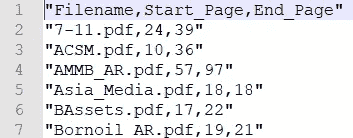

图:记录了所有财务报告 SDGs 部分的起止页码。

3.将它们转换成文本文件(。txt)格式以便于进一步处理。推荐两个免费的在线工具:“Zamzar 在线文件转换”和“我爱 PDF。”参考上图，转换器的第一个输出将包含第一个财务报告中出现的所有单词，仅从第 24 页到第 39 页。转换器将删除第一个财务报表中其他页面的内容。
a)“Zamzar 在线文件转换”——【https://www.zamzar.com/convert/pdf-to-txt】T2b)“我爱 PDF”——[https://www.ilovepdf.com/split_pdf#split,range](https://www.ilovepdf.com/split_pdf#split,range.)

4.将所有转换后的文本文件保存在名为“data”的文件夹中，如下图所示。

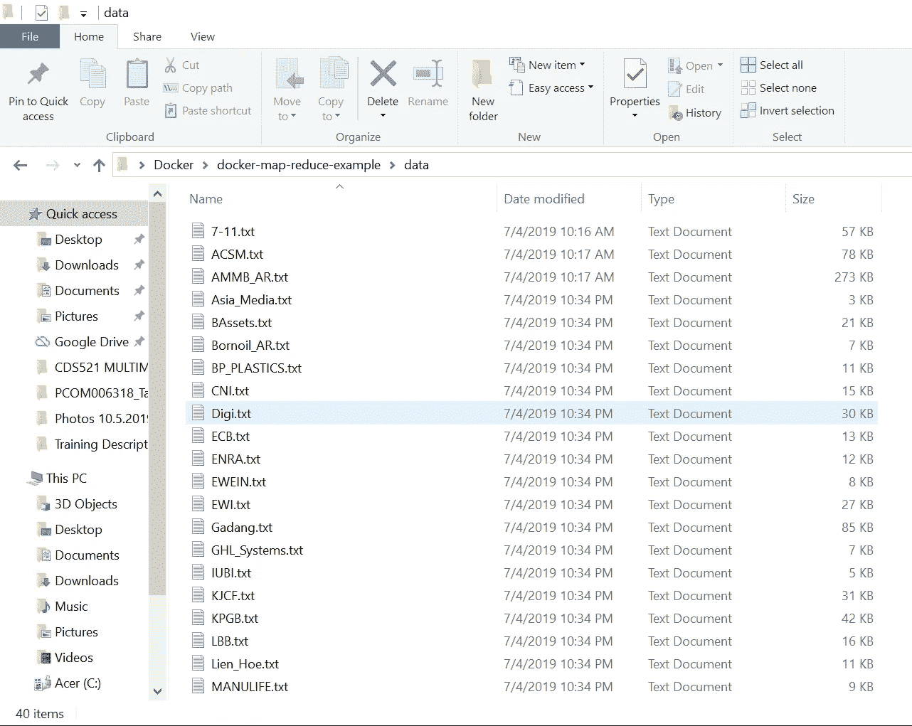

图:总共有 40 个转换后的文本文件存储在名为“data”的文件夹中

5.在名为“data”的文件夹所在的目录中创建一个名为“out”的空白文件夹

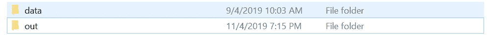

# 在容器中为 MapReduce 开发 Python 代码

1.  假设一个 Docker 容器从主机接收了要处理的文件，主机将任务分配给多个容器。首先，定义所需的模块、库和目录。数据目录是读取容器中文件的位置，而输出目录是容器中存储已处理输出的位置。

2.获取当前目录并以字符串格式分割从主机发送的文件名。

3.定义一个函数，将文本文件的内容转换成键值对。然后，这些键值对被简化并以字典格式存储。

4.开发的函数将对主机分配的所有文本文件进行循环处理。结果以 json 格式保存在容器中名为“out”的文件夹中。

5.用文件名“docker_analyze.py”保存代码

# 创建图像的 Dockerfile 文件

为了成功构建 Docker 容器，您需要一个 Docker 映像。用一个编程的比喻来说，如果图像是一个类，那么容器就是一个类的实例——一个运行时对象。Docker 映像是一个惰性的、不可变的文件，本质上是容器的快照。使用 build 命令创建一个映像，使用 run 启动时将生成一个容器。Docker 图像是由一系列层构建而成的。每一层代表图像 docker 文件中的一条指令。Dockerfile 文件中的命令及其简要说明如下。定义完这些命令后，用不带任何文件扩展名的文件名“Dockerfile”保存文件。

1.  从 ubuntu:16.04 图像创建一个图层。
2.  确保操作系统是最新的。
3.  安装 Python3 库。
4.  将文件“docker_analyze.py”从主机复制到 docker 容器中。
5.  成功创建 docker 容器后，运行文件“docker_analayze.py”。

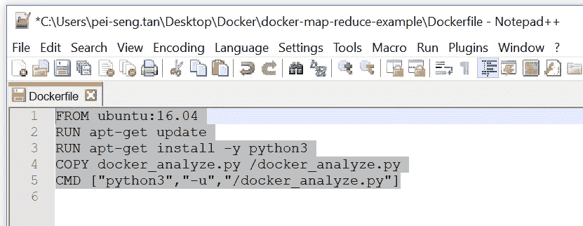

图:用一个简单的代码编辑器如 Notepad++准备 Dockerfile 中的命令。

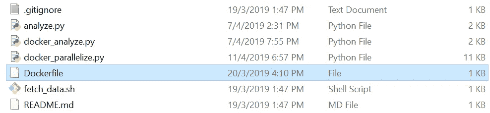

图:用没有任何文件扩展名的文件名“Dockerfile”保存文件。

# 创建一个 Docker 映像并尝试运行一个 Docker 容器

1.  确保主机中的 Docker 守护程序正在运行。打开命令提示符或“git bash”窗口，键入下面的命令来部署映像。

```
docker build --tag analysis_test .
```

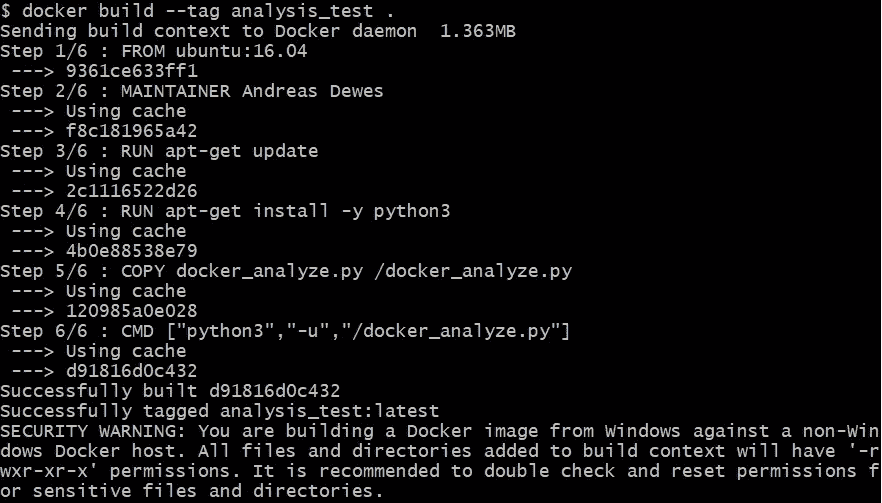

图:Docker 映像构建成功。

2.通过在命令提示符下键入以下命令来显示所有可用 Docker 映像的列表，验证先前部署的 Docker 映像是否存在。

```
docker image ls
```

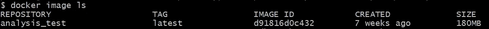

图:标记名为“analysis_test”的 Docker 映像构建完成。

3.(可选)您可以键入以下命令，通过使用 Docker 映像作为基础来运行 Docker 容器。但是，这一次您将无法这样做，因为您还没有为 Docker 容器定义输入，Docker 容器是一个字符串，包含要为这个特定容器处理的财务报告中的所有文件的名称。

```
docker run analysis_test
```

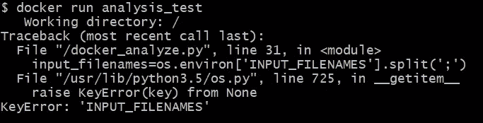

图:由于缺少 Docker 容器的输入，无法运行 Docker 容器。

# 创建一个函数来建立 Docker 守护进程和主机之间的通信路径

1.  打开名为“docker_parallelize.py”的新文件
2.  导入所需的模块和库。预初始化一些变量。

如图所示，“CONTAINER_NAME”被定义为“analysis_test”，这是之前用于标记 Docker 图像的名称。

```
# Docker Configuration# Docker Image
CONTAINER_NAME = 'analysis_test'
Container_count = 1
```

名为“DATA_DIRECTORY”和“OUTPUT_DIRECTORY”的变量用于建立主机和 Docker 容器之间的连接，因此 Docker 容器可以从主机目录读取文件或将文件写入主机目录。

```
# Volume Bind between Docker and Local OS
DATA_DIRECTORY = 'c:/Users/pei-seng.tan/Desktop/Docker/docker-map-reduce-example/data'
OUTPUT_DIRECTORY = 'c:/Users/pei-seng.tan/Desktop/Docker/docker-map-reduce-example/out'
```

与 SDG 相关的这些单词的搜索结果将只显示给用户。

```
# Some targeted words of Sustainable Development Goal 
UN_word_list = ["poverty", "hunger", "health", "education", "equality", "sanitation", "clean", "growth", "innovation", "sustainable", "production", "climate", "water", "life", "peace", "partnerships", "resources"]
```

3.创建一个函数，通过将要处理的文件划分到 Docker 容器来执行分发处理。每个 Docker 容器要处理的文件数量取决于输入文件的数量和用户设置的容器数量。

# 开发 Python 代码，用于组合和显示 Docker 容器完成的处理结果，并与简单的用户界面集成

# 示范

1.  通过键入以下命令运行应用程序。

```
python docker_parallelize.py
```

2.会弹出用户界面，如下图所示。

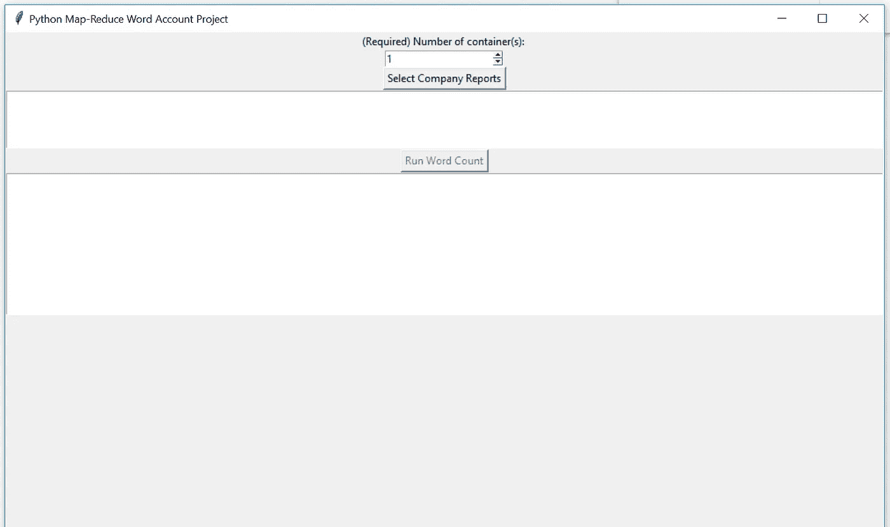

图:用户界面

3.选择容器的数量(最大值为 4，在代码中设置)。在这个演示中，我设置了两个。


图:选择容器的数量。

4.选择要处理的文件数量。在这个演示中，我选择了六个。

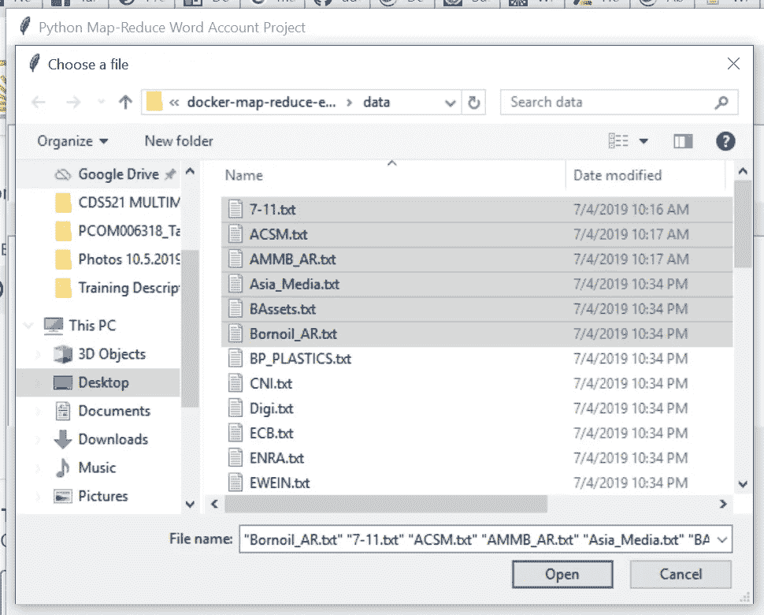

图:选择六个要处理的财务报表。

5.单击名为“运行字数统计”的按钮

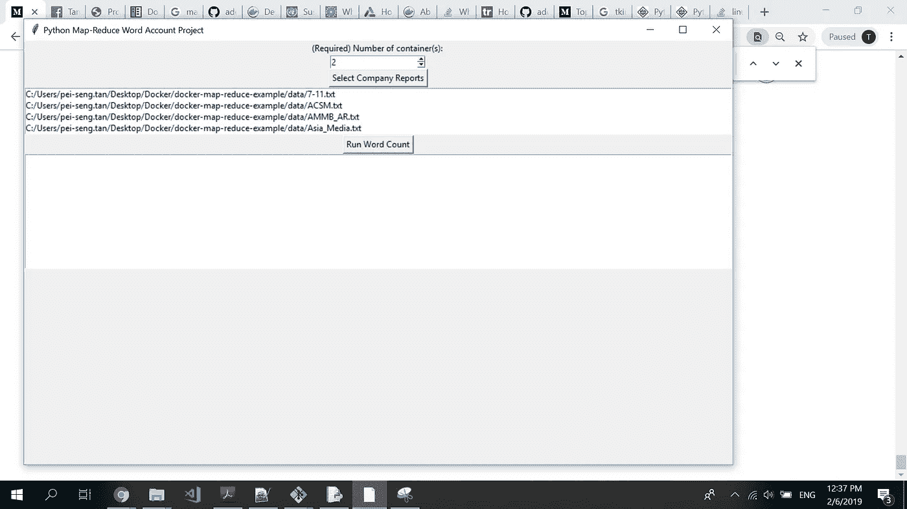

图:点击“运行字数统计”按钮

6.结果将显示在用户界面的底部。


图:用户界面显示了所选的六家公司的财务报告中的总字数。“可持续”、“健康”和“增长”这三个词排在总字数的前三位。

7.通过滚动显示在用户界面中央的日志信息，您可以获得有关搜索结果的更多信息。

a)容器的 id 和分配给每个容器的文件。

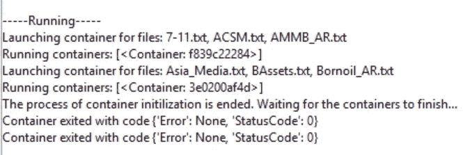

图:分配给每个容器的容器 id 和文件。

b)每家公司的总字数。

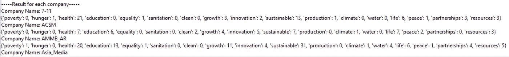

图:每个公司的总字数。

c)总完成时间为 8 秒。经过调查，延迟是由主机中的所有内容组合而成的。


# Git-hub 源代码:

[](https://github.com/PeiSeng/Docker-MapReduce-Word_Count-Python_SDK) [## Pei seng/Docker-MapReduce-Word _ Count-Python _ SDK

### 在 GitHub 上创建一个账号，为 PE iseng/Docker-MapReduce-Word _ Count-Python _ SDK 开发做贡献。

github.com](https://github.com/PeiSeng/Docker-MapReduce-Word_Count-Python_SDK) 

# 参考资料:

1.  Docker 是什么？[https://opensource.com/resources/what-docker](https://opensource.com/resources/what-docker)
2.  Docker Python for Docker【https://docker-py.readthedocs.io/en/stable/# 
3.  码头工人文件【https://docs.docker.com/ 
4.  Hadoop—MapReduce[https://www.tutorialspoint.com/hadoop/hadoop_mapreduce.htm](https://www.tutorialspoint.com/hadoop/hadoop_mapreduce.htm)
5.  可持续发展目标[https://www . UNDP . org/content/UNDP/en/home/sustainable-Development-Goals . html](https://www.undp.org/content/undp/en/home/sustainable-development-goals.html)
6.  码头地图缩小示例[https://github.com/adewes/docker-map-reduce-example](https://github.com/adewes/docker-map-reduce-example)

# 欣赏

本项目由 Tan Pei Seng、Yeap Soon Kent、Elvis Yoon Yu Jing 和 Cheng Xiyang 为 CDS 504《大数据使能技术和基础设施》撰稿，该项目是马来西亚 Sains 大学数据科学和分析硕士的核心课题之一。