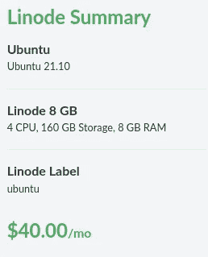
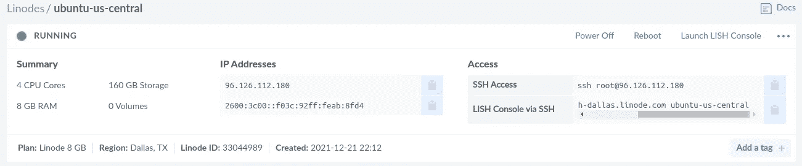
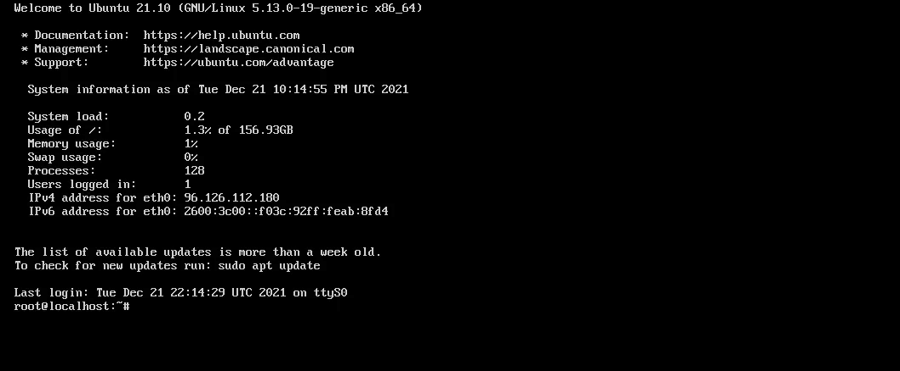
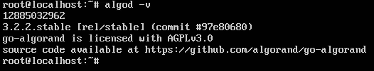
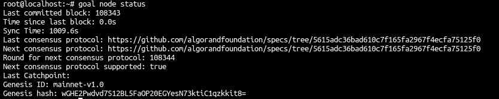
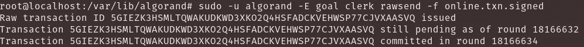
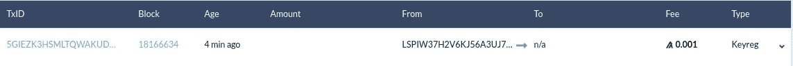
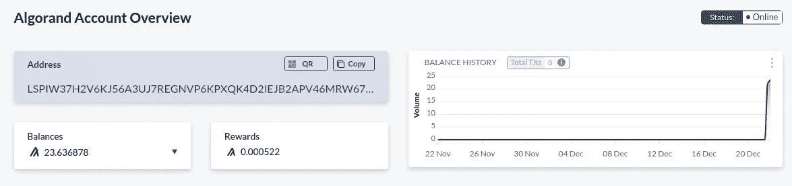

# 在云中运行 Algorand 节点

> 原文：<https://betterprogramming.pub/running-an-algorand-node-in-the-cloud-a3e320f4e864>

## 通过 Linux 机器运行 Algorand 的参与节点


图片来源: [Pixabay](https://pixabay.com/illustrations/blockchain-data-records-system-3513216/)

最近，我开始再次潜入 Algorand，并希望开始托管自己的参与节点，以加入共识参与算法，并更好地了解网络如何在引擎盖下工作。您可以在满足以下要求的任何基础结构上托管您的参与节点:

*   2–4 个虚拟 CPU
*   4–8GB 内存
*   100–200 GB 固态硬盘(建议使用 NVMe 固态硬盘)
*   100 兆宽带

对于我的参与节点，我选择将节点设置在 Linode 上，这是一个基于 Linux 的云计算解决方案。我以前从未使用过它，我认为脱离 AWS 和 Azure 来尝试 Linode 会很有趣！要开始，请跟随！

# Linode 设置

为了进行设置，我首先创建了一个 Linode 帐户。因为我以前从来没有过 Linode 账户，所以我有 100 美元的信用额度可以使用。一旦创建了一个账户并存入了 100 美元，你有 60 天的时间来使用它。


Linode 的主页，带有 100 美元的信用信息

为了满足上述参与要求，我创建了一个具有以下规范的 Linode:



我的 Linode 规格

*   2 个虚拟 CPU
*   8GB 内存
*   160GB 固态硬盘存储

一旦 Linode 完成配置，控制面板应该类似于以下内容:



在 Linode 上成功创作

一旦 Linode 启动并运行，我通过点击右上角的“启动 LISH 控制台”按钮启动一个 **LISH 控制台**。控制台启动后，我使用创建 Linode 时提供的 root 凭据登录:



通过 LISH 控制台成功登录到 Linode

# Algorand CLI 设置

现在 Linode 已经启动并运行了，我继续为 Algorand 安装了运行一个参与节点所需的一切。

首先，运行以下命令来更新软件包源和任何已安装的软件包(这可能需要一段时间):

```
sudo apt-get update
sudo apt-get upgrade
sudo apt-get install -y gnupg2 curl software-properties-common
```

在更新源代码和更新包之后，按照(假定的)长文本输入，我安装了运行一个节点所需的算法和工具:

```
echo "export ALGORAND_DATA=/var/lib/algorand" >> /root/.bashrccurl -O [https://releases.algorand.com/key.pub](https://releases.algorand.com/key.pub)sudo apt-key add key.pubsudo add-apt-repository "deb [arch=amd64] https://releases.algorand.com/deb/ stable main"sudo apt-get update
```

一旦安装了 algrand 库源代码，我就安装了实际的 algrand 包和相应的开发工具，包括:

```
sudo apt-get install -y algorand-devtools
```

为了验证安装是否成功完成，我运行了:

```
algod -v
```

**algod -v** 命令向我展示了以下内容:



Algorand 版本 3.2.2 .已安装稳定版

要检查我们的 Algorand 节点是否可以看到 *MainNet* 网络，请运行以下命令:

```
goal node status
```



**目标节点状态的输出**

如上所示，可以看到当前正在处理的节点(**最后提交的块**)和网络本身的状态。

# 节点快速追赶

在创建注册事务之前，应该执行*快速* *追赶*以将节点与 network⁶.同步

检查 MainNet([https://algrand-catch points . S3 . us-east-2 . Amazon AWS . com/channel/MainNet/latest . catch point](https://algorand-catchpoints.s3.us-east-2.amazonaws.com/channel/mainnet/latest.catchpoint))的 *CatchPoint* 值，我使用下面的命令来执行*快速* catchup，以将我的节点与 *MainNet* 快速同步。

```
goal node catchup 18160000#Z7ORUX36OFJJAYYNICD5H6XBP4EJTTYFW4UMVETJVG6D5FJQUH7Q
```

运行该命令将显示以下数据:

```
root@localhost:~# goal node status
Last committed block: 1019727
Sync Time: 210.2s
Catchpoint: 18160000#Z7ORUX36OFJJAYYNICD5H6XBP4EJTTYFW4UMVETJVG6D5FJQUH7Q
Catchpoint total accounts: 14980347
Catchpoint accounts processed: 4376576
Catchpoint accounts verified: 0
Genesis ID: mainnet-v1.0
Genesis hash: wGHE2Pwdvd7S12BL5FaOP20EGYesN73ktiC1qzkkit8=
```

请注意，现在有新的行提到了捕捉点值。一旦同步时间值为 0 秒，节点将被更新并与网络同步。

我的花了大约十五分钟！

# 参与密钥生成

在安装完包并确认节点可以看到网络之后，我生成了一个参与密钥，这样我的地址就可以参与共识协议。我按照阿尔格兰德·documentation⁴.记录的步骤

为了生成一个参与密钥，我们可以运行

```
goal account addpartkey -a <address for participation> --roundFirstValid=<current block height> --roundLastValid=<expected height 6 months from now>
```

如上图**目标节点状态**输出所示，当前块高度为 18167276。为了计算 6 个月后的街区高度，我使用了 Purestake⁵.的一段文字

> 6 个月大约是 182 天。182 天 x 24 小时/天 x 60 分钟/天 x 60 秒/分钟= 15724800 秒。在撰写本文时，阿尔格兰德的每一轮大约需要 4.5 秒。所以 15724800 秒/每块 4.5 秒= 3494400 块

因此，我们可以通过将我们的砌块高度与 6 个月内的估计砌块高度相加来计算 6 个月的砌块高度:

```
**18167276 + 3494400 = 21661676**
```

根据计算，6 个月后的块高为`21661676`。这将是`roundLastValid`参数的值。`18167276` 将是`roundFirstValid`参数的值。根据计算结果，我运行了以下程序:

```
sudo -u algorand -E goal account addpartkey -a <address of Algorand Wallet> --roundFirstValid **18167276** --roundLastValid **21661676**
```

这表示成功的密钥生成消息。


成功参与密钥生成

接下来，我们需要运行

```
sudo -u algorand -E goal account partkeyinfo
```

上述命令将向我们显示以下输出:

```
Dumping participation key info from /var/lib/algorand...Participation ID:          <id>
Parent address:            <address>
Last vote round:           N/A
Last block proposal round: N/A
Effective first round:     18166954
Effective last round:      21166584
First round:               18166584
Last round:                21166584
Key dilution:              10000
Selection key:             <sel key>
Voting key:                <voting key>
```

# 密钥注册交易

生成密钥后，我们可以开始注册的交易过程。

```
sudo -u algorand -E goal account changeonlinestatus --address=<address> --online=true --txfile=keyreg.txnsudo -u algorand -E algokey sign -m "<passphrase>" -t keyreg.txn -o keyreg.txn.signedsudo -u algorand -E goal clerk rawsend -f keyreg.txn.signed
```

我还编写了一个 Python 脚本，看起来对于密钥注册也很成功。它可以在下面的我的 GitHub 中找到:

[](https://github.com/Latonis/algorand-learning/blob/main/participationNode/register.py) [## algo rand-learning/register . py at main la tonis/algo rand-learning

### 此文件包含双向 Unicode 文本，其解释或编译可能与下面显示的不同…

github.com](https://github.com/Latonis/algorand-learning/blob/main/participationNode/register.py) 

在成功注册到网络以成为在线的并且是共识协议的一部分时，消息将被打印:



成功注册进入 Algorand MainNet 网络！

# 验证密钥注册

由于地址现已注册，可通过 AlgoExplorer 或任何其他 Algorand 区块链 Explorer 工具检查该地址，以查看 Keyreg(密钥注册)交易及其是否成功。



通过[https://algoexplorer.io/](https://algoexplorer.io/)验证注册

同样值得注意的是，您的节点地址现在应该在 https://algoexplorer.io/[的](https://algoexplorer.io/)上显示为在线，而之前它在那里是离线的**。**



通过[https://algoexplorer.io/](https://algoexplorer.io/)在线验证

恭喜你。您现在正在通过 Linode 上托管的 Linux 机器为 Algorand 运行一个参与节点！

# 参考

[1][https://algorand.foundation/algorand-protocol/network](https://algorand.foundation/algorand-protocol/network)

[https://www.linode.com/](https://www.linode.com/)

[3][https://developer . algrand . org/docs/run-a-node/setup/install/](https://developer.algorand.org/docs/run-a-node/setup/install/)

[4][https://developer . algrand . org/docs/run-a-node/participate/generate _ keys/](https://developer.algorand.org/docs/run-a-node/participate/generate_keys/)

[5][https://www . pure stake . com/blog/participation-keys-in-algo rand/](https://www.purestake.com/blog/participation-keys-in-algorand/)

[6][https://developer . algrand . org/docs/run-a-node/setup/install/# sync-node-network-using-fast-catch up](https://developer.algorand.org/docs/run-a-node/setup/install/#sync-node-network-using-fast-catchup)