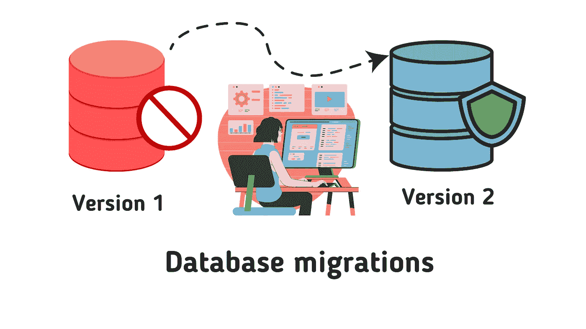

# 关于运行数据库迁移，我学到了什么

> 原文：<https://betterprogramming.pub/running-database-migrations-11eb4b5c739e>

## 技巧和经验教训



我过去从事过大量的数据库迁移工作。

并非所有的数据库迁移都是相同的。然而，我注意到了一些重复出现的模式。最近，我参与了一个持续了大约三个月的数据库迁移。这一经历提醒我，同样的教训仍然适用。

趁这些教训还历历在目，我会用这篇博文把它们写下来。

我不会提供一份详尽的清单。对于在职业生涯中经历过多次数据库迁移的经验丰富的开发人员来说，我的一些技巧可能是显而易见的。

## 技术选择

做出这些选择时要问的问题:

*   有哪些现有的工具可以用于您的应用程序，这样我就不必从头开始编写了？
*   迁移的规模有多大？
*   是一次性迁移吗？迁移会再延续几个月吗，也就是说，[带着长尾](https://blog.pragmaticengineer.com/typical-migration-approaches/)的迁移？

**从头开始构建您的迁移工具。**在早期，云服务还没有流行的时候，我会从远程服务器运行数据库迁移脚本。我在运行它的同时希望不会出现长时间的中断，同时保持数据的完整性。临时脚本非常适合一次性和小规模的迁移。如果我的应用程序工具箱没有免费的数据库迁移工具，我会从头开始写一个脚本。

**现成的迁移工具。如果您有现有的工具可以重用，从头开始编写工具并不是最好的方法。**

如果有现成的工具，就利用它们。一些开源框架自带了迁移工具。我过去用过 Django 和 Flask 的迁移工具。这些迁移工具对于中小规模的数据库迁移非常有效。开源工具*通常*都有很好的文档和活跃的社区。

如果您遇到了别人以前遇到过的问题，您可以查看文档或社区讨论。

**工作流程。**我最近和我的团队一起使用 [Cadence 工作流](https://cadenceworkflow.io/)来运行数据库迁移。使用 Cadence 的决定很简单，因为我们的工程组织广泛支持它的使用。Cadence 还带有高级功能，如处理重试和超时，以及其他许多功能。Cadence 的特性使编写健壮的迁移工作流变得容易。工作流也足够灵活，可以处理我们需要的跨不同数据库的迁移，包括 Google Spanner 和 Firestore。

## 预演选项

运行迁移脚本时，提供一个`dry-run`选项。使用`dry-run`选项有助于在本地开发环境中调试迁移代码的逻辑。

该命令将如下所示:

```
run-migration --dry-run=true
```

它允许您预览迁移脚本将做什么，而无需执行实际的数据库写入。例如，打印出您希望运行的 SQL 更新查询，然后当`dry-run`选项为真时，跳过 SQL 更新查询的执行。

一个简单的例子:

```
logger.Info("running query", query)if !dryRun {
  executeSql(query)
}
```

## 限制选项

提供选项来批量处理您要在迁移中处理的行数。

```
run-migration --limit=100
```

`limit`选项适用于:

*   **测试。**您可以选择可管理的行数进行测试。
*   **配料。**您可以在较小的批次中运行您的迁移，确认每个批次的结果，并重复该过程。小批量有助于减少可能发生的任何潜在问题的表面积。

## 日志记录、监控和警报

在测试您的迁移时，您可能会对您的日志感到抓狂。

但是，在生产环境中运行迁移时，只记录必要的信息。迁移可能涉及数千行。用冗余信息膨胀您的日志记录仪表板会使您在出现问题时很难进行故障诊断。重新审视您的监控仪表板、指标和警报标准。

当您提前调整您的监控和警报工具时，您将很容易发现迁移导致的潜在问题。

## 沙盒或测试环境

在与您的生产环境非常相似的沙盒环境中测试您的迁移。无论您在本地测试上花费多少时间，您都很有可能发现您在本地环境中没有发现的问题。比如处理失败的 API 调用或意外值。

## 前期加载请求或依赖关系

如果您的组织需要，请提前向您的开发运维团队或基础架构团队请求您的需求。例如创建沙箱数据库实例。您不希望因为依赖于其他团队而在开始迁移时受阻。

## 测试计划

准备测试用例，帮助您确认迁移没有破坏数据库的完整性或引入错误。例如，测试您在 web 应用程序上显示的列表是否仍按预期加载，或者是否没有会导致 API 错误的重复条目。

## 评估任务时添加缓冲

在执行数据库迁移时，无论规模如何，都要考虑墨菲定律。当评估与迁移相关的用户故事或任务的要点时，为意外问题和/或最坏情况添加缓冲。

## 迁徙的长尾

迁移的长尾效应会影响您团队的能力，因此您应该提前解决这些问题。与您的团队和利益相关者一起设定预期，无论您是否预期迁移会持续一个季度以上。写出处理迁移长尾所需的任务。在你的冲刺计划中跟进这些任务，确保它们不会被遗漏。

## 一次性迁移

对于一次性迁移，您可以选择让您的整个团队在几个 sprints 中专注于迁移工作。如果您能够以一种您的团队可以并行工作的方式分解迁移任务，那么让您的整个团队参与进来会很有效。

假设一次性迁移不可行。您可以将迁移分解成更小的故事和任务，由几个开发人员在整个季度的每个 sprint 中完成。

## 没有必要在代码审查中过分挑剔

虽然我仍然鼓励良好的编码实践。

您的迁移代码很有可能是相对短暂的。如果您提出 PRs，请指出哪些文件是临时的，您最终会删除它们。在待办事项中添加一个`TODO`或创建一个后续任务。如果你正在评审，在知道哪段代码是短命的时候，用你的同情心去判断。

这是在适当的编码标准和在您的情况下有意义的东西之间的平衡行为。

## 编写用户故事

经常被忽视的一点是通过用户故事传达数据库迁移价值的重要性。

例如，您收到了用户关于一个遗留 web 应用程序加载速度太慢的投诉。在与您的团队讨论之后，您决定运行一个迁移，创建一个新的索引来加速表查询。

而不是写:

```
Create a new index X in table Y…
```

你可以写:

```
As a user, I want to load my list of documents within *n* milliseconds…”
```

以这样的方式编写您的迁移用户故事，当涉众看到您的待办事项时，他们会理解您为什么优先考虑这样的数据库迁移工作。

[](https://blog.ardy.me/membership) [## 通过我的推荐链接加入媒体

### 阅读 Ardy Gallego Dedase(以及媒体上成千上万的其他作家)的每一个故事。您的会员费直接…

blog.ardy.me](https://blog.ardy.me/membership)