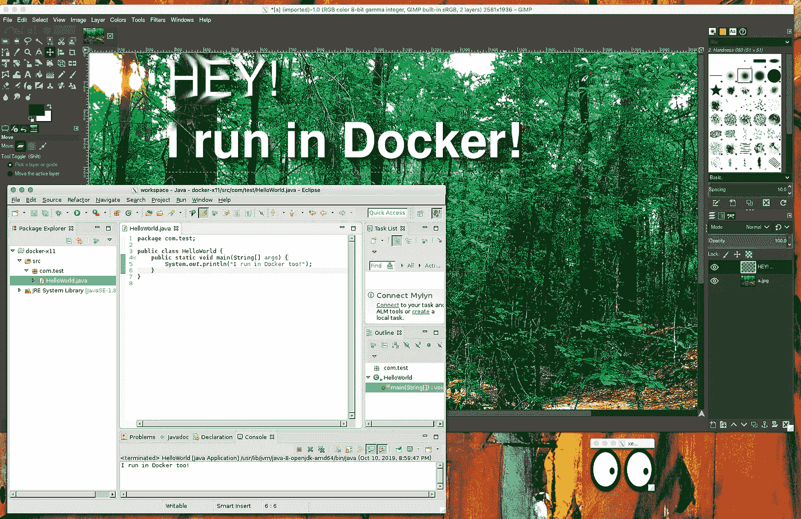
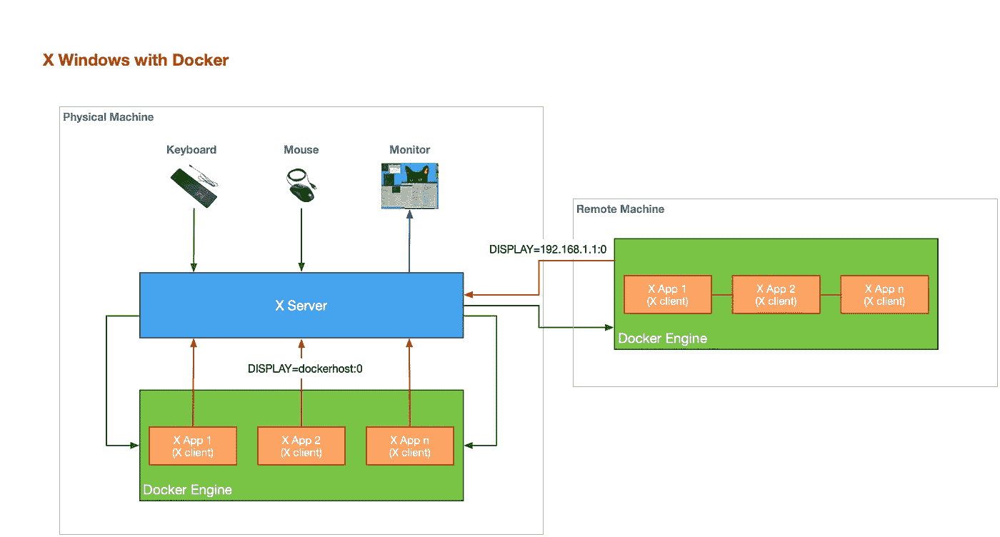
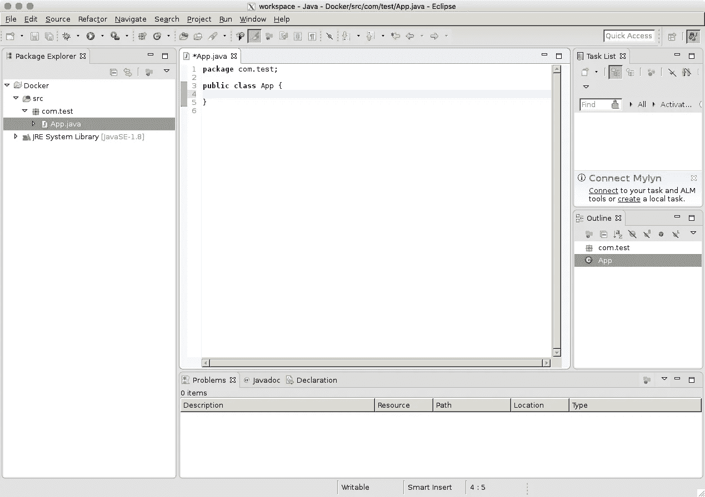
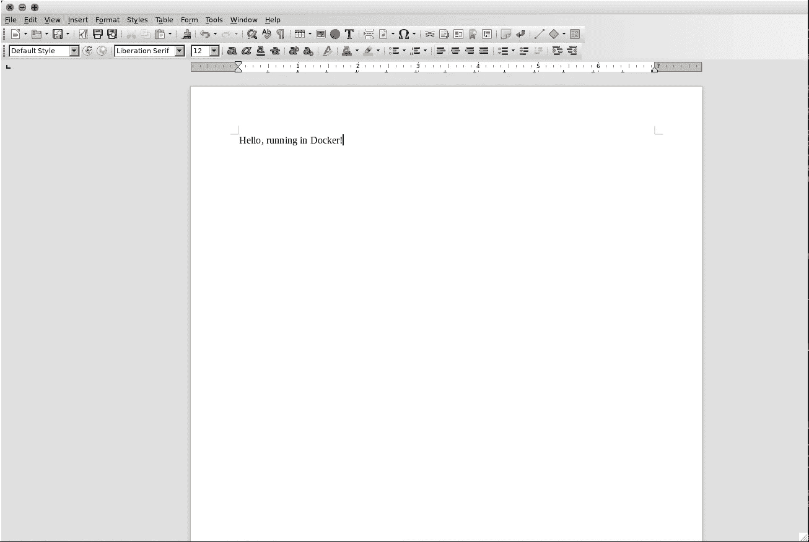
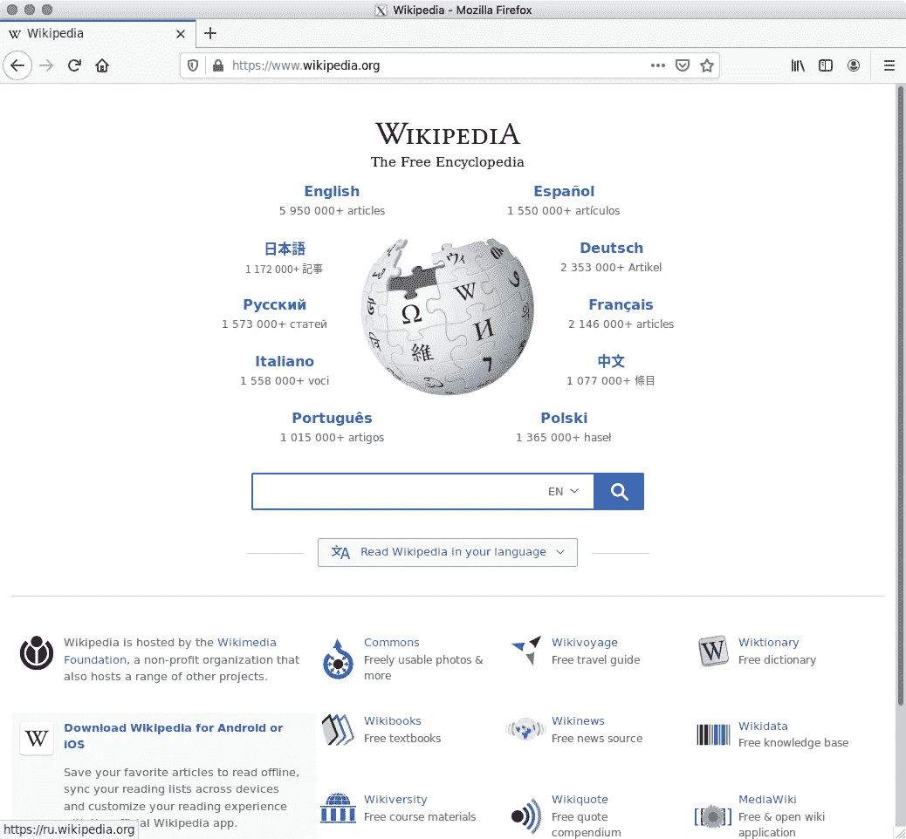

# 在 Docker 中运行桌面应用程序

> 原文：<https://betterprogramming.pub/running-desktop-apps-in-docker-43a70a5265c4>

## 学习如何运行桌面应用程序，如 GIMP、Eclipse IDE、Firefox 等。在码头

Docker 中运行的 GIMP、Eclipse IDE 和 xeyes

如今，Docker 是运行容器化应用程序的事实标准。从简单的 Hello Worlds 到复杂的多容器设置，您的应用程序的部署再简单不过了。

但是那些需要图形前端的应用程序呢？Docker 是一种服务器端技术——当然，你不能有图形，对吗？还是可以？接下来我们来了解一下(TL；大卫:是的，你可以。

# Docker 没有图形

术语 *graphics* 可以表示计算机科学和软件开发世界中的各种事物，当然，我不会在这里尝试定义它。有了一些诗意的许可，让我们笼统地称桌面应用程序为图形应用程序:一个需要*画布*和*在其用户界面上绘制*的软件。

显然，您不希望 Docker 为您的容器提供这样的画布，事实也的确如此，它确实没有。事实上，很多时候你被要求在[无头模式](https://en.wikipedia.org/wiki/Headless_software)下运行 Docker 容器，正是因为如此。那么如何在 Docker 中运行桌面应用程序呢？让我们弄清楚。

# x 窗口

X 窗口系统(X11，或简称 X)是一个用于位图显示的窗口系统，常见于类 Unix 操作系统。x 为 GUI 环境提供了基本框架:在显示设备上绘制和移动窗口，与鼠标和键盘交互。

x 需要一个服务器组件，允许应用程序内的交互来绘制内容并从用户的输入设备获得输入。作为 X 客户端，应用程序完全不知道它们的输出将实际呈现在哪里。

要进一步尝试下面的例子，您需要在您的 PC 上运行一个 X 服务器。如果你在桌面 Linux 上，你已经有一个了。macOS 可以下载 [XQuartz](https://www.xquartz.org/) ，Windows 可以试试 [VcXsrv](https://sourceforge.net/projects/vcxsrv/) 。

# x 和 Docker 交互场景

桌面应用程序将在 Docker 中运行，并试图与您在 PC 上运行的 X 服务器通信。这可以在您的主机上运行的 Docker 引擎中发生，也可以在远程机器上运行的 Docker 引擎中发生。对于 X 来说，除了引入一些网络延迟之外，这并没有什么不同。

下图描述了交互场景:

x 窗口和 Docker 交互

x 客户机(您的桌面应用程序)并不真的需要知道太多信息来进行这种通信。

实际上，除了 X 服务器的位置和一个可选的目标显示器之外，他们不需要知道任何东西。

这由一个名为 DISPLAY 的环境变量表示，语法如下:`DISPLAY=xserver-host:0`。你在`:`后面看到的数字就是显示号；出于本文的意图和目的，我们将认为这等同于“0 是连接到 X 服务器的主显示器”

# 让欢乐开始吧

是时候运行我们的桌面应用程序了。

因为我们将在 Docker 容器中运行桌面应用程序，而 X 服务器将在主机上运行，所以我们需要一种方式让这两者进行通信。

不幸的是，目前还没有通用的、开箱即用的 Docker 方法来做到这一点。因此，请记住 macOS、Windows 和 Linux 的以下设置:

MAC OS:`-e DISPLAY=docker.for.mac.host.internal:0` Windows:`-e DISPLAY=host.docker.internal:0` Linux:`--net=host -e DISPLAY=:0`

另外，记得让你的 X 服务器允许远程连接。对于 Mac 和 Windows，这应该是 X server 应用程序上的一个设置，而在 Linux 中，您可以使用`xhosts +`(暂时)启用来自所有主机的访问。

## xeyes

没有一篇关于 X Windows 的文章不提到空前经典的 xeyes:

xeyes 在 Docker 中运行

苹果电脑:`docker run --rm -ti -e DISPLAY=docker.for.mac.host.internal:0 fr3nd/xeyes`

windows:
`docker run --rm -ti -e DISPLAY=host.docker.internal:0 fr3nd/xeyes`
Linux:
`docker run --rm -ti --net=host -e DISPLAY=:0 fr3nd/xeyes`

## 瘸子

Gimp 允许在没有其他工具可用时快速编辑照片或绘图:

GIMP 在 Docker 中运行

macOS: `docker run --rm -ti -e DISPLAY=docker.for.mac.host.internal:0 jamesnetherton/gimp`

视窗:`docker run --rm -ti -e DISPLAY=host.docker.internal:0 jamesnetherton/gimp`

Linux: `docker run --rm -ti --net=host -e DISPLAY=:0 jamesnetherton/gimp`

## Eclipse IDE

快速启动一个 IDE:

运行在 Docker 中的 Eclipse IDE

苹果电脑:`docker run --rm -ti -e DISPLAY=docker.for.mac.host.internal:0 psharkey/eclipse`

视窗:`docker run --rm -ti -e DISPLAY=host.docker.internal:0 psharkey/eclipse`

Linux: `docker run --rm -ti --net=host -e DISPLAY=:0 psharkey/eclipse`

## 自由办公室

文字处理器、电子表格编辑器、演示工具和数据库编辑器:

Docker 中运行的 Libre Office

苹果电脑:`docker run --rm -ti -e DISPLAY=docker.for.mac.host.internal:0 woahbase/alpine-libreoffice:x86_64`

视窗:`docker run --rm -ti -e DISPLAY=host.docker.internal:0 woahbase/alpine-libreoffice:x86_64`

Linux: `docker run --rm -ti --net=host -e DISPLAY=:0 woahbase/alpine-libreoffice:x86_64`

## XMind

XMind 是一个思维导图和头脑风暴工具:

Docker 中运行的 XMind

苹果电脑:`docker run --rm -ti -e DISPLAY=docker.for.mac.host.internal:0 mdwheele/xmind`

Windows:
`docker run --rm -ti -e DISPLAY=host.docker.internal:0 mdwheele/xmind`

Linux:
`docker run --rm -ti --net=host -e DISPLAY=:0 mdwheele/xmind`

## 火狐浏览器

启动一次性浏览器，这样就没人能跟踪你了:

Firefox 在 Docker 中运行

苹果电脑:`docker run --rm -ti -e DISPLAY=docker.for.mac.host.internal:0 jess/firefox`

视窗:`docker run --rm -ti -e DISPLAY=host.docker.internal:0 jess/firefox`

Linux: `docker run --rm -ti --net=host -e DISPLAY=:0 jess/firefox`

在本文中，我们看到了桌面应用程序如何利用 X Windows 的能力在 Docker 中运行。设置非常简单，只需要在您的主机上运行一个 X 服务器。

对 Docker 感兴趣？这里有一些附加的帖子，希望你会觉得有启发性和趣味性:
[用 Maven 构建并推送 Docker](https://medium.com/swlh/build-push-to-docker-with-maven-eea7c4b8cfa2)
[如何从失败的自动化 Docker Hub 构建中恢复](https://medium.com/better-programming/how-to-recover-from-a-failed-automated-docker-hub-build-8b6c1cc3d7d4)
[如何在 Docker Hub 上测试你的自动化构建](https://medium.com/better-programming/how-to-test-your-automated-builds-on-docker-hub-e40879f35d1e)
[当你推送 GitHub 时自动构建你的 Docker 镜像](https://medium.com/better-programming/build-your-docker-images-automatically-when-you-push-on-github-18e80ece76af)