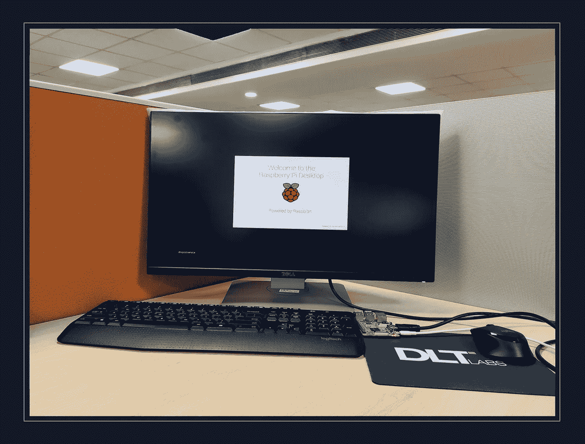
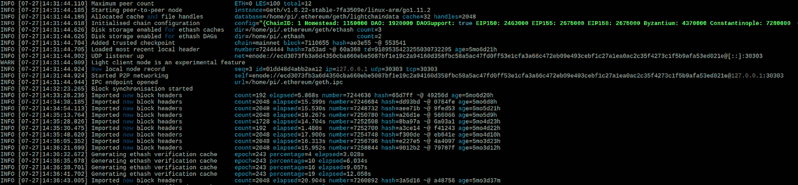
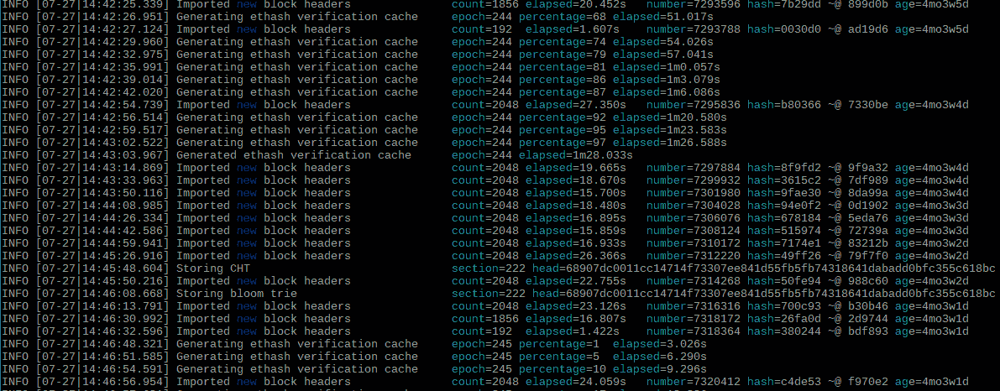
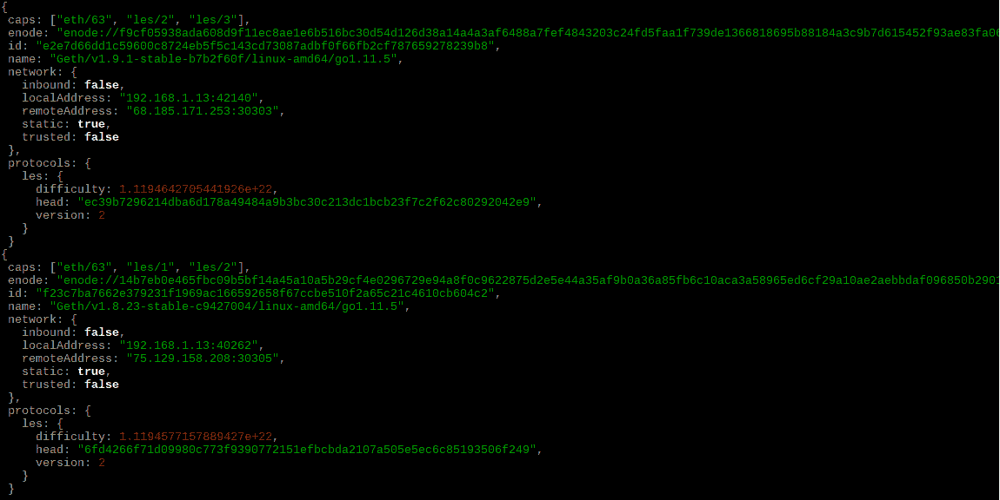
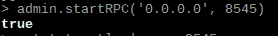
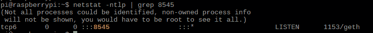

# 如何在 Raspberry Pi 上运行以太坊节点

> 原文：<https://betterprogramming.pub/running-ethereum-mainnet-on-raspberry-pi-6aca5cae32aa>

## 您想运行自己的节点已经有一段时间了—让我们来设置一个



# 介绍

一台袖珍计算机，功能强大。了解为什么Raspberry Pi 是基于物联网和区块链实施的致命组合。

## 在深入这个主题之前，让我们简单解释一下以太坊

以太坊是一个运行智能合约的去中心化平台。

智能合同是完全按照程序运行的应用程序，没有任何停机、审查、欺诈或第三方干扰的可能性。

以太坊的核心采用了区块链技术。简单来说，以太坊(Ethereum)是一个全球网络，旨在以分散的方式处理指令，依靠多台计算机或节点的处理能力和存储资源。

通过运行一个节点，我们有助于保持网络的分散性和对等点之间的信任。是直接参与以太坊网络，掌握一些前沿技术的一种方式。另外，这很有趣！

## 为什么我们想在 Raspberry Pi 上运行以太坊节点？

Raspberry Pi 非常适合运行以太坊节点，因为它可以自己运行，直到我们决定停止它。

当然，我们可以在我们的计算机上运行一个节点，但是有专门的计算和存储成本。我宁愿让我的节点在专用硬件上运行，在笔记本电脑上看电影。如果你不小心烤焦了，一份树莓派的价格要比一份馅饼便宜得多。

我们也可以通过云服务在虚拟机实例上运行以太坊节点，但这将增加巨大的成本。我们当然不想在口袋里烧一个洞，不是吗？

此外，Raspberry Pi 可用于创建一个简单的实验沙盒，这也证明了在嵌入式平台上部署区块链技术并进一步将其与物联网集成的可能性。

# 我们如何在 Raspberry Pi 上运行以太坊节点？

现在要安装我们的钻机，我们需要一些行业工具。让我们来看看一些先决条件:

*   Raspberry Pi 3B+采用优质外壳和散热器(冷却风扇)来防止过热和关机
*   32G+ MicroSD 卡
*   HDMI 线和显示器
*   一个键盘和一个鼠标(当然你需要那个！)

我们假设 Raspbian 操作系统已经安装在 Raspberry Pi 上。如果没有，不要担心，按照下面的链接把事情搞定 **:**

【https://www.raspberrypi.org/downloads/raspbian/ 

一旦操作系统的基本设置完成，我们就可以开始了！让我们按照以下步骤前进:

## **第一步:从更新软件包到最新版本开始**

命令:

```
$ sudo apt-get update
$ sudo apt-get dist-upgrade
```

## **第二步:释放以太坊客户端的内存，又名 Geth (Go Ethereum)**

为内存密集型任务释放 RAM 的一个好方法是减少分配给 GPU 的内存量。此外，如果您不需要图形桌面，配置您的系统简单地引导到命令行。

```
$ sudo raspi-config
```

1.要引导至命令行:

*   3 →启动
*   B1 →桌面/ CLI
*   B1 →控制台

2.为了减少分配给 GPU 的内存:

*   7 →高级
*   A3 →内存拆分
*   32 兆字节

3.最后，重启。

接下来，我们将在接下来的步骤中安装软件包依赖项。

## **第三步:在安装 Geth 之前，我们需要安装 Golang。这可以使用下面的命令**来完成

```
$ sudo apt-get install git golang libgmp3-dev
```

安装的 Golang 版本将会过时，所以我们需要使用 Golang 版本管理器“g”将其版本升级到 1.10 以上

链接:**[https://github.com/stefanmaric/g](https://github.com/stefanmaric/g)**

**命令:**

```
$ curl -sSL [https://git.io/g-install](https://git.io/g-install) | bash
$ g install <version> (above 1.10 ex. 1.11.2)
```

## ****步骤 4:安装 Geth****

**我们将选择从源代码构建 Geth，而不是使用二进制文件，因为从源代码构建允许大量的定制选项。**

**例如，我们可以添加一些二进制文件中没有提供的特性，提供我们的硬件(Raspberry Pi)特定信息以进行适当的安装，并将其安装在我们希望的位置。**

**此外，我们可以安装最新版本和更新，无论是安全补丁或新功能。**

**命令:**

```
$ mkdir src$ cd src$ git clone -b release/1.8 [https://github.com/Ethereum/go-Ethereum.git](https://github.com/Ethereum/go-Ethereum.git)
(release number should be the latest one for efficient working.)$ cd go-Ethereum$ make$ sudo cp build/bin/geth /usr/local/bin/
```

## ****第五步:创建账户****

```
$ geth account new
```

**这将生成一组新的加密密钥，并用密码保护私钥。**

**请注意，如果我们使用此帐户来挖掘加密货币并进行有意义的交易，我们会希望确保备份我们的密钥，以防止我们的私钥被访问。**

## ****第六步:在 light 模式下同步以太坊 Mainnet****

```
$ geth — syncmode light — cache 64 — maxpeers 12
```

**如果我们不带任何参数运行 Geth，它将启动一个节点，并尝试同步整个公共 Mainnet 区块链——其大小超过 50GB，并且在不断增长，这对于嵌入式计算机来说可能不是一个好主意。**

**因此，我们改为在[光](https://github.com/ethereum/wiki/wiki/Light-client-protocol)同步模式下启动节点。这只在块头出现时获取块头，并按需获取区块链的其他部分。**

**要停止执行，请按 Ctrl + C**

**要在后台运行，您只需使用`nohup`。**

```
$ nohup geth — syncmode light — cache 64 — maxpeers 12 &
```

**它将在后台运行同步过程。要查看日志，请使用任何代码编辑器(例如 Vim 或 Nano)打开文件 nohup.out。**

**日志显示为:**

********

## ****第七步:JavaScript 控制台****

**Geth Javascript 控制台通过**Geth-attach 命令可用。****

****要检查最新同步的块:****

```
**>>> eth.getBlockNumber ( console.log )**
```

****输出:****

********

****要列出当前帐户:****

```
**>>> eth.accounts**
```

****要列出对等方:****

```
**>>> admin.peers**
```

****输出:****

********

## ******步骤 8:设置 RPC******

****打开 JavaScript 控制台，运行以下命令。****

```
**>>> admin.startRPC ( ‘0.0.0.0’, 8545 )**
```

****输出:****

****************

****语法:`admin.startRPC ( ‘ IP address ’, PORT number )`****

****RPC 将开始在该 IP 和端口上运行。****

****现在，我们可以使用 Postman、进行简单的 API 调用，或者我们可以使用自己选择的编程语言进行任何 REST API 调用，并通过以太坊管理 API 获取数据。****

## ******第 9 步:在以太坊区块链上发送交易******

****嗯，这一步才是真正的乐趣；然而，它将花费我们真正的醚。(最好的东西从来都不是免费的！)****

****该事务与`eth_sendTransaction`的参数相同，并且包含`from`地址。`passphrase` 用于解密属于`tx.from`的私钥。****

****如果只有`passphrase`解密私钥，那么并且只有在那时交易才被验证，用户登录并且将交易发送到网络上。该帐户在节点中没有被全局解锁，不能在其他 RPC 调用中使用。****

****控制台:`personal.sendTransaction(tx, passphrase)`****

****RPC:********

******在 JavaScript 控制台上:******

```
****>>> var tx = {from: “0x391694e7e0b0cce554cb130d723a9d27458f9298”, to: “0xafa3f8684e54059998bc3a7b0d2b0da075154d66”, value: web3.toWei(1.23, “ether”)}
undefined
>>> personal.sendTransaction(tx, “passphrase”)****
```

******要使用树莓 Pi 玩更多以太坊区块链，请参考[go-以太坊管理 API](https://github.com/ethereum/go-ethereum/wiki/Management-APIs)。******

******这一节就讲到这里。不断创新！******