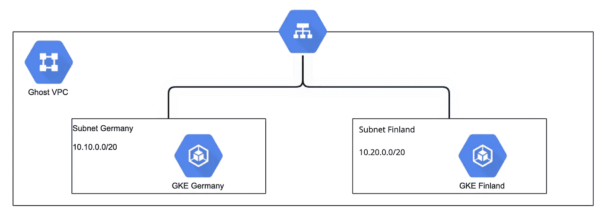
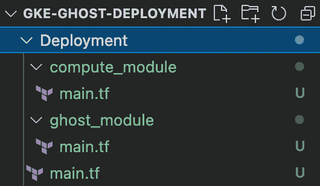
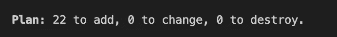
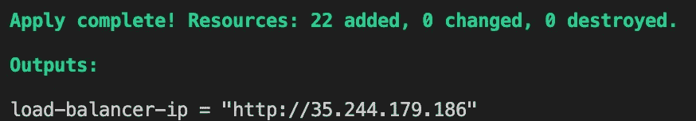

# 在多区域 Google Kubernetes 引擎中运行 Ghost

> 原文：<https://betterprogramming.pub/running-ghost-in-a-multi-region-google-kubernetes-engine-db9de8ba784e>

## 全球部署应用程序


本·怀特在 [Unsplash](https://unsplash.com?utm_source=medium&utm_medium=referral) 上的照片

最初我计划使用我的“Hello World”应用程序，但我认为是时候使用现实世界的应用程序了。我的灵感来自于另一位媒体作家[乔治·菲尔德](https://medium.com/@george.af.field)和他的“[10 Side Hustles to Make Extra dose As a Software Engineer](/10-side-hustles-to-make-extra-money-as-a-software-engineer-a290e66c7ce9)”文章。

他提到[Ghost](https://ghost.org/)——一个为内容创作者提供的博客内容管理系统——作为一个额外赚钱的工具。幸运的是，Ghost 团队有一个公开的 Ghost Docker 映像[，我们可以在这次演示中使用它。](https://hub.docker.com/_/ghost)

TL；博士？检查[我的 GitHub repo](https://github.com/Escoto/GKE-Ghost-Deployment) 的完整脚本。

这是我关于容器的系列博客的继续。点击这里查看之前的博客:

*   [Google Cloud 中的 Kubernetes 引擎和 Terraform](https://medium.com/codex/kubernetes-and-terraform-in-google-cloud-3fc9e1c81e0)
*   [谷歌云中的 Kubernetes](https://medium.com/codex/kubernetes-in-google-cloud-f27bb8cc6603)
*   [将您的第一个应用程序容器化](https://medium.com/codex/containerizing-your-application-b1644385e2ef)

# 要求

*   一个 [GCP 项目](https://cloud.google.com/resource-manager/docs/creating-managing-projects#creating_a_project)
*   启用所需的 API
*   在你的本地机器上安装谷歌 SDK
*   安装[地形](https://learn.hashicorp.com/tutorials/terraform/install-cli)

> 如果用 Google 的云壳 SDK，Terraform 开箱即用！！

# 未来的任务

我们面临的任务是探索在多个地区运行我们的应用程序的可能性。如果我们已经以`regional`的身份运行集群(正如我在上一篇文章中所做的)，那么应用程序已经部署在多个区域中。但是，地震和龙卷风会同时摧毁所有这些区域吗？大多数*可能不是*，但客户的延迟至少会得到改善。

有人提议在多个地区托管应用程序有多种原因，但现在我们想把重点放在有趣的部分——完成它。

# 可能吗？—是的！

为了更容易理解，您可以从

```
$> git clone [https://github.com/Escoto/GKE-Ghost-Deployment.git](https://github.com/Escoto/GKE-Ghost-Deployment.git)
$> cd Deployment/
```

这是我们今天的目标。此图描述了同一个 VPC 中的两个 GKE 集群，它们通过外部全局负载平衡器对外公开。



由[作者](https://medium.com/@raescoto)使用 [Gliffy](https://www.gliffy.com/)

现在，这张图片总结了需求并隐藏了所有的复杂性。实际上，完成这项工作并不像看起来那么简单，至少与区域性的 GKE 相比是如此。

当创建区域 GKE 时，[Terraform Kubernetes Provider](https://registry.terraform.io/providers/hashicorp/kubernetes/latest/docs)是一个魅力所在，它负责创建负载平衡器并向世界公开您的服务，而您甚至不会注意到这一切正在发生。

与此同时，当您想要将您的应用程序部署到多个 GKE 集群时，一个 GKE 不能是负载平衡器的唯一所有者。负载均衡器必须在不同的实例之间“共享”,因此文件略有变化，它不再是 GKE 声明的 LB，LB 现在是一个独立的服务，您必须将每个 GKE 集群注册为后端服务。

# 怎么会？！

> 请记住，这只是一个例子，我并没有严格遵循 Terraform 的最佳实践，这也不是一个生产就绪的解决方案。相反，为了这个实验，我们专注于完成它。

在我以前的博客中，我用一个区域中的每个区域做了一个区域聚类。让我们迭代这个解决方案，首先创建一些 [Terraform 模块](https://learn.hashicorp.com/tutorials/terraform/module)，一个用于 Kubernetes 服务，一个用于 Kubernetes 集群；这些模块将允许我们通过简单地传递变量在不同的区域创建多个一致的集群。

在这一点上，我的目录看起来像这样，并且在整个练习中它将保持这样。



创建两个模块

网络资源可能是创建新模块的一个原因，但现在让我们将它们保留在这里。如图所示，我们需要一个 VPC 和两个子网络，每个区域一个子网；对于这个例子，我选择德国和芬兰。

如你所见，我使用了几个局部变量，如果你想看到它们的完整声明，请看看[回购](https://github.com/Escoto/GKE-Ghost-Deployment/blob/main/Deployment/main.tf)。

有了网络，我们现在可以看看将利用它们的集群模块。

如果你注意这个集群的声明，我们提供了*区域*作为`location`，这反过来使它成为区域性的。基本上，这意味着它将在每个区域上创建一个实例组，然后我们必须在负载平衡器上注册该实例组，以便可以向它们发送流量。

这个过程要求我们打开我们的 Kubernetes 服务将通过一个名为[的端口](https://cloud.google.com/sdk/gcloud/reference/compute/instance-groups/get-named-ports)使用的端口。

在这里，我将演示如何打开一个端口，如果你看到了完整的脚本，你会注意到我是如何为每个实例组打开端口的。这不是非常可扩展的，因为用一句话来说有点“硬编码”,并且将我们锁定在只有三个区域的区域。目前，这足以让我们的练习继续进行。

该模块就绪后，我们可以返回主脚本，开始创建区域集群，它们的端口`30000`将为我们打开。现在我们只想要两个，每个地区一个。这将产生六个实例组，每个区域的每个区域一个。

服务器就位后，我们可以创建一个负载平衡器来在它们之间分配连接。

在使用单个集群时，Kubernetes 为我们隐藏了这部分基础设施的配置，但在这种情况下，我们需要自己进行设置。

重要的是要注意

*   [网络标签](https://cloud.google.com/vpc/docs/add-remove-network-tags)
*   指定港口`http:30000`
*   添加 VPC

此时，我们有了一个运行应用程序的地方，以及一个负责分发工作的服务。现在让我们配置一个 Kubernetes 服务，它将把我们的应用程序暴露给我们之前为实例组配置的同一个开放端口。

长话短说，我给你们展示的是库伯内特斯`Service`而不是`Deployment`，你们可以在这里找到。这里我将重点放在服务上，因为它负责公开我们的应用程序。在部署中有一些棘手的事情需要配置，但这些都是 Ghost 特有的，你可以在[的文档](https://ghost.org/docs/config/#running-ghost-with-config-env-variables)中找到它们。

此时，这个练习开始变得有趣了。在我以前的文章中，我在同一个文件中有 Kubernetes Provider+Deployment+Service。如果你想把它变成一个模块，你不能，你必须把提供者和实现分开。我实际上花了很多时间来处理这个问题，直到我终于找到了 [Pavel Tuzov](https://medium.com/@paveltuzov) 在这里解释我的问题" [Terraform:不要将 Kubernetes provider 用于您的集群资源！](https://itnext.io/terraform-dont-use-kubernetes-provider-with-your-cluster-resource-d8ec5319d14a)”。

因此，回到主脚本，我们需要声明两个别名提供者——每个集群上的每个部署一个。

最后，提供者就位后，我们现在可以继续配置我们的应用程序部署。

我们现在可以运行我们都喜欢的命令了

```
$> terraform init
$> terraform plan
$> terraform apply
```

如果你使用我的脚本，在计划之后，你应该得到类似这样的东西:



然后:



一旦 terraform 完成创建所有服务，我们必须等待大约 3 分钟，以便所有服务完成预热。


别忘了清理你的环境，这种跑步几分钟并不贵，大概就几毛钱，但是如果你一个月都忘了这个…

```
$> terraform destroy
```

既然我们可以在全球范围内部署我们的应用程序，我们的任务就完成了。

我们现在可以去喝杯咖啡了！