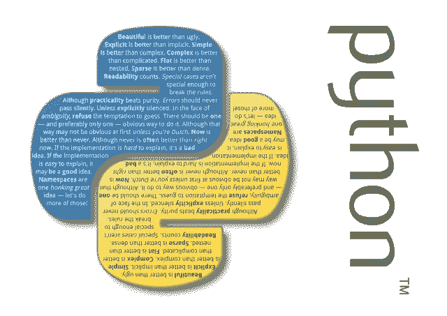

# 从 C#运行 Python 脚本并处理结果

> 原文：<https://betterprogramming.pub/running-python-script-from-c-and-working-with-the-results-843e68d230e5>

## 如何根据动态条件修补参数

Python 的禅

在最近的一个项目中，我需要根据动态条件修补一些参数。我们有几个外部服务要调用，基于一些标识符，对于标识符#1012，我们需要从参数中删除每个“-”实例，然后用修补的参数调用外部服务；对于标识符#1013，我们需要在没有定义前缀的任何输入参数前添加“995”。

项目写在。NET (C#)和修补部分是作为一些实用程序静态类方法完成的，它随着时间的推移而增长…主要问题是，对于任何附加条件，我必须添加实际的补丁，并将服务重新部署到活动服务器。我需要能够使用某种动态解释语言来编写补丁，这种语言可以更改/添加/删除补丁，而无需重新编译。净部分。我必须决定是使用 PHP 还是 Python。

虽然我有一些编写 PHP 脚本的经验，但这对我来说并不舒服。Python 的哲学/意识形态(见标题图片)如此契合，以至于 Python 被选中来完成这项任务。

对于编程来说，至少有两种方法可以解决我们的问题。让我们通过一些示例实现细节来讨论几个解决方案:

1.  使用安装了 Python 解释器的新进程调用 Python 脚本。
2.  使用 [IronPython](http://ironpython.net/) 解释器调用 Python 脚本。NET 应用程序。

下面的例子包含了更多的解释。

# 使用新流程初始化调用 Python 脚本。

这里的主要思想是使用一个新初始化的进程调用脚本，并获得它的标准输出。这个方法需要一个外部 Python 解释器来实际执行脚本。

使用新流程初始化执行脚本的示例实现

请记住，当您运行这样的代码时，您需要考虑运行您的主应用程序的帐户的权限。例如，如果您想从托管在 IIS 上的 web 服务运行一个脚本——确保所有需要执行的脚本文件对运行 web 服务的`ApplicationPool`的用户具有正确的权限。

# 使用 IronPython 解释器调用 Python 脚本。NET 应用程序。

您可以将 IronPython 解释器放在您的。NET 应用程序。例如，使用 NuGet，您可以下载[右包](https://www.nuget.org/packages/IronPython)，然后将脚本执行(实际上是 IronPython 引擎)嵌入到您的应用程序中。

# **结论**

这里的主要区别是，第二种方法是完全托管的代码，因此您可以在应用程序中获得所有异常和对脚本执行的控制。对于第一种方法，您失去了对已启动流程内部的控制。当然，您可以使用标准输出和控制流程等待超时来查看异常，但是所有这些都是需要支持的额外代码。

# 资源

 [## IronPython 正在运行

www.amazon.com](https://www.amazon.com/IronPython-Action-Michael-J-Foord/dp/1933988339/ref=sr_1_1?ie=UTF8&qid=1480012639&sr=8-1&keywords=IronPython+in+Action) 

特别感谢 Giorgi Kardava 关于 IronPython 的讨论和材料，以及一些例子和测试。

 [## 格卡尔达瓦(乔治卡尔达瓦)

### gkardava 有 5 个存储库可用。在 GitHub 上关注他们的代码。

github.com](https://github.com/gkardava)