# 使用 PyScript 在 Web 上运行 Python 脚本

> 原文：<https://betterprogramming.pub/running-python-script-on-the-web-using-pyscript-the-next-big-thing-8ace9543d75>

## 这是下一件大事吗？如果它继续进化的话


照片由[杰克逊·索](https://unsplash.com/@jacksonsophat?utm_source=medium&utm_medium=referral)在 [Unsplash](https://unsplash.com?utm_source=medium&utm_medium=referral) 上拍摄

在 2022 年 PyCon 美国会议期间，主题演讲人之一王蒙杰公布了 PyScript——一种直接在 HTML 中编写 Python 脚本的方法。如果您不了解 Peter，您可能听说过 Anaconda，它是 Python 和 R 最流行的发行版之一，特别关注数据科学。彼得是 Anaconda 的首席执行官和联合创始人。

换句话说，PyScript 是由一家声誉良好的技术公司开发的，这可能会在不久的将来保证它的生存能力。它受到了 Python 和 web 开发人员的极大关注，并且在 [GitHub](https://github.com/pyscript/pyscript) 上有超过 10k 颗星。然而，它能否成为一个成功的产品取决于时间和开发的长期投资，使其成为一个有竞争力的产品，这有一些已知的弊端(将在最后讨论)。

事不宜迟，让我们来快速了解一下这款激动人心的产品吧！

# py 脚本标签

我们知道大多数网站最常见的元素是 HTML 文件。当我们做一个网站的时候，我们的工作就是通过一些框架直接或者间接的制作 HTML 文件。在一个典型的 HTML 文件中，你会看到各种各样的标签。例如，`<head>`定义了 HTML 页面的元数据和关键信息，`<title>`是文档的标题，`<h1>`、`<h2>`等定义了不同级别的标题。

如前所述，PyScript 允许您在 HTML 中编写 Python 脚本，它使用了一个特殊的标签— `py-script`。在标签中，您可以嵌入 Python 脚本。要了解它是如何工作的，您可以创建一个包含以下代码的 HTML 文件，并使用 Chrome 打开该文件。在你的 Chrome 浏览器中，你应该可以看到如下内容:

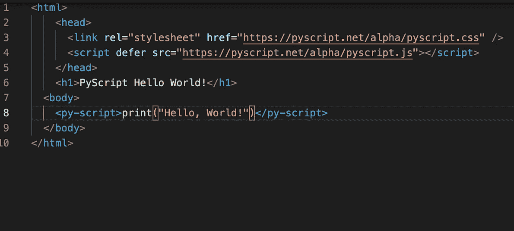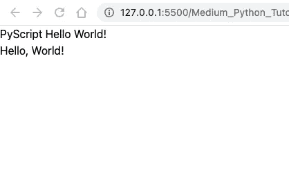

作者截图

在上面的代码片段中，您可能会注意到三件重要的事情。

*   `link`标签定义了一个外部样式表。在我们的例子中，我们使用 PyScript 提供的`css`文件。
*   我们使用`script`标签来嵌入由`src`定义的 PyScript 上托管的外部脚本。我们使用`defer`,这样脚本在下载后执行，页面完成解析——本质上是延迟执行，而不是实时执行。
*   最有趣的部分是`py-script`标签。如你所见，`print(“Hello, World!”)`是 Python 代码。当我们执行 HTML 文件时，我们看到代码的评估结果。

这很酷，不是吗？如果你不熟悉 web 开发，但是你知道 Python，使用 PyScript，你可以嵌入任何有效的 Python 代码。让我们再看一个例子。

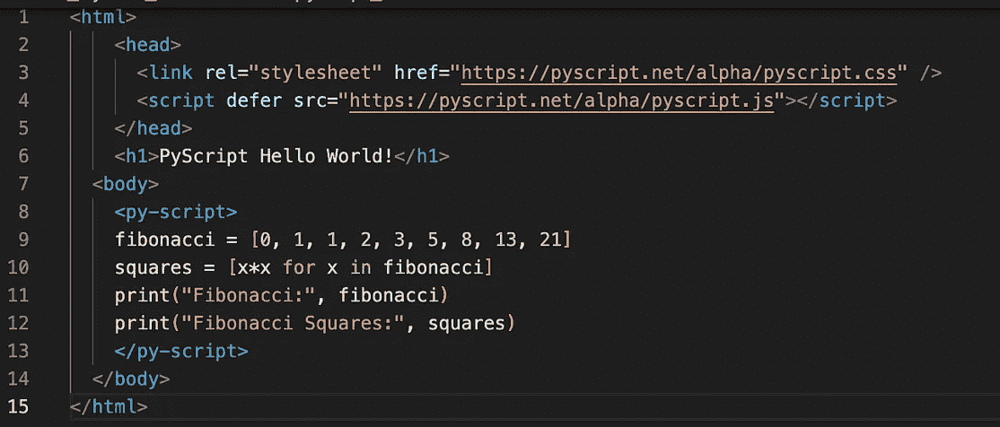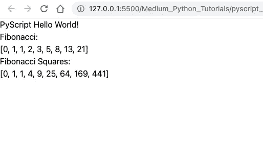

另一个 PyScript 示例(图片由作者提供)

在这里，我们编写了一些需要计算的代码，正如您所看到的，脚本得到了正确的执行。

# py-env 标签

当我们编写更复杂的代码时，我们需要使用第三方库。在这种情况下，我们可以利用`py-env`标签。你可能已经猜到了，env 是环境的简称。在`py-env`标签中，您列出了运行代码所需的 Python 包。

你可能知道许多数据科学家使用熊猫进行数据处理工作。让我们看看下面的例子。

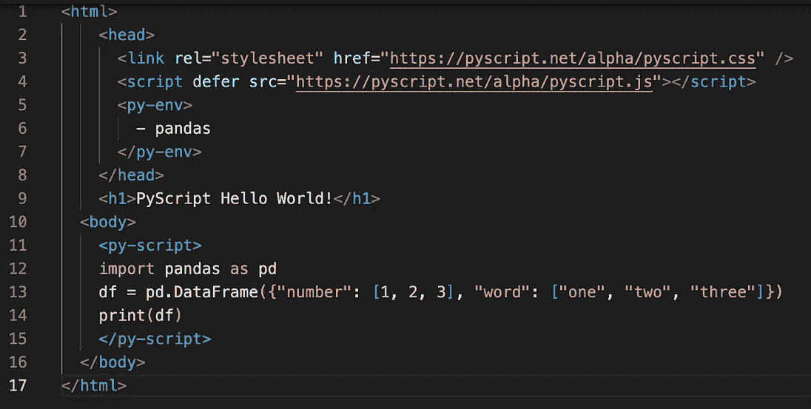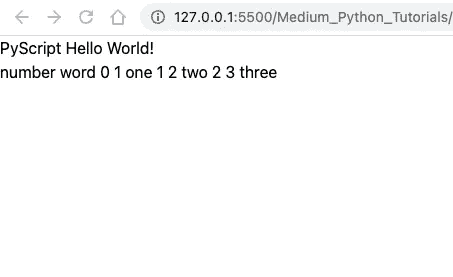

使用包的 PyScript(图片由作者提供)

正如您在上面看到的，我们在`py-env`标签中指定了依赖项(即熊猫),该标签放在`head`标签中。如果您的页面需要更多依赖项，您可以在此列出所有依赖项:

```
<py-env>
  - pandas
  - matplotlib
  - numpy
</py-env>
```

在`py-script`标签中，你可以看到我们确实可以使用 pandas 库来创建一个`DataFrame`对象。然而，当我们打印它时，它是单行而不是结构化的数据表。没有适当的结构，我们就无法理解这些数据。幸运的是，我们可以使用`write`函数，如下所述。

# 将内容写入指定的标签

除了 Python 中的标准`print`函数之外，作为脚本的一部分，PyScript 还有自己的函数`write`将数据发送到页面上指定的 web 元素中。考虑下面的例子:

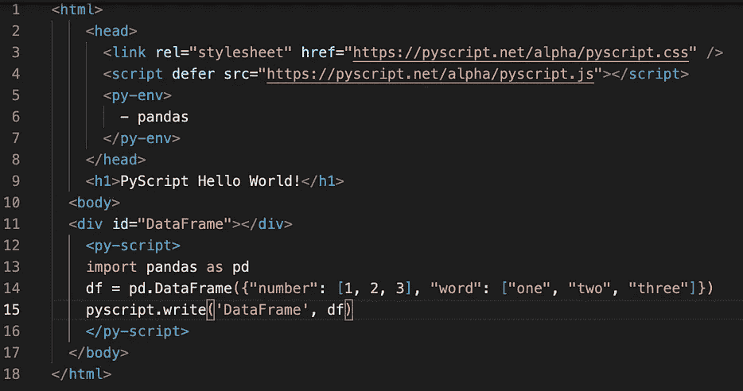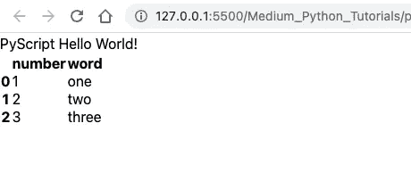

PyScript 编写(图片由作者提供)

在上面的代码片段中，与前面的示例相比，有两个显著的变化。

*   我们现在定义一个 id 为`“DataFrame”`的分部，这样它可以在以后被引用。
*   在 py-script 标记中，我们创建了与前面相同的 DataFrame 对象。但是现在，我们不是调用`print`，而是调用`pyscript.write`函数来请求 PyScript 处理在`“DataFrame”`部分显示`DataFrame`对象。从输出中，您可以看到我们现在有了一个结构化的表。

`write`函数不仅能写表格，还能写数字。下面的例子向您展示了我们如何使用另一个流行的 Python 数据可视化包`matplotlib`来显示 Python 创建的绘图。

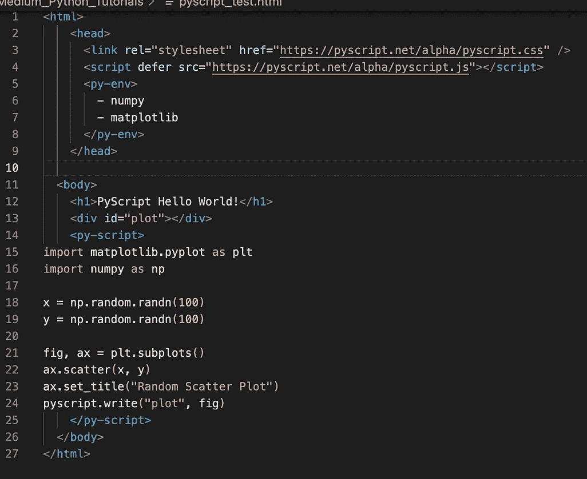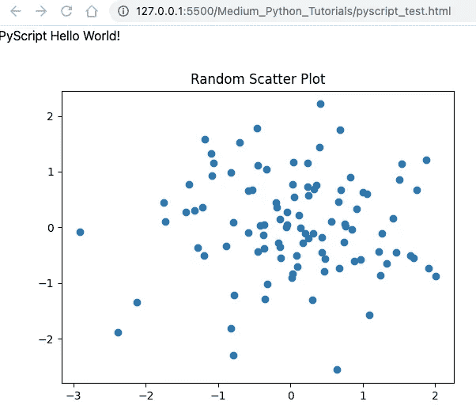

PyScript 编写情节(图片由作者提供)

如您所见，`write`功能以期望的方式显示图像。

# py-repl 标签

学习 Python 的最好方法之一是使用 REPL:读取、评估、打印和循环。也就是说，您使用交互式 Python 控制台，键入一些代码，Python 对其进行评估并打印任何适用的输出，然后继续循环。一个网页可以提供这样的 REPL 环境，如 Jupyter 笔记本。

PyScript 可以使用`py-repl`标签提供类似的功能。在这个元素中，您可以允许用户自己编写代码，也可以通过编程方式输入代码。请看下面的例子:

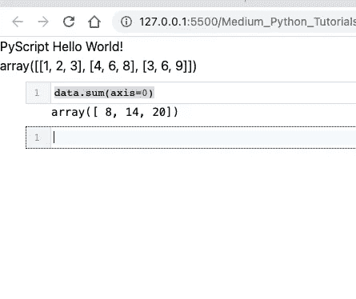

PyScript REPL(图片由作者提供)

如您所见，我们有一个单元格，其中包含了我们在`py-repl`标签中指定的代码。值得注意的是，单元格中的代码可以引用我们之前在`py-script`标签中定义的变量。因此，一切似乎都协调一致。

# 最后的想法

这些只是 PyScript 在这个阶段必须提供的主要亮点。它似乎是一个有前途的产品，因为它提供了一个灵活的框架，允许 Python 程序员在没有太多 web 开发知识的情况下制作 web 应用程序。然而，也有类似的成功产品，因此竞争会很激烈。

例如，如果我需要为我的数据科学项目制作一个 web 应用程序，我会使用 Streamlit，它在功能方面已经相对成熟。请注意，PyScript 和 Streamlit 是不同系列的产品，尽管两者都与 web 开发有关。PyScript 应该更加通用，因为它的目标是你可以在任何网页上嵌入任何 Python 代码，这是 Streamlit 做不到的。

PyScript 在得到更好的接收之前有一些缺点必须解决。比如网页的加载速度很慢。如果您尝试按照本教程运行代码，您可能会注意到在网页能够正确显示之前会有明显的延迟。

尽管如此，我期待这个产品继续成长，我的信心主要来自它的开发者——Anaconda 团队，他们给我们带来了精彩的 Anaconda 工具。