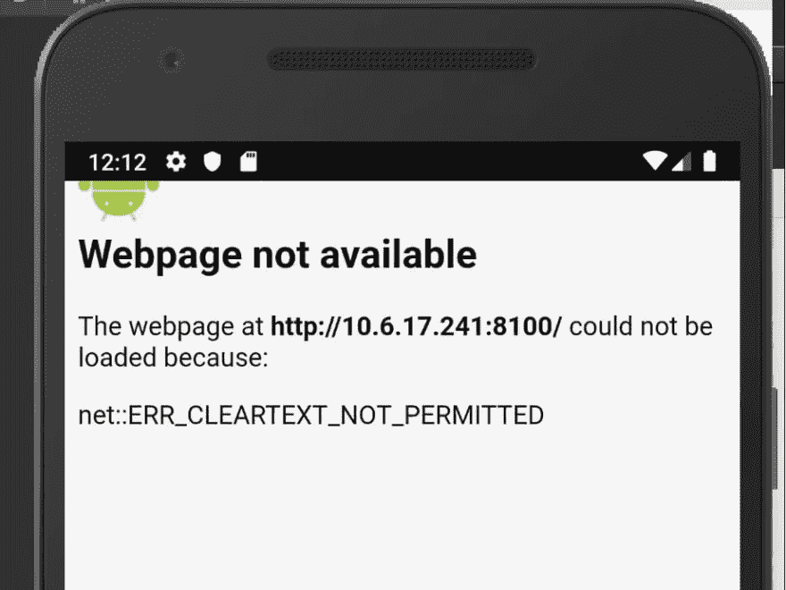

# 运行反应与离子电容器和带电重装

> 原文：<https://betterprogramming.pub/running-react-with-ionic-capacitor-live-reload-fc00fd4695d0>

## 将 React 整合到您的 Ionic 应用程序中


*由法比安·格罗斯在 Unsplash 上拍摄的照片*

[*Ionic Capacitor*](https://capacitor.ionicframework.com/docs/)*是一个跨平台的应用运行时，可以轻松构建在 iOS、Android、Electron 和 web 上本地运行的 web 应用。我们称这些应用为“本地渐进式网络应用”，它们代表了混合应用的下一次发展。*

[Ionic Capacitor 文档](https://ionicframework.com/docs/cli/commands/capacitor-run)对于构建和运行带有 Capacitor 和 Live Reload 的 react 应用程序并不起作用。所以，经过几个小时的努力，我找到了一个适合我的方法。希望它也能让其他人受益。

# 首先构建您的应用程序

这段代码的起点在这个 github repo 中: [MyAppReactApp](https://github.com/aaronksaunders/MyAppReactApp) 。这是 YouTube 视频中的代码[Ionic 框架中的 React Hooks 第一部分](https://www.youtube.com/watch?v=f9pq4Yizrg4&t=6s)。

```
ionic serve
```

当它运行时，注意它显示了应用程序运行的 URL。这是它在我的开发设备上的样子:

```
MacBook-Pro:MyAppReactApp aaronksaunders$ionic serve >react-scripts start 
[react-scripts] ℹ ｢wds｣: Project is running at http://10.6.17.241/ [react-scripts] ℹ ｢wds｣: webpack output is served from / 
[react-scripts] ℹ ｢wds｣: Content not from webpack is served from /Users/aaronksaunders/dev/projects/react/MyAppReactApp/public 
[react-scripts] ℹ ｢wds｣: 404s will fallback to /index.html 
[react-scripts] Starting the development server...
```

# 设置`capacitor.config.json`

文件`capacitor.config.json`可以在应用程序目录的根目录中找到。我们需要修改它，以便电容器知道在哪里找到网站运行。从`ionic serve`命令的输出中获取 URL，并修改您的`capacitor.config.json`文件，如下所示:

```
{
  "appId": "io.ionic.starter",
  "appName": "myAppReact1",
  "bundledWebRuntime": false,
  "npmClient": "npm",
  "webDir": "build",
  "cordova": {},
  "server": {
    "url": "http://10.6.17.241:8100"
  }
}
```

*确保将端口添加到 URL 的末尾！*

# 运行电容器

由于我使用的是 Visual Studio 代码，因此只需打开另一个终端窗口并运行以下命令来同步项目代码:

```
npx cap sync
```

这将复制项目的所有插件信息和本机桥代码，以便在设备或仿真器上运行。控制台输出应该类似于以下内容:

```
MacBook-Pro:MyAppReactApp aaronksaunders$npx cap sync ios 
✔ Copying web assets from build to ios/App/public in 348.07ms 
✔ Copying native bridge in 1.60ms 
✔ Copying capacitor.config.json in 1.43ms 
✔ copy in 368.54ms 
✔ Updating iOS plugins in 3.57ms 
Found 0 Capacitor plugins for ios: ✔ Updating iOS native dependencies with "pod install" (may take several minutes) in 4.23s 
✔ update ios in 4.24s 
Sync finished in 4.626s
```

接下来，用下面的命令打开特定于平台的 IDE。我在 iOS 上，所以命令打开 XCode——当它打开时，构建并运行应用程序:

```
npx cap open ios
```

当应用程序启动时，您应该会在 Xcode 日志中看到类似下面的内容:

```
2019-12-30 14:30:08.440853-0500 App[8013:145759] DiskCookieStorage changing policy from 2 to 0, cookie file: file:///Users/aaronksaunders/Library/Developer/CoreSimulator/Devices/76C4C563-0811-4917-9047-4ACD2B6C8687/data/Containers/Data/Application/D4CCEEC9-3FE1-4360-AF30-574BC8DEA7FA/Library/Cookies/io.ionic.starter.aks.binarycookies Loading network plugin 
2019-12-30 14:30:08.541581-0500 App[8013:145759] CAPKeyboard: resize mode - native 
⚡️ Loading app at http://10.6.17.241:8100... Reachable via WiFi APP ACTIVE 
⚡️ [log] - [HMR] Waiting for update signal from WDS... 
⚡️ WebView loaded 
⚡️ To Native ->App addListener 25525202 
SplashScreen.hideSplash: SplashScreen was automatically hidden after default timeout. You should call `SplashScreen.hide()` as soon as your web app is loaded (or increase the timeout). Read more at https://capacitor.ionicframework.com/docs/apis/splash-screen/#hiding-the-splash-screen 
⚡️ To Native ->Camera getPhoto 25525203
```

现在，您对网站所做的任何编辑都将强制重新构建—应用程序将检测新网站并重新加载自己。

# 安卓怪癖

在 Android 设备和模拟器上运行带实时重载的电容器时，可能会遇到一个问题。如果您按照下面的说明操作，这个问题很容易解决。

我将向您介绍整个过程，以便您可以看到错误，然后修复它。让我们从将 Android 添加到项目开始。

```
npx cap add android
```

以下是运行该命令的输出:

```
MacBook-Pro:MyAppReactApp aaronksaunders$npx cap add android 
✔ Installing android dependencies in 7.13s ⠋ 
Adding native android project in: /Users/aaronksaunders/de
✔ Adding native android project in: /Users/aaronksaunders/dev/projects/react/MyAppReactApp/android in 27.56ms 
✔ Syncing Gradle in 15.83s 
✔ add in 22.99s ⠋ 
Copying web assets from build to android/app/src/main/asse⠙ 
Copying web assets from build to android/app/src/main/asse⠹ 
Copying web assets from build to android/app/src/main/asse
✔ Copying web assets from build to android/app/src/main/assets/public in 235.76ms 
✔ Copying native bridge in 1.00ms 
✔ Copying capacitor.config.json in 760.08μp 
✔ copy in 247.39ms 
✔ Updating Android plugins in 3.77ms Found 0 Capacitor plugins for android: 
✔ update android in 16.64ms
```

然后我们需要同步本机代码和插件，这样我们就可以在 Android Studio 中运行它。

```
npx cap sync android
```

然后用下面的命令打开 Android Studio。

```
npx cap open android
```

最后，在模拟器或设备中运行代码，您将看到以下错误:



这是一个 Android 特有的问题，可以通过更新`AndroidManifest.xml`以包含`android:usesCleartextTraffic="true"`来解决。您可以在以下路径找到的文件中进行编辑:`android/app/src/main/AndroidManifest.xml`。

```
<application android:usesCleartextTraffic= "true"   
  android:allowBackup= "true" 
  android:icon= "@mipmap/ic_launcher"
  android:label= "@string/app_name" 
  android:roundIcon= "@mipmap/ic_launcher_round"
  android:supportsRtl= "true" 
  android:theme= "@style/AppTheme" >
```

在您做出这个更改之后，您需要`npx cap sync android`来获得应用程序更新。然后重新启动模拟器或设备，应用程序应该工作正常。

# 移除实时重新加载

要从您的项目中移除 live reload，您只需更新`capacitor.config.json`并移除`server.url`属性:

```
{
  "appId": "io.ionic.starter",
  "appName": "myAppReact1",
  "bundledWebRuntime": false,
  "npmClient": "npm",
  "webDir": "build",
  "cordova": {},
  "server": {
    "url": "http://10.6.17.241:8100" //<== REMOVE THIS!!
  }
}
```