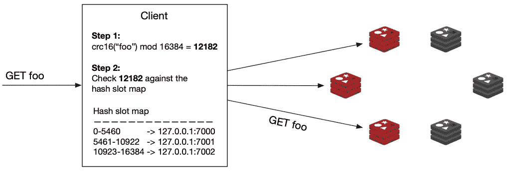
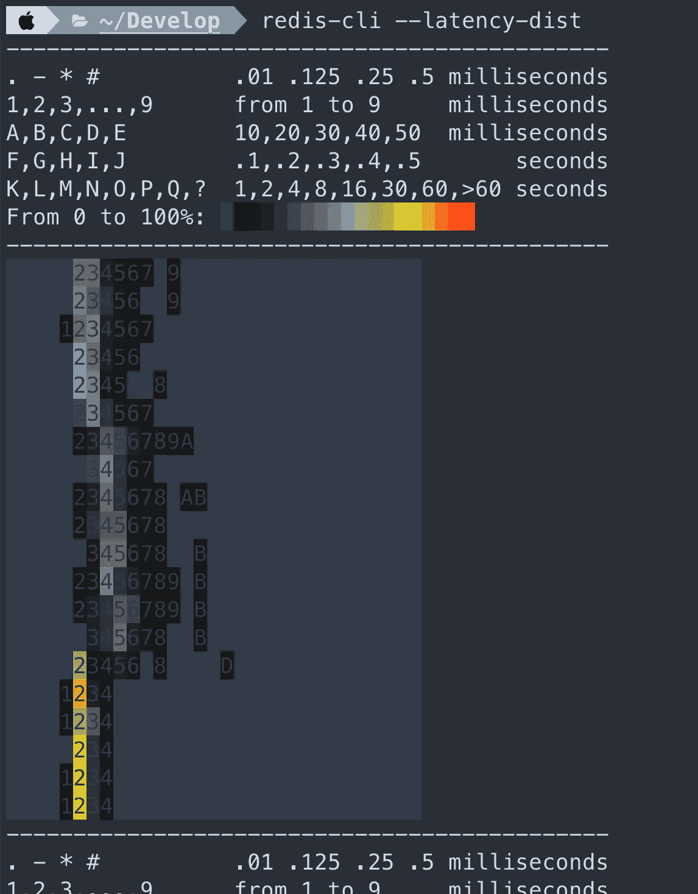

# 大规模运行 Redis—Redis 路线图

> 原文：<https://betterprogramming.pub/running-redis-at-scale-redis-roadmap-607521db2a0f>

## 对 Redis 的深入研究


由[Niklas bishop](https://unsplash.com/@nbischop?utm_source=medium&utm_medium=referral)在 [Unsplash](https://unsplash.com?utm_source=medium&utm_medium=referral) 上拍摄的照片

名为`redis.conf`的自文档化 Redis 配置文件作为编写良好的文档的例子被多次提及。

在这个文件中，您可以找到所有可能的 Redis 配置指令，以及它们的功能和默认值的详细描述。

在生产环境中运行 Redis 时，您应该始终根据您的需要调整`redis.conf`文件，并指示 Redis 基于其参数运行。

方法是在启动服务器时提供文件的路径:

```
$ redis-server./path/to/redis.conf
```

当您只是为了测试而启动 Redis 服务器实例时，您可以直接在命令行上传递配置指令:

```
$ redis-server --port 7000 --replicaof 127.0.0.1:6379
```

通过命令行传递的参数的格式与在`redis.conf`文件中使用的格式完全相同，唯一不同的是关键字是前缀。

注意，这在内部生成了一个内存中的临时配置文件，其中的参数被转换成`redis.conf`的格式。

通过使用特殊命令`CONFIG SET`和`CONFIG GET`，可以在不停止或重启 Redis 服务器的情况下对其进行重新配置。

```
127.0.0.1:6379> CONFIG GET *127.0.0.1:6379> CONFIG SET something127.0.0.1:6379> CONFIG REWRITE
```

并不是所有的配置指令都支持这种方式，但是您可以首先检查命令`CONFIG GET *`的输出，以获得所有支持的指令的列表。

注意，动态修改配置对`redis.conf`文件没有影响，所以在 Redis 下一次重启时，将使用旧的配置。

如果您想用您当前的配置设置强制更新`redis.conf`文件，您可以运行`CONFIG REWRITE`命令，它将自动扫描您的`redis.conf`文件并更新与当前配置值不匹配的字段。

# **客户端性能提升**

## **连接管理—池化**

Redis 客户端负责管理与 Redis 服务器的连接。一遍又一遍地创建和重新创建新连接会给服务器带来大量不必要的负载。一个好的客户机库会提供一些优化连接管理的方法，例如，通过建立一个连接池。

使用连接池，[客户端](https://redis.io/topics/clients)库将实例化一系列到 Redis 服务器的(持久)连接，并保持它们打开。当应用程序需要发送请求时，当前线程将从池中获得这些连接中的一个，使用它，并在完成后返回它。

因此，如果可能的话，总是尝试选择一个支持连接池的客户端库，因为这个决定会对系统的性能产生巨大的影响。

## **流水线作业**

与任何客户机-服务器应用程序一样，Redis 可以同时处理许多客户机。

每个客户端在一个套接字上进行读取(通常是阻塞的),并等待服务器响应。服务器从套接字读取请求，解析它，处理它，并将响应写入套接字。数据包从客户端传输到服务器，然后再传输回来的时间称为网络往返时间，或 RTT。

例如，如果您需要执行 50 个命令，您将不得不发送请求并等待响应 50 次，每次都要支付 RTT 成本。为了解决这个问题，Redis 可以处理新的请求，即使客户端还没有读取旧的响应。这样，您可以向服务器发送多个命令，而根本不需要等待回复；最后，只需一步就可以阅读回复。

这种技术叫做[流水线](https://redis.io/topics/pipelining)，是另一种提高系统性能的好方法。大多数 Redis 库都支持这种现成的技术。

## **初始调谐**

我们喜欢 Redis，因为它很快(而且有趣！)，所以当我们开始考虑扩展 Redis 时，我们首先要确保我们已经尽了一切努力来最大化它的性能。

让我们从一些重要的调优参数开始。

## **最大客户端数**

Redis 的默认最大客户端数为 10，000；达到最大值后，Redis 将对所有新连接做出错误响应。如果您有许多连接(或许多应用程序实例)，那么您可能需要更高。您可以在 Redis 配置文件中设置并发客户端的最大数量:

```
maxclients 20000
```

## **最大内存**

默认情况下，Redis 没有最大内存限制，因此它将使用所有可用的系统内存。如果您正在使用复制，您将希望限制内存使用，以减少副本输出缓冲区的开销。给系统留个记忆也是个好主意。大约 25%的开销。您可以在 Redis 配置文件中更新此设置:

```
# memory size in bytes  
maxmemory 1288490188
```

## **设置 tcp-backlog**

Redis 服务器使用`tcp-backlog`的值来指定完整连接队列的大小。

Redis 将这个配置作为`listen(int s, int backlog)`调用的第二个参数传递。

如果您有许多连接，您将需要设置高于默认值 511。您可以在 Redis 配置文件中对此进行更新:

```
# TCP listen() backlog. 
# 
# In high requests-per-second environments you need an high backlog in order 
# to avoid slow clients connections issues. Note that the Linux kernel 
# will silently truncate it to the value of /proc/sys/net/core/somaxconn so 
# make sure to raise both the value of somaxconn and tcp_max_syn_backlog 
# in order to get the desired effect.
tcp-backlog 65536
```

正如`redis.conf`中的注释所示，somaxconn 和`tcp_max_syn_backlog`的值可能也需要在操作系统级别增加。

## **设置读取副本配置**

扩展 Redis 的一个简单方法是添加读取副本并减轻主副本的负载。当您有大量读取(相对于大量写入)工作负载时，这是最有效的。您可能希望副本可用，并且即使复制没有完成，也仍然提供陈旧数据。您可以在 Redis 配置中对此进行更新:

```
slave-serve-stale-data yes
```

您还需要防止复制副本上发生任何写入。您可以在 Redis 配置中对此进行更新:

```
slave-read-only yes
```

## **内核内存**

在高负载下，由于内存分配，偶尔会出现性能下降。这是 Redis 的创始人 Salvatore 过去在博客上写的。性能问题与透明的`hugepages`有关，如果需要，您可以在操作系统级别禁用它。

```
$ echo 'never' > /sys/kernel/mm/transparent_hugepage/enabled
```

## **内核网络栈**

如果您计划在高性能环境中处理大量连接，我们建议调整以下内核参数:

```
vm.swappiness=0                       # turn off swapping
net.ipv4.tcp_sack=1                   # enable selective acknowledgements
net.ipv4.tcp_timestamps=1             # needed for selective acknowledgements
net.ipv4.tcp_window_scaling=1         # scale the network window
net.ipv4.tcp_congestion_control=cubic # better congestion algorithm
net.ipv4.tcp_syncookies=1             # enable syn cookies
net.ipv4.tcp_tw_recycle=1             # recycle sockets quickly
net.ipv4.tcp_max_syn_backlog=NUMBER   # backlog setting
net.core.somaxconn=NUMBER             # up the number of connections per port
net.core.rmem_max=NUMBER              # up the receive buffer size
net.core.wmem_max=NUMBER              # up the buffer size for all connections
```

## **文件描述符限制**

如果没有为 Redis 用户设置正确的文件描述符数量，您将会看到错误消息，指出“Redis 无法设置最大打开文件数”您可以在操作系统级别增加文件描述符限制。

这里有一个在 Ubuntu 上使用`systemd`的例子:

```
/etc/systemd/system/redis.service
[Service] 
... 
User=redis 
Group=redis 
...
LimitNOFILE=65536 
...
```

然后，您需要重新加载守护程序并重新启动 redis 服务。

## **启用 RPS(接收数据包控制)和 CPU 首选项**

我们可以提高性能的一个方法是防止 Redis 运行在与处理任何网络流量的 CPU 相同的 CPU 上。这可以通过为我们的网络接口启用 RPS 并为我们的 Redis 进程创建一些 CPU 关联来实现。

这里有一个例子。首先，我们可以在 CPU 0–1 上启用 RPS:

```
$ echo '3' > /sys/class/net/eth1/queues/rx-0/rps_cpus
```

然后，我们可以将 redis 的 CPU 关联设置为 CPU 2–8:

```
# config is set to write pid to /var/run/redis.pid
$ taskset -pc 2-8 `cat /var/run/redis.pid`
pid 8946's current affinity list: 0-8
pid 8946's new affinity list: 2-8
```

## **保存快照**

正如我们在前一单元中了解到的，如果至少有一个键发生了变化，Redis 将每小时保存一次数据库快照，如果至少有 100 个键发生了变化，则每 5 分钟保存一次，如果至少有 10000 个键发生了变化，则每 60 秒保存一次。

让我们将其更新为一个简化的假设场景，如果在 20 秒内修改了三个键，我们希望保存一个快照。

步骤 1 —创建一个名为 2.2 的目录，并在其中准备一个 redis.conf 文件。

```
$ mkdir 2.2
$ cd 2.2
$ vim redis.conf
```

`redis.conf`文件应该指定一个将用于 rdb 文件的文件名和一个指令，如果 20 秒内修改了 3 个键，该指令将触发快照的创建，如上所述。

```
dbfilename my_backup_file.rdb
save 20 3
```

步骤 2——在 2.2 目录中启动一个 Redis 服务器，将您刚刚创建的`redis.conf` 配置文件传递给它。

```
$ redis-server ./redis.conf
```

在单独的终端中，tab 使用`redis-cli`创建三个随机密钥，一个接一个。例如:

```
127.0.0.1:6379> SET a 1
127.0.0.1:6379> SET b 2
127.0.0.1:6379> SET c 3
```

在 2.2 目录中运行 ls 命令以列出其所有内容。什么变了？

步骤 3——现在我们准备将我们的持久性提升一个层次，并建立一个 AOF 文件。修改您的`redis.conf`文件，这样服务器将记录每一个新的写命令并强制写入磁盘。

小心点！我们有一个正在运行的服务器，我们希望在不重新启动它的情况下应用此配置。

```
127.0.0.1:6379> CONFIG SET appendonly yes
127.0.0.1:6379> CONFIG SET appendfsync always
```

为了将这些设置保存到 redis.conf 文件中，我们需要保存它们:

```
127.0.0.1:6379> CONFIG REWRITE
```

步骤 4 —通过 redis-cli 创建几个随机密钥。再次检查目录 2.2 的内容。什么变了？

第 5 步—作为最后一步，重新启动 Redis 服务器进程(您可以在终端中按 Ctrl+C 停止该进程并再次重新运行它)。如果您运行 SCAN 0 命令，您将看到您创建的所有密钥仍在数据库中，即使我们重新启动了该进程。

## **启用基本复制**

步骤 1 —首先，让我们创建并配置主实例。我们将从它的 primary.conf 配置文件中的一些配置更改开始。

```
$ touch primary.conf  # Create the configuration file
```

现在用你最喜欢的文本编辑器打开`primary.conf`文件，并设置以下配置指令:

```
# Create a strong password here
requirepass a_strong_password# AUTH password of the primary instance in case this instance becomes a replica
masterauth a_strong_password# Enable AOF file persistence
appendonly yes# Choose a name for the AOF file
appendfilename "primary.aof"
```

最后，让我们启动主实例:

```
$ redis-server ./primary.conf
```

步骤 2 —接下来，让我们为复制副本准备配置文件:

```
$ touch replica.conf
```

让我们为刚刚创建的文件添加一些设置:

```
# Port on which the replica should run
port 6380# Address of the primary instance
replicaof 127.0.0.1 6379# AUTH password of the primary instance
masterauth a_strong_password# AUTH password for the replica instance
requirepass a_strong_password
```

让我们开始复制:

```
$ redis-server ./replica.conf
```

步骤 3 —打开两个终端选项卡，并使用它们启动与主实例和复制副本实例的连接:

```
# Tab 1 (primary)
$ redis-cli # Tab 2 (replica)
$ redis-cli -p 6380
```

通过运行命令`AUTH`后跟您的密码，在两个选项卡上进行身份验证:

```
AUTH a_strong_password
```

在第二个(副本)选项卡上运行`MONITOR`命令，这将允许您查看针对该实例执行的每个命令。

返回第一个(主要)选项卡，执行任何写命令，例如

```
127.0.0.1:6379> SET foo bar
```

在第二个选项卡中，您应该会看到命令已经发送到副本服务器:

```
1617230062.389077 [0 127.0.0.1:6379] "SELECT" "0"
1617230062.389092 [0 127.0.0.1:6379] "set" "foo" "bar"
```

步骤 4 —保持实例运行，或者至少保持它们的配置文件。下一次练习我们会用到它们。

## **了解哨兵**

Redis Sentinel 是一个分布式系统，由多个以 Sentinel 模式启动的 Redis 实例组成。我们称这些情况为哨兵。

[哨兵小组](https://redis.io/topics/sentinel)监控主 Redis 实例及其副本。如果哨兵检测到主实例出现故障，哨兵进程将查找具有最新数据的复制副本，并将该复制副本升级为新的主实例。这样，与数据库对话的客户端将能够重新连接到新的主服务器，并继续正常运行，对用户的干扰最小。

## **决定主实例停机**

为了让哨兵能够决定主实例已经关闭，我们需要足够多的哨兵同意，从他们的角度来看，服务器是不可访问的。

有许多哨兵成员同意他们需要采取行动，这叫做达到法定人数。如果哨兵同盟无法达到法定人数，他们就不能判定初选失败。法定人数所需的哨兵确切人数是可配置的。

## **触发故障转移**

一旦哨兵确定主实例停机，他们需要选举并授权一名负责故障转移的领导者(哨兵实例)。只有在哨兵同盟的大多数成员都同意的情况下，才能选出领导人。

在最后一步中，领导者将通过发送命令`REPLICAOF NO ONE`将所选的副本重新配置为主副本，并且它将重新配置其他副本以跟随新升级的主副本。

## **前哨和客户端库**

如果您的系统使用 Sentinel 实现高可用性，那么您需要一个支持 Sentinel 的客户端。并不是所有的库都有这个功能，但是大多数流行的库都有，所以在选择库时要确保将其添加到需求列表中。

第 1 步——我们将重复使用它们来创建我们的哨兵设置。如果没有，请重新参考说明并再次阅读。

完成后，您将拥有一个包含一个复制副本的主 Redis 实例。

第 2 步——要初始化 Redis Sentinel，您需要提供一个配置文件，所以让我们继续创建一个:

```
$ touch sentinel1.conf
```

打开文件并在以下设置中粘贴:

```
port 5000
sentinel monitor myprimary 127.0.0.1 6379 2
sentinel down-after-milliseconds myprimary 5000
sentinel failover-timeout myprimary 60000
sentinel auth-pass myprimary a_strong_password
```

## **条款明细**

`port`-哨兵应运行的端口

`sentinel monitor` —在特定的 IP 地址和端口上监视主服务器。有了主哨兵的地址，他们将能够自己发现所有的复制品。这一行的最后一个论点是法定人数需要多少哨兵。

`sentinel down-after-milliseconds` —一个实例不可达到被认为停机的时间需要多少毫秒

`sentinel failover-timeout` —如果一个 Sentinel 投票给另一个 Sentinel 进行给定主节点的故障转移，它将等待这个毫秒数，再次尝试对同一主节点进行故障转移。

`sentinel auth-pass` —为了让 sentinel 在配置了 requirepass 时连接到 Redis 服务器实例，Sentinel 配置必须包括 sentinel auth-pass 指令。

步骤 3 —制作该文件的另外两个副本— sentinel2.conf 和 sentinel3.conf，并编辑它们，以便端口配置分别设置为 5001 和 5002。

步骤 4 —让我们在三个不同的终端选项卡中初始化三个 Sentinels:

```
# Tab 1
$ redis-server ./sentinel1.conf --sentinel# Tab 2
$ redis-server ./sentinel2.conf --sentinel# Tab3
$ redis-server ./sentinel3.conf --sentinel
```

步骤 5——如果您现在连接到 Sentinels 中的一个，您将能够运行许多新命令，如果在 Redis 实例上运行，这些命令将会出错。例如:

```
# Provides information about the Primary
SENTINEL master myprimary# Gives you information about the replicas connected to the Primary
SENTINEL replicas myprimary# Provides information on the other Sentinels
SENTINEL sentinels myprimary# Provides the IP address of the current Primary
SENTINEL get-master-addr-by-name myprimary
```

步骤 6 —如果我们现在通过按 Ctrl+C 或运行`redis-cli -p 6379 DEBUG sleep 30`命令来终止主 Redis 实例，我们将能够在 Sentinels 的日志中观察到故障转移过程将在大约 5 秒钟后开始。如果您再次运行返回主服务器 IP 地址的命令，您将看到复制副本服务器已提升为主服务器:

```
redis> SENTINEL get-master-addr-by-name myprimary
1) "127.0.0.1"
2) "6380"
```

## **创建 Redis 集群**

步骤 1 —要创建一个集群，我们需要启动几个空的 Redis 实例，并将它们配置为以集群模式运行。

以下是 Redis 集群的最小配置文件:

```
# redis.conf file
port 7000
cluster-enabled yes
cluster-config-file nodes.conf
cluster-node-timeout 5000
appendonly yes
```

在第一行中，我们指定了服务器应该运行的端口，然后我们声明我们希望服务器以集群模式运行，并带有启用集群的 yes 指令。cluster-config-file 定义存储该节点配置的文件的名称，以防服务器重新启动。最后，cluster-node-timeout 是一个节点必须不可访问才能被认为处于故障状态的毫秒数。

步骤 2 —让我们在您的本地主机上创建一个具有三个主碎片和三个副本的集群(请记住，在生产中始终使用两个副本来防止出现裂脑情况)。我们需要启动六个 Redis 进程，并为每个进程创建一个`redis.conf`文件，指定它们的端口和上面的其余配置指令。

首先，创建六个目录:

```
mkdir 7000 7001 7002 7003 7004 7005
```

第 3 步——然后在每个目录中创建最小配置`redis.conf`文件，确保您更改了端口指令以匹配目录名。您最终应该得到以下目录结构:

```
- 7000
  - redis.conf
- 7001
  - redis.conf
- 7002
  - redis.conf
- 7003
  - redis.conf
- 7004
  - redis.conf
- 7005
  - redis.conf
```

步骤 4 —打开六个终端选项卡，进入每个目录并启动一个 Redis 实例来启动服务器:

```
# Terminal tab 1
cd 7000
/path/to/redis-server ./redis.conf# Terminal tab 2
cd 7001
/path/to/redis-server ./redis.conf
```

…等等。

步骤 5 —现在您已经有六个空的 Redis 服务器在运行，您可以将它们加入一个集群:

```
redis-cli --cluster create 127.0.0.1:7000 127.0.0.1:7001 \
127.0.0.1:7002 127.0.0.1:7003 127.0.0.1:7004 127.0.0.1:7005 \
--cluster-replicas 1
```

这里我们列出了所有六个服务器的端口和 IP 地址，并使用 CREATE 命令指示 Redis 将它们加入集群，为每个主服务器创建一个副本。

Redis-cli 将提出配置建议；键入 yes 接受它。集群将被配置和加入，这意味着实例将被引导以相互通信。

最后，您应该会看到一条消息，内容如下:

```
[OK] All 16384 slots covered
```

这意味着至少有一个主实例为 16384 个可用插槽中的每一个提供服务。

步骤 6 —让我们向集群添加一个新的碎片，这是您需要扩展时可能会做的事情。

首先，和以前一样，我们需要在集群模式下启动两个新的空 Redis 实例(主实例及其副本实例)。我们创建新的目录 7006 和 7007，并在其中复制我们之前使用的相同的`redis.conf`文件，确保我们将它们中的端口指令更改为适当的端口(7006 和 7007)。

```
$ mkdir 7006 7007
$ cp 7000/redis.conf 7006/redis.conf
$ cp 7000/redis.conf 7007/redis.conf
```

将文件`./7006/redis.conf`和`./7007/redis.conf`中的端口号分别更新为 7006 和 7007。

步骤 7 —让我们启动 Redis 实例:

```
# Terminal tab 7
$ cd 7006
$ redis-server ./redis.conf# Terminal tab 8
$ cd 7007
$ redis-server ./redis.conf
```

步骤 8 —在下一步中，我们使用 add-node 命令将新的主碎片加入集群。第一个参数是新碎片的地址，第二个参数是集群中任何当前碎片的地址。

```
redis-cli --cluster add-node 127.0.0.1:7006 127.0.0.1:7000
```

第 9 步——最后，我们需要加入新的副本碎片，使用相同的 add-node 命令，以及一些额外的参数，表明碎片作为副本加入，什么将是它的主碎片。如果我们不指定一个主碎片，Redis 会自己分配一个。

我们可以通过在任何碎片上运行 cluster nodes 命令来找到我们的碎片的 id:

```
$ redis-cli -p 7000 cluster nodes
46a768cfeadb9d2aee91ddd882433a1798f53271 127.0.0.1:7006@17006 master - 0 1616754504000 0 connected
1f2bc068c7ccc9e408161bd51b695a9a47b890b2 127.0.0.1:7003@17003 slave a138f48fe038b93ea2e186e7a5962fb1fa6e34fa 0 1616754504551 3 connected
5b4e4be56158cf6103ffa3035024a8d820337973 127.0.0.1:7001@17001 master - 0 1616754505584 2 connected 5461-10922
a138f48fe038b93ea2e186e7a5962fb1fa6e34fa 127.0.0.1:7002@17002 master - 0 1616754505000 3 connected 10923-16383
71e078dab649166dcbbcec51520742bc7a5c1992 127.0.0.1:7005@17005 slave 5b4e4be56158cf6103ffa3035024a8d820337973 0 1616754505584 2 connected
f224ecabedf39d1fffb34fb6c1683f8252f3b7dc 127.0.0.1:7000@17000 myself,master - 0 1616754502000 1 connected 0-5460
04d71d5eb200353713da475c5c4f0a4253295aa4 127.0.0.1:7004@17004 slave f224ecabedf39d1fffb34fb6c1683f8252f3b7dc 0 1616754505896 1 connected
```

我们在上一步中添加的主碎片的端口是 7006，我们可以在第一行看到它。它的 id 是`46a768cfeadb9d2aee91ddd882433a1798f53271`。

生成的命令是:

```
$ redis-cli -p 7000 --cluster add-node 127.0.0.1:7007 127.0.0.1:7000 --cluster-slave --cluster-master-id 46a768cfeadb9d2aee91ddd882433a1798f53271
```

标志 cluster-slave 表示碎片应该作为副本加入，并且— `cluster-master-id 46a768cfeadb9d2aee91ddd882433a1798f53271`指定它应该复制哪个主碎片。

步骤 10 —现在我们的群集有八个碎片(四个主碎片和四个副本碎片)，但是如果我们运行 cluster slots 命令，我们将会看到新添加的碎片没有托管任何哈希片段，因此也没有托管数据。让我们给它们分配一些哈希槽:

```
$ redis-cli  -p 7000  --cluster reshard 127.0.0.1:7000
```

我们在这里使用命令 reshard 和集群中任何碎片的地址作为参数。在下一步中，我们将能够选择我们要从中移动插槽的碎片。

您将得到的第一个问题是关于您想要移动的插槽数量。如果我们总共有 16384 个插槽和四个主碎片，让我们得到所有碎片的四分之一，这样数据就平均分布了。16384 ÷ 4 是 4096，我们就用这个数吧。

接下来的问题是关于接收 shard id 我们想要将数据移动到的主碎片的 ID，我们在上一步中学习了如何使用 cluster nodes 命令来获取它。

最后，我们需要输入我们想要从中复制数据的碎片的 id。或者，我们可以输入“all ”,碎片将从所有可用的主碎片中移走一些散列槽。

```
$ redis-cli -p 7000 --cluster reshard 127.0.0.1:7000
....
....
....How many slots do you want to move (from 1 to 16384)? 4096
What is the receiving node ID? 46a768cfeadb9d2aee91ddd882433a1798f53271
Please enter all the source node IDs.
  Type 'all' to use all the nodes as source nodes for the hash slots.
  Type 'done' once you entered all the source nodes IDs.
Source node #1: allReady to move 4096 slots.
  Source nodes:
	M: f224ecabedf39d1fffb34fb6c1683f8252f3b7dc 127.0.0.1:7000
   	slots:[0-5460] (5461 slots) master
   	1 additional replica(s)
	M: 5b4e4be56158cf6103ffa3035024a8d820337973 127.0.0.1:7001
   	slots:[5461-10922] (5462 slots) master
   	1 additional replica(s)
	M: a138f48fe038b93ea2e186e7a5962fb1fa6e34fa 127.0.0.1:7002
   	slots:[10923-16383] (5461 slots) master
   	1 additional replica(s)
  Destination node:
	M: 46a768cfeadb9d2aee91ddd882433a1798f53271 127.0.0.1:7006
   	slots: (0 slots) master
   	1 additional replica(s)
  Resharding plan:
	Moving slot 5461 from 5b4e4be56158cf6103ffa3035024a8d820337973
	Moving slot 5462 from 5b4e4be56158cf6103ffa3035024a8d820337973Do you want to proceed with the proposed reshard plan (yes/no)? 
Moving slot 5461 from 127.0.0.1:7001 to 127.0.0.1:7006:
Moving slot 5462 from 127.0.0.1:7001 to 127.0.0.1:7006:
Moving slot 5463 from 127.0.0.1:7001 to 127.0.0.1:7006:
....
....
....
```

该命令完成后，我们可以再次运行 cluster slots 命令，我们将看到新的主碎片和副本碎片已被分配了一些哈希槽:

```
$ redis-cli -p 7000 cluster slots
```

## **对 redis 集群使用 Redis-CLI**

当您使用`redis-cli`连接到 Redis 集群的一个分片时，您只能连接到那个分片，不能访问其他分片的数据。如果您试图从错误的碎片访问密钥，您将得到一个移动错误。

有一个技巧你可以用在`redis-cli`上，这样你就不必打开所有碎片的连接，而是让它为你做连接和重新连接的工作。这是由-c 开关触发的`redis-cli`集群支持模式:

```
$ redis-cli -p 7000 -c
```

当处于集群模式时，如果客户端从它连接的碎片获得(错误)移动 15495 `127.0.0.1:7002`错误响应，它将简单地重新连接到错误响应中返回的地址，在这种情况下是`127.0.0.1:7002`。

现在轮到你了:使用`redis-cli`集群模式连接到你的集群，并尝试访问不同碎片中的密钥。观察响应消息。

当您使用`redis-cli`连接到 Redis 集群的一个分片时，您只能连接到那个分片，不能访问其他分片的数据。如果您试图从错误的碎片访问密钥，您将得到一个移动错误。

有一个技巧你可以用在`redis-cli`上，这样你就不必打开所有碎片的连接，而是让它为你做连接和重新连接的工作。这是由-c 开关触发的`redis-cli`集群支持模式:

```
$ redis-cli -p 7000 -c
```

在集群模式下，如果客户端从它所连接的 shard 获得(error) MOVED 15495 127.0.0.1:7002 错误响应，它将简单地重新连接到错误响应中返回的地址，在本例中为 127.0.0.1:7002。

现在轮到你了:使用`redis-cli`集群模式连接到你的集群，并尝试访问不同碎片中的密钥。观察响应消息。

当您使用`redis-cli`连接到 Redis 集群的一个分片时，您只能连接到那个分片，不能访问来自其他分片的数据。如果您试图从错误的碎片访问密钥，您将得到一个移动错误。

有一个技巧你可以用在`redis-cli`上，这样你就不必打开所有碎片的连接，而是让它为你做连接和重新连接的工作。这是由-c 开关触发的`redis-cli`集群支持模式:

```
$ redis-cli -p 7000 -c
```

当处于集群模式时，如果客户端从它连接的碎片获得(错误)移动 15495 `127.0.0.1:7002`错误响应，它将简单地重新连接到错误响应中返回的地址，在这种情况下是`127.0.0.1:7002`。

现在轮到您了:使用 redis-cli 集群模式连接到您的集群，并尝试访问不同碎片中的密钥。观察响应消息。

## **Redis 集群和客户端库**

要将客户端库与 [Redis 集群](https://redis.io/topics/cluster-tutorial)一起使用，客户端库需要支持集群。支持 Redis 集群的客户端通常具有一个特殊的连接模块，用于管理到集群的连接。一些较好的客户机库通常遵循这样的过程:

客户端连接到集群中的任何碎片，并获取其余碎片的地址。客户端还获取散列槽到碎片的映射，这样它就可以知道在特定散列槽的什么地方寻找一个键。这个哈希槽映射在本地缓存。

[](https://redis.io/topics/cluster-tutorial) [## Redis 集群教程- Redis

### 这份文件是一个温和的介绍 Redis 集群，这并没有使用难以理解的概念…

redis.io](https://redis.io/topics/cluster-tutorial) 

当客户端需要读/写一个密钥时，它首先对密钥名运行哈希函数(crc16 ),然后模块除以 16384，得到密钥的哈希槽号。

在下面的例子中，键“foo”的散列槽号是 12182。然后，客户机对照散列槽映射检查散列槽号，以确定它应该连接到哪个碎片。在我们的例子中，哈希槽号 12182 位于碎片 127.0.0.1:7002 上。

最后，客户端连接到碎片并找到它需要使用的密钥。



如果集群的拓扑由于某种原因发生了变化，并且密钥已经被移动，那么碎片将会响应一个(error) MOVED 15495 127.0.0.1:7006 错误，返回负责那个密钥的新碎片的地址。这向客户端表明，它需要重新查询集群的拓扑结构和哈希槽分配，因此它会这样做，并为将来的查询更新其本地哈希槽映射。

并不是每个客户机库都内置了这种额外的逻辑，所以在选择客户机库时，一定要寻找支持集群的。

另一个要检查的细节是客户机是否在本地存储散列槽映射。如果没有，并且它依赖于(错误的)移动响应来获得正确碎片的地址，您可以预期会有比通常高得多的延迟，因为您的客户端可能必须发出两个网络请求，而不是一个请求。

支持 Redis 集群的[客户端](https://redis.io/clients)示例:

*   爪哇:Jedis，莴苣
*   。NET: StackExchange。雷迪斯
*   Go: Radix，go-redis/redis
*   Node.js: ioredis
*   Python: redis-py

## **Redis 中的数据点**

通过 redis-cli 可以查看多个 Redis 指标。

运行 INFO 命令可以在单个视图中提供许多可用的指标。

```
127.0.0.1:6379> INFO
# Server
redis_version:6.0.1
redis_git_sha1:00000000
redis_git_dirty:0
redis_build_id:e02d1d807e41d65
redis_mode:standalone
os:Linux 4.19.121-linuxkit x86_64
…
```

有几个部分可以单独拉动。例如，如果您只想获得“clients”部分，您可以将该部分作为参数传递给 info 命令。

```
127.0.0.1:6379> INFO CLIENTS
# Clients
connected_clients:1
client_recent_max_input_buffer:2
client_recent_max_output_buffer:0
blocked_clients:0
tracking_clients:0
clients_in_timeout_table:0
```

**服务器**:当前 Redis 服务器信息。

值得注意的指标:

*   `redis_version`
*   `process_id`
*   `config_file`
*   `uptime_in_seconds`
*   `uptime_in_days`

**客户端**:已连接或连接失败的客户端的可用数据。

值得注意的指标:

*   `connected_clients`
*   `blocked_clients`

**内存**:内存使用和统计

值得注意的指标:

*   `used_memory`
*   `mem_fragmentation_ratio`

**持久性** : RDB 或 AOF 指标

值得注意的指标:

*   `rdb_last_save_time`
*   `rdb_changes_since_last_save`
*   `aof_rewrite_in_progress`

统计数据:一些一般的统计数据

值得注意的指标:

*   `keyspace_hits`
*   `keyspace_misses`
*   `expired_keys`
*   `evicted_keys`
*   `instantaneous_ops_per_sec`

**复制**:包括主/副本标识符和偏移量的复制数据

值得注意的指标:

*   `master_link_down_since`
*   `connected_slaves`
*   `master_last_io_seconds_ago`

**CPU** :计算消耗统计

值得注意的指标:

*   `used_cpu_sys`
*   `used_cpu_user`

**模块**:来自任何加载模块的数据

值得注意的指标(每个模块):

*   版本
*   选择

**集群**:集群是否启用

值得注意的指标:

*   `cluster_enabled`

**密钥空间**:密钥和到期数据

值得注意的指标(每数据库):

*   键
*   期满
*   `avg_ttl`

输出可以从结果中读取，也可以通过管道传输到文件中。

```
127.0.0.1:6379> redis-cli INFO STATS > redis-info-stats
```

这可以间隔进行，并由本地或第三方监控服务使用。

INFO 返回的一些数据将是静态的。例如，Redis 版本在更新之前不会改变。其他数据是动态的，例如`keyspace_hits``keyspace_misses`。后者可用于计算命中率，并作为长期指标进行观察。复制部分字段`master_link_down_since`可以是连接警报的度量。

可以为给定指标设置的一些可能的预警示例:

`MetricExample Alertuptime_in_seconds` < 300 秒:确保服务器停留`upconnected_clients` <预期应用程序的最小数量`connectionsmaster_link_down_since` > 30 秒:复制应该是`operationalrdb_last_save_time` >不拍摄快照的最大可接受间隔。

这不是一个详尽的列表，只是为了让您了解如何使用`INFO`中的指标。

# **通过 redis-cli 选项获得延迟和统计数据**

`redis-cli`客户端有一些内置选项，允许您提取一些实时延迟和统计数据。

## **延迟选项**

连续采样延迟

```
$ redis-cli --latency
min: 1, max: 17, avg: 4.03 (927 samples)
```

可以添加 raw 或 CSV 输出标志

```
$ redis-cli --latency --csv
1,4,1.94,78
```

为了进行超过一秒钟的采样，可以使用 latency-history，它的默认时间间隔为 15 秒，但可以使用-i 参数指定。

```
$ redis-cli --latency-history -i 60 
min: 1, max: 30, avg: 4.84 (328 samples)
```

这也可以与 CSV 或 raw 输出格式标志结合使用。

```
$ redis-cli --latency-history -i 60 --csv
13,13,13.00,1
5,13,9.00,2
3,13,7.00,3
3,13,6.00,4
3,13,5.60,5
2,13,5.00,6
2,13,5.43,7
2,13,5.62,8
2,13,5.22,9
2,13,5.00,10
1,13,4.64,11
…
```

这两者都可以通过管道传输到一个文件。

latency-dist 选项将延迟显示为一个频谱。默认间隔为一秒，但可以使用`-i`参数进行更改。



## **统计选项**

使用 stat 标志从服务器获取滚动统计数据。

```
$ redis-cli --stat 
------- data ------ --------------------- load -------------------- - child -
keys       mem      clients blocked requests            connections
4          9.98M    51      0       8168035 (+0)        4132
4          9.98M    51      0       8181542 (+13507)    4132
4          9.98M    51      0       8196100 (+14558)    4132
4          9.98M    51      0       8209794 (+13694)    4132
4          9.98M    51      0       8223420 (+13626)    4132
4          9.98M    51      0       8236624 (+13204)    4132
4          9.98M    51      0       8251376 (+14752)    4132
4          9.98M    51      0       8263417 (+12041)    4182
4          9.98M    51      0       8276781 (+13364)    4182
4          9.90M    51      0       8289693 (+12912)    4182
```

## **内存统计**

Redis 包含一个`MEMORY`命令，该命令包含一个获取统计数据的子命令。

```
127.0.0.1:6379> memory stats
 1) "peak.allocated"
 2) (integer) 11912984
 3) "total.allocated"
 4) (integer) 8379168
 5) "startup.allocated"
 6) (integer) 5292168
 7) "replication.backlog"
 8) (integer) 0
 9) "clients.slaves"
10) (integer) 0
11) "clients.normal"
12) (integer) 16986
13) "aof.buffer"
14) (integer) 0
```

这些值在`INFO MEMORY`命令中也是可用的，但是这里它们是在一个典型的 Redis RESP 数组回复中返回的。

还有一个`LATENCY DOCTOR`子命令，包含当前内存指标的分析报告。

## **延迟监控**

众所周知，Redis 速度很快，因此经常被用在非常极端的场景中，在这些场景中，低延迟是必须的。Redis 有一个称为延迟监控的特性，它允许您深入研究可能的延迟问题。延迟监控由以下概念性部分组成:

延迟挂钩对不同的延迟敏感代码路径进行采样。

不同事件导致的潜伏期峰值的时序记录。

从时间序列中获取原始数据的报告引擎。

分析引擎根据测量结果提供人类可读的报告和提示。

默认情况下，此功能是禁用的，因为大多数时候不需要它。为了启用它，您可以在 Redis 配置中更新想要监控的阈值时间(以毫秒为单位)。

时间超过阈值的事件将被记录为延迟峰值。如果要求识别阻塞服务器 10 毫秒或更长时间的所有事件，则应该相应地设置阈值配置。

```
latency-monitor-threshold 10
```

如果调试会话是临时的，可以通过`redis-cli`设置阈值。

```
127.0.0.1:6379> CONFIG SET latency-monitor-threshold 10
```

要禁用延迟框架，阈值应设回 0。

```
127.0.0.1:6379> CONFIG SET latency-monitor-threshold 0
```

可以使用`LATENCY`命令及其子命令查看延迟数据:

`LATENCY LATEST` —所有事件的最新样本

`LATENCY HISTORY` —给定事件的最新时间序列

`LATENCY RESET` —重置时间序列数据

`LATENCY GRAPH` —渲染 ASCII 艺术图形

`LATENCY DOCTOR` —分析报告

为了使用这些命令，您需要熟悉[延迟监控框架](https://redis.io/topics/latency-monitor)正在跟踪的不同事件。

例如，您可以使用`LATENCY LATEST`子命令，您可能会看到如下数据:

```
127.0.0.1:6379> latency latest
1) 1) "command"
   2) (integer) 1616372606
   3) (integer) 600
   4) (integer) 600
2) 1) "fast-command"
   2) (integer) 1616372434
   3) (integer) 12
   4) (integer) 12
```

该命令的结果提供了该事件的时间戳、延迟和最大延迟。利用上面的事件表，我可以看到常规命令的延迟峰值为 600 毫秒，而 O(1)或 O(log N)命令的延迟峰值为 12 毫秒。

一些延迟命令需要传递特定的事件。

```
127.0.0.1:6379> latency graph command
command - high 600 ms, low 100 ms (all time high 600 ms)
--------------------------------------------------------------------------------
    _##
   o|||
  o||||
_#|||||3222184
05308ss
sssss
```

虽然启用延迟监控的成本接近于零，并且内存需求非常小，但它会提高您的基准内存使用量，因此如果您想从 Redis 获得所需的性能，就没有必要让它保持启用状态。

## **监控工具**

有许多开源监控工具和服务可以可视化您的 Redis 指标，其中一些还提供了警报功能。

Grafana 的 Redis 数据源就是一个例子。它是一个 Grafana 插件，允许用户连接到 Redis 数据库并构建仪表板以轻松观察 Redis 数据。它提供了一个现成的预定义控制面板，而且还允许您根据自己的特定需求构建定制的控制面板。

[](https://github.com/redislabs-training/ru301) [## GitHub-Redis labs-training/ru 301:ru 301 的练习文件-大规模运行 Redis。

### 此时您不能执行该操作。您已使用另一个标签页或窗口登录。您已在另一个选项卡中注销，或者…

github.com](https://github.com/redislabs-training/ru301) 

进入可观察性统计目录。

## **要求**

*   码头工人
*   docker-撰写
*   互联网连接

## **启动环境**

```
$ docker-compose up -d
```

## **连接到环境**

在终端中运行以下命令，在正在运行的 docker 容器中获得 shell 提示符:

```
$ docker-compose exec redis_stats bash
```

## **生成负载**

生成一些负载的简单方法是打开另一个终端并运行:

```
$ docker-compose exec redis_stats redis-benchmark
```

## **信息**

由于大多数统计数据来自于`INFO`命令，您应该首先运行这个命令来查看那里。

```
$ redis-cli INFO
```

尝试将此输出通过管道传输到一个文件。

## **内存使用情况**

因为我们通常建议设置`maxmemory`大小，所以可以根据`maxmemory`配置值和`used_memory` stat 的结果来计算正在使用的内存和警报的百分比。

第一集`maxmemory`。

```
$ redis-cli config set maxmemory 100000
```

然后，您可以提取这两个数据点，看看如何使用它们来计算内存使用量。

```
$ redis-cli INFO | grep used_memory:
$ redis-cli CONFIG GET maxmemory
```

## **客户数据**

您可以拉动`INFO`命令的客户端部分:

```
$ redis-cli info clients
```

或者是您想要跟踪的特定指标:

```
$ redis-cli info clients | grep connected_clients
```

## **统计部分**

使用`redis-cli`列出完整的“统计”部分。

## **命中率**

可以使用 stats 部分中的两个数据点来生成缓存命中/未命中比率。

```
$ redis-cli INFO stats | grep keyspace
```

## **被驱逐的钥匙**

当 Redis 达到其最大内存并且`redis.conf`中的`maxmemory-policy`被设置为除`volatile-lru`之外的值时，就会发生驱逐。

```
$ redis-cli INFO stats | grep evicted_keys
```

## **过期密钥**

关注到期时间是一个好主意，以确保 redis 按预期运行。

```
$ redis-cli INFO stats | grep expired_keys
```

## **键槽**

以下数据可用于绘制键空间的大小，因为键数量的快速下降或上升是问题的良好指示器。

```
$ redis-cli INFO keyspace
```

## **工作量(接收的连接，处理的命令)**

以下统计数据是 Redis 服务器上工作负载的良好指标。

```
$ redis-cli INFO stats | egrep "^total_"
```

## **识别问题**

除了上述信息、内存和延迟框架中数据点的指标之外，在进行故障诊断时，您可能需要从其他来源获取数据。

## **可用性**

Redis 服务器在正常运行时会响应`PING`命令:

```
$ redis-cli -h redis.example.com -p 6379 PING
PONG
```

## **慢速日志**

Redis Slowlog 是一个记录超过特定执行时间的查询的系统，其中不包括 I/O 操作，如客户端通信。默认情况下，它通过两个配置参数启用。

```
slowlog-log-slower-than 1000000
```

这表明如果有一个执行时间长于微秒，在本例中是一秒，它将被记录。可以使用值-1 禁用慢速日志。它还可以设置为记录每个值为 0 的命令。

```
slowlog-max-len 128
```

这将设置慢速日志的长度。当新命令被记录时，最旧的命令被从队列中删除。

这些值也可以在运行时使用`CONFIG SET`命令进行更改。

您可以使用`LEN`子命令查看慢速日志的当前长度:

```
redis.cloud:6379> slowlog len
(integer) 11
```

可以使用 GET 子命令从慢速日志中提取条目。

```
redis.cloud:6379> slowlog get 2
1) 1) (integer) 10
   2) (integer) 1616372606
   3) (integer) 600406
   4) 1) "debug"
      2) "sleep"
      3) ".6"
   5) "172.17.0.1:60546"
   6) ""
2) 1) (integer) 9
   2) (integer) 1616372602
   3) (integer) 600565
   4) 1) "debug"
      2) "sleep"
      3) ".6"
   5) "172.17.0.1:60546"
   6) ""
```

可以使用 reset 子命令重置慢速日志。

```
redis.cloud:6379> slowlog reset
OK
redis.cloud:6379> slowlog len
(integer) 0
```

## **扫描键**

有几个选项可以传递给 redis-cli，这将触发密钥空间分析。它们使用 SCAN 命令，因此应该可以安全运行，不会影响操作。您可以在它们的输出中看到，如果需要，有一个节流选项。

**大关键字:**该选项将扫描数据集寻找大关键字，并提供关于它们的信息。

```
$ redis-cli --bigkeys # Scanning the entire keyspace to find biggest keys as well as
# average sizes per key type.  You can use -i 0.1 to sleep 0.1 sec
# per 100 SCAN commands (not usually needed).[00.00%] Biggest string found so far '"counter:__rand_int__"' with 6 bytes
[00.00%] Biggest hash   found so far '"myhash"' with 1 fields
[00.00%] Biggest list   found so far '"mylist"' with 200000 items-------- summary -------Sampled 4 keys in the keyspace!
Total key length in bytes is 48 (avg len 12.00)Biggest   list found '"mylist"' has 200000 items
Biggest   hash found '"myhash"' has 1 fields
Biggest string found '"counter:__rand_int__"' has 6 bytes1 lists with 200000 items (25.00% of keys, avg size 200000.00)
1 hashs with 1 fields (25.00% of keys, avg size 1.00)
2 strings with 9 bytes (50.00% of keys, avg size 4.50)
0 streams with 0 entries (00.00% of keys, avg size 0.00)
0 sets with 0 members (00.00% of keys, avg size 0.00)
0 zsets with 0 members (00.00% of keys, avg size 0.00)
```

**记忆键:**与大键类似，记忆键会寻找最大的键，但也会报告平均大小。

```
$ redis-cli --memkeys# Scanning the entire keyspace to find biggest keys as well as
# average sizes per key type.  You can use -i 0.1 to sleep 0.1 sec
# per 100 SCAN commands (not usually needed).[00.00%] Biggest string found so far '"counter:__rand_int__"' with 62 bytes
[00.00%] Biggest string found so far '"key:__rand_int__"' with 63 bytes
[00.00%] Biggest hash   found so far '"myhash"' with 86 bytes
[00.00%] Biggest list   found so far '"mylist"' with 860473 bytes-------- summary -------Sampled 4 keys in the keyspace!
Total key length in bytes is 48 (avg len 12.00)Biggest   list found '"mylist"' has 860473 bytes
Biggest   hash found '"myhash"' has 86 bytes
Biggest string found '"key:__rand_int__"' has 63 bytes1 lists with 860473 bytes (25.00% of keys, avg size 860473.00)
1 hashs with 86 bytes (25.00% of keys, avg size 86.00)
2 strings with 125 bytes (50.00% of keys, avg size 62.50)
0 streams with 0 bytes (00.00% of keys, avg size 0.00)
0 sets with 0 bytes (00.00% of keys, avg size 0.00)
0 zsets with 0 bytes (00.00% of keys, avg size 0.00)
```

**热键:**热键扫描仅在`maxmemory-policy`设置为`volatile-lfu`或`allkeys-lfu`时可用。如果您需要识别热键，您可以将此参数添加到`redis-cli`。

```
$ redis-cli --hotkeys# Scanning the entire keyspace to find hot keys as well as
# average sizes per key type.  You can use -i 0.1 to sleep 0.1 sec
# per 100 SCAN commands (not usually needed).[00.00%] Hot key '"key:__rand_int__"' found so far with counter 37-------- summary -------Sampled 5 keys in the keyspace!
hot key found with counter: 37  keyname: "key:__rand_int__"
```

**Monitor:**`MONITOR`命令允许您查看针对 Redis 实例运行的每个命令的流。

```
127.0.0.1:6379 > monitor
OK
1616541192.039933 [0 127.0.0.1:57070] "PING"
1616541276.052331 [0 127.0.0.1:57098] "set" "user:2398423hu" "KutMo"
```

## **设置和使用 Redis 日志文件**

Redis 日志文件是您需要了解的另一个重要日志。它包含对配置和部署错误进行故障排除的有用信息。如果不配置 Redis 日志记录，故障排除将会非常困难。

Redis 有四个日志级别，您可以直接在`redis.conf` 文件中配置— `WARNING`、`NOTICE`、`VERBOSE`、`DEBUG`

Redis 还支持通过使用`syslog`将日志文件发送到远程日志服务器。

远程日志记录对于许多安全专业人员来说非常重要。这些远程日志服务器经常用于监控安全事件和管理事故。

这些集中式日志服务器执行三种常见功能:确保日志文件的完整性，确保日志保留一段特定的时间，以及将日志与其他系统日志相关联，以发现对基础结构的潜在攻击。

让我们在 Redis 部署上设置日志记录。首先，我们将打开我们的`redis.conf` 文件:

```
$ sudo vi /etc/redis/redis.conf
```

`redis.conf`文件有一整节专门用来记录日志。

首先，在`redis.conf`文件中找到 logfile 指令。这将允许您定义日志目录。对于这个例子，让我们使用`/var/log/redis/redis.log`。

如果您想使用远程日志服务器，那么您需要取消注释行`syslog-enabled`、`syslog-ident`和`syslog-facility`，并确保`syslog-enabled`设置为 yes。

接下来，我们将重启 Redis 服务器。您应该看到指示 Redis 正在启动的日志事件。

```
$ sudo tail -f /var/log/redis/redis.log
```

接下来，让我们检查我们是否正确地写入了`syslog`。您应该看到这些相同的日志。

```
$ less /var/log/syslog | grep redis
```

最后，您需要将您的日志发送到您的远程日志服务器，以确保您的日志将备份到该服务器。为此，您还必须修改`rsyslog`配置。此配置因远程日志服务器提供商而异。

下一篇文章再见…