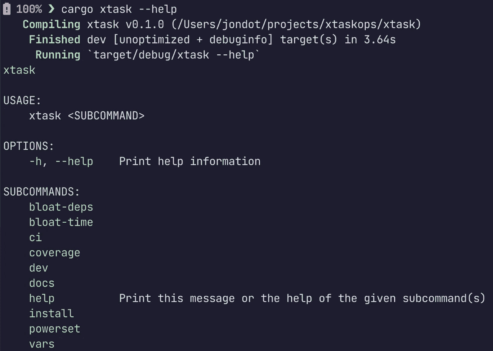

# 使用“xtask”和“xtaskops”运行 Rust 任务

> 原文：<https://betterprogramming.pub/running-rust-tasks-with-xtask-and-xtaskops-a2193e67dc25>

## 突击测验:你如何编写和运行你的日常任务？


如果你有一个中等规模的 React 项目，或者一个用 Go 或任何其他语言开发的项目，你可能会发现自己需要自己的构建、测试或 CI 任务。

例如，对于 Node.js 中的`npm`或`yarn`，您可以编写自己的`test:integration`任务，该任务只运行您的集成测试:

```
$ yarn test:integration
```

`test:integration`可能是任何一系列的 shell 命令，告诉您的测试运行程序要过滤什么。

有时，这些作业有依赖关系，所以您要以正确的方式对它们进行排序:

```
$ yarn clean && yarn build && yarn test:integration
```

然后，你把这些放进你的`package.json`文件:

```
"ci": "yarn clean && yarn build && yarn test:integration"
```

最终变成了:

```
$ yarn ci
```

对于`make`或者类似的工具，对于所有类型的任务，比如构建、lint、测试、覆盖、CI、发布，看起来都非常相似。

有时，您必须编写自己的“CI 工具”shell 脚本:

```
$ ./ci/build-dev.sh
```

# 我们如何在 Rust 项目中做到这一点？

通过向您的清单文件添加一些 shell 脚本(对于 Rust - `cargo.toml`)，实际上不可能像使用`yarn`或`npm`那样对 Cargo 执行特定的任务。

人们通常通过为特定需求调用定制的 shell 脚本来解决这个问题，或者通过使用(滥用？)`make`，类似围棋界是怎么做的。

有几个原因可以解释为什么我们要走这条简单的路线。它们是:

*   这很简单，只需命名任务并开始
*   我们都知道 shell 命令
*   运行顺序和故障模式也是从 shell 继承的
*   易于实验和迭代

# 工作流问题


尝试一个 shell 命令，并将其粘贴为一个`make`任务，这对于简单的情况非常有用。

但是，对于任何一个中等规模的项目，问问你自己这些问题:

*   如何给`make`提供自定义参数？(或`npm`任务)
*   给 shell 脚本提供参数怎么样？和标志或选项？还有违约？

答案是:你回到那个时候你所熟悉的任何 shell 脚本 voodoo。

提示用户输入更糟糕，以特定的顺序运行任务(解析任务图)留给您，手工编码顺序。

# 生产力问题


就像在“普通”软件中一样，为了提高工作效率，您需要:

*   做一些程序化的逻辑
*   重用您现有的代码库
*   导入其他人的库或任务
*   调试、推理或测试任务的能力

所有这些在`npm`或`make`或类似的工具中都是不可能的，而且这是一种创作 shell 脚本的痛苦体验。

# 有什么解决方案吗？


显然，对于这一挑战有几种解决方案。

## 声明性“线性”构建工具

有一些典型的工具是为“运行我的 shell 命令”而开发的，比如`yarn`、`make`等。

您可以使用您所知道的关于环境变量、shell 命令排序和逻辑(`&&`等)的一切，使用位置参数`$1, $2,`等。希望一切都好。

## 更智能的“制造”工具，半声明式

像`just`或`cargo-make`这样的工具是专门为解决与任务相关的痛苦而构建的，这是一件好事。

例如用`cargo-make`构建任务看起来像这样:

```
[tasks.A]
dependencies = ["B", "C"][tasks.B]
dependencies = ["D"][tasks.C]
dependencies = ["D2"][tasks.D]
script = "echo hello"[tasks.D2]
alias="D"
```

所以我们得到:

*   具有依赖性的任务优先工具、订单解决方案
*   参数和命名的便利性

但是，我们最终会受到在 shell 或我们使用的工具上运行命令的限制。

## 编程语言 DSL 工具

在这一类别中，您有一个库或一个基础结构，您可以自己构建任务。

您得到的只是一种以方便的方式运行完全支持编程语言的任务的方法，以及一些胶水。

Ruby 中的`[rake](https://github.com/ruby/rake)`就是一个很好的例子。它看起来像`make`，但是你用你的母语:Ruby 来构建你的所有任务。

在某个时间点，一个类似的解决方案(更像是一个指南)出现了:`[xtask](https://github.com/matklad/cargo-xtask)`。

# xtask



`xtask`是一个约定，一个项目成立的惯例。

如果您遵循设置步骤，您最终会得到一个`cargo xtask`命令和一个名为`xtask`的新 Rust 项目，您可以在其中构建所有的定制内容。

通常使用`xtask`意味着你习惯使用货物。

这也意味着你可以充分发挥 Rust 的潜力:导入库、重用项目逻辑、测试、lint 和安全地运行你的构建任务。

# 设置`xtask`

我们正试图从单机箱项目转移到多机箱工作空间，其中有两个成员:

```
[ your-project, xtask ]
```

如果你的项目名为`acme`，将你的代码移动到一个新的`acme/`内部文件夹。

然后，在您的项目中:

```
$ cargo new --bin xtask
```

设置您的工作空间(根`cargo.toml`):

```
[workspace]
members = [
  "acme",
  "xtask"
]
```

为`cargo`添加一个别名以了解`xtask`(在`.cargo/config`):

```
[alias]
xtask = "run --package xtask --"
```

就是这样。现在`xtask`项目由您来构建了。像对待任何其他应该执行构建任务的二进制文件一样对待它。

这就是你想要的:

*   轻松获取命令和参数
*   将命令路由到您轻松编写的任务
*   轻松创作任务

现在，还没有推荐的方法来轻松创作`xtask`任务。

这就是`xtaskops`诞生的原因。

# 使用 xtaskops

使用 [xtaskops](https://github.com/jondot/xtaskops) ，这是一个完全加载的`xtask`二进制文件，有比你需要的更多的任务。它或多或少适合单个屏幕:


通过使用`xtaskops`库，你可以免费获得 Rust 中的所有常见任务，然后还可以获得一些很酷的任务，比如`bloat-deps`(根据大小显示最大的依赖关系)和`powerset`(对功能组合进行测试)。

只需将它们连接到您选择的 CLI 框架(这里，我们使用的是`clap`)。

以下是今天在`xtaskops`中可用的一些任务:

*   显示发布版本中最大的板条箱
*   显示板条箱建造时间
*   开发人员运行货物检查，然后对每个文件更改进行货物测试
*   ci 连续运行典型的 CI 任务:fmt、clippy 和 tests
*   覆盖率运行覆盖率
*   单据在观察模式下运行货物单据
*   安装已安装货物工具
*   powerset 使用 powerset 功能执行配置项构建

要运行自己的命令，使用`cmd!`宏:

```
cmd!(your,command,here)
```

# 对每个项目使用`xtask`

您可以使用由`xtask`驱动的[生锈启动器](https://github.com/rusty-ferris-club/rust-starter)，而不是为每个项目反复手动设置`xtask`。

对于已经存在的项目，你可以复制`xtask`文件或者使用[背包](https://github.com/rusty-ferris-club/backpack)，这样可以很容易的抓取部分库。

当然，你可能想做一个你自己的启动项目:为你自己设置一次`xtask`，然后在你所有的工作中重复使用你的项目。然后使用[背包](https://github.com/rusty-ferris-club/backpack)从你的仓库地址开始每一个新项目。

# 结论

在添加另一个`make`任务或编写另一个定制 shell 构建脚本之前，请记住:

*   您的构建、ci、工作流、差事代码——仍然是维护的代码
*   不要低估使用 shell 命令的任务的维护开销
*   你的 shell voodoo 最好是没有 bug 的，经过测试和推理的
*   最好重用团队在知识、代码、标准和实践方面的投资
*   `make`可能很棘手，需要遗忘的知识(例如`.PHONY`)
*   package.json 任务通常需要额外的包(`rimraf`、`concurrently`)

你可以使用`xtask`来减轻所有这些痛苦，并编写更多的 Rust 代码。