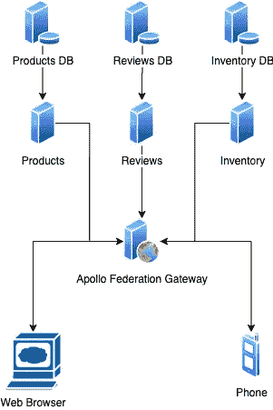

# 在引导 Docker 合成服务之前运行 SQL 迁移

> 原文：<https://betterprogramming.pub/running-sql-migrations-before-booting-docker-compose-services-a8909bf03cbc>

## 拥有丰富的本地开发经验对快乐工程师来说至关重要

图片来源:[像素上的 Andrea Piacquadio](https://www.pexels.com/photo/happy-ethnic-woman-sitting-at-table-with-laptop-3769021/)

开发人员乐于进入代码库，开始解决问题，而不是害怕拿起笔记本电脑。随着服务越来越多地被分成单独的“微服务”，新的问题出现了。当我回顾我短暂的职业生涯时，一个让我非常痛苦的问题是 SQL 迁移以及它们应该如何在 Docker Compose 中工作。理想情况下，它们应该在 web 应用程序启动之前运行，这样它们就可以访问结构良好的数据库。您实现这一目标的策略可能因环境而异。在本文中，我将介绍您的本地经验，这很容易扩展到 CI，我还将谈到如何在生产中做到这一点。

# 一点背景知识

当我们开始在堆栈中采用 [Apollo Federation](https://www.apollographql.com/blog/apollo-federation-f260cf525d21/) 时，我遇到了这个问题。一个网关服务位于我们的其他 [GraphQL](https://graphql.org/) 服务之前(它们有自己的数据库)。这个网关是客户端应用程序(图中的“Web 浏览器”)查询以获取数据的对象。对于开始使用网关 API 的客户端，每个依赖的服务都必须是启动的和健康的。

我们的服务图表

我的目标是以一种确定的方式启动整个服务集，让每个服务一直等待，直到其依赖的服务运行正常。在本文中，我将重点讨论数据库和迁移，但是这里的概念可以扩展到任何依赖于另一个服务的服务。

运行产品服务及其迁移的典型 Docker 合成文件如下所示:

这个设置有几个问题，主要集中在`depends_on`:

1.  当`postgres`开始运行时，`products-run-migrations`脚本将正确运行，而不是当它健康并准备好接受连接时。当迁移开始运行时，有 99%的可能性`postgres`容器不健康，导致迁移失败。
2.  与`products`服务的情况类似。当`products-run-migrations`开始运行时，它将正确运行。如果您在健康时查询`products`服务，很可能迁移还没有完成。

# 我们想要什么

这不是我们目前想要的。理想情况下，开发人员应该能够启动产品服务，当它运行正常时，知道迁移运行成功，并且可以查询它的 API。

这需要我做一些研究。

我发现`depends_on`有一个`conditions`参数，我可以用它来实现我们想要的实现。但接下来我发现事情出了岔子。

**我们需要降级我们的 Docker 撰写版本。**

事实证明，Docker Compose 3.x 版本的本意是[用于 Docker Swarm 和 Kubernetes 环境，在这些环境中，服务并不严格地相互依赖](https://github.com/peter-evans/docker-compose-healthcheck/issues/3)。这促进了服务独立运行的更具容错性的环境。

[我看到人们建议](https://peterevans.dev/posts/how-to-wait-for-container-x-before-starting-y/)的是切换到 Docker Compose 2.4，使用类似[wait-it](https://github.com/vishnubob/wait-for-it)的端口等待脚本。

我们的新 Docker Compose 2.4 文件:

一些新增内容:

1.  在`postgres`容器中增加了一个`healthcheck`。这使得像`products-run-migrations`这样的迁移脚本只有在数据库准备好接受连接时才能开始运行。
2.  我们将一个`entrypoint`和`condition`参数一起添加到我们的迁移映像中。这确保了不仅数据库在运行，而且端口正在返回 200 响应代码。
3.  向`products`服务定义中的两个`depends_on`添加了`condition`参数。

它并不完美，但比以前好得多。应用程序在启动前没有等待迁移完全完成的问题仍然存在。如果它们运行得相对较快，本地开发人员可能不会遇到问题。在 CI 中，我们可以完全控制环境，因此我们可以添加一个额外的命令来绕过这个问题。

# 仍然存在的问题

我没有提到的是我们的生产环境在 Docker Compose 方面是什么样的。我们决定维护 Docker 编写文件的两个版本，一个在 2.4，另一个在 3.7。这是因为我们想在未来轻松采用 Kubernetes。您可能会坚持使用其中的一个，但是为了获得更好的本地开发体验，我们决定始终使用 2.4 文件。