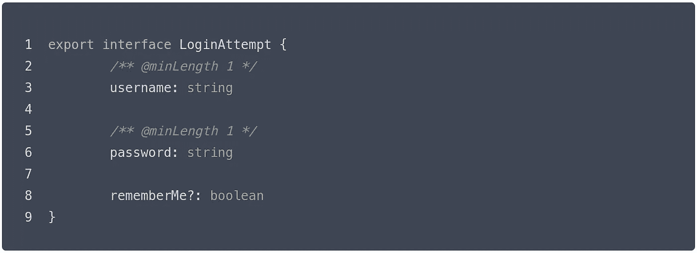
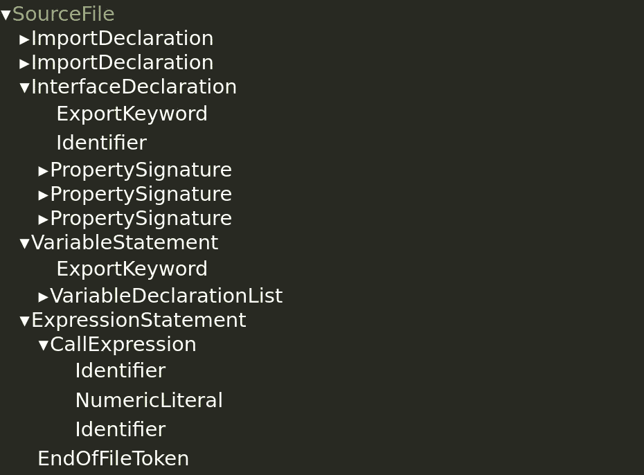

# 来自 TypeScript 接口的运行时数据验证

> 原文：<https://betterprogramming.pub/runtime-data-validation-from-typescript-interfaces-1001ad22e775>

## 我(ab)如何使用 TypeScript 编译器来启用使用 Zod 和 TypeScript 接口的透明运行时数据验证。



作者图片

在过去一年左右的时间里，我一直在(慢慢地)构建一个名为 [Extollo](https://extollo.garrettmills.dev/) 的基于 TypeScript 的 Node.js 框架。

Extollo 的设计目标之一是只向用户(即开发人员)展示 ES/TypeScript 的本地概念，以减少启动和运行框架所需的专门知识。

# 运行时模式:DSL 的瘟疫

我对当前 Node.js 框架场景最大的不满之一是，当涉及到模式定义时，几乎每个生态系统都必须重新发明轮子。因为 JavaScript 没有本地的运行时类型规范系统(至少不是一个好的系统)，所以如果您想对数据结构在运行时应该是什么样子的细节进行编码，您需要设计一个在运行时传递这些信息的系统。

例如，一个多产的 MongoDB ODM for Node.js，Mongoose，让用户能够在定义模型时指定集合中记录的模式。这里有一个来自[mongose 文档](https://mongoosejs.com/docs/guide.html#definition)的样本模式定义:

```
import mongoose from 'mongoose';
const { Schema } = mongoose;const blogSchema = new Schema({
  title:  String, // String is shorthand for {type: String}
  author: String,
  body:   String,
  comments: [{ body: String, date: Date }],
  date: { type: Date, default: Date.now },
  hidden: Boolean,
  meta: {
    votes: Number,
    favs:  Number
  }
});
```

我目前正在为 Extollo 构建请求验证系统。因为它必须处理带有动态输入的 web 请求，所以需要在运行时指定验证器接口，以便可以根据模式检查数据。为此，我使用了由科林·麦克唐奈编写的神奇的 [Zod 模式验证器库](https://github.com/colinhacks/zod)。

然而，Zod 和 Mongoose 一样，都是 JavaScript 运行时模式的基本问题的受害者。因为它的模式需要在运行时可用，所以您必须使用 Zod 的自定义模式构建器来定义您的接口。以下是可能来自登录页面的一些数据的模式示例:

```
import { z } from 'zod'export const LoginAttemptSchema = z.object({
	username: z.string().nonempty(),
	password: z.string().nonempty(),
	rememberMe: z.boolean().optional(),
})
```

这还不算太糟糕，但是它确实需要开发人员学习 Zod 的特定模式定义语言。我发现这特别烦人，因为 TypeScript 已经有了接口定义语言。在这种情况下，如果开发人员已经知道语言内置的系统，我想避免让他们学习一个等价的系统。

首先，让我们用 TypeScript 重写这个模式:

```
export interface LoginAttempt {
	/** @minLength 1 */
	username: string

	/** @minLength 1 */
	password: string

	rememberMe?: boolean
}
```

好吧，这是一个进步！我们可以使用 TypeScript 的本机类型语法来定义接口，并为任何不能本机表达的属性增加 JSDoc 注释。因此，要在 Zod 中使用它，我们需要将它从 TypeScript 语法转换为 Zod 语法。幸运的是，杨奇煜·伯纳德领导了优秀的 [ts-to-zod 项目](https://github.com/fabien0102/ts-to-zod)，该项目检查文件中定义的接口，并为它们输出等价的 zod 模式。

嗯（表示踌躇等）..所以现在用户可以用(大部分)本机 TypeScript 语法编写他们的模式定义，并且，通过一点助手工具，我们可以将它们转换成 Zod 格式，这样我们就可以在运行时使用它们。完美！嗯，差不多…

当我们想要在运行时实际上 *u* 阿瑟模式时，我们会遇到一个微妙的问题。让我们看一个例子:

```
import { Validator } from '@extollo/lib'
import { LoginAttempt } from '../types/LoginAttempt.ts'class LoginController {
	public function getValidator() {
		return new Validator<LoginAttempt>()
	}
}
```

这个类有一个方法，该方法返回一个新的验证器实例，并将 LoginAttempt 模式作为其类型参数。直观地说，这应该会产生一个验证器，在运行时根据 LoginAttempt 模式验证数据。让我们看看编译后的 JavaScript:

```
"use strict";
Object.defineProperty(exports, "__esModule", { value: true });
const Validator_1 = require("@extollo/lib").Validator;
class LoginController {
    getValidator() {
        return new Validator_1.Validator();
    }
}
```

哦哦。忽略样板噪声，我们看到我们漂亮的、类型参数化的验证器实例已经去掉了它的类型信息。为什么？TypeScript 是一个 [transpiler](https://devopedia.org/transpiler) 。因此，它获取类型脚本代码并输出与*等价的* JavaScript 代码。因为 JavaScript 在运行时没有类型的概念，所以 transpiler(在本例中是 tsc)将它们剥离出来。

所以现在我们有一个问题。我们已经通过只要求开发人员指定 TypeScript 类型来改进我们的用户界面，但是现在我们不能在运行时使用它们，因为 TypeScript 类型被去掉了。我们刚刚生成的 Zod 模式呢？你问得很明智。不幸的是，在接口和它引入的 Zod 模式之间没有映射，也没有简单的方法来创建这样的映射，因为它必须在编译时完成。

# 一个很深的兔子洞

通常，这是故事的结尾。您需要在接口和 Zod 模式之间建立某种映射(请记住，由于我们的 ts-to-zod 魔术，开发人员根本不知道这种映射的存在)来使验证器工作。在泛型 TypeScript 项目中，您必须有某种命名约定，或者以某种方式向用户公开模式来创建映射。

然而，Extollo 有一个独特的优势，我怀疑可以用来透明地解决这个问题:`[excc](https://code.garrettmills.dev/extollo/cc)`。Extollo 项目主要是类型脚本项目，但它们也包含其他文件，如视图、资产等，这些文件需要包含在外建的包中。为了标准化所有这些，Extollo 使用自己的名为`excc`的项目编译器进行构建。`excc`主要是围绕 tsc 的一个包装器，它做一些额外的预处理和后处理来处理上面的情况。

因为 Extollo 项目都在使用`excc`，这意味着我们可以在编译时进行任意处理。我怀疑有一种方法可以在接口和我们为运行时生成的模式之间创建映射。

# zod-定义接口

第一步是使用`ts-to-zod`将 TypeScript 接口转换成 Zod schemata。在`excc`中，这被实现为[一个预处理步骤](https://code.garrettmills.dev/Extollo/cc/src/branch/master/src/phases/ZodifyPhase.ts#L30)，它将 Zod 模式附加到。包含接口的 ts 文件。因此，经过处理的 LoginAttempt.ts 可能如下所示:

```
import { z } from "zod";export interface LoginAttempt {
	/** @minLength 1 */
	username: string

	/** @minLength 1 */
	password: string

	rememberMe?: boolean
}export const exZodifiedSchema = z.object({
	username: z.string().nonempty(),
	password: z.string().nonempty(),
	rememberMe: z.boolean().optional(),
});
```

这有一些缺点。也就是说，它假设每个文件只定义了一个接口。然而，Extollo 对模型、中间件、控制器和配置文件等其他概念强制执行这种约定，所以在这里做这样的假设是合适的。

这使我们更接近了，但是它仍然没有为运行时模式做映射。第一步是设计一些引用模式的方法，这样我们就可以很容易地修改使用相关接口的 TypeScript 代码。

我不喜欢我最初的系统，但是现在`excc`为它定义的每个接口生成一个唯一的 ID 号。然后，当它将 Zod 模式写入接口的文件中时，它添加代码以将其注册到[全局服务](https://code.garrettmills.dev/extollo/lib/src/branch/master/src/validation/ZodifyRegistrar.ts)，该服务在运行时将 ID 号映射到 Zod 模式。因此，上面的文件实际上会类似于:

```
import { z } from "zod";
import { registerZodifiedSchema } from "@extollo/lib";export interface LoginAttempt {
	/** @minLength 1 */
	username: string

	/** @minLength 1 */
	password: string

	rememberMe?: boolean
}/** @ex-zod-id 11@ */
export const exZodifiedSchema = z.object({
	username: z.string().nonempty(),
	password: z.string().nonempty(),
	rememberMe: z.boolean().optional(),
});
registerZodifiedSchema(11, exZodifiedSchema);
```

这可能看起来不多，但这是朝着我们的目标迈出的巨大的一步。现在，在编译时，我们有了接口到 id 的映射，在运行时，有了 id 到模式的映射。因此，我们可以使用编译时映射来修改所有引用该接口的地方，以便用该接口的模式 ID 来设置运行时参数。然后，在运行时，我们可以使用 ID 来查找模式。答对了。不，我们实际上是怎么做的…

# 争论 AST

现在我们有了映射，我们需要确保在代码中引用类型时进行查找。也就是说，在我们创建验证器<loginattempt>的任何地方，我们都应该为验证器实例上的 LoginAttempt 设置 Zod 模式的 ID。</loginattempt>

为此，我为 TypeScript 编写了几个转换器插件。现在，tsc 默认不支持插件。(你可能在某个项目的`tsconfig.json`里见过插件，但它们是编辑器语言服务器的[插件，而不是编译器。幸运的是，有一个很棒的开源包可以解决这个问题。Ron S .维护了一个名为](https://www.typescriptlang.org/tsconfig#plugins) [ts-patch](https://github.com/nonara/ts-patch) 的包，该包很恰当地为一个项目的`tsc`安装打补丁，以允许该项目指定编译器插件。

这些插件在 TypeScript 程序的抽象语法树上操作。如果你不熟悉 ast，它们基本上是编译器对你正在编译的程序的内部表示。它们是可以操作和优化的数据结构。当您安装一个插件时，它会被 AST 为您正在编译的 TypeScript 项目中的每个源文件重复调用。重要的是，插件可以替换 AST 中的任何节点，或者在文件中返回一个完全不同的节点，`tsc`将输出修改后的版本，而不是原来的版本。

# 首先，识别

第一个插件对项目中每个文件的整个 AST 进行操作。它的工作是遍历每个文件的 AST 和[寻找我们为其生成 Zod 模式的接口声明](https://code.garrettmills.dev/Extollo/cc/src/branch/master/src/transformer.ts#L92)。当它找到一个时，它解析出我们先前写入文件的 ID 号，并存储该 ID 号和 TypeScript 用来在内部标识接口的符号之间的映射。

因为我们是将 Zod 模式写入文件的人，所以我们可以知道它——以及向全局服务注册它的调用——是文件中的最后语句。因此，我们可以快速查找它们，并从注册调用中解析出 ID。

此时，扩充文件的类型脚本 AST 如下所示:



(顺便说一下，我使用 ts-ast-viewer web 应用程序生成了这个层次结构[。ts-ast-viewer 是由 David Sherret](https://ts-ast-viewer.com/#code/JYWwDg9gTgLgBAbzgLzgXzgMyhEcBEyEAJvgNwBQoksicUApgObADOMDUAWicJsA2IBlAMYALBiACG6LDjz4AAgwAeMCABsNEAPQbgAI3IUKqmvGAA7DlExSRDOABkILSwEEYHcPAQUAkDoAVEFwiiBWTgyWTDBicACMcEE6AQCurJyWUiAMAFxw7FBWTAEBwaHhkdGx8UkpAWBSrKwA7tDEBUUlZf6MuSAGnACyDAD8BQYQmgxSlhRoJhVhqgC0RMSrwMSJCYrJqWbQ8CIQluxwqjzEfALC4pIyALwoAHQQBgBWDCIwABR+fwZLI5fJvboxP4ASleljOkjAMAAntCADSNZptDoFZCvCFMaGw+E+FFQ9F9SSSIZQUY415TGZzQkQRHAM5SDRohZQyiMFjsTjXW6CUQSaR-BIJVGXFRC-gih7SHkUIA) 发起的一个项目，它允许您可视化和探索任何类型脚本程序的 ast。这对我理解这个项目的结构是非常宝贵的。)

通过递归遍历 AST，我们可以寻找 InterfaceDeclaration 节点。如果我们在文件中找到一个，我们可以检查文件的根，看看是否定义了一个名为`exZodifiedSchema`的标识符。如果是这样，我们获取文件中的最后一条语句(包含对`registerZodifiedSchema`的调用的 ExpressionStatement)并取出它的第一个参数，即 ID 号。

一旦这个转换器完成，我们就已经确定了生成 Zod 模式的所有接口，并创建了从接口到运行时所需 ID 号的映射。

# 然后，修改

第二个插件在第一个插件检查完项目中的所有文件后运行。这个插件的工作是[用一个](https://code.garrettmills.dev/Extollo/cc/src/branch/master/src/transformer.ts#L7)[life](https://developer.mozilla.org/en-US/docs/Glossary/IIFE)替换任何 NewExpression 节点，其中类型参数包含 Zod 化接口，life 将`__exZodifiedSchemata`属性设置为一个 ID 号数组，用于查找这些接口的模式。

也就是说，插件转换了这个:

```
new Validator<LoginAttempt>()
```

变成这样:

```
(() => {
	const vI = new Validator<LoginAttempt>();
	vI.__exZodifiedSchemata = [11];
	return vI;
})()
```

因为`NewExpression`是一个表达式，就像`CallExpression`一样，任何有`NewExpression`的地方都可以用这个`CallExpression`代替，用附加的逻辑包装它。

转换器能够查找与接口相关联的 ID 号，因为引用`new Validator<LoginAttempt>()`中接口的标识符与我们用第一个插件标识的 InterfaceDeclaration 具有相同的符号集。

这些符号是由 TypeScript 编译器中称为链接器的东西创建的，它解析所有的标识符声明，并将它们与这些标识符的使用相匹配，即使实际的变量在此过程中已经被重命名。因此，我们可以使用这些符号来匹配接口的使用和我们关心的接口的声明。

*这种*是最终让一切运转起来的神奇调味酱。该插件运行后，程序 TypeScript 完成编译，根据验证器实例化时指定的接口，将所有运行时类型映射链接到验证器实例。

# 结论

这是一个漫长的旅程，有点累，但最终的结果非常好。从开发人员的角度来看，他们可以这样输入:

```
const validator = new Validator<LoginAttempt>();
```

并且，在运行时，验证器实例将拥有一个 Zod 模式，并能够根据该模式解析数据。没有自定义模式定义语言，没有验证器/模式映射，什么都没有。对于开发人员来说，这只是纯粹的类型脚本，这是他们一直以来的目标。

这项功能的代码仍在开发中，我必须删除大量未使用的代码，清理我保留的代码，并可能重写其中的一部分，使其不那么…简单。但是，最终，我对这个“神奇”的特性非常满意，它有助于保持 Extollo 项目的原生类型和易于维护。

你可以在这里找到一个与这个帖子[相匹配的最小工作示例。](https://code.garrettmills.dev/garrettmills/blog-runtime-types)

> 这篇文章最初出现在我的博客上，[这里](https://garrettmills.dev/blog/2022/01/14/Runtime-Data-Validation-from-TypeScript-Interfaces/)。