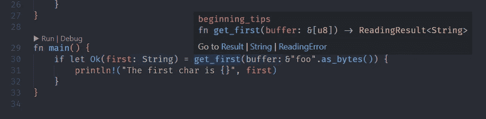

# 改进 Rust 代码的 6 条建议

> 原文：<https://betterprogramming.pub/rust-beginner-tips-8ecc2503517e>

## Rust 初学者提示

罗曼·辛克维奇·🇺🇦在 [Unsplash](https://unsplash.com?utm_source=medium&utm_medium=referral) 上拍摄的照片

这一次，我想发布一个非常简单的帖子，为刚接触 Rust 的人提供六个非常基本的提示和建议。

# 如果让

您可能已经用一个匹配的分支和一个空块编写了一些`match`,对剩下的选项不做任何事情。例如，当你得到`Some(foo)`、`Err(error)`或`Ok(bar)`时，才执行一个动作。对于那些病例，我们有`if let`。

如果 let 清晰并节省无用代码

# 为结果取别名以保存错误声明

这个选项带有个人偏好，但是如果您在同一个文件或模块中一遍又一遍地声明相同的结果，它会非常有用。正如你在`[std::io::Result](https://doc.rust-lang.org/stable/std/io/type.Result.html)`中看到的，它甚至用在了`std`库中。

为结果创建新的别名允许您使用“默认错误”

IDE 仍然会给我们一个返回错误的链接

# include_str！并且包含 _ 字节！

这两个宏对于一些项目非常有用，特别是在基于文本输入的原型或小程序的时候，比如代码 的 [**到来的挑战。**](https://adventofcode.com/)

它们的使用非常简单，它们读取指定路径中的文件，并在文件初始化时将内容保存在一个常量中。这将允许您不硬编码一些有问题的或大的字符串常量，您甚至可以将它们从版本控制中取出。

在我们的代码中，令牌被完美地加载为常量

# 使用 enumerate 获取集合索引

如果您来自其他语言，并且希望迭代一个集合并同时获取索引，那么您可能会默认编写一个 for 循环来迭代零和集合长度之间的数字，然后访问索引中的项。在 Rust 中你可以使用[枚举](https://doc.rust-lang.org/stable/std/iter/trait.Iterator.html#method.enumerate)。

`enumerate`是来自令人敬畏的**迭代器特征**的方法之一。在迭代器调用的末尾添加这个方法会将每个循环的内容变成一个包含索引和值的元组。

它更加清晰，我们甚至可以保存打印的参数(vec[i]不能在文字字符串中使用)

# 自己

Self 是一个强大的关键字，可以有自己完整的帖子，尤其是当你使用**定义特征**时，但是它最基本的用途是在你实现 structs 时作为一个好的推荐。

它将允许你用一个固定的词来引用块的所有者，例如，如果你决定重命名这个结构，这样可以节省你一些时间。

如果我把 Foo 改为 BetterName，我就不必修改第二个方法

# 阅读&[T]而不是&Vec

很多时候，我们必须实现读取元素集合的函数。在这些情况下，我们可以请求`&[T]`而不是借用的向量。这将为我们提供相同的功能(如果我们只是想读的话)和更多的灵活性。

同一功能处理更多类型和功能

今天到此为止。将来，我可能会制作第二版，增加一些额外的小技巧，比如块的使用或者一些有用的宏。在此之前，您可以一如既往地查看一下[范例库](https://github.com/kriogenia/medium/tree/main/beginning_tips/src)。

 [## 中等/开始 _ 主要克里金属的提示/中等

### 存放我在 Medium 帖子中使用的示例的存储库- medium/beginning_tips 位于 main kriogenia/medium

github.com](https://github.com/kriogenia/medium/tree/main/beginning_tips)