# 铁锈事件再探

> 原文：<https://betterprogramming.pub/rust-events-revisited-926486721e3f>

## 轻松编写 Rust 事件

照片由[J·斯科特·拉科齐](https://unsplash.com/@rockinrakozy?utm_source=medium&utm_medium=referral)在 [Unsplash](https://unsplash.com?utm_source=medium&utm_medium=referral) 上拍摄

最近写了[一篇关于 Rust](https://medium.com/better-programming/custom-events-in-rust-c4e534b6b8cb) 中写事件的文章。我必须承认，我对自己得出的解决方案并不完全满意。我之前的代码使用了一种笨拙的宏捕获模式来定义信号，并产生了不能像事件接收者应该做的那样容易地转换数据的接收者。

因此，我们必须为我们的每个接收器编写定制的转换——不太符合人体工程学。我决定我可以做得更好！我最终得出的结论是这样的:

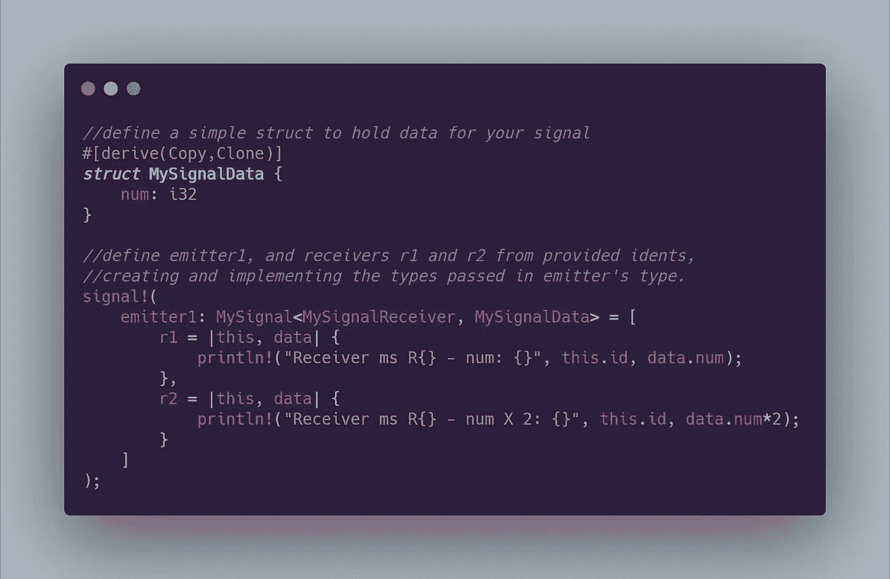

这样，我们既可以声明又可以使用发射器和接收器的变量，`emitter1`、`r1`和`r2`。我们可以使用任何名称作为我们的标识符。通过使用重复捕获，我们可以通过将它们与一个独特的闭包配对来拥有多个具有不同功能的接收器。

还要注意，您使用的类型并不一定存在——我们实际上是通过这个宏创建的。因此，当您声明`MySignal<MySignalReceiver, MySignalData>`时，即使这些标识符还不存在，也会通过宏扩展用提供的名称创建它们。

这个版本似乎更通用，更符合人体工程学。我也采纳了一些评论员的建议，改变了我的命名习惯，使之更具描述性。

我将从头到尾走一遍我的过程，这既是因为我已经更改了大量代码，也是因为新读者无需阅读我的另一篇 Rust events 文章就能更容易理解。此外，这篇文章包含了我认为是一个优秀的解决方案。

# 信号和接收器

最好将事件看作是一个*发射器*或*信号*(发送事件数据)和一个*接收器*(对信号发送的数据做一些事情)。我认为实现信号和接收器的最佳方式是使用 Rust 特性。一、`Receiver`特质:

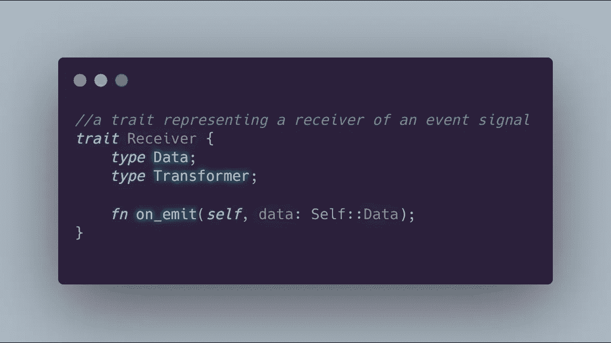

我决定利用特征`type`声明。`type Data`和`type Transformer`仅仅意味着在实现`Receiver`的结构中，你必须同时定义`Data`和`Transformer`类型。

`Receiver`也使用典型的函数定义——在这种情况下，`on_emit`是事件被触发时将被调用的函数。它利用了我们的`Self::Data`定义——我们定义的类型之一。我们实际上不需要`Receiver`的`Transformer`类型，但是我们*需要*稍后告诉`Signal`期望什么类型:

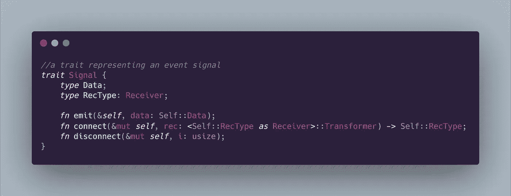

我们这里也发生了一些类似的事情。同样，我们使用类型声明，这次我们甚至添加了一个绑定到`RecType`的 trait，它告诉编译器只接受实现`Receiver`的项目。我们在`emit`中利用了我们的`Self::Data`类型声明。

然而，在`connect`中发生了一些古怪的事情。为了让我们能够稍后优雅地声明我们的接收者，我们需要指定期望什么类型的闭包。我们将把定义该类型的工作留给实现结构。最后，我们有`disconnect`，它用一个`usize`表示被断开的接收者的 ID。

# 又大又胖的宏

当我第一次决定如何让事件在 Rust 中工作时，我意识到实现这些特征需要反复使用相同的样板代码。因此，我决定最好的路线将是宏观的方式。

Rust 里的宏其实很棒。它们(粗略地)将类型安全、用户定义的令牌模式转换成 Rust 代码。作为输入，宏接受在宏调用中提供的令牌流本身。这是非常强大的，随着重复捕获，宏可以让你的生活变得更好。定义宏很简单:

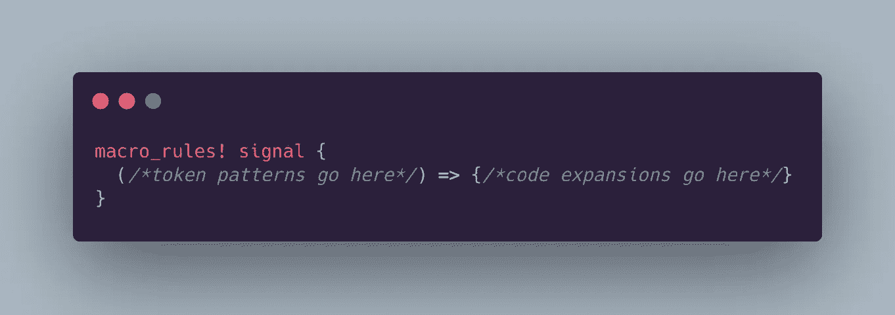

我们只需要一个匹配臂来实现我们庞大的宏:

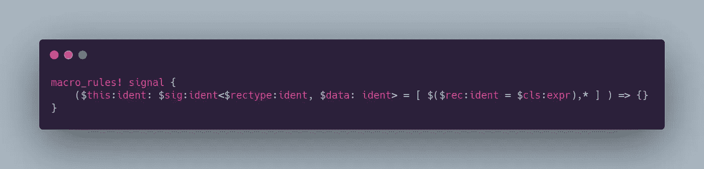

很拗口。为了更加清晰，回头看看第一张图片(关于我们的最终声明将会是什么样子),并与这张图片进行比较。我在这里定义的模式允许我们使用我在最初的例子中定义的语法来声明信号。让我们来分解一下:

*   首先，查看以`$`开头的模式的任何部分。这表示有俘虏。你可以用这些变量来表示展开的部分。捕获是键入的。看看`$this`变量。这是一个`ident`类型的捕获。这可以是任何有效的标识符(`type`、`struct`、`variable`或`trait`名称)。
*   接下来让我们看看这些符号。很难辨别，但是看第一个`ident`之后马上看。你会看到一个`:`。我决定使用一个`:`来分隔我们生成的信号实例的名称和它的类型，以保留某种预期的声明语法(sans `let mut`)。
*   `:`之后的下一部分是另一个捕获— `$sig`。又是一个`ident`。这是我们将用来命名我们生成的`Signal`结构的捕获。紧随`$sig`之后的是尖括号。这将让我们使用接下来的两个`ident`、`$rectype`和`$data`，就好像它们是我们的`Signal`类型的类型参数。这让我们在定义信号时有了熟悉的语法`MySignal<MySignalReceiver, MySignalData>`。还要注意，数据类型必须存在于宏之外。请确保您使用的数据类型已经存在，因为在扩展中不会为我们创建该参数。也可以使用大多数内置类型— `i32`、元组或任何`Copy + Clone`的结构。
*   宏的下一部分看起来像是使用`=`对方括号中的内容进行赋值。这仅仅意味着当我们调用宏时，在类型声明后面会有方括号。如果您没有给一个项目加上前缀`$`，它将被解释为应该出现在模式中的*文字字符*。在我们的括号内是`$(),+`中的一些截图。包围的`$(),+`意味着我们期望重复捕获被包围的模式，`,+`表示我们期望一次或多次逗号分隔的集合。
*   在重复捕获中，我们要寻找由`=`字符分隔的`$rec`、`ident`和`$cls`、`expr`。这样，看起来就像我们在做赋值(我们将在宏声明的末尾)。重复捕获中有一种新的捕获类型— `expr`。这将捕获任何有效的 Rust 表达式。在我们的情况下，我们期待一个结束。我们将把这个闭包封装在扩展中的函数指针中。

首先，Rust 宏捕获模式看起来有点难。但是不用担心——一旦你理解了语法和捕获类型，你马上就可以编写自己的宏了。因为您可以使用您喜欢的任何模式，所以您可以轻松地扩展 Rust 语法或编写特定于领域的脚本语言，所有这些都在宏中。

**注意:**我不是 100%确定 Rust 社区关于宏语法的政策，但是我希望我的`signal`定义没有违反太多规则！

# 过程生成和实现

现在我们已经了解了 match arm 中发生的事情，让我们开始扩展呼叫。我们希望我们的宏为我们创建结构来代表我们的`Signal`和`Receiver`实现者。让我们看看如何使用我们捕获的一些令牌来实现这一点:

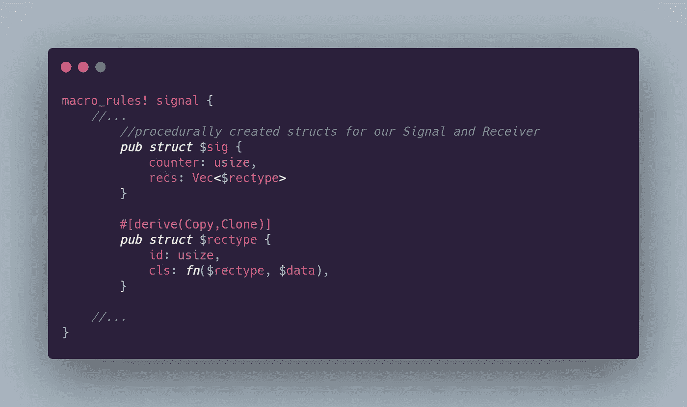

我们使用捕获的`$sig`标识符作为`Signal`实现结构的名称，使用`$rectype`标识符作为`Receiver`实现结构的名称。非常简单。

我们的信号总是需要一种方法来跟踪听众，所以我们使用程序生成的`$rectype`中的`Vec`。我们还需要为连接到信号的接收器生成 id，所以我们给`Signal`结构一个叫做`counter`的`usize`。

在我们的`$rectype`结构中，我们有一个相应的`id`、`usize`，用于在我们的信号上使用计数器值。`$rectype`还有一个保存函数指针的字段。我们可以再次使用捕获的变量来建立函数的签名。

在写这篇文章之前，我并不知道这一点，但是你显然可以将一个正确签名的闭包赋给一个匹配的函数指针。这样做最好的部分是函数指针总是相同大小的*并且*已经实现了`Copy + Clone`，允许我们程序定义的结构也实现`Copy + Clone`。

现在让我们开始实现我们的信号和接收器。让我们从在生成的结构上定义一些帮助器方法开始:

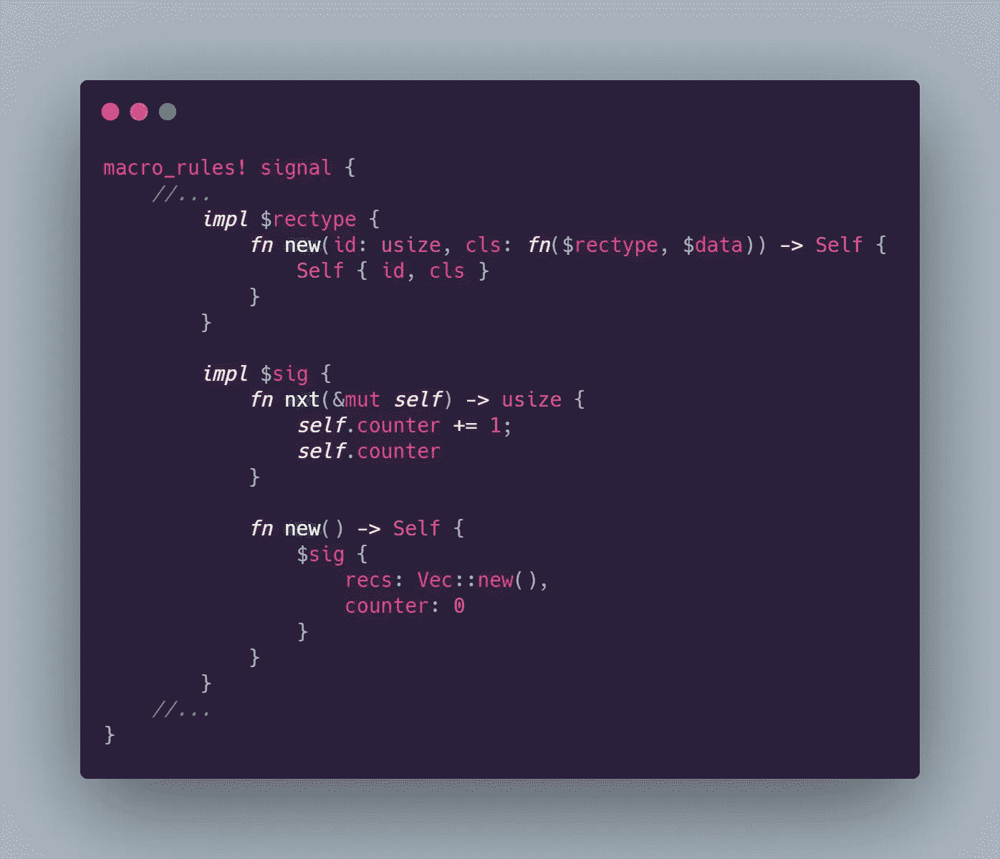

我们可以在这里充分利用捕获，使我们的实现相当通用。当它扩展时，我们可以在编译时显式地输入像函数指针`cls`这样的东西。我们给这两种类型一个惯用的`new`构造函数，我们的信号类型得到一个增量来分配接收者 id。

现在我们将为程序定义的结构实现`Signal`和`Receiver`。我们将从实现接收器开始:

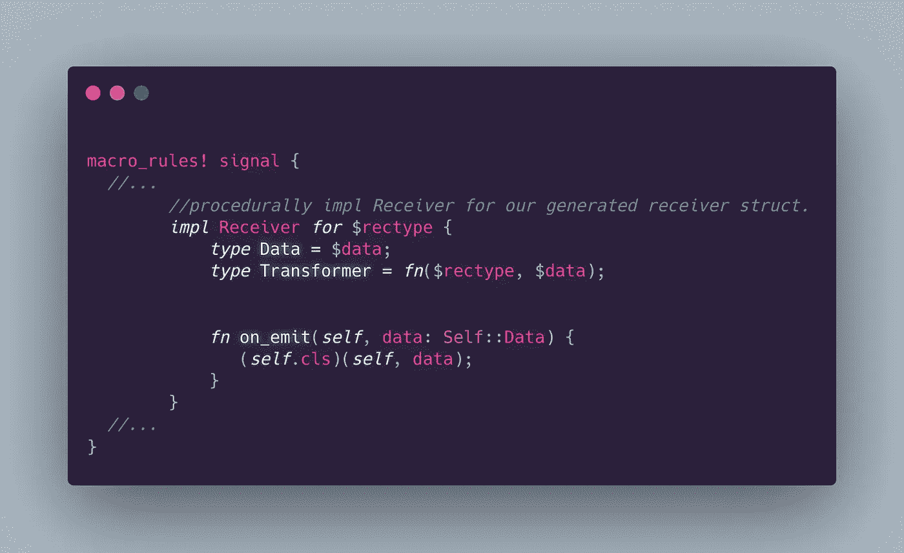

我们再次大量使用我们的捕获来定义所需的特征类型。数据不言自明。就像我之前提到的，我们将需要那个`Transformer`类型在以后用省略类型声明来声明我们的闭包。在`on_emit`中，我们简单地调用存储在函数指针末尾的函数。

实现`Signal`稍微复杂一点:

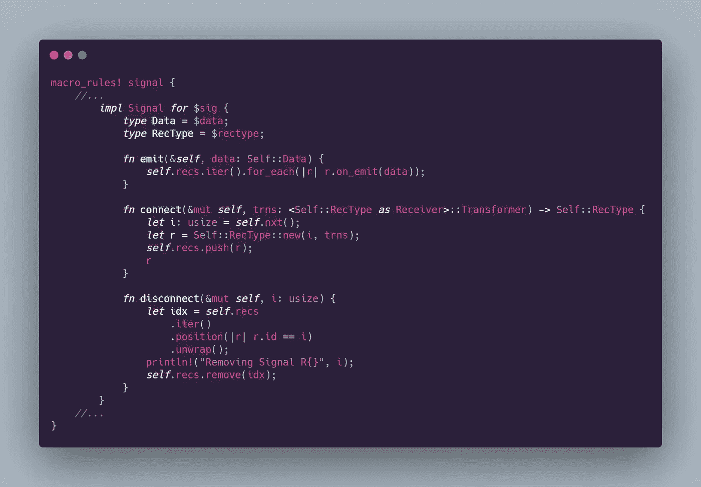

*   我们的类型声明任务是通过使用我们的`$data`和`$rectype`捕获来完成的。
*   `emit`的实现简单地迭代内部结构的`receivers`集合，并调用每个接收者的`on_emit`函数。
*   `connect`的实现必须使用相当冗长的类型转换(就像我们在定义`Signal`特征时必须做的那样),以向编译器澄清可能的类型歧义。但除此之外，事情很简单。我们递增并将信号的`counter`返回到变量`i`中。然后，我们使用提供的`i`和`trns`值创建一个新的接收器，并将其推入我们信号的`Vec`。我们返回我们的接收器，`r`，所以我们可以使用它作为宏扩展的结果。
*   `disconnect`使用迭代器的`position`函数来查找相关条目的索引。在这种情况下，我通过它的`id`字段来识别匹配。这返回一个选项，所以我们`unwrap`它知道 ID 存在，因为我们在构造接收器时分配了 ID。我们现在可以在信号接收器的`Vec`的`remove`方法中使用这个变量`idx`。

# 重复捕获

当我们定义宏的模式时，我们在一些方括号中放置了一个重复的捕获。这为我们提供了两个功能:

*   我们可以定义我们的接收器，就好像它们是在一个未确定大小的数组中声明的一样(也称为 JavaScript 风格)。
*   我们可以展开我们的重复捕获来实际定义我们传递给宏的重复部分的`ident`,所以我们的`ident`不仅仅是占位符——它们是扩展结束时真正定义的标识符。

为了将我们的捕获用于重复扩展，我们使用了与定义重复捕获基本相同的语法。

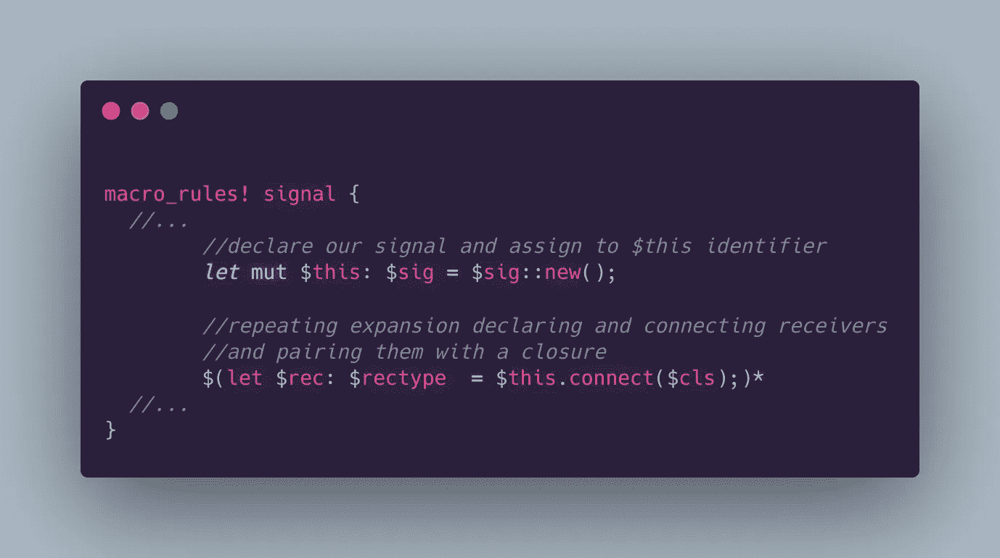

首先，我们声明我们的信号，使用`$this`标识符作为信号实例的名称。然后，我们用`$()*`语法打开我们的重复展开。我们告诉编译器为每个捕获提供这行代码，它定义了一个变量，其名称与当前的`$rec`值相关联，作为我们信号的连接接收器。

通过在这里提供它的类型作为`$rectype`，由于我们的`Transformer`关联类型，我们可以省略闭包中的类型声明。

最后，我们几乎准备好测试它了。现在让我们通过定义一个愚蠢的结构来展示如何使用任何`Copy + Clone`结构作为信号的数据类型:

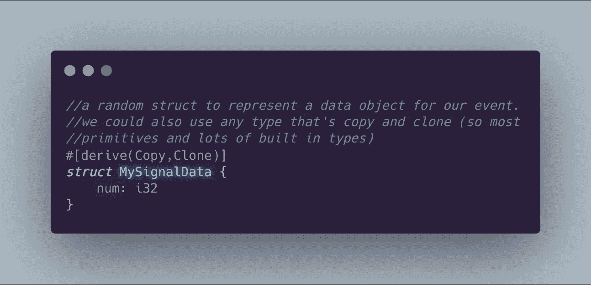

显然，这可以通过一个`i32`来完成。但这只是证明我们能做到的问题。这是一个简单的连接、发射和断开功能测试的证明。它还展示了我们如何用一个原语替换我们的结构，以获得更简单的`Signal`定义。

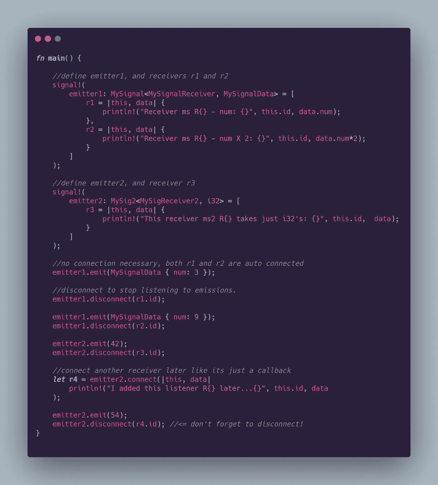

这里可以玩[。](https://play.rust-lang.org/?version=stable&mode=debug&edition=2018&gist=9c50fba4ea6e443387c7079afbcdb376)

# 铁锈很聪明

我们现在可以用我们的`signal!`宏和一点即兴的语法相当容易地定义信号和接收器。我们可以用各种方式将事件连接起来。因为我们的实现使用简单的结构和闭包，所以我们甚至可以通过向`Signal::connect`函数传递一个带有预期签名的闭包来添加新的接收者。

我们甚至不必关心我们生成的类型，因为`connect`从提供的闭包构建实例。编译器对我们的扩展非常聪明，当我们没有使用我们的接收器变量时，它甚至会警告我们(意味着你从来没有断开它们！)或者当我们未能将 connect 的结果赋给一个变量时(意味着我们没有将一个接收器标记化以在后面的`disconnect`中使用)。Rust 就是那样聪明。

这结束了大树中的另一个节点，那就是我的生锈之旅。直到我的下一次冒险，FP on，读者们！