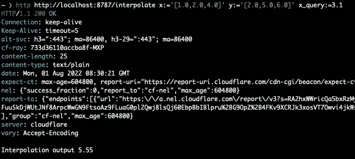

# 创建无服务器的 Rust 功能以获得快速体验

> 原文：<https://betterprogramming.pub/rust-for-the-fastest-serverless-experience-80530acdd4d4>

## WASM 再次施展魔法


瑞安·贝克在 [Unsplash](https://unsplash.com?utm_source=medium&utm_medium=referral) 上的照片

我发现无服务器令人惊叹:开发的速度、多功能性和简易性令人难以置信。如果你读了我关于部署你的第一个 JS 无服务器 worker 的最新故事，你已经知道我正在使用 Cloudflare workers 作为我的画布来构建我想要通过 URL 访问的函数和 API。

Cloudflare workers 在 chrome V8 隔离中运行，这些隔离在 Cloudflare 的全球网络中找到它们的运行时，这意味着您的无服务器功能在支持和运行其他隔离的运行时中安全运行(在这里，您会发现 Cloudflare workers 的效率)。

从标题和副标题就能猜到，CF 工人原生支持 Rust，这要感谢 WebAssembly。这项技术允许在浏览器上执行 C 和 Rust 等语言(请记住，工作人员是在 chrome V8 运行时上运行的)，从而为 Cloudflare 开发团队提供了一个环境，让他们的工作人员使用 Rust 进行编写，并享受该语言的安全性和效率(在速度和开发工作方面)。

现在让我们来看看如何使用 Rust 创建我们的第一个无服务器函数，并像使用 JS 一样部署它(我建议也阅读struct InterpData {
x: Vec<f64>,
y: Vec<f64>,
x_query: f64
}

接下来，我们为`InterpData`结构编写线性插值方法，从`x_query`和提供的向量开始提取 *y* :

在这里，我们简单地匹配哪些`*x*`索引可以找到我们的`query_x`(在这个函数中是`n`)，然后将匹配变量赋给它。接下来，我们根据 lerp 公式计算`*y*`。

最后，我们向路由器添加一个 post 路由。代码如下:

在第 4 行中，我们将 JSON 请求主体作为一个字符串，并在第 5 行中将其序列化(如果主体和`InterpData`结构之间存在名称类型不匹配，那么 worker 将返回，这就是错误)。最后，我们使用`interpolate_extract`方法计算我们的`*y*` 坐标，并在第 11 行将其作为响应返回。

# 把所有的放在一起

结果是您的`lib.rs`文件中的以下代码:

我们测试一下，再运行一次`wrangler dev`。我们希望验证`/interpolate`端点是否按预期工作。我将使用 httpie，如下所示:

```
http http://localhost:8787/interpolate x:='[1.0,2.0,4.0]' y:='[2.0,5.0,6.0]' x_query:=3.1
```

上述命令与使用以下主体向`[http://localhost:8787/interpolate](http://localhost:8787/interpolate)`端点发出 post 请求相同:

```
{
  "x":[1.0, 2.0, 4.0],
  "y":[2.0, 5.0, 6.0],
  "x_query":3.1
}
```



# 发布您的员工

要发布员工，请执行以下操作:

1.  用牧马人登录 cloud flare:`wrangler login`
2.  发布工人:在工人的根目录下，`wrangler publish.`

现在，您可以从提供的 worker URL 使用这个端点。

正如我之前提到的，由于 WebAssembly，用 Rust 编写 Cloudflare workers 成为可能。这确保了用 Rust 编写的工人很可能总是比他们的 JavaScript 对手更快。此外，感谢编译器，您将能够编写 workers，而不用担心类型和内存安全。随着您对 Rust 越来越熟悉，这将使开发变得更加容易。

如果你想知道更多关于铁锈和 WASM 的事情，你可以[阅读这篇文章](/get-started-with-wasm-in-rust-2347056bab4)。

感谢阅读！