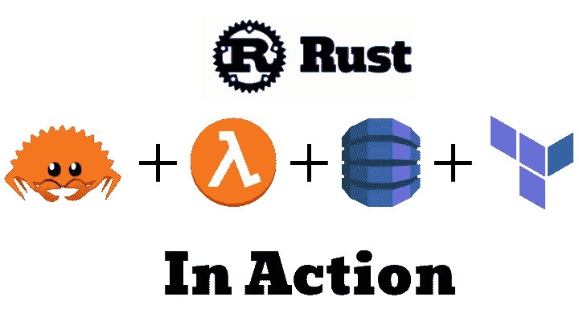
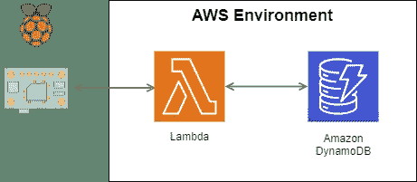
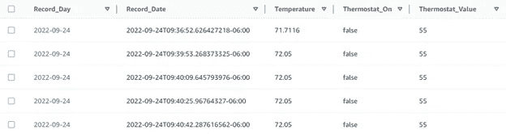
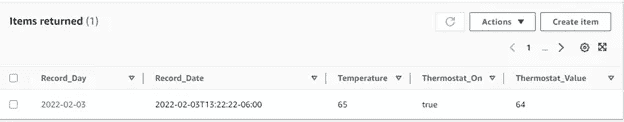

# Rust、Lambda 和 DynamoDB

> 原文：<https://betterprogramming.pub/rust-lambda-and-dynamodb-bea841d47cca>

## Rust 中 AWS Lambda 函数的实现，它写入 DynamoDB。所有这些都是通过 Terraform 部署的，还有一个 Rust HTTP 客户端！



生锈在起作用

作为我学习 Rust 开发的旅程的一部分，我开发了一个托管在 AWS 上的 Lambda 服务，该服务写入 DynamoDB 数据库和一个相关的 Rust HTTP 客户端。除了 Rust，我还使用 Terraform 来管理 AWS 资源的部署。本文是我在运行于 Raspberry Pi 上的无线恒温器应用程序上写的第四篇文章。你可以在这里找到其他的: [Raspberry Pi 无线恒温器——在 Rust 中](https://medium.com/@mikehentges65/raspberry-pi-wireless-thermostat-in-rust-45a5d35196cf) , [Rust 交叉编译变得容易](https://medium.com/@mikehentges65/rust-cross-compiling-made-easy-e30fcb233fef)，以及[在 Rust 中实现多线程共享内存](/easy-multi-threaded-shared-memory-in-rust-57344e9e8b97)。所有源代码都可以在[我的 GitHub 库](https://github.com/mikehentges/thermostat-pi)获得。

我们将在本文中讨论以下内容:

1.  将一个 JSON API 定义为两个相关项目共享的一个单独的机箱。
2.  使用 AWS Rust SDK 在 Rust 中编写一个 AWS Lambda 函数，该函数接受一个带有 JSON 有效负载数据的 HTTP POST，并将数据写入 DynamoDB 数据库。
3.  使用 Terraform 来定义和构建数据库、lambda 函数以及将所有部分组合在一起所需的权限胶水。
4.  使用 AWS CLI 部署 Lambda 应用程序可执行更新。
5.  编写一个 Rust HTTP 客户端，将数据发送给我们的 Lambda 函数。

我假设您的系统上安装了 [AWS CLI](https://aws.amazon.com/cli/) 、 [Terraform](https://www.terraform.io/) 和 [Rust](https://www.rust-lang.org/) ，并且您的 AWS 帐户已经设置好并连接到 CLI。这有点麻烦，但是在每个系统的文档中很容易理解。

我的应用程序的用例是跟踪我的 Raspberry Pi 恒温器应用程序的状态并记录历史。在 Raspberry Pi 上运行的 Rust 应用程序会将信息推送到云数据库。利用云数据库中的活动数据，可以通过检查数据来监控应用程序的健康状况，从而避免打开防火墙让外部观察者进入。我还获得了一个历史数据源，稍后我可以在 UI 上绘制它。

我选择了 AWS 上的 [DynamoDB 作为数据库平台。我的数据需求很容易放入 DynamoDB 的免费层，DynamoDB 是推送物联网时间序列数据的有效位置。我没有将 Pi 应用程序直接连接到 Dynamo 数据库，而是选择了一个基于 HTTP 的服务层作为 Raspberry PI 和 AWS 之间的接口。我发现 HTTP 服务比直接的数据库连接更有弹性——HTTP 的无状态特性使它能够在网络中断时自我纠正。将数据推送到数据库对于 Lambda 函数来说是一项出色的工作——随着 AWS 最近发布 Rust SDK，我利用这个机会将 Lambda 函数构建成一个 Rust 应用程序。下面这张图片展示了我们将要研究的各个部分是如何组合在一起的:](https://aws.amazon.com/dynamodb/)



我们的建筑

该应用程序有三个主要部分。首先，主应用程序是 thermostat_pi，它是创建我们移动到数据库的数据的客户机。这个项目下是 Lambda 函数项目，名为 push_temp。最后，temp_data 项目包含数据传输 API 的定义。这三个项目都在 GitHub 上的`thermostat_pi`应用程序下。

在`temp_data`中，我从 Rust struct 开始，它保存了恒温器应用程序的数据，并启用了 JSON 表示的`serde`:

```
//temp-data/src/lib.rs
use serde::Deserialize;
use serde::Serialize;

#[derive(Debug, Serialize, Deserialize)]
pub struct TempData {
 pub record_date: String,
 pub thermostat_on: bool,
 pub temperature: f32,
 pub thermostat_value: u16,
}
```

我在一个单独的 Rust crate 中创建了它，以便它可以与 Pi 应用程序和 lambda 函数项目共享——确保两者始终同步。`temp-data Cargo.toml`看起来是这样的:

```
[package]
name = "temp-data"
version = "0.1.0"
edition = "2021"
license = "MIT"

[dependencies]
serde = {version = "1", features = ["derive"]}
```

然后我定义了一个相应的 DynamoDB 数据库来保存这些信息。我为时序数据选择了一个分区键“day ”,这样就可以检索一天的数据，而不用扫描整个表。我还为日期/时间创建了一个排序关键字。当我想设置一个警报或绘制历史数据时，这个键结构将允许对数据进行有效的读取访问。我没有太多使用 DynamoDB 的经验，所以可能有更有效的方法来解决这个问题——但是我已经有了适合我的方法。下面是我们完成后 DynamoDB 表的样子:



迪纳摩中的样本数据

`Record_Day`和`Record_Date`键是 DynamoDB 的字符串。`Record_Date`格式是 RFC3339，Rust 标准时间包支持。它创建一个字符串，该字符串可以通过字母排序正确地对时间值进行排序。

接下来，我们构建 lambda 函数来接收传入的请求，并将其存储在 DynamoDB 表中。我的主项目的`push-temp`目录(GitHub 链接)就是它所在的地方。推送温度`Cargo.toml`包含这些条目:

```
[package]
name = "push_temp"
version = "0.1.0"
edition = "2021"
license = "MIT OR Apache-2.0"

[dependencies]
aws-config = "0.51.0"
aws-sdk-dynamodb = "0.21.0"
log = "0.4.14"
serde = {version = "1", features = ["derive"]}
tokio = "1.16.1"
tracing-subscriber = { version = "0.3", features = ["env-filter"] }
lambda_http = "0.7"
serde_json = "1.0.78"

# Our package that defines the struct of the incoming request
temp-data = { path="../temp-data" }
```

我们正在使用 [AWS SDK 来处理 Rust](https://docs.aws.amazon.com/sdk-for-rust/) 。我将 lambda 函数的所有 Rust 代码放在 main.rs 文件中。首先，有一些样板文件来导入我们的消息结构，定义我们的响应类型，并设置 Lambda 环境:

```
//push-temp/src/main.rs
use aws_sdk_dynamodb::model::AttributeValue;
use aws_sdk_dynamodb::Client;
use lambda_http::{lambda_runtime::Error, service_fn, IntoResponse, Request};

extern crate temp_data;
use temp_data::TempData;

use log::{debug, error};
use serde::Serialize;

#[derive(Debug, Serialize)]
struct SuccessResponse {
 pub body: String,
}

#[derive(Debug, Serialize)]
struct FailureResponse {
 pub body: String,
}

// Implement Display for the Failure response so that we can then implement Error.
impl std::fmt::Display for FailureResponse {
 fn fmt(&self, f: &mut std::fmt::Formatter<'_>) -> std::fmt::Result {
 write!(f, "{}", self.body)
 }
}

impl std::error::Error for FailureResponse {}
```

`main()`函数为输入事件注册一个事件处理程序；我们的处理函数被命名为`my_handler`:

```
//push-temp/src/main.rs (continued)
#[tokio::main]
async fn main() -> Result<(), Error> {
 tracing_subscriber::fmt::init();
 debug!("logger has been set up");
 lambda_http::run(service_fn(my_handler)).await?;
 Ok(())
}
```

我们的`my_handler()`函数将在传入请求到达时运行。我们的`my_handler()`函数需要做几件事。首先，它从请求中获取传入的 JSON，并将其解析为我们的结构`request_struct`。注意，如果 JSON 解析失败，此时会返回一个错误值。

```
//push-temp/src/main.rs (continued)
async fn my_handler(request: Request) -> Result<impl IntoResponse, Error> {
  debug!("handling a request, Request is: {:?}", request);
  let request_json = match request.body() {
    lambda_http::Body::Text(json_string) => json_string,
    _ => "",
  };
  debug!("Request JSON is : {:?}", request_json);
  let request_struct: TempData = serde_json::from_str(request_json)?;
```

接下来，我们需要将这个结构推到 DynamoDB 表中。我选择将每个数据元素分离到它自己的 DynamoDB 属性中，而不是直接存储 JSON。我们做了一些小的数据格式化，将日期作为一个单独的属性提取出来，用作我们的分区键。其余的结构值转换成 Dynamo DB API 的属性值。我们的错误处理对最终用户隐藏了特定于 DynamoDB 的错误消息，作为一个实现细节。

```
//push-temp/src/main.rs (continued)

// set up as a DynamoDB client
let config = aws_config::load_from_env().await;
let client = Client::new(&config);

// build the values that are stored in the DB
let record_date_av = AttributeValue::S(request_struct.record_date.clone());
let thermostat_on_av = AttributeValue::S(request_struct.thermostat_on.to_string());
let temperature_av = AttributeValue::N(request_struct.temperature.to_string());
let thermostat_value_av = AttributeValue::N(request_struct.thermostat_value.to_string());
let record_day_av: AttributeValue = AttributeValue::S(request_struct.record_date[..10].to_string());

// Store our data in the DB
let _resp = client
  .put_item()
  .table_name("Shop_Thermostat")
  .item("Record_Day", record_day_av)
  .item("Record_Date", record_date_av)
  .item("Thermostat_On", thermostat_on_av)
  .item("Temperature", temperature_av)
  .item("Thermostat_Value", thermostat_value_av)
  .send()
  .await
  .map_err(|err| {
    error!("failed to put item in Shop_Thermostat, error: {}", err);
    FailureResponse {
      body: "The lambda encountered an error and your message was not saved".to_owned(),
    }
  })?;
debug! {
 "Successfully stored item {:?}", &request_struct
 }
Ok("the lambda was successful".to_string())
}
```

为了将我们的自定义 Lambda 函数部署到 AWS，我们需要创建一个名为“bootstrap”的可执行文件。我们需要 Rust 通过交叉编译到 x86_64-unknown-linux-musl 目标来构建我们的可执行文件——这是 Lambda 运行时所需要的。我喜欢使用[和](https://github.com/casey/just)作为命令运行器，并为构建创建了一个简单的`justfile`，它运行我们需要的两个命令，以在本地目录中生成名为“bootstrap”的可执行文件。我使用 [cross 工具](https://github.com/cross-rs/cross) (cargo install cross)，它为交叉编译环境下拉一个 Docker 容器。如果您不想使用本地 docker 容器， [AWS SDK](https://docs.aws.amazon.com/sdk-for-rust/latest/dg/lambda.html) 记录了 cross 的替代方法。最后，我们将生成的可执行文件复制到神奇的文件名“bootstrap”中，并将其存储在我们的项目根目录中。

```
#push-temp/justfile
build: 
 cross build - release - target x86_64-unknown-linux-musl
 cp target/x86_64-unknown-linux-musl/release/push_temp bootstrap
```

我们可以通过压缩引导文件并通过 AWS web 界面上传来手动部署我们的 Lambda 函数。但是 AWS 的其他部分需要绕过 Lambda 函数才能正常工作。我们需要为 Lambda 函数设置将数据插入 DynamoDB 表的权限，以及执行 Lambda 函数本身的权限。

最近，AWS 发布了一种创建 [Lambda 函数 URL](https://docs.aws.amazon.com/lambda/latest/dg/lambda-urls.html) 的方法——一个直接连接到 Lambda 函数的 HTTPS 端点。对于像我们这样的简单用例，Lambda 函数 URL 允许更简单的设置，并避免了创建 API 网关端点。如果 API 网关端点对您来说很重要，我建议您阅读[这篇文章](https://medium.com/aws-tip/crud-operations-with-rust-on-aws-lambda-part-2-bd1feae2554b)，其中包括所需的额外步骤。我的方法是上述方法的简化版本。

我们可以使用 AWS 控制台来创建我们的 Lambda 函数、函数 URL 和 dynamo db——但是它不太具有可重复性。相反，让我们使用 Terraform 来定义我们需要的可重复过程的各个部分。它也给了我们一个干净的方法，当我们想删除所有东西的时候。我将 Terraform 配置分成一组文件，用于我们部署的每个部分，所有文件都位于`push_temp`机箱的根目录下。首先，`variables.tf`文件将定义我们需要的几个共享值:

```
#push-temp/variables.tf

# Input variable definitions, adjust for your needs
variable "aws_region" {
  description = "AWS region for all resources."
  type = string
  default = "us-east-2"
}

variable "push_temp_bin_path" {
  description = "The binary path for the lambda."
  type = string
  default = "./bootstrap"
}
```

然后，一个`main.tf`文件建立了我们的环境:

```
#push-temp/main.tf

terraform {
  required_providers {
    aws = {
      source = "hashicorp/aws"
      version = "~> 4.0"
    }
    archive = {
      source = "hashicorp/archive"
      version = "~> 2.2.0"
    }
  }

  required_version = "~> 1.0"
}

provider "aws" {
  region = var.aws_region
}

data "aws_caller_identity" "current" {}
```

现在，我们可以设置需要部署的每个资源。首先，我们创建 DynamoDB 表。注意，我们将使用的两列定义为键，其余的在我们插入数据时动态创建。我们的键是字符串，所以我们使用 type = "S "来定义它们。我们以尽可能低的资源使用率初始化该表，因为我们有一个小的 Raspberry Pi 向我们发送数据。

```
#push-temp/dynamo.tf

# aws_dynamodb_table.shop-thermostat-table:
resource "aws_dynamodb_table" "shop-thermostat-table" {
  hash_key = "Record_Day"
  name = "Shop_Thermostat"
  range_key = "Record_Date"
  billing_mode = "PAY_PER_REQUEST"
  read_capacity = 0
  write_capacity = 0

  attribute {
    name = "Record_Day"
    type = "S"
  }

  attribute {
    name = "Record_Date"
    type = "S"
  }
}
```

接下来，我们可以定义我们的 lambda 函数。我们需要提供。我们的可执行文件到 Terraform 的 zip 文件，用于设置 Lambda 函数的初始部署。我不想使用 Terraform 在每次应用程序更改时部署我们的可执行文件——terra form 不是 CI/CD 工具。但是我们需要一些东西来创造这个功能。因此，在成功创建所有资源之后，我们将使用不同的方法来部署应用程序更新。

我们还设置了一个 Lambda 函数 URL 作为公共可达端点。

```
#push-temp/lambdas.tf

# Here we grab the compiled executable and use the archive_file package
# to convert it into the .zip file we need.
data "archive_file" "push_temp_lambda_archive" {
  type = "zip"
  source_file = var.push_temp_bin_path
  output_path = "bootstrap.zip"
}

# Here we set up an IAM role for our Lambda function
resource "aws_iam_role" "push_temp_lambda_execution_role" {
  assume_role_policy = <<EOF
  {
    "Version": "2012–10–17",
    "Statement": [
    {
      "Action": "sts:AssumeRole",
      "Principal": {
        "Service": "lambda.amazonaws.com"
      },
      "Effect": "Allow",
      "Sid": ""
    }
  ]
}
EOF
}

# Here we attach a permission to execute a lambda function to our role
resource "aws_iam_role_policy_attachment" "push_temp_lambda_execution_policy" {
  role = aws_iam_role.push_temp_lambda_execution_role.name
  policy_arn = "arn:aws:iam::aws:policy/service-role/AWSLambdaBasicExecutionRole"
}

# Here is the definition of our lambda function 
resource "aws_lambda_function" "push_temp_lambda" {
  function_name = "PushTemp"
  source_code_hash = data.archive_file.push_temp_lambda_archive.output_base64sha256
  filename = data.archive_file.push_temp_lambda_archive.output_path
  handler = "func"
  runtime = "provided"

  # here we enable debug logging for our Rust run-time environment. We would change
  # this to something less verbose for production.
 environment {
   variables = {
     "RUST_LOG" = "debug"
   }
 }

 #This attaches the role defined above to this lambda function
 role = aws_iam_role.push_temp_lambda_execution_role.arn
}

// Add lambda -> DynamoDB policies to the lambda execution role
resource "aws_iam_role_policy" "write_db_policy" {
  name = "lambda_write_db_policy"
  role = aws_iam_role.push_temp_lambda_execution_role.name
  policy = <<EOF
{
  "Version": "2012–10–17",
  "Statement": [
   {
     "Sid": "",
     "Action": [
       "dynamodb:PutItem"
     ],
     "Effect": "Allow",
     "Resource": "arn:aws:dynamodb: :${var.aws_region}::${data.aws_caller_identity.current.account_id}:table/Shop_Thermostat"
   }
 ]
}
EOF
}

// The Lambda Function URL that allows direct access to our function
resource "aws_lambda_function_url" "push_temp_function" {
   function_name = aws_lambda_function.push_temp_lambda.function_name
   authorization_type = "NONE"
}
```

最后，我们创建一个输出文件，这样我们就可以获得调用函数的 API 端点:

```
#push-temp/output.tf

# Output value definitions
output "invoke_url" {
  value = aws_lambda_function_url.push_temp_function.function_url
}
```

咻，都做完了！一个“terraform init & terraform apply”将创建所有的东西，上传我们新编译的函数，并为测试做好准备！

我们可以通过 curl 调用外部端点，用 terraform 在 apply 上输出的值替换下面的<endpoint>。</endpoint>

```
curl -X POST https://<endpoint>.lambda-url.us-east-2.on.aws/ \
-H 'Content-Type: application/json' \
-d '{"record_date":"2022–02–03T13:22:22","thermostat_on":true,"temperature":"65","thermostat_value":"64"}'
```

您可以使用 DynamoDB 控制台查看数据库中的新记录:



为了在初始部署后对代码进行应用程序更新，我在 justfile 中为部署更新的应用程序所需的命令创建了一个部署目标。这些命令依赖于为 Lambda 函数所在的相同区域安装和配置的 AWS CLI。

```
#push-temp/justfile (continued)
deploy: build
  cp target/x86_64-unknown-linux-musl/release/push_temp bootstrap
  zip bootstrap.zip bootstrap
  aws lambda update-function-code - function-name PushTemp - zip-file fileb://./bootstrap.zip
```

既然我们有了一个可以接受带有 JSON 数据的 HTTP Post 并在 DynamoDB 中持久化它的工作后端，我们就可以创建一个 Rust 前端来发送这个请求。我们在主应用程序中的`Cargo.toml`再次引用了我们共享的 TempData crate，这样我们就可以使用共享的 struct。

```
[dependencies]
temp-data = { path="temp-data" }
```

我创建了一个函数`store_temp_data()`,每当 Rust 应用程序中有新数据时就使用它。我传入数据和端点 URL，它们在其他地方的运行时配置中。我将`reqwest`箱用于基本的 HTTP 客户端。我们的函数从初始化客户端和构建我们前面看到的请求结构 TempData 开始。我们还获取当前时间，并将其转换为 RFC3339 格式。

```
//thermostat-pi/src/send_temp.rs

use reqwest;
use reqwest::Error;
use time::format_description::well_known::Rfc3339;
use time::macros::offset;
use time::OffsetDateTime;

extern crate temp_data;
use temp_data::TempData;

pub async fn store_temp_data(
  thermostat_on: bool, 
  current_temp: f32,
  thermostat_value: i16,
  aws_url: &str,
) -> Result<(), Error> {
  let client = reqwest::Client::new();

  // Get the current time, offset to my timezone
  let now = OffsetDateTime::now_utc().to_offset(offset!(-6));
  let now = now.format(&Rfc3339).unwrap();

  let body = TempData {
    record_date: now,
    thermostat_on: thermostat_on,
    temperature: current_temp
    thermostat_value: thermostat_value
  };
```

接下来，我们将请求发送到端点，沿途将其序列化为 JSON，并处理响应。我选择记录错误并在出错时返回 OK，因为这对于我们的应用程序来说是一个不重要的函数。

```
//thermostat-pi/src/send_temp.rs (continued) 

  let response = client
    .post(aws_url)
    .json(&body)
    .send()
    .await;

  match response {
    Ok(r) => {
      tracing::debug!("response: {:?}", r);
    }
    Err(e) => {
      tracing::error!("Error sending to AWS, {}", e);
    }
  }

  Ok(())
}
```

就是这样！对于我们要完成的五件事，以下是我们的要点:

1.  我们在一个单独的目录中定义了 TempData 结构，它有自己的`Cargo.toml`，为我们的客户端和服务器应用程序之间的 API 提供了一个公共的可引用结构。利用 struct 在客户机和服务器之间定义一个基于 JSON 的接口，并使用`serde`在两端序列化和反序列化我们的 TempData 结构，在我们的项目中设置和保持同步是很简单的。
2.  AWS Rust SDK 为 Rust 提供了易于使用的 Lambda 定义和 DynamoDB 访问接口。Rust 以其速度和低内存占用为 Lambda 提供了一个很好的执行环境。
3.  Terraform 可以很好地构建我们需要的所有 AWS 组件，并设置将所有组件粘合在一起所需的权限。
4.  使用 AWS CLI 是按需更新 Lambda 可执行文件的简单方法。
5.  `reqwest` crate 为我们提供了一种为客户端应用程序发送 HTTP 请求的简单方法。

我希望这对你的生锈之旅有用！如果你有什么改进的想法，请在评论中反馈。