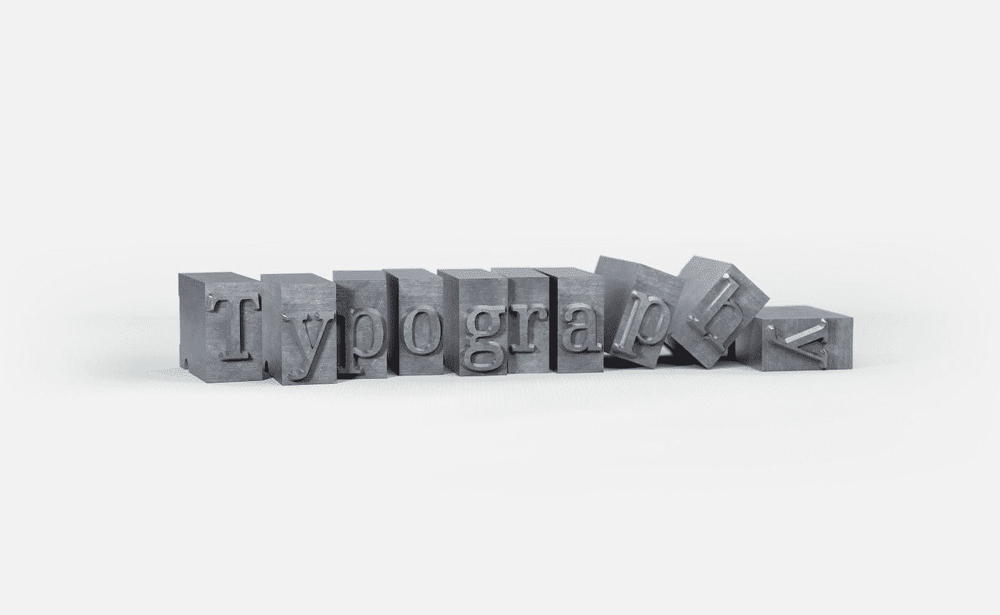

# 你应该在 Rust 中开发你自己的类型吗？是的，下面是方法

> 原文：<https://betterprogramming.pub/rust-should-you-work-on-your-own-types-yes-and-heres-how-5214c61300b0>

## 让你的 Rust 代码更安全、更干净



[Florian Klauer](https://unsplash.com/@florianklauer?utm_source=medium&utm_medium=referral) 在 [Unsplash](https://unsplash.com?utm_source=medium&utm_medium=referral) 上拍摄的照片

首先，我想说的是，如果您希望您的代码是生产就绪的或者尽可能干净，那么您应该使用本文中描述的方法。说完了，我们开始吧！

有无数的理由说明类型在你的代码中是必不可少的:速度、编译器效率、可维护性、可读性、安全性等等，这就是为什么大多数语言依赖于类型。

像 Rust 这样的语言有一些内置的类型，也称为“原始”类型。这些原语意味着直接在您的代码中使用，但也可以让您在它们的基础上构建自己的类型。

例如，Rust 的标准库提供了许多有用的类型和实现供您在代码中使用，但是当您决定不在机箱中包含标准库时，真正的挑战才开始。

例如，当使用微控制器或其他嵌入式系统时，您可能不想使用标准库，就像您在编写智能合同时不想使用它一样，在智能合同中，关心编译代码的大小是很重要的。

在没有标准库的情况下编写非基本代码的唯一方法是创建自己的类型，即使有了标准库，大多数时候也需要创建新的类型。

但是数字呢？在 Rust 中，你有各种各样的本原数类型:`i8`、`i16`、`i32`、`i64`、`i128`、`isize`、`u8`、`u16`、`u32`、`u64`、`u128`、`usize`、`f32`、`f64`。

本文旨在向您展示为什么您会发现大多数时候，使用您自己的类型更好，并且它将通过数字来实现。

> 为什么通过数字？

因为即使在处理像有符号和无符号整数这样简单的东西时，这也是显示对新类型的需求的一种强有力的方式。

# 用例

假设我们正在制作一个苹果汁赠品，我们想赠送 180 个苹果汁，让最多 180 个加入赠品的用户能够以他们认为正确/有利可图的价格转售他们的苹果汁。

由于我们使用键值存储来实现并行性(假设我们的目标平台支持它)，我们将为每个 180 分配一个数字 id。

我们还可以说，我们的应用程序必须知道密钥，而不需要获取它们，因此使用一个从 0 到 180 的数字作为 id 是一个很好的方法。

我们可以做的是创建一个这样的枚举来包含一个`u8`数(因为 u8 的最大值可以是 255):

```
enum Key {
    Giveaway(u8),
}
```

这样，当我们在键值存储中读取或写入我们的第 120 个苹果汁时，我们可以使用键:`Key::Giveaway(120)`。

# 问题是

> 这个实现有什么问题？

那么`Key::Giveaway(190)`呢？

我们的 ID 应该有一个最大值 180，所以可以肯定地说，如果我们想让我们的应用程序受益于 Rust 提供的安全性，就不应该有上面这样的东西。我们可以这样做:

```
fn put_store(key: Key, value: &[u8]) {
    let Key::Giveaway(repr) = key;
    assert!(repr <= 180);
    // put in the kv
}
```

但这绝对不是一个干净的过程，更难维护，而且远不如我们将要做的清晰可辨。

# 解决方案

我们要做的是创建我们自己的类型，并设置界限以受益于强类型。我们将做一些事情，不允许用一个无效的`u8`内部值创建一个`Key::Giveaway`。

我们创建了`Id`结构，并实现了`Id::new`方法来检查 ID 的整数表示是否有效(`assert!(int ≤ 180)`)。

我们现在可以调用一个`put_store`、`get_store`或任何其他涉及`Id`的函数，而不用担心安全检查，因为我们拥有的任何`Id`都是为了进行这些检查而创建的。

# 为什么？

> 这难道不会使代码的性能稍有下降吗？
> 
> 在我们的类型中有很强的界限是唯一的优势吗？
> 
> 我应该什么时候实施这种语法？

我的经验是，如果您正在处理其他开发人员不得不审查和维护的代码，或者您计划自己维护一段时间的代码，则应该始终加强正确性、可读性和可维护性。

强制这样的强类型不仅在检查填充它们的值、可维护性和可读性方面是有益的，而且还可以防止您自己或其他开发人员执行无效的操作。

例如，如果我们使用`u8`原语作为我们的 id，而不是`Id`类型，那么另一个开发人员可以执行像`my_id * 100`这样的操作，为与特定苹果汁相关的另一个值创建一个 id，这是不应该发生的，因为将`my_id`乘以 100 会产生另一种 id。

# 权衡取舍

当采用这种方法时，您会注意到最大的缺点是代码大小，以及您必须根据需要为您的类型编写大量实现的事实。例如，如果你需要用 id(`id1 + id2`)做加法，你将不得不这样做:

```
impl Id {
    ... pub fn add(&self, rhs: Id) -> Id {
        Id::new(self.0 + rhs.0)
    }
}
```

不得不手动实现这些可能很烦人，但是当处理生产代码时，这是值得做的努力。

最后，我并不总是强制强类型。您必须考虑到许多因开发人员而异的变量:

*   代码是要直接投入生产吗？
*   该类型在代码中的重现性如何？
*   现有的法规是如何实施的？

不管怎样，知道如何和为什么使用你自己的类型是很好的，即使是在处理，例如，数字。

*感谢阅读！如果你对 Rust 感兴趣，你可能也会觉得我最近写的两篇文章很有趣:*

[](/build-a-cryptominer-in-rust-and-run-it-on-your-browser-300662204131) [## 在 Rust 中构建一个加密货币挖掘器，并在您的浏览器上运行它

### 了解黑客如何利用 WASM 进行区块链采矿

better 编程. pub](/build-a-cryptominer-in-rust-and-run-it-on-your-browser-300662204131) [](/rust-for-the-fastest-serverless-experience-80530acdd4d4) [## 创建无服务器的 Rust 功能以获得快速体验

### WASM 再次施展魔法

better 编程. pub](/rust-for-the-fastest-serverless-experience-80530acdd4d4)