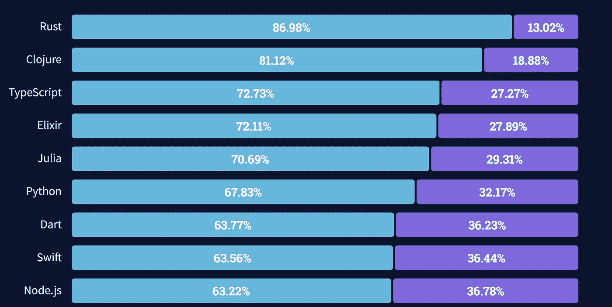
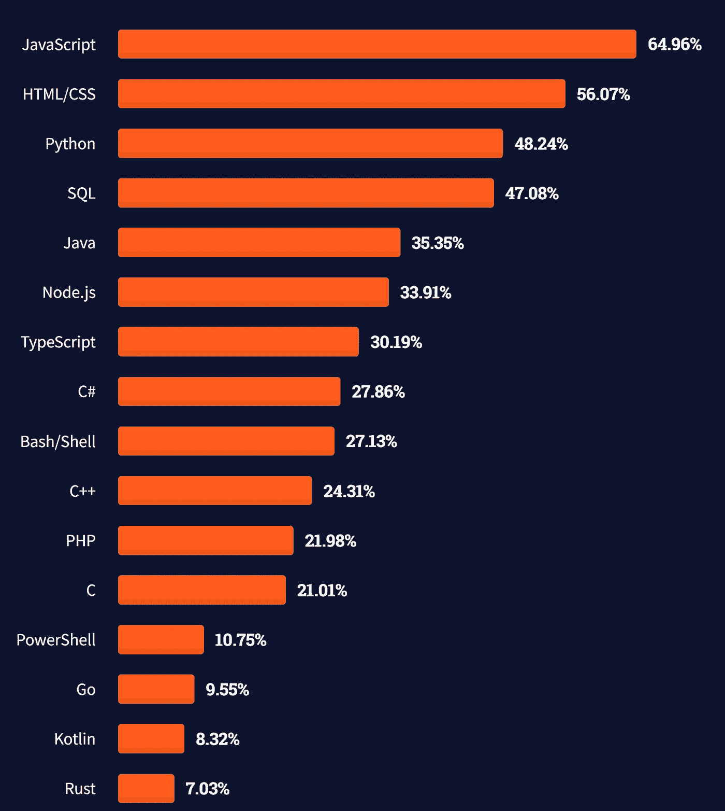

# 为什么 Rust 可能比 Java 和 JavaScript 吸引更多的开发人员

> 原文：<https://betterprogramming.pub/rusts-secret-weapon-and-it-s-impending-domination-60ff4232993f>

## 锈病有一个秘密武器，使它的统治地位不可避免


斯蒂芬·斯坦鲍尔在 Unsplash[上拍摄的照片](https://unsplash.com?utm_source=medium&utm_medium=referral)

不可否认，Rust 是一种非常受欢迎的语言，毕竟，它已经连续第六年在 StackOverflow 开发者调查中排名第`#1 Most Loved Programming Language`。

读到这里，你可能很清楚为什么有这么多人喜欢它，但我还是要回顾一下这些原因，至少在我透露它的秘密武器之前。

**很快，** *很快*。虽然它可能不是一个很好的基准，但计算机语言基准测试游戏测量它仅比最快的语言 **C** 差一点点。

这是有道理的，因为 Rust 是用来取代 C/C++的。比基准测试更好的是，在许多情况下，Rust 编译器能够比 C 或 C++更好地优化代码**,这仅仅是因为它有更多关于开发人员意图的信息。**

**一致。Rust 的开发人员可以预期，如果他们的代码能够编译，它就能工作。当它不编译时，编译器给出的反馈和建议比任何其他语言都好。它甚至可以检查你的 [*算术*是否有误](https://rust-lang.github.io/rust-clippy/master/index.html#suspicious_arithmetic_impl)。**

**这很复杂，但只在需要的地方。语言本身以及它的标准库都是由它的用户有意识地构建的。在大多数地方，你可能会发现你必须写乏味的样板文件，Rust 使它变得容易。它也给了你自由去写你想要的代码，以你想要的方式。我们稍后将回到这一点。**

# 问题是

当开始一个新项目时，你要做的第一件事是什么？这取决于你用的是什么栈。

如果您想使用 NodeJS，它可能看起来像这样:

```
mkdir new_project
touch index.js
npm install
```

这只是最低限度。如果您想要添加任何依赖项，您必须经历不合理数量的障碍，而标准的软件包仓库 npm 是众所周知的非常不安全，更不用说它是由私人公司控制的。

如果要用 Java，就得用某种模板，否则不可能从头创建项目。即使这样，您也必须在两三个包管理器之间做出选择，并在库不支持您的选择时处理它。

如果你想用 C 或者 C++算了。作为一个初学者，你将陷入如何使用本地链接器和编译器让任何库工作的困境。

## 生锈的溶液

Cargo 是最简单、最容易使用的构建工具之一。它做你可能需要的一切，这可能是 Rust 可能很快成为主要玩家的原因。99%的情况下，你可以直接从 [crates.io](https://crates.io) 中复制并粘贴给定库的字符串，这是一个由 Rust Foundation 拥有并运营的库，你就可以开始比赛了。

测试也很容易，只需运行`cargo test`即可完成。它既包括单元测试，也包括集成测试，如果你需要的话。

`cargo doc`提供了一种一致且简单的方法来记录代码。它对用户来说也很棒，允许开发人员访问一个库的直观表示。

**它是可扩展的**，一些最伟大的二进制板条箱的存在是为了扩展功能。因此，在为数不多的几个`cargo`自己不能解决的领域，有额外的板条箱来填补空白。

# 铁锈不可避免的统治

我认为，在所有使用 Rust 的理由中，`cargo`将是增加其受欢迎程度的最重要的理由。



[根据 2021 年 StackOverflow 开发者调查，最受欢迎的编程语言与令人畏惧的编程语言。](https://insights.stackoverflow.com/survey/2021#technology-most-loved-dreaded-and-wanted)

你必须明白，目前很少使用铁锈。你可以说它被一些大型公司用于一些非常大的项目——Google Fuschia，Discord，Mozilla Firefox 等等。不幸的是，这些数字就是加不起来。只有不到 7%的开发者使用 Rust。但这种情况将开始改变。



[根据 2021 年 StackOverflow 开发者调查，最受欢迎的编程语言。](https://insights.stackoverflow.com/survey/2021#section-most-popular-technologies-programming-scripting-and-markup-languages)

Rust 可能很难学，尤其是对于那些习惯于像 JavaScript 这样的动态语言的人来说。但是 Rust 击败了大多数语言的是构建系统。`cargo`一个人就让 Rust 比 C/C++、Java 和其他许多语言更容易接近。

越来越多的新开发人员将会使用 Rust，而不是其他语言，因为它更容易开始，更容易学习，并且有一个很好的社区可以寻求帮助。

# 这太棒了！

如果你已经读到这里，还没有意识到我喜欢 Rust，我很抱歉。我和你都应该为这个消息感到高兴，因为这意味着我们将有更多的机会来编写我们喜欢的代码。

如果你有什么想法，我很想听听。

```
**Want to Connect?**If you like art, or photography, also check out my [Instagram.](https://www.instagram.com/elijah_sirius/)
```