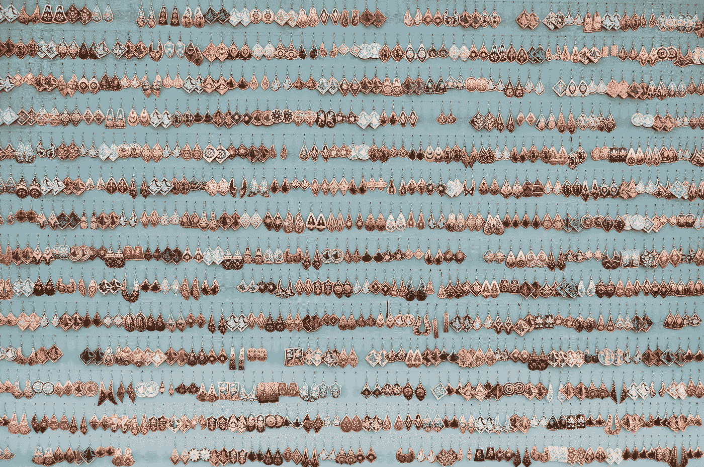
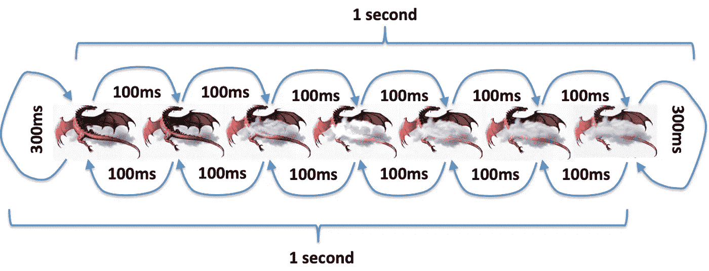

# RxJava 2 链接和传统代码:并排比较

> 原文：<https://betterprogramming.pub/rxjava-2-chaining-and-conventional-code-side-by-side-comparison-a04c50a97109>

## 使用和不使用 RxJava 创建循环动画

照片由[佩塔·佩特科夫斯基](https://unsplash.com/@petkovski?utm_source=unsplash&utm_medium=referral&utm_content=creditCopyText)在 [Unsplash](https://unsplash.com/s/photos/side-by-side?utm_source=unsplash&utm_medium=referral&utm_content=creditCopyText) 上拍摄

与做同样事情的传统代码相比，RxJava 的新学习者看到它有时是有帮助的。

这里我将展示两段操作几乎相同的代码——一段使用 RxJava，另一段使用常规代码。

> 如果您不熟悉 RxJava，请查看[轻松学习 rx Java](https://medium.com/@elye.project/learning-rxjava-in-android-made-simple-in-kotlin-single-just-subscribe-581ff8835a64)

# 代码做什么

在进入细节之前，让我们看看代码是做什么的。基本上，它通过一组图像循环创建一个动画，如下图所示。

代码操作是这样的:

*   以 100 毫秒的间隔从 0 到 6 循环，然后等待 300 毫秒
*   以 100 ms 的间隔从 6 循环回 0，然后等待 300 ms。

动画看起来像这样:

> 注:如果你对制作那个图像动画的完整代码感兴趣，参考[https://medium . com/better-programming/practical-image-porter duff-mode-usage-in-Android-3 B4 b5 D2 E8 f 5 f](https://medium.com/better-programming/practical-image-porterduff-mode-usage-in-android-3b4b5d2e8f5f)

# 常规代码

我只使用 RxJava 将循环操作放在工作线程之后，这样可以避免暂停 UI 线程。除此之外，它只是 while-loop 和 sleep (wait)的一个常规代码示例。

> 注意:`*RxJavaPlugins.setErrorHandler* ***{*** */*Catch InterruptedException*/* ***}***`**主要是处理 Rx 中无法被 onError 捕捉到的睡眠中断。这里有一个解释:[https://stackoverflow.com/a/57658846/3286489](https://stackoverflow.com/a/57658846/3286489)**

## **赞成的意见**

**它很容易阅读和理解逻辑，你可以将代码映射到上面的图表中。使用简单的编码控制代码我们可以实现我们想要做的事情。**

## **骗局**

**使用`Thread.sleep`对于等待来说并不理想，而且考虑到它想要实现的目标，它也相对冗长。需要更多的代码行和更深层次的代码。**

# **RxJava 链接代码**

## **赞成的意见**

**代码看起来更加整洁和简洁。所需的代码层次不太深。不需要`Thread.sleep`，因为它被`internal`操作代替。**

## **骗局**

**乍一看，代码更难理解。它不容易映射到上面所示的流程图。你得知道 RxJava 操作函数和副作用函数使用，才能做到简洁。它需要更多的精神能量。**

**就个人而言，为了更好的理解和清晰，我更喜欢传统的编码方法。然而，在这种情况下，由于在这种情况下需要`Thread.sleep`，我将使用`interval`操作进行 RxJava 链接。**

**哪个更好没有对错之分。这只是一种偏好——需要根据具体情况评估其使用情况。有时介于两者之间的混合也同样有效。**

**如果您想要上面动画的完整代码，并继续探索这两种编码方法，请从这里获得:**

** [## Android 中实际图像端口缓冲模式的使用

### 使用 PorterDuff 混合两个图像以产生所需的图像输出

medium.com](https://medium.com/better-programming/practical-image-porterduff-mode-usage-in-android-3b4b5d2e8f5f) 

我希望这篇文章对你有帮助。**