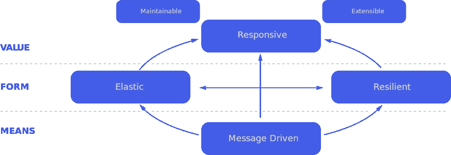
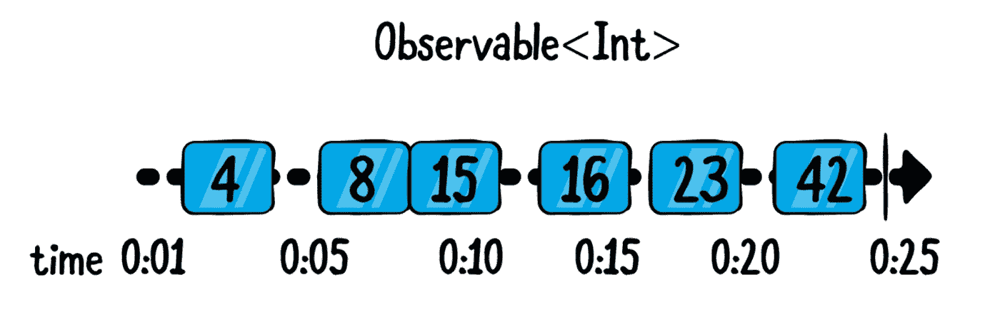
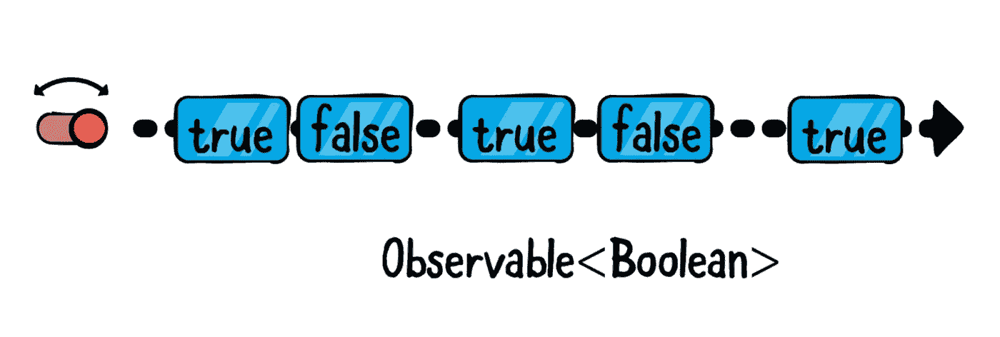
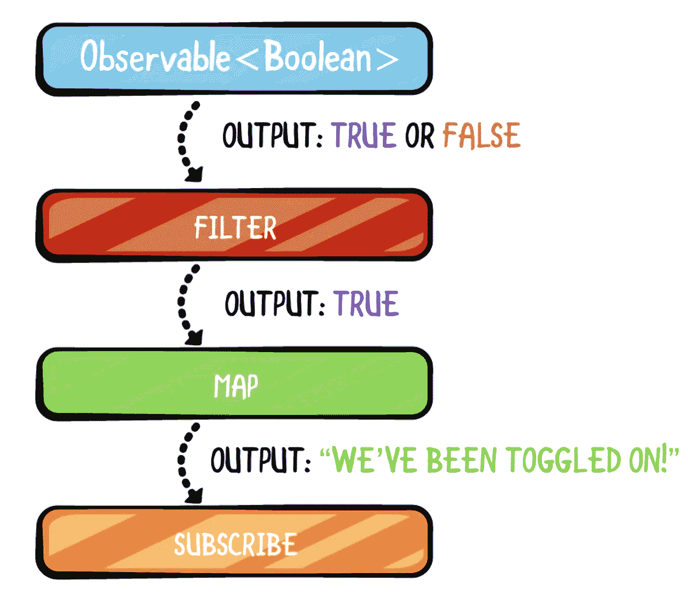

# 在 10 分钟内学习 Kotlin 基础知识中的 RxJava 基础知识

> 原文：<https://betterprogramming.pub/rxjava-kotlin-basics-in-10-minutes-cf7d931cafe2>

## 为您的 Android 应用添加反应功能


阿什·埃德蒙兹在 Unsplash[上拍摄的照片](https://unsplash.com/s/photos/abstract?utm_source=unsplash&utm_medium=referral&utm_content=creditCopyText)

RxJava 是一个库，通过使用可观察序列和函数式操作符创建异步和基于事件的代码，允许通过调度程序执行。"

RxJava 本质上简化了异步程序的开发，它允许代码对新的数据流或异步事件做出反应，并以顺序的方式进行处理。

# **异步编程快速入门:**

假设您正在设备上执行一系列任务:

*   按钮开关
*   在屏幕上观看动画
*   从互联网下载大照片
*   将少量数据保存到磁盘
*   播放音频

所有这些事件显然是同时发生的，每当键盘在你的屏幕上播放动画时，你的应用程序中的音频直到动画结束才淡出，对吗？

你程序的所有不同部分不会互相阻碍执行，对吗？通常，我们在不同的线程上执行不同的工作，并在设备 CPU 的不同内核上执行它们。

编写真正并行运行的代码相当复杂。尤其是当我们处理处理同一份数据的不同代码时，很难确定执行的顺序。

RxJava 以被动的方式处理所有这些问题。

# 反动宣言



“反应式系统”是一个相当抽象的术语，涵盖表现出大部分或所有这些品质的应用程序:

*   **响应式:**始终保持 UI 最新，代表最新的应用状态。
*   弹性:每种行为都是独立定义的，并提供灵活的错误恢复。
*   **弹性:**代码处理不同的工作负载，经常实现一些特性，比如懒惰的拉驱动数据。
*   **消息驱动:**组件使用基于消息的通信来提高可重用性和隔离性，分离类的生命周期和实现

简而言之，反应式系统以灵活和一致的方式对用户和其他事件做出反应。

# 什么是可观察对象、运算符和调度程序？

## **可观测量**

`Observable<T>`类提供了 Rx 代码的基础:异步产生一系列事件的能力，这些事件可以“携带”数据 t 的不可变快照。

它允许一个或多个观察者对任何事件做出实时反应，并更新应用程序和使用新的和传入的数据。

一个`Observable` (实现了上面的接口)只能发出(并且观察者可以接收)三种类型的事件:

*   **下一个事件:**“携带”最新(或下一个)数据值的事件。这是观察者“接收”值的方式。
*   **完整事件:**该事件成功终止事件序列。这意味着`Observable`成功完成了它的生命周期，不会排放。
*   **错误事件:**`Observable`因错误而终止，不会发出其他事件。

当谈到随时间发出的异步事件时，您可以在时间轴上可视化一个可观察到的整数序列，如下所示:



**可观测数据流**

蓝框是由`Observable`发出的下一个事件。右边的竖线代表完整的事件。时间线上的 x 表示一个错误事件。

因为可观察契约没有对`Observable`或`Observer`的性质做出任何假设，所以使用事件序列是最终的解耦实践。你永远不需要使用回调来允许你的类之间相互交流。


**解耦观测器**

# **冷热对比**

**热可观测序列:**一些可观测序列发出零个、一个或多个值，并且在稍后的时间点，要么成功终止，要么错误终止。

该工作流程准确描述了典型可观察对象的生命周期。看看下面的相关代码:

```
API.download(file = "[http://www](http://www)...")
  .subscribeBy(
    onNext = {
      // append data to a file
    },
    onComplete = {
      // use downloaded file
    },
    onError = {
      // display error to user
    }
  )
```

考虑上面从互联网下载文件的代码:

*   首先，您开始下载并开始观察传入的数据。
*   然后，随着文件的一部分进入，您会重复地收到大量数据。
*   如果网络连接中断，下载将停止，连接将超时并出现错误。
*   或者，如果代码下载了文件的所有数据，它将成功完成。

**冷可观察序列:**与文件下载或类似活动不同，它们被认为是自然或强制终止的，还有其他序列是无限的。通常，UI 事件就是这样无限可观察的序列。

例如，考虑您需要对应用程序中的开关切换做出反应的代码:

*   你给你想听的开关加一个`OnCheckedChangedListener`。

然后你需要给 OnCheckedChangedListener 一个 lambda 回调，它查看`isChecked`值并相应地更新应用状态。

*   这种开关检查变化的顺序没有自然的结束。只要屏幕上有一个开关，就可能有一系列开关检查更改。此外，因为序列实际上是无限的，所以在你开始观察它的时候总是有一个初始值，也就是说，不管开关是开还是关。



可能发生的情况是，用户从来没有切换开关，但这并不意味着事件序列被终止。这只是意味着没有事件发出。

在 RxJava 中，您可以编写这样的代码来对开关变化做出反应:

```
switch.checkedChanges()
  .subscribeBy(
    onNext = { isOn ->
      if (isOn) {
        // toggle a setting on
      } else {
        // toggle a setting off
     }
```

`checkedChanges()`是`CompoundButton`上即将被发现的扩展方法，它产生了一个`Observable<Boolean>`。
你订阅`checkedChanges()`返回的`Observable`，根据当前开关状态更新 app 设置。

# 经营者

`ObservableSource<T>`和`Observable`类的实现包含了大量的方法，这些方法抽象了异步工作的离散部分，可以组合在一起实现更复杂的逻辑。
因为它们是高度解耦和可组合的，所以这些方法通常被称为操作符。由于这些操作符主要接受异步输入，并且只产生输出而不会引起副作用，因此它们可以很容易地组合在一起，就像拼图一样，并努力构建一个更大的画面。例如，以下面的数学表达式为例:

**(5+6)* 10–2。**

以一种清晰、确定的方式，您可以将操作符`*`、`( )`、`+`和 `—`以它们预定义的顺序应用于作为它们输入的数据，获取它们的输出，并继续处理表达式，直到它被解析。

以有点类似的方式，您可以将`Rx`操作符应用于由`Observable`发出的输入片段，以确定性地处理输入和输出，直到表达式被解析为最终值，然后您可以使用该值来产生副作用。
这是之前关于观察开关变化的例子，调整后使用一些常见的 Rx 操作符:

```
switch.checkedChanges()
  .filter { it == true }
  .map { "We've been toggled on!" }
  .subscribeBy(
    onNext = { message ->
      updateTextView(message)
    }
  )
```

每次`checkedChanges()`产生真或假值时，`Rx`将对发出的数据应用过滤器和映射操作符。



首先，过滤器只会让真值通过。如果开关被关闭，订阅代码将不会被执行，因为过滤器将限制这些值。

如果是真值，map 运算符将接受布尔类型输入并将其转换为字符串输出，即文本“我们已经打开！”

最后，用`subscribeBy`订阅产生的下一个事件，这次携带一个`String`值，并调用一个方法用屏幕上的文本更新一些文本视图。

操作符也是高度可组合的。它们总是接受数据作为输入并输出结果，因此您可以很容易地以许多不同的方式将它们链接起来，实现比单个操作者单独所能实现的要多得多的功能！

# **调度程序**

调度器类似于你在普通 Java 和 Kotlin 代码中看到的`ThreadPools`。如果你不熟悉`ThreadPools`，你可以把它们想象成一个线程的集合，所有的线程都连接在一起并可供使用。RxJava 附带了许多预定义的调度器，它们覆盖了 99%的用例。希望这意味着你永远不必创建自己的调度程序。

也就是说，调度程序非常强大。

例如，您可以指定希望观察 IO 调度程序上的后续事件，这使得您的 Rx 代码在后台线程池中运行。如果您要从网络下载文件或将某些内容保存到数据库，您可能需要使用此计划程序。

为繁重的计算任务保留的一组单独线程上的订阅。

借助 RxJava，您可以在不同的调度器上调度同一订阅的不同工作，以获得最佳性能。

就这样结束了！