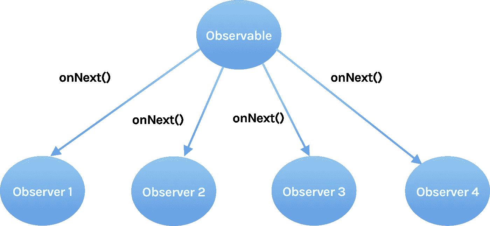
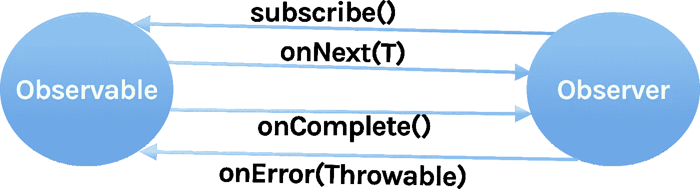
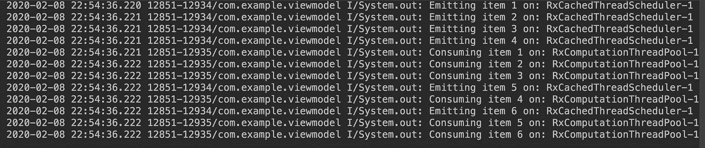

# rx Java:Android 中的多线程

> 原文：<https://betterprogramming.pub/rxjava-multi-threading-in-android-302a7419edbf>

## 如何掌握 RxJava 的详细指南


[RxJava](https://github.com/ReactiveX/RxJava) 已经进入开发市场很长时间了，但是在与我的一些同事交流时，我发现许多人还没有开始使用 RxJava，因为他们不知道它提供的好处。

虽然有很多文章，但我写这篇文章是为了解释一个人如何容易习惯使用 RxJava。在起点，一切都是新的，比如术语和使用什么。

我们需要继续和它一起工作，这样我们才能习惯和理解它。在本帖中，我们将讨论 RxJava 的基础知识和一些有用的见解。

# 什么是 RxJava

RxJava 是[反应式扩展](http://reactivex.io/)的 Java VM 实现:一个通过使用可观察序列来组成异步和基于事件的程序的库。

简单来说，我们可以把它定义为一个带有可观察流的异步编程的 API。它结合了观察者模式、迭代器模式和函数式编程的最佳思想。

它扩展了 observer 模式以支持数据/事件序列，并添加了操作符，允许您以声明的方式将序列组合在一起，同时抽象出诸如低级线程、同步、线程安全和并发数据结构之类的问题。

换句话说，我们可以说，由一个组件发出的数据和由 Rx 库提供的底层结构会将这些更改传播到另一个注册为接收这些数据更改的组件。

# 为什么要用 RxJava？

在开始使用任何东西之前，我们需要分析我们为什么需要这个东西。将 Executor 服务用于线程化，将 AsyncTask 用于其他异步操作可以执行我们的任务，但是要正确地管理它们，我们要付出更多的努力。

## **轻松多线程**

对于异步工作，线程管理至关重要。在许多情况下，当一个任务正在执行时，我们会遇到后台线程和主线程之间进行通信的情况。

一个简单的例子是在后台线程执行的同时更新 UI。虽然听起来很容易，但我们知道在更新 UI 之前需要执行多少检查。

Rx 使我们变得更容易，所以通过使用 Rx，我们可以很容易地控制我们在一个单独的线程中开始的任务。

## **简单的错误处理**

错误是最让开发者沮丧的事情。在执行大量复杂的异步操作时，我们会在许多地方遇到错误。

为了避免这种情况，我们通常使用`try` / `catch`或其他一些补丁代码来解决这个问题。但是 Rx 提供了处理这些错误的标准方法。它有一个标准的成功和失败交付方法。

## **避免回调地狱**

在任何时候，如果您已经进行了嵌套网络调用，您可能知道处理它们的痛苦。但是 Rx 有许多运营商可以非常容易地解决这类问题。

# 观察者模式

让我们稍微了解一下观察者模式。观察者模式是一种软件设计模式，其中一个名为*主题*的对象维护一个名为*观察者*的依赖者列表。

它会自动通知它们任何状态变化，通常是通过调用它们的一个方法。简而言之，将会有一个观察者订阅可观察的来获得最新数据或状态变化的通知。

# 公式

在某种程度上，RxJava 就是学习这个公式，并根据我们的要求应用它。

```
Rx= SCHEDULERS + OBSERVABLE + OBSERVER
```

让我们来分析和理解每个组件。

# 可观察量

在 RxJava 中，Observables 是向观察者发送数据的来源。对于观察者来说，要想听到可观测的东西，他们需要先订阅。

订阅后创建的实例，在 RxJava2 中，称为 *Disposable* 。如果任务完成或者停止监听 Observables，我们可以通过调用 Disposable 实例上的方法`dispose()`来取消订阅。

我们可以把可观的东西看作供应商。它们处理数据并将数据提供给其他组件。它做一些工作，并发出一些值。



`Observable.OnSubscribe`是一个接口，它定义了当订户订阅可观察对象时要采取的动作。subscribe 方法仅在观察者订阅可观察对象时运行。

让我们创建一个简单的可观察对象。

# 观察者

观察器是使用由可观察对象发出的数据的组件。在 Rx 中，观察者使用`subscribe`方法订阅可观察对象，以接收可观察对象发出的数据。

每当可观察对象发出数据时，所有注册的观察对象都会在`onNext()`方法回调中接收数据。在这里，我们可以执行各种操作，比如解析 JSON 响应或更新 UI 等。如果有一个误差从可观察对象中抛出，观察者将在`onError()`中接收到它。

要理解观察者，我们应该知道三种基本方法。

*   `onNext()`:用于观察对象发射下一个物品时接收数据。
*   `onError()`:发生错误时触发。
*   `onComplete()`:最后一个项目发出后调用。基本上工作完成的时候。



让我们创建一个简单的观察者实例。

让我们向观察者订阅可观察的。

```
observableObject.**subscribe**(observerInstance);
```

这就在观察者和被观察者之间建立了一种联系。可观察对象现在会发出被观察者的`onNext()`捕捉到的值。

控制台的输出是:

```
Output:
onSubscribe
onNext 10
onNext 20
onNext 30
onComplete
```

# 调度程序

调度器用于指定工作必须在哪个线程上完成，因此这在线程管理的情况下更有用。

在 Rx 中，调度器是告诉可观察对象或观察者应该在哪个线程上运行的组件。

我们可以使用`subscribeOn()`来告诉观察对象它应该在哪个线程上运行，我们可以使用`observeOn()`来告诉观察对象它们应该在哪个线程上发出数据。

有许多调度程序，但我们将讨论我们最常用的三个主要调度程序。

## **Schedulers.io()**

通常用于 IO 相关的东西，如网络请求、文件系统操作等。IO 调度程序由线程池支持。我们一般用它来表示:

```
observableInstance.subscribeOn(**Schedulers.io()**)
```

返回用于 IO 绑定工作的默认共享调度程序实例。这可用于异步执行阻塞 IO 操作。

这个实现类似于来自`java.util.concurrent`的`ThreadPoolExecutor` ，具有一个无限的线程池。

该实现由一个单线程`ScheduledExecutorService`实例池支持，这些实例将尝试重用工作器使用的先前启动的实例，否则它们将启动一个新的支持`ScheduledExecutorService`实例。

请注意，这个调度程序可能会创建无限数量的工作线程，这会导致系统变慢或`OutOfMemoryError`。因此，对于临时用途或实现运算符时，必须释放 Worker 实例。

我们可以通过在代码中引用 scheduler 类之前必须设置的系统属性来控制这个标准调度程序的某些属性。支持的系统属性`System.getProperty()`。

默认情况下，`io()`调度器工作线程的保持活动时间为 60 秒，默认情况下，`io()`调度器的线程优先级为`NORM_PRIORITY`。

当我们从应用的任何部分调用`Schedulers.io()` 时，Rx 框架中的以下方法被调用:

```
@NonNull
public static Scheduler io() {
    return RxJavaPlugins.*onIoScheduler*(*IO*);
}
```

## Schedulers.computation()

该调度程序可用于执行 CPU 密集型操作，如处理大量数据、位图处理等。使用该调度程序创建的线程数量完全取决于移动设备上可用的 CPU 内核数量。

因此，如果您的手机上有两个内核，那么池中将有两个线程。这也意味着，如果这两个线程很忙，那么进程将不得不等待它们可用。

由于这限制了并行运行的线程数量，当任务完全受限于 CPU 时，我们应该使用计算调度器；那是当它们需要计算能力并且没有阻塞代码的时候。

```
observableInstance.subscribeOn(**Schedulers.computation()**)
```

## AndroidSchedulers.mainThread()

这个调度器由 [Rx Android](https://github.com/ReactiveX/RxAndroid) 库提供，包名为 io . react vex . Android . schedulers。

这个调度器用于将执行带回主线程，以便在需要时可以完成 UI 更新。这通常与如下所示的`observeOn()`一起使用。

```
observableInstance.observeOn(**AndroidSchedulers.mainThread()**)
```

# 例子

让我们通过一个例子来更好地理解所有这些组件。

## 第一步

将依赖项添加到应用程序级`build.gradle`。

```
//RxJava
implementation 'io.reactivex.rxjava2:rxjava:2.2.8'//RxAndroid
implementation 'io.reactivex.rxjava2:rxandroid:2.1.1'//ViewModel
implementation 'androidx.lifecycle:lifecycle-viewmodel-ktx:2.2.0'
```

## 第二步

在潜入之前，让我们先了解一些方法，比如`subscribeOn()`和`observeOn()`。

`subscribeOn()`:这是一个方法，告诉观察对象它们应该在哪个线程上运行。无论您将`subscribeOn()`方法放在观察对象链的哪个位置，它都只作用于根观察对象，并控制它应该在哪个线程上运行。

每个可观察对象应该只有一个`subscribeOn()`来定义它的执行线程。尽管我们定义了多个`subscribeOn()`方法，但最接近根可观察对象的方法将会起作用，其他的都不行。

如果我们有一系列的可观测值，那么根可观测值就是发射源。

`observeOn()`:该方法告诉所有后续操作符将在哪个线程上执行(直到遇到另一个`observeOn`)，它可能在链中多次出现，改变不同代码段的执行线程。

这个方法告诉观察者他们应该在哪个线程上使用发出的可观察值。如果我们在一个可观察对象上定义了`subscribeOn()`,而没有指定`observeOn()`,那么观察者将只消费那个特定线程上的项目。

**用例**

通常，我们在单独的工作线程中运行的`Scheduler.io()`上执行网络请求，但是我们需要用`AndroidSchedulers.mainThread()`指定`observeOn()`来使用发出的数据来更新 UI。

让我们创建一个简单的应用程序，它有一个活动，在这个活动中，单击一个按钮，调用`ViewModel`上的方法，从远程 repo 或本地计算中获取数据，以检查 Rx 是如何执行多线程的。

我们来过一遍`ViewModel`的逻辑。

输出是:



## **第三步**

分析。当我们观察`ViewModel`中的方法时，我们可以理解为:

1.  `CompositeDisposable`:一次性容器，可容纳多种其他一次性物品，并提供 O(1)的添加和移除复杂度。
2.  `subscribe()`:这个方法有两个部分，成功和失败块，我们可以根据需要处理每一种情况。
3.  `subscribeOn()`和`observeOn()` : `subscribeOn()`用于指定被观察对象应该在哪个线程上执行工作，`observeOn()`用于指定被观察对象应该在哪个线程上发出项目。
4.  `onCleared()`:这是`ViewModel`被覆盖的方法，在这里我们可以处理掉所有的一次性物品。当`ViewModel`被销毁时调用这个方法。

# 奖金

渴望了解更多关于 Rx 的信息，请继续阅读 RxJava 上的系列[完整指南。](https://medium.com/@pavan.careers5208/complete-guide-on-rxjava-d997235e4eec)

# 结论

这还不是关于 RxJava 的全部知识；还有更多的探索，如不同的方法来创建一个可观测量和可观测量的类型，运营商等。

我将在接下来的文章中写下这些。让我们继续学习。

请让我知道你的建议和意见。

感谢阅读。