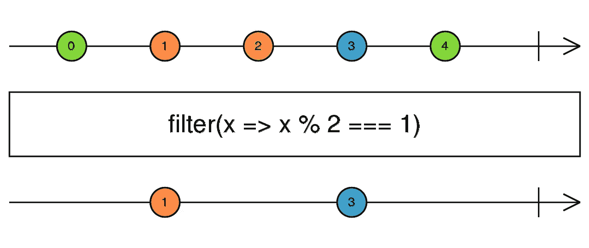

# RxJS 最佳实践

> 原文：<https://betterprogramming.pub/rxjs-best-practices-7f559d811514>

## 我每天在代码中使用的一系列实践

RxJS 是 JavaScript 中最流行的函数式反应式编程(FRP)框架。这意味着很多人每天都在他们的项目中使用 RxJS。大多数开发人员都知道常见的干净代码实践，但是 RxJS 最佳实践呢？你知道玻璃钢的注意事项吗？你在代码中应用它们了吗？

本教程将重点介绍我在编写代码时日常使用的几个最佳实践，并附有实际例子。我们将讨论以下几点:

我们将讨论这些技术:

1.避免 subscribe 函数中的逻辑

2.使用主题来强制完成

3.避免重复的逻辑

4.避免嵌套—使用链代替

5.共享以避免流重复

6.不要暴露主题

7.使用大理石图进行测试

事不宜迟，我们开始吧。

大家好，欢迎来到多泰。在这个视频中，我们将讨论 RxJS，它是 JavaScript 中最流行的函数式反应式编程框架。更具体地说，我们将讨论 RxJS 最佳实践。我们将讨论函数式反应式编程的注意事项。所以，事不宜迟，让我们开始吧

# 1.避免 Subscribe 函数中的逻辑

对于你们中的一些人来说，这种说法似乎很明显，但是对于 RxJS 初学者来说，这是一个常见的陷阱。在你学会如何*功能性+反应性地思考之前，*你可能会尝试这样做:

订阅功能中的逻辑

我们的`pokemon$` Observable 发出`Pokemon`对象，并且，以一种*非常* *非反应的方式，*我们订阅它是为了访问这些对象并执行一些动作，比如如果`Pokemon`类型是`Water`就提前返回，调用`getStats()`函数，记录该函数返回的统计数据，最后，将数据保存到`Pokedex`。我们所有的逻辑都在`subscribe`函数中。

然而，这段代码不正是我们在传统的*命令式*编程范例中看到的吗？既然 RxJS 是一个函数式反应式编程库，我们就要告别我们传统的思维方式，开始函数式反应式的思考(Streams！纯函数！).

那么，我们如何使我们的代码功能反应？通过使用 RxJS 为我们提供的可管道化操作符:

使用管道运算符

瞧，我们的代码通过一些简单的改变，已经从命令式变成了功能反应式。它甚至看起来更干净，不是吗？

**注意:**我完全知道一部分逻辑(`saveToPokedex()` 函数)仍然保留在`subscribe`中。我发现将最后一部分逻辑放在`subscribe`中让我更容易阅读代码。你们都可以自由选择是否让`subscribe`完全空着。

我们使用的操作符非常简单:`[filter](https://www.learnrxjs.io/learn-rxjs/operators/filtering/filter)`和`[map](https://rxjs-dev.firebaseapp.com/api/operators/map)`的工作方式与它们同名的数组操作符完全相同，`[tap](https://rxjs-dev.firebaseapp.com/api/operators/tap)`用于执行*副作用*(定义如下)。

> “如果一个操作、函数或表达式修改了其本地环境之外的某个状态变量值，则称其具有*副作用*—通过[维基百科](https://en.wikipedia.org/wiki/Side_effect_(computer_science))

# 2.使用主题来强制完成

当使用 Observables 时，内存泄漏是一个真正的危险。为什么？因为，一旦我们订阅了一个可观测值，它就会无限期地不断发出值，直到满足以下两个条件之一:

1.  我们手动取消订阅可观察的
2.  它完成了

看起来很简单，对吧？让我们来看看如何取消订阅可观察的:

手动取消订阅可观察的

正如你在上面的例子中看到的，我们必须将我们的`pokemon$`可观察对象的订阅存储在一个变量中，然后在那个存储的订阅上手动调用`unsubscribe`。目前看来并不太难。

但是，如果我们有更多需要订阅的可观测量，会发生什么呢？

手动取消订阅几个观察项目

如您所见，随着我们向代码中添加更多的可观察对象，我们需要跟踪越来越多的订阅，我们的代码开始看起来有点拥挤。难道没有更好的方法让我们告诉我们的可观测量停止发射值吗？幸运的是，我们有，而且非常非常简单:

我们可以使用 Subject 和`takeUntil()`操作符来强制完成我们的观察。怎么会？这里有一个例子:

使用“takeUntil”完成可观测量

我们来了解一下上面是怎么回事。我们已经创建了一个`stop$`主题，并用`takeUntil`操作符将我们的三个可观察对象管道化。这个操作符用于告诉一个可观察对象，一旦一个不同的通知可观察对象发出，就停止发出值。这意味着当`stop$`主体发射时，我们的三个可观察对象将停止发射值。

那么我们如何让我们的`stop$`主体发出呢？通过调用它的`next()`函数，这正是我们在`stopObservables()`函数中所做的。所以，每当我们调用我们的`stopObservables()`函数，我们的`stop$` Subject 就会发出，我们所有的可观测性就会自动完成。听起来很酷，不是吗？

不再需要存储任何订阅和取消订阅？向`takeUntil`操作员致敬！

# 3.避免重复的逻辑

我们都知道重复代码是一个不好的信号，应该避免。(如果你不知道，我建议你去读完这本再回来。)您可能想知道哪些场景会导致重复的 RxJS 逻辑。让我们看看下面的例子:

重复的“takeUntil”逻辑

如您所见，我们有一个`number$`可观察值，我们订阅了两次:一次用`reduce()` 计算总值，一次用`filter()`去掉所有奇数。

然而，我们的`number$`可观测，尽管它的名字，并不仅仅包含数字。如您所见，它还包含一些危险的 falsy 值，这会导致我们的代码失败。这就是为什么我们需要过滤掉这些虚假的值，这就是我们正在用`filter(Boolean)`做的事情。

*注意:当使用* `*filter(Boolean)*` *时我们失去了类型推断。我们可以通过显式键入* `*filter*` *来避免这种情况，像这样:* `*filter<number>(Boolean)*`。

看起来很简单，但是…

注意我们是如何在两个可观测量中复制了`filter(Boolean)`逻辑的？只要我们的代码允许，就应该避免这种情况。怎么会？通过将此逻辑附加到源可观察对象，如下所示:

将 takeUntil 逻辑移动到源可观察对象

更少的代码+没有重复=更干净的代码。厉害！

# 4.避免嵌套—使用链代替

应该不惜一切代价避免嵌套订阅。它们使我们的代码变得复杂、肮脏、难以测试，并可能导致一些非常严重的错误。

"什么是嵌套订阅？"你可能会问。当我们在一个可观察对象的订阅块中订阅另一个可观察对象时。让我们来看看下面的代码:

嵌套订阅

看起来不太整洁，是吗？上面的代码令人困惑、复杂，如果我们需要调用更多返回 Observables 的函数，我们将不得不继续添加越来越多的订阅。这听起来有点像订阅地狱。那么我们能做些什么来避免嵌套订阅呢？

答案是使用高阶映射运算符。这些运算符中有些是`[switchMap](https://www.learnrxjs.io/learn-rxjs/operators/transformation/switchmap)`、`[mergeMap](https://www.learnrxjs.io/learn-rxjs/operators/transformation/mergemap)`等。

为了修正我们的例子，我们将使用`switchMap`操作符。为什么？因为`switchMap`退订之前的可观察和切换(好记吧？)到内在可观察的，在我们的情况下，这是完美的解决方案。但是，请注意，根据您需要的行为，您可能需要使用不同的高阶映射操作符。

使用高阶映射运算符

看看我们的代码现在看起来有多可爱。

# 5.共享以避免流重复

您的 Angular 代码是否有过重复的 HTTP 请求，并想知道为什么？继续读下去，你会发现这一普遍错误背后的原因。

大多数可观察的东西都是冷的。这意味着当我们订阅它们时，它们的生产者被创建和激活。这听起来可能有点令人困惑，但是很容易理解。有了冷观察，每次我们订阅它们，一个新的生产者就产生了。因此，如果我们订阅一个冷可观的五倍，五个生产者将被创建。

那么到底什么是制片人呢？它基本上是我们的可观察值的来源(例如，一个 DOM 事件、一个 HTTP 请求、一个数组等)。)这对我们这些反应式程序员意味着什么？例如，如果我们两次订阅一个发出 HTTP 请求的可观察对象，就会发出两个 HTTP 请求。

听起来像是麻烦。

下面的例子(借用 Angular 的`HttpClient`)将触发两个不同的 HTTP 请求，因为`pokemon$`是一个冷可观察对象，我们订阅了它两次:

重复的 HTTP 请求

可以想象，这种行为只能导致讨厌的 bug，那么如何才能避免呢？有没有一种方法可以多次订阅一个可观察对象，而不会触发重复的逻辑，因为它的源是一遍又一遍创建的？当然有。请允许我介绍一下`share()`操作员。

该操作符用于允许对一个可观察对象的多个订阅，而无需重新创建其源。换句话说，它把一个可观察的物体从冷变热。让我们看看它是如何使用的:

使用“share()”来避免重复的源

是的，这就是我们需要做的，我们的问题就神奇地解决了。通过添加`share()`操作符，我们以前冰冷的`pokemon$`可观察对象现在的行为就像它是热的一样，即使我们订阅了两次，也只会发出一个 HTTP 请求。

**一个警告:**由于热观测值不复制源，如果我们订阅了一个流，我们将不能访问以前发出的值。`[shareReplay()](https://www.learnrxjs.io/learn-rxjs/operators/multicasting/sharereplay)` 运算符可以解决这个问题。

# 6.不要暴露主题

使用服务来包含我们在应用程序中重用的可观察对象是一种常见的做法。在这种服务中包含主题也很常见。许多开发人员犯的一个常见错误是通过如下方式将这些主题直接暴露给外部世界:

暴露的对象

不要这样。通过公开一个主题，我们允许任何人将数据放入其中——更不用说我们完全打破了`DataService`类的封装。与其暴露我们的主体，不如暴露我们主体的数据。

“不是一回事吗？”你可能想知道。答案是否定的。如果我们公开一个 Subject，我们将使它的所有方法可用，包括用于使 Subject 发出新值的`next()`函数。另一方面，如果我们只是公开它的数据，我们不会让我们的主题的方法可用，只是它发出的值可用。

那么，我们如何公开我们主题的数据而不公开它的方法呢？通过调用`asObservable()`方法——它基本上将一个主题转化为一个可观察的对象。由于 Observables 没有`next()`功能，我们的对象的数据将不会被篡改:

维护封装的私有主题

在上面的代码中，我们做了四件不同的事情:

*   我们的`pokemonLevel` 和`stop$`主题现在都是私有的，因此不能从我们的`DataService`类外部访问。
*   我们现在有了一个通过调用我们的`pokemonLevel`主题上的`asObservable()`方法创建的`pokemonLevel$`可观察对象。通过这种方式，我们可以从类外部访问`pokemonLevel`数据，同时保证主题不会被操纵。
*   你可能已经注意到，对于`stop$`主题，我们没有创建一个可观察的。这是因为我们不需要从类外访问`stop$`的数据。
*   我们现在有两个名为`increaseLevel()`和`stop()`的公共方法。后者足够简单易懂。它允许我们让私有的`stop$`主题从类的外部发出——这样就完成了所有已经管道化`takeUntil(stop$)`的可观察对象。
*   `increaseLevel()`作为一个过滤器，只允许我们将某些值传递给`pokemonLevel()`主题。

这样，任何任意的数据都无法进入我们的主题，我们的主题在类中得到了很好的保护。

**注意**:请记住 Observables 有`complete()`和`error()`方法，仍然可以用来搞乱主体。

大家记住，封装是关键。

# 使用大理石图进行测试

众所周知，编写测试和编写代码一样重要。然而，如果编写 RxJS 测试的想法对您来说听起来有点令人畏惧…不要害怕。从 RxJS 6+开始，RxJS 大理石测试实用程序将使我们的生活变得非常非常容易。你熟悉大理石图吗？如果没有，这里有一个例子:

过滤器-大理石图

即使你是 RxJS 的新手，你也应该或多或少地理解这些图表。它们无处不在，非常直观，并且它们使得理解一些更复杂的 RxJS 操作符是如何工作的变得非常容易。RxJS 测试实用程序允许我们使用这些大理石图来编写简单、直观和可视化的测试。您所要做的就是从`rxjs/testing`模块导入`TestScheduler`并开始编写测试！

让我们通过测试我们的`number$`可观察值来看看它是如何做到的:

使用“TestScheduler”进行大理石测试

因为深入研究 marble 测试不是本教程的目标，所以我将只简要介绍上面代码中出现的关键概念，以便我们对正在发生的事情有一个基本的了解:

*   `TestScheduler`:用于虚拟时间。它接收一个回调，可以用助手对象调用这个回调(在我们的例子中，是`cold()`和`expectObservable()`助手)。
*   `Run()`:回调返回时自动调用`flush()`。
*   `-` :每个`-`代表 1 毫秒的虚拟时间。
*   `Cold()`:创建一个 cold Observable，它的订阅在测试开始时开始。在我们的例子中，我们正在创建一个冷的可观测值，它将每 1 毫秒发出一个值并完成。
*   `|`:表示可观察的完成。
*   因此，我们的`expectedMarbleDiagram`期望 *a* 在 20 ms 发射。
*   `expectedValues`变量包含我们的可观察对象发出的每一项的期望值。在我们的例子中， *a* 是唯一会发出的值，它等于 10。
*   `ExpectObservable()`:调度一个断言，当`testScheduler`刷新时执行。在我们的例子中，我们的断言期望`number$`可观察值类似于`expectedMarbleDiagram`，其值包含在`expectedValues`变量中。

你可以在[官方 RxJS 文档](https://rxjs-dev.firebaseapp.com/guide/testing/marble-testing)中找到更多关于帮手的信息。

使用 RxJS 大理石测试工具的优势:

*   您避免了许多样板代码。(茉莉弹珠用户将能够欣赏这一点。)
*   使用起来非常简单直观。
*   很好玩！即使你不热衷于编写测试，我也可以保证你会喜欢大理石测试。

因为我喜欢让我所有的代码示例都以口袋妖怪为主题，所以我会加入另一个规范，这次是一个`pokemon$`可观察的测试:

另一个大理石测试示例

# 结论

那都是乡亲们！今天我们讨论了几个 RxJS 最佳实践，我总是小心翼翼地在我的代码中应用。如果您还不了解它们，我希望您会发现它们很有用。

你知道更多 RxJS 最佳实践吗？如果你有，请在下面的评论中告诉我。这样，我们都可以为编写更好、更干净的反应式代码做出贡献。