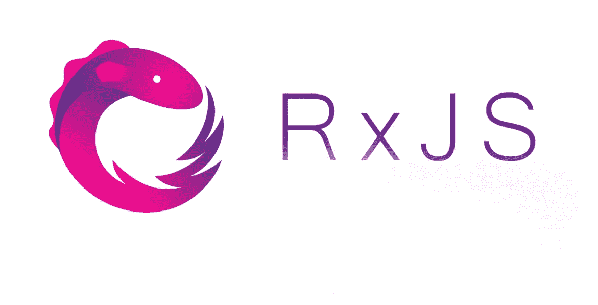

# RxJS 角度声明模式

> 原文：<https://betterprogramming.pub/rxjs-declarative-pattern-in-angular-cafba3983d21>

## [RxJS](https://medium.com/@lorenzozar/list/rxjs-39bc4f4110ec) ，[有角](https://medium.com/@lorenzozar/list/angular-5496c492a185)

## 使用声明性 RxJS 模式检索 Angular 中的数据



RxJS 徽标

RxJS 是一个 JavaScript 库，支持反应式编程，广义来说是一种声明式编程。然而，需要明确的是，RxJS 并没有让你的代码默认为反应式或声明式的。

您可以使用命令式或声明式风格进行编码。这两种风格都可以在合适的环境中增加价值。

然而，如果在使用 RxJS 时使用命令式编程风格，那么您可能会失去反应式/声明式编程风格的一些好处。

在开始一个使用 RxJS 和 Angular 的例子之前，我将简要讨论命令式编程和声明式编程之间的区别。

1.  命令式与声明式:简单介绍命令式和声明式编程风格之间的理论差异。
2.  Angular 中的 RxJS:通过一些例子展示了如何在 Angular 中使用 RxJS 按照命令式和声明式模式检索数据，从而将理论付诸实践。

为了充分利用这篇文章，你应该熟悉[角度](https://www.vitainbeta.org/2022/02/06/angular-tutorial-and-posts/)、 [RxJS](https://www.vitainbeta.org/2022/01/18/what-is-rxjs/) 和[可观测量](https://www.vitainbeta.org/2022/02/01/what-are-observables/)。尽管 RxJS 是框架不可知的，但它被广泛用于 Angular。

# 命令式 vs 陈述式

对于一些读者来说，这一部分是不必要的，因为命令式编程和声明式编程之间的区别已经在别处广泛讨论过了。

然而，如果你想更深入地挖掘，我在这一节的末尾增加了一些深度。

## 概观

简而言之，声明式编程告诉一个程序*需要做什么*；命令式编程告诉程序*如何*去做。

简而言之:

*   声明式编程描述了要实现的目标，但没有描述如何实现它。声明式编程不描述中间步骤；它回答了这个问题:目标是什么？示例语言:C、C++、Java。
*   命令式编程是程序应该执行以实现特定目标的一系列命令。命令式编程描述了如何实现目标；它回答了这样一个问题:如何实现目标？示例语言:Haskell、Lisp、SQL。

你可以用两种方法达到同样的目的。

## 什么和如何

假设我饿了，所以我的目标是煮点东西。


照片由 [Mgg Vitchakorn](https://unsplash.com/@mggbox?utm_source=medium&utm_medium=referral) 在 [Unsplash](https://unsplash.com?utm_source=medium&utm_medium=referral) 上拍摄

遵循陈述风格，我可以说“煮一些意大利面。”目标是什么？做些意大利面。

遵循命令式风格，我需要说明如何实现它:

*   烧开一升水
*   加入一撮盐
*   当水沸腾时，加入 80 克意大利面
*   包装上标明的时间过后，将意大利面从水中取出

这两种风格截然不同。

我们甚至可以说，命令式风格以一种逐步的、机械的方式解释了要做什么，但可能对我们想要解决的问题没有什么洞察力。

声明式风格提出了一个解决方案，并试图解决一个问题，而不解释如何解决。

## 上下文无关的

此外，我们可以说声明式编程是上下文无关的，因为我可以使用相同的声明在餐馆或其他上下文中烹饪意大利面。

遵循命令式的风格，我们声明了可能不适合其他环境(如餐馆)的数量。

## 优点和缺点

声明式编程比命令式编程好吗？看情况！

**声明式编程的抽象程度更高。**

更高层次的抽象既不好也不坏。它能把复杂的问题包装成简单的解决方案。它甚至可以通过隐藏一些复杂性来加速开发。

设想一个创建标准表单的库，包括样式和状态管理。太棒了！

只要您不需要更改表单的某些部分来适应您的特定用例。

对于更高层次的抽象，也是一样的。如果您不需要使用复杂性，并且不会对性能产生太大影响，那么隐藏复杂性是一件好事。

说了这么多，我们想对 RxJS 使用声明式风格。

# RxJS 以角度表示

同样，使用 RxJS 不会使您的代码具有声明性。实际上，只要你一使用`subscribe()`方法，你就要势在必行了！

让我们来看看检索数据的经典模式，并将其与声明性模式进行比较。

## 经典图案

在下面的代码中，您可以看到一个带有`getTodo`方法的 Angular 服务，它在第 20 行发出 HTTP GET 请求。

它返回一个`ToDo`类型的可观察对象。代码如下:

为了按照经典模式使用服务和可观察对象，我们需要适当地订阅和取消订阅。

在`app.component.ts`中，我们将订阅包含在`ngOnInit`中，以便在页面加载时检索数据。

我们将订阅存储在`subscription`变量中，这样当页面卸载时，我们可以很容易地在`ngOnDestroy`中取消订阅，如下所示:

我们可以在模板中使用字符串插值`{{data.title}}`来显示与我们检索到的数据相关的标题。

```
// app.component.html<div *ngIf="data">
  {{ data.title }}
</div>
```

## 陈述模式

让我们回顾一下代码，以实现一个声明性模式。

我们可以从服务开始，我们声明一个变量`todo$`，而不是声明一个`getTodo`方法。

美元符号是一种约定，表示变量是一个`Observable`而不是实际的数据。

让我们转到组件。

首先，我们删除所有管理订阅和相关导入的代码。在这个简单的例子中，我们甚至可以去掉`ngOnInit`和`ngOnDestroy`。

这里的关键行是第 10 行，它是:

```
data$ = this.todoService.todo$;
```

我们刚刚定义了另一个名为`data$`的局部变量。我们将服务中的可观察对象分配给变量，使其在组件中可用。

注意，我们不是在告诉 Angular 订阅或退订！我们甚至看不到一个观察者！这是真正的声明式风格的亮点。

最后，我们只想在模板中显示一些数据。这是我们的目标。Angular 如何实现它不关我们的事。

让我们转到模板。

我们使用异步管道。异步管道自动订阅和取消订阅，如下所示:

```
// app.component.html<div *ngIf="data$ | async as data">
  {{ data.title }}
</div>
```

首先，我们从组件绑定到`data$`。

其次，我们使用异步管道来订阅和取消订阅`data$`

第三，我们使用`as data`来定义变量，该变量将包含来自可观察值的值。最后，我们可以像以前一样在模板上使用`data`。

# 概述

要在 Angular 中使用声明性模式检索数据，

1.  首先在服务中声明可观察变量
2.  在组件中使用一个局部变量，使可观察对象在模板中可用
3.  在模板中使用角度异步管道