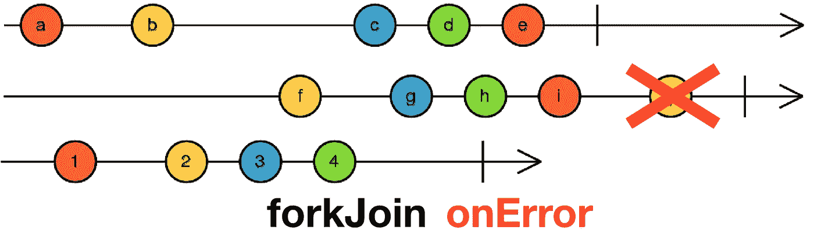
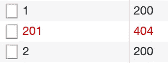
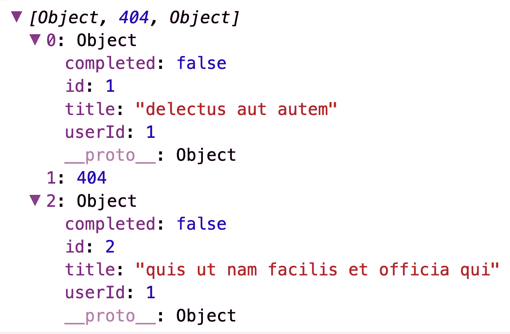
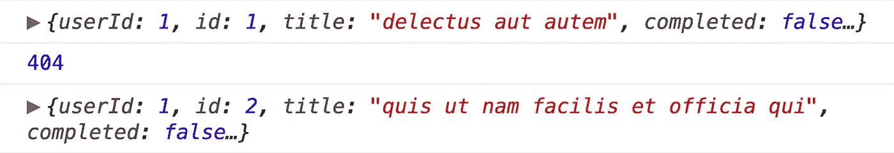

# RxJS:用 forkJoin 处理错误

> 原文：<https://betterprogramming.pub/rxjs-error-handling-with-forkjoin-3d4027df70fc>

## 组合静态方法的错误处理，如 forkJoin、concat 和 zip



如果你是 Angular 开发者，你已经熟悉了 [RxJS](https://rxjs-dev.firebaseapp.com/) ，或者，至少，你知道，在与`HttpClient`的服务通话之后，你应该订阅。

但是，如果对反应式扩展有更深入的了解，您总是可以获得更多。

有一些操作符，如果使用正确，可以使事情变得更容易，这不同于只知道如何订阅。这正是 RxJS 不得不[对运营商](https://rxjs-dev.firebaseapp.com/guide/operators)说的话:

> " RxJS 主要是对它的操作者有用，尽管可观测性是基础."

有时，当处理可观测量时，你最终不得不将它们结合起来。RxJS 为您提供了组合操作符和静态方法，帮助您处理这些情况，但是生活并不是一片美好。

当我们组合多个可观察对象时，试图处理错误就成了一个真正的问题，RxJS 方法通常不会如你所愿。

让我们来看一个例子，以及我写这篇文章的主要原因。

```
const todo1$ = this.myService.getTodo(1);
const error$ = this.myService.getTodo(201);
const todo2$ = this.myService.getTodo(2);forkJoin([todo1$, error$, todo2$])
  .subscribe(
    next => console.log(next),
    error => console.log(error)
  );
```

在上面的示例代码中，我使用一个服务来存储对 [JSONPlaceholder](https://jsonplaceholder.typicode.com/) 的 open API 的`GET`调用，每个调用都应该通过其`id`返回一个`todo`的可观察对象。

然后，我使用`forkJoin`合并这些观察值，它并行执行这些调用。

有些人可能会说，如果您需要合并请求，那么您这样做是错误的，或者您的后端是错误的。

嗯，您在前端处理的数据可能实际上来自数据库中的两个不同集合，或者您可能需要对表单中的每个修改对象执行请求，删除所有操作，等等。

`forkJoin`将订阅传递的观察值，因此发出`HTTP GET`请求。

根据 JSONPlaceholder 网站的信息，他们有 200 个待办事项，所以我特意设置了一个`error$`变量，用`201`作为`id`来调用`todo`。

这将返回一个错误，但是当我订阅时，我将如何接收信息呢？


由 forkJoin 的错误记录到控制台

检查控制台，我们只看到一条错误消息，由来自 subscribe 的`onError`回调捕获并记录。



Chrome DevTools 网络标签

但是等等……如果我们检查一下 DevTools 中的 network 选项卡，我们会看到所有三个`GET`都被调用了。`todo1$`和`todo2$`成功返回，那么他们在哪里？

根据 [RxJS 文档](https://rxjs-dev.firebaseapp.com/api/index/function/forkJoin)，原来`forkJoin`是这样工作的:

> 如果在某个时间点出现任何输入可观察到的错误，forkJoin 也会出错，并且所有其他可观察到的错误都会立即取消订阅

所以，你只是丢失了从`todo1$`和`todo2$`取回的信息。

同样，如果你是一个 Angular 开发者，这次使用的是 [NgRx](https://ngrx.io/) ，也许你已经担心*不会让你的可观察对象死去。*

这是因为，当在一个`Effect`内部管道化时，如果你没有正确处理一个错误，如果你再次调度它处理的动作，你的`Effect`可能会死亡并且不能被执行。

所以，这里的关键是单独处理错误，就像对每个可观察到的。

用`catchError`操作符管道化这个可观察值将处理错误，并将其映射到另一个值。您可以找到符合您需求的最佳方式，但这里有一些示例:

```
const error$ = this.myService.getTodo(201)
  .pipe(
    catchError(err => of(err.status)),
  );...const error$ = this.myService.getTodo(201)
  .pipe(
    catchError(err => of({isError: true, error: err})),
  );...const error$ = this.myService.getTodo(201)
  .pipe(
    catchError(err => of(undefined)),
  );
```

这样，一旦`error$`抛出一个错误，它将被内部处理，一个新的值将被返回给外部的可观察对象。您可以将错误映射到所示的任何其他值，如状态代码、未定义、全新的对象等。

现在，如果我们检查控制台，它将显示一个数组，包含两个`todo`对象和一个`string`，来自`error$`的状态代码。

这一切都由`forkJoin.subscribe(next => {})`处理，因为`forkJoin`不知道有错误。



通过 forkJoin 的 onNext 登录到控制台

同样的方法可以用于`concat`。根据其[文件](https://rxjs-dev.firebaseapp.com/api/index/function/concat):

> 创建一个输出可观察对象，该输出可观察对象依次发出给定可观察对象的所有值，然后继续下一个。
> 
> 如果链中的任何可观察对象出错，concat 也将立即出错，而不是将控制权传递给下一个可观察对象。在发出错误的观察对象之后订阅的观察对象永远不会被订阅。"

```
concat([todo1$, error$, todo2$])
  .subscribe(
    next => console.log(next),
    error => console.log(error)
  );
```

如果我们不应用我们的可观察的死亡预防，`concat`将发送`todo1$`的值，然后发送错误，不订阅`todo2$`。

如果我们在内部处理`error$`错误，那就是我们返回的值:



通过 concat 的 onNext 登录到控制台

# ***结论***

嗯，这里的关键是，如前所述，*不要让你的可观察对象死去*。

外部可观察对象不需要知道内部可观察对象抛出了一个错误，您可以返回重要的数据来找出哪个失败了。

这适用于其他情况，不仅是服务调用，还有其他组合方法甚至运算符。使用管道时，你可能会得到一个更高阶的可观测值，而不处理它的误差可能会导致真正的头痛。

我希望这有所帮助。