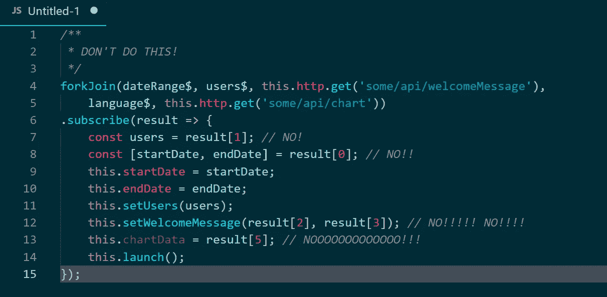

# RxJS forkJoin 最佳实践

> 原文：<https://betterprogramming.pub/rxjs-forkjoin-never-use-array-indexes-in-subscribe-1f4005582ae8>

## 永远不要在 Subscribe 中使用数组索引！

我们知道，当我们想并行订阅几个可观测量，等待全部完成，然后用结果做一些事情时，一个`forkJoin` 运算符是最佳选择。但是如果你写错了订阅代码，它可能会成为你的应用程序中一个非常糟糕的部分…

我经常观察到在 Angular 应用程序中结合 RxJS `forkJoin` 操作符编写的代码非常难看。这里有一些帮助你避免混乱和正确使用`forkJoin`的提示。

# 会有多糟？

您可能已经在您从事的项目中遇到过这种代码:

虽然这看起来很糟糕，但相信我，如果你不尽快开始重构，情况会变得更糟。

在这个`forkJoin`中，我们一次订阅五个可观测量，我们以五元素数组的形式获得结果，然后在订阅处理程序中，我们使用数组索引访问数据。

# **切勿使用数组索引访问来自 forkJoin 的数据！**

通过索引访问是你能做的最糟糕的事情。原因如下:

1.  `subscribe`法的正文完全不可读；你不知道这个神秘的`result[3]`或`result[5]`背后隐藏着什么信息。您需要参考`forkJoin`调用来找出它，但是这并不容易，因为您需要用手指数出可观察到的对象来找到正确的对象！
2.  每当您从`forkJoin`中添加或删除一个可观察对象时，索引都会改变。大多数情况下，您需要重新索引`subscribe`方法中的所有内容。这样的重新索引很容易引入错误，而且，当你需要这样做的时候，真的很令人沮丧。
3.  `subscribe`方法打破了单一责任原则。在订阅处理程序中，我们现在获取来自`forkJoin`的所有数据，我们将它分配给一些私有字段，我们同步它，我们启动一些方法，最后，我们触发基于所有先前步骤和获取的数据的最终动作。大多数情况下，您不会被迫将所有内容都打包到 subscribe 方法中，但无论如何，您还是会这样做。如果不担心分离关注点，你很快就会用一个庞大、笨拙的方法完成所有的事情。

现在快来解一下。

# 我们如何避免 forkJoin 问题？

在`forkJoin subscribe`方法中，你应该对来自可观测量的数据不那么感兴趣，而是关注所有可观测量都已经完成的事实。

获取数据可能不是`forkJoin subscribe`所关心的。更重要的是确保数据已经完全可用，并且可以安全使用。

数据存储通常可以直接转移到作为参数传递给`forkJoin`的可观测量中。我们可以使用 RxJS `tap`操作符来处理数据，就像这样:

看看通过应用这个简单的技巧，一切都变得简单了。我们现在有一个非常简单的`subscribe`方法，大部分数据处理直接在传递给`forkJoin`的可观测量中进行。

我们分开关注；日期范围由`dateRange$` observable 直接存储在私有字段中，`setUsers`方法由`users$` observable 运行，最后，图表的配置在调用 API 后被获取和设置。

但是我们仍然有一些数组索引出现在`subscribe`方法中，我们已经知道这是不好的。我们不能将代码直接移动到可观测量中，因为该方法依赖于来自其中两个可观测量的数据，并且这两个可观测量都需要在运行之前完成。

我们如何帮助自己？嗯，我们可以引入另一个私有字段来存储数据和处理问题，就像例子中的其他可观测量的情况一样。我们也可以创建一个嵌套的`forkJoin`来分别处理这两个可观测量。相反，让我们使用最简单的解决方案:析构数组。

如你所见，我们现在有了完全可读的`forkJoin`代码，没有任何上述的缺点。我们已经命名了感兴趣的数组元素，并在代码中使用了这些名称。现在看起来好多了:

在`subscribe`方法中，数组索引不再访问任何数据。

但是也许你已经注意到了，我们仍然需要计算去符号化符号中的逗号！我们能容易地修理它吗？实际上是的，因为我们现在只使用来自 subscribe 方法中两个可观测量的数据。让我们重新排列`forkJoin`中的观察值:

这就是我们如何最终得到整洁、自我解释、易于维护的`forkJoin`代码！希望你注意到不同之处:)

# 关键要点

1.  切勿使用`forkJoin subscribe`中的数组索引访问数据。这导致了不可读的代码、维护噩梦和潜在的错误。
2.  在可能的情况下，通过将代码移动到专用的可观察对象来减少订阅逻辑。
    在 subscribe 中，当所有数据都可用时，只关注你需要做的事情，将所有其他内容移出一个`forkJoin` subscribe。
3.  爱 RxJS！:)

P.S .有没有注意到结果数组里没有`result[5]`？最后一个元素实际上是`result[4]`。这在代码中从未使用过，而我们一直在访问总是未定义的`result[5]`。
这正是在`forkJoin`:)中使用索引时发生的事情