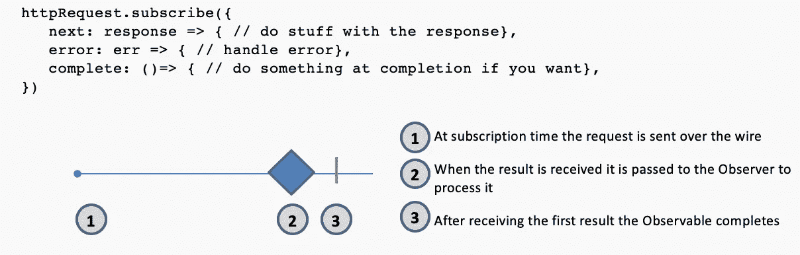
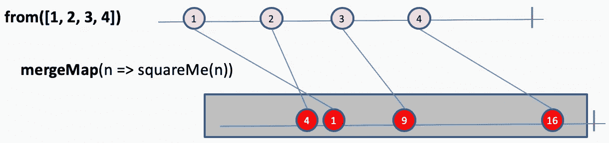
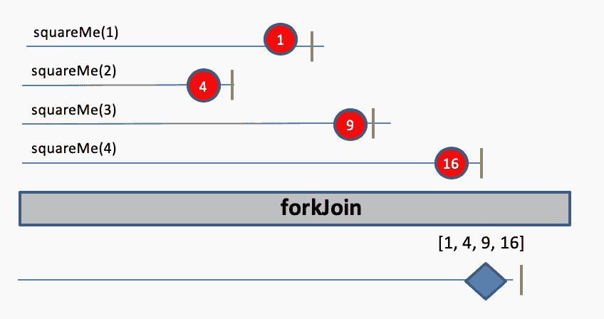
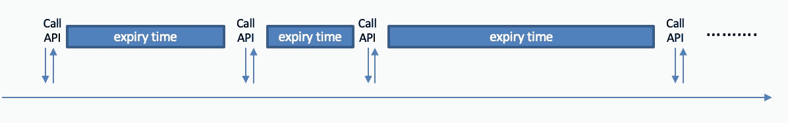
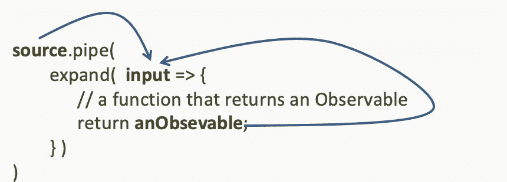
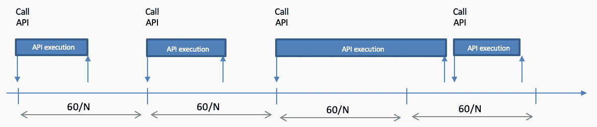

# 异步 API 的反应式编程模式

> 原文：<https://betterprogramming.pub/rxjs-patterns-emerging-from-stackoverflow-asynchronous-api-calls-as-streams-in-the-real-world-ef636c9af19a>

## 堆栈溢出的真实场景


图片来源:作者

反应式编程越来越受欢迎，对[react vex](http://reactivex.io/)库的使用也是如此。越来越多的人开始使用这种范式，并且在他们的学习道路上经常面临类似的问题。相似的问题需要相似的解决方案，这就是模式。

理解现实问题的一个有趣来源是堆栈溢出。我前段时间开始关注围绕 RxJS 的问题，我注意到了一些反复出现的主题和人们必须应对的类似情况。

一个流行的主题是异步 API 调用；换句话说，如何处理现实世界中的 HTTP 请求。例如:

*   如何顺序调用多个异步 API，每个都依赖于前一个的结果？
*   如何将参数数组转换成异步调用数组并控制它们的执行？
*   即使我们无法预测每个请求需要多长时间才能返回，如何以预定义的频率随时间递归调用 API？

让我们看看如何处理这种情况。

# 顺序调用许多异步 API 来完成工作

调用一些 REST APIs。对于许多人来说，这是 RxJS 的第一个问题。REST APIs 本质上是异步的，可以建模为只有一个值的流。



作为可观察对象的 HTTP 请求

在实际场景中，我们经常需要发出不同的 API 调用来完成工作。这里有一些如何处理这些情况的例子。

## **合并顺序发射的可观测结果**

通常我们需要连续地打几个电话来得到我们想要的东西。例如，假设我们有两个 API，一个返回雇员的详细信息，给定他们的 ID，另一个返回部门的详细信息，同样给定其 ID:

*   `getEmployee(id: string) : Observable<Employee>`
*   `getDepartment(id: string) : Observable<Department>`

`Employee`包含了`departmentId`他们工作的地方。我们需要做的是一起返回员工及其部门的详细信息。

这里的关键是按顺序进行这两个调用，即使两个调用都是异步的，然后合并两个结果。这是一种可能的方法:

```
getEmployee(employeeId).pipe(
  **concatMap**(employee => getDepartment(employee.deptId).pipe(
    **map**(department => ({employee, department}))
  ))
)
```

使用`concatMap`，我们保证`getEmployee`在我们移动到下一个可观察对象之前完成，这是由`getDepartment`返回的。一旦`getDepartment`发出，我们就使用`map`操作符转换发出的值，该操作符直接在`getDepartment`之后通过管道传输。注意到`employee`在`map`操作符所在的闭包内是很重要的，所以它可以在传递给它的函数内使用。这就成功了。

我们不能在最外部的管道中使用`map`操作符，因为根据 JavaScript 闭包的可见性规则，`employee`变量是不可见的。

```
getEmployee(employeeId).pipe(
  concatMap(employee => getDepartment(employee.deptId)),
  // **employee variable is not visible here**
  map(department => ({employee, department})) // **would not compile**
)
```

作为旁注，短语法`department => ({employee, department})`相当于`department => {return {employee, department}}`。

引起我注意这个问题的堆栈溢出问题是[这个问题](https://stackoverflow.com/questions/52225197/how-can-i-get-the-value-of-the-first-observable-in-a-chain-of-observables-relati)和[这个问题](https://stackoverflow.com/questions/52271612/how-to-merge-static-observable-with-dynamic-in-rxjs-6)。

## **沿着一条长长的运算符管道传递一个值**

这个例子与调用异步 API 没有严格的关系，但是经常与调用异步 API 联系在一起。

让我们考虑一个类似的例子。我们需要计算员工家庭住址和办公地点之间的距离。像以前一样，我们需要获取雇员详细信息来获得雇员地址，然后获得部门详细信息。不过，这一次，为了读取办公地点的地址，我们需要调用第三个 API，将部门 ID 作为参数。一旦我们有了两个地址，我们就可以调用最后一个服务来获得两个地址之间的距离。

我们当然可以扩展以前使用的相同方法，如下所示:

然而，这种风格很容易变得乏味。传递雇员数据的需要使代码变得混乱。我们希望找到一种更简单的方法来做到这一点，JavaScript 闭包再次派上了用场，如下所示:

在这种情况下，关键点是创建一个函数，在我们的例子中是一个名为`closureF`的箭头函数，它需要一个参数`employee: Employee`。由于这是一个函数的参数，它在整个函数中都是可用的，所以`closureF`函数中的任何操作符都可以直接访问它。

顺便提一下，在`concatMap(closureF)`中，我们使用了一个相当于`concatMap(employee => closureF(employee))`的紧凑语法。

这个例子启发我的堆栈溢出问题是[这个问题](https://stackoverflow.com/questions/51578014/sane-way-to-pass-keep-a-value-throwout-a-long-pipe)和[这个问题](https://stackoverflow.com/questions/60533679/removing-side-effect-from-observable-implementation/60535164#60535164)。

# 从进行异步调用数组所需的参数数组开始

假设我们有一个产品代码列表，我们需要通过调用一个异步 API 来获取每个产品的详细信息。有时我们没有接受一系列代码的 API，而只有一个接受单一产品代码的 API。在这种情况下，我们的代码列表被转换成一系列 API 调用。

在这种情况下，我们可能会面临不同的需求。我们可能被要求让调用以与产品代码的初始数组相同的顺序返回结果。我们可能被要求设置并发调用的数量限制，以控制 API 服务器上的负载。我们可能被要求并行运行所有调用，并在所有调用完成后立即返回所有结果。

让我们看看如何使用 RxJS 操作符来处理这些情况。

## **从一个参数数组开始调用一堆 API**

这是最简单的场景。我们只需要调用 API 的次数和数组中参数的数量一样多。然后我们处理结果，忽略了结果可能以不同的顺序返回的事实。为了使这个例子更容易绘制，我们假设我们的远程服务器提供了一个对数字求平方的 REST API。


服务器被多次调用，结果以不同的顺序返回

这里的解决方案是通过使用`mergeMap`操作符，也就是`flatMap`来提供的。

```
from([1, 2, 3, 4]).pipe(
   **mergeMap**(n => squareMe(n))
)
```

下面的大理石图显示了一段时间内的行为



如果我们想保证返回值的顺序不变呢？嗯，在这种情况下，我们使用`concatMap`而不是`mergeMap`，生活将对我们有利。

```
from([1, 2, 3, 4]).pipe(
   **concatMap**(n => squareMe(n))
)
```

保证所有可观察的事物将按照它们被创建的顺序被处理；更准确地说，只有当第一个观察完成时，我们才能转向下一个观察。

## 限制服务器上的并发点击次数

在前面的示例中，我们将多次并发访问服务器。我们无法控制针对它发出多少并行调用。不过，有时我们可能不得不控制这个数字。服务器能够为单个客户机管理的并发请求有一个限制，我们可能不想超过这个限制。

在这种情况下，我们可以再次使用`mergeMap`，指定第二个可选参数`concurrency`。该参数允许我们设置在`mergeMap`内可同时处理的最大观察值，更准确地说是*订阅的*。

```
from([1, 2, 3, 4]).pipe(
   **mergeMap**(n => squareMe(n), 2)
)
```

上面的例子显示了我们如何确保最多同时有两个 HTTP 请求在运行。

如果我们把`concurrency`设为 1 会发生什么？这意味着我们一次只有一个请求，这意味着我们连接所有的请求，这意味着`concatMap`相当于`mergeMap`设置为 1。

## 并行运行所有 API，并在所有 API 都完成(或出现一个错误)时返回

我们要考虑的最后一种情况是，当我们希望有许多请求并行运行，并在所有请求都完成或其中一个请求出错时得到通知。

在这种情况下，操作员要查看的是`forkJoin`。`forkJoin`接受一个观察值数组作为输入，并返回一个数组，该数组包含作为输入传递的每个观察值发出的最后值。

回到我们的例子，这意味着我们必须首先构建一个可观测量数组，然后将它传递给`forkJoin`，就像这样:

```
const **arrayOfObservables** = [1, 2, 3, 4].map(n => squareMe(n));
forkJoin(**arrayOfObservables**);
```

我们可以用大理石图来想象这种情况下会发生什么。



# 随着时间的推移递归调用 API

当我们需要随着时间的推移重复调用一些异步 API 时，一些有趣的问题就出现了。

## **在 API 自身返回的数据指定的到期时间后，刷新 API 中的数据**

假设我们有一个远程服务，可以通过 REST API 获取一组数据。作为此类数据的一部分，服务器返回一个到期时间，该时间指示数据可被视为有效的截止时间。

有效性一过期，我们就想获取新的有效数据。

我们需要做的是反复调用 REST API，根据上一次调用的结果设置每次调用的时间。



这是一个递归问题，当我们看到递归时，我们需要考虑`expand`运算符。

在不涉及文档中可用的太多细节的情况下，我们可以说`expand`是一个接受函数作为其参数的操作符。这个函数需要返回一个可观察值。由源可观测值和由输入函数返回的可观测值通知的每条数据都作为输入传递回函数本身。



记住这一点，我们可以在验证时间到期后处理调用 API 的问题，如下所示:

```
fetchDataAndExpiry().pipe(
   expand(({data, expiry}) => fetchDataAndExpiry().pipe(
      delay(expiry)
   ))
)
```

需要注意的是，传递给`delay`操作符的参数是前一个调用返回的`expiry`的值。

上面的解决方案忽略了远程调用本身引入的延迟。如果我们要考虑它，我们必须稍微复杂一些代码，就像这样:

[这个问题启发了](https://stackoverflow.com/questions/49886776/rxjs-repeat-api-call-based-on-duration-specified-in-response)这个例子。

## **平均每分钟调用一个 API N 次**

这是另一个有趣的例子。还有一个远程服务器为客户端提供 REST API。不过，这一次，平均而言，客户有权在某个时间间隔内调用该服务一定的次数。例如，他们可以每分钟调用 API 十次，即每六秒一次。通常，API 在该时间间隔内响应，但有时可能需要更长时间。在这种情况下，您有权在返回后立即调用 API，因为您将保持在为您设置的平均值范围内。



为了解决这种情况，我们可以使用`interval`和`concatMap`的组合，就像这样”

```
interval(throttleTime).pipe(
   concatMap(() => callAPI())
);
```

`throttleTime`是我们平均必须遵守的时间间隔，以毫秒表示。所以，如果我们每分钟可以发出十个 API 调用，`throttleTime`就是 60 / 10 = 6.000 毫秒*。* `interval`然后创建一系列事件，每六秒触发一次。这是我们调用服务器的节奏。

使用`concatMap`，我们将这样的事件转换成另一个可观察的流，即通过调用`callAPI()`函数返回的可观察的流。`concatMap`还确保这些新的可观测量按顺序订阅，即它们被连接。因此，如果一个调用的返回时间超过 6 秒，那么下一个调用必须等待它完成后才能被触发。

这是[激发这个例子](https://stackoverflow.com/questions/52289312/how-to-make-repeated-http-requests-not-more-than-every-n-seconds-with-rxjs)的问题。

# 结论

这些是我们在读取堆栈溢出问题时发现的一些常见问题的例子。其他主题也有待研究。如果您喜欢这种方法，我们可以继续研究其他模式。