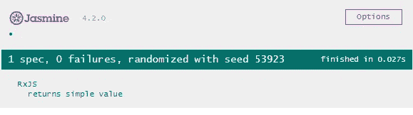
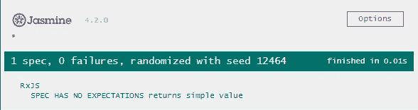
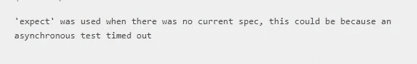
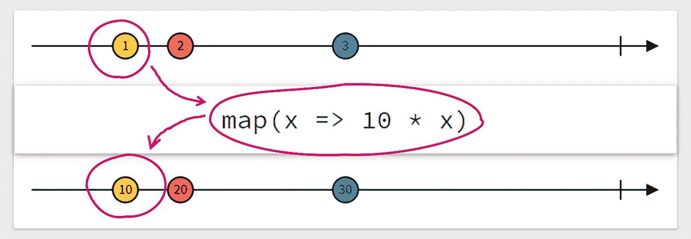
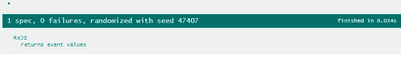
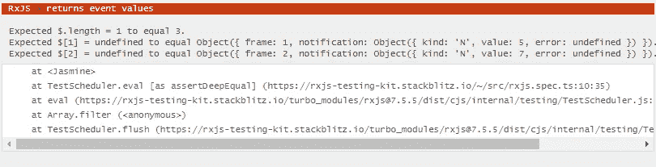

# RxJS 测试——为可观察性编写单元测试

> 原文：<https://betterprogramming.pub/rxjs-testing-write-unit-tests-for-observables-603af959e251>

## 通过使用 RxJS 测试特性编写测试来提高您的单元测试技能。


照片由 [Davyn Ben](https://unsplash.com/@davynben?utm_source=medium&utm_medium=referral) 在 [Unsplash](https://unsplash.com?utm_source=medium&utm_medium=referral) 上拍摄

RxJS 是一套非常强大和酷的工具，用于创建反应式应用程序。在开发 Angular 应用程序时，您很可能会遇到 RxJS，所以我假设您熟悉如何使用它。

然而，当我大约三年前开始使用 Angular 时，当我问他们如何用 observables 进行测试时，我得到了一些困惑的表情。下面是我是如何开始和结束为可观测性编写单元测试的。

# 天真的初学者示例

让我们从一个简短的例子开始:一个函数，它接受一个句子，并以相反的顺序返回它。

```
export function myFunction1(x: string): Observable<string> {
  return of(x).pipe(
    map((x) => x.split(' ')),
    map((x) => x.reverse()),
    map((x) => x.join(' '))
  );
}
```

我想向您展示当我开始用 observables 进行单元测试时，典型的单元测试是什么样子的:

```
describe('RxJS', () => {
  it('returns simple value', () => {
    const y = myFunction1('humans eat tomatoes'); y.subscribe((value) => expect(value).toBe('tomatoes eat humans'));
  });
});
```

嗯，这是一个简单的方法，毫无疑问，它很有效。



成功测试

如果你不知道这部电影，它是人类历史上最糟糕的恐怖电影之一。如果你想浪费时间，绝对值得一看。

好吧，让我们异步调用并增加一些延迟:

```
export function myFunction1(x: string): Observable<string> {
  return of(x).pipe(
    map((x) => x.split(' ')),
    map((x) => x.reverse()),
    map((x) => x.join(' ')),
    delay(10)
  );
}
```

乍看之下，这个测试显然是成功的，但是当你仔细观察时，你会发现这个测试没有任何预期。这意味着我们的测试没有检查任何东西。



成功的测试，但没有期望。

您也可能会收到以下警告:



由于超时，测试失败。

测试只是在计算发出的值之前完成。一种简单的方法是对其进行异步测试:

干得好！它工作了。顺便说一下，将`async`放在测试用例回调的前面是不起作用的，除非你运行一个可承诺的测试用例。另一方面，您可以使用`[@angular/testing](https://angular.io/api/core/testing/fakeAsync)`包中的`fakeAsync()`来代替，并使用`tick()`来模拟一个计算周期。

但这不是我们想要用于复杂 RxJS 测试的。我们想用正确的方式来做:RxJS 测试

# 大理石图

所以，让我们从大理石图的一些基础开始。如果您使用可观测量，您可以考虑像溪流或流动一样的值的发射。当您将运算符应用于流时，值将会改变，并且后续的流会发出其他值。你有某种输入值，相应的操作符，它修改输入值和结果输出值(见下面的`map()`操作符的例子)



简单的大理石图

现在你可以给每个发射值分配一个字母，比如`a`、`b`和`c`。流的末端用管道`|`表示。错误用一个`#`来表示。现在可能的情况是，在发射值之间经过了一段时间。可观测的时间可以用虚拟帧来表示，虚拟帧通常为 1 毫秒长，用`-`或类似于`5s`或`100ms`的时间级数值来表示。如果在同一时间范围内发出多个值，您可以使用`()`将它们组合在一起。一些例子:

```
a--b| // emits 'a' then after ~40ms 'b' and completes
(a|)  // emits 'a' and completes immediately 
a--b-a--c-a--| // emits a series of values
a---# // emits 'a' and errors out after some time.
```

# `rxjs/testing`

RxJS 附带了一个方便的工具集，使用如上所述的大理石图来测试可观测量。

首先，我们需要一个`TestScheduler`，我们把它放在单元测试文件的顶部:

现在，我们可以再次调整我们的单元测试:

测试又变绿了。万岁！但是让我们检查一下我们在这里添加了什么。首先，我们定义我们期望的大理石图(1)。

```
----------(a|) // after 10 'ticks' the observable emits 'a' and completes immediately after that.
```

不用写`----------` 来表示 10ms 的时间，也可以直接写`10ms (a|)`。

然后，我们定义我们的期望值(2)，其中我们用来自我们的大理石图的键和相应的值创建一个对象结构。

```
const expectedValues = {
  a: 'tomatoes eat humans',
};
```

最后，我们让测试调度程序运行(3)。

# 读取错误

现在，当一切正常时，单元测试是绿色的，我们都很好。然而，通常情况下，事情不会马上解决。如果出了问题，我们会得到什么？

让我们看看我们的测试调度程序实际上在比较什么。概括一下，这是我们的比较器:

```
(actual, expected) => { return expect(actual).toEqual(expected) }
```

这是对类型为`any`的实际值和期望值的深度相等检查，咄！
无论如何，这项检查实际上是在验证几件事情，这可能发生在订阅期间。

有四种类型的问题:

*   帧的长度(即意外发射的项目数)
*   帧的数量(即，预期的时间帧是意外的)
*   帧的种类(即项目、完成、错误、订阅、取消订阅)
*   帧值(即发出的项目值或错误消息)

假设，我们在函数中忘记了一些东西:

```
export function myFunction1(x: string): Observable<string> {
  return of().pipe(           // we forgot to call of(x)
    map((x) => x.split(' ')),
    map((x) => x.reverse()),
    map((x) => x.join(' ')),
    delay(10)
  );
}
```

这就是我们得到的结果:


各种错误

## 帧长度不正确

```
Expected $.length = 1 to equal 2.
```

上面的错误告诉我们，我们期望两个帧，但只得到一个。所以你得到了`Expected $.length = X to equal Y`，当你发射的物品比预期的多或少。

## 帧号不正确

```
Expected $[0].frame = 0 to equal 10.
```

上述错误表明，帧号不正确。所以你得到了`Expected $[i].frame = X to equal Y`，其中`i`是该帧的索引，也就是我们例子中的第一帧。

## 框架类型不正确

```
Expected $[0].notification.kind = 'C' to equal 'N'.
```

上述错误表明帧的种类或类型不正确。因此，如果流发出另一种类型的信号，你就会得到`Expected $[i].notification.kind = '...' to equal '...'`。典型的信号有:

*   `N` =发射项目
*   `C` =完成
*   `E` =错误

在我们的例子中，我们期望在第一帧有一个项目，但是得到了一个完成信号。

## 帧值不正确

```
Expected $[0].notification.value = undefined to equal 'tomatoes eat humans'.Expected $[1] = undefined to equal Object({ frame: 10, notification: Object({ kind: 'C', value: undefined, error: undefined }) }).
```

上述错误表明框架/项目的值不正确。所以如果实际值不正确，就会得到`Expected $[i].notification.value = ... to equal ...`。在第二个误差中，你可以看到，这种误差也适用于整个帧。在我们的例子中，第一帧的值是未定义的，但应该包含“番茄吃人”，而第二帧根本不存在。

# 科目呢？

有时您有事件驱动的用例，其中您有触发器，它导致任何类型的动作，和事件管道，您可以在其中监听更新。

下面的例子是一个带有初始值的`BehaviorSubject`。每次我们调用`add`或`minus`函数时，我们都使用`scan`操作符来计算当前值和新值之和。例如，这两个函数可以绑定到按钮和输入字段。

让我们为此编写单元测试:

这是结果，目前为止是好的:



科目测试成功

但是我们现在如何触发函数调用呢？一个简单的实现应该是这样的:

但这是行不通的。根本没有发射任何项目。为什么会这样？本质上是因为`testScheduler`在自己的同步范围内运行，因此`setTimeout`的两个任务在测试后执行。



使用触发器时测试失败

为了解决这个问题，我们必须在`testScheduler`范围内运行触发器。除了`expectObservable`之外，`testScheduler`还提供了一些额外的助手。你可以在这里找到关于他们的文档:[https://rxjs.dev/guide/testing/marble-testing#api](https://rxjs.dev/guide/testing/marble-testing#api)

使用`triggerMarbles`和`triggerValues`我们可以创建函数调用，它会在我们需要的确切时间发生。

```
const triggerMarbles = '-abcabc';
const triggerValues = {
  a: () => add(5),
  b: () => add(2),
  c: () => minus(7),
};
```

我们现在需要`cold`助手来运行这些触发器:

```
testScheduler.run(({ expectObservable, cold }) => {
  ...
  expectObservable(
    cold(triggerMarbles, triggerValues).pipe(tap(fn => fn()))
  );
});
```

`expectObservable`订阅(以及退订)我们的 cold observable。用`.pipe(tap(fn => fn()))`我们运行相应的触发功能。

现在，我们可以调整预期输出:

```
const expectedMarbles = 'abcabca';
const expectedValues = {
  a: 0,
  b: 5,
  c: 7,
};
```

把所有东西放在一起，我们有这个单元测试:

# 已知限制

你可以在这里了解已知的限制:[已知问题](https://rxjs.dev/guide/testing/marble-testing#known-issues)。然而，我想总结其中一些，因为它们可能不是那么明显。

## Promises / setTimeout()

承诺不支持作为可观察的来源，即类似下面的代码不能用`testScheduler`断言:

```
from(Promise.resolve('something'))
```

这意味着，每个 API 都会返回一个承诺，比如封装在 observables 中的`fetch()`或`async`函数。为了让这些工作，你必须退回到上面解释的异步测试，例如使用`done()`。

# 鳍！

你可以在这个 stackblitz 项目中找到上面的例子:[https://stackblitz.com/edit/rxjs-testing-kit?file=main.ts](https://stackblitz.com/edit/rxjs-testing-kit?file=main.ts)

我希望这能帮助你用 RxJS observables 编写单元测试。


照片由[上的](https://unsplash.com/@theblowup?utm_source=medium&utm_medium=referral)放大[去飞溅](https://unsplash.com?utm_source=medium&utm_medium=referral)