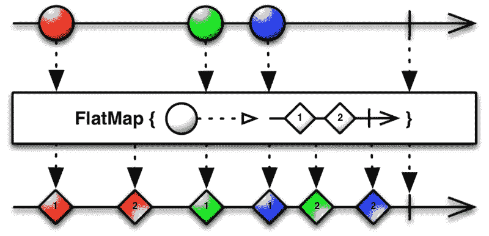

# RxSwift:深入平面地图

> 原文：<https://betterprogramming.pub/rxswift-deep-inside-flatmap-1ca150c41b18>

## 理解 Combine 和 RxSwift 中最强大(也最容易混淆)的运算符之一的指南


[插图](http://reactivex.io/documentation/operators/flatmap.html)通过 ReactiveX 文档

ReactiveX 武器库中最强大的操作之一是`FlatMap`。然而对许多人来说，这也是最难理解的操作之一。

今天我们将深入研究`FlatMap`，当我们完成时，你将确切地知道它是如何工作的，何时使用它，以及如何避开它周围的一些陷阱。

为此，我们将深入了解一些 RxSwift 运算符。一旦您理解了一些实现细节，其余的也就变得容易理解了。

尽管 Combine 的实现可能会有所不同，但一旦您理解了 RxSwift 版本背后的关键概念，您将能够在任何地方和任何平台上使用它。

所以让我们开始吧。

# 平面图函数签名

函数签名帮助不大。

```
extension ObservableType {
  func flatMap<O:Observable>(_ selector:(E) -> O) -> Observable<O.E>
}
```

为了清晰起见，我对签名做了一点编辑，但是除非你是 RxSwift 和泛型方面的专家，否则它仍然非常密集。所以我们来试试官方的定义。

## 官方定义

引用 ReactiveX 网站上关于 `[FlatMap](http://reactivex.io/documentation/operators/flatmap.html)`的[文档:](http://reactivex.io/documentation/operators/flatmap.html)

> “`FlatMap`运算符通过将您指定的函数应用到源可观察对象发出的每个项目来转换可观察对象，其中该函数返回一个自身发出项目的可观察对象。`FlatMap`然后合并这些产生的可观测量的发射，发射这些合并的结果作为它自己的序列。
> 
> 例如，当您有一个发出一系列项的可观察对象，这些项本身具有可观察成员或者可以通过其他方式转换为可观察对象时，此方法非常有用，这样您就可以创建一个新的可观察对象，它发出由这些项的子可观察对象发出的项的完整集合。"

第一次看到这个，读起来像古梵文，眼睛开始呆滞。再读一遍(第三遍、第四遍、第五遍)也无济于事。

本文开头展示的大理石图似乎也没有太多意义。三个事件进去了，六个事件出来了——但是它们都混在一起了。这是怎么回事？

然而，今天，我可以读他们两个，理解他们想说什么，当我们完成时，你也能。

# 一些基本原则

我将从今天讨论的几个重要基础开始。请通读它们，以确保你和我在同一页上，我们在讨论同样的事情。

在 RxSwift 中，人们订阅可观测数据以接收未来事件。这和我们在 iOS 中使用`NotificationCenter`真的没什么区别。

```
NotificationCenter.default
    .addObserver(self, selector: #selector(onOrientationChange(_:)), name: UIDevice.orientationDidChangeNotification, object: nil)func onOrientationChange(_ sender:AnyObject) {
    // do something
}
```

我们向`orientationDidChangeNotification`添加了一个观察者，并告诉它我们希望在将来每当事件发生时得到通知。因此，每当用户旋转他们的设备时，我们的`onOrientationChange`委托就会被调用。

在 RxSpeak 中，我们订阅了一个可观察对象来接收未来事件。因此，当在 RxSwift 中完成时，这看起来相似也就不足为奇了。

```
NotificationCenter.default
    .rx
    .notification(UIDevice.orientationDidChangeNotification)
    .subscribe(onNext: { _ in
        // do something
    })
    .disposed(by: disposeBag)
```

唯一真正的区别是我们的订阅处理程序是一个闭包而不是一个委托函数，RxSwift 使用了一个额外的`disposed(by:)`操作符来取消我们不再需要的订阅。

# 卷你自己的

那么，如果我告诉你我们需要一些代码来做类似于`NotificationCenter`的事情，但是你实际上不能使用`NotificationCenter` (或者 Rx 或者 Combine)呢？

嗯，如果你想一分钟，你可能会意识到在它的核心，`NotificationCenter`实际上只不过是一个字典，它的关键字是通知名，它的值是一个观察器数组。也许让键字符串和订户闭包只是为了使实现更简单。

当发送一个通知时，send 函数所做的就是在字典中查找该通知，获取订阅数组，然后遍历该数组，依次执行每个闭包。“哟，伙计们。是时候了。做你的事。”

大概是这样的:

```
class MyNotificationCenter { static var subscriptions: [String:[() -> Void]] = [:] static func subscribe(name: String, block: @escaping ()->Void) {
        var subs = subscriptions[name] ?? []
        subs.append(block)
        subscriptions[name] = subs
    } static func send(name: String) {
        subscriptions[name]?.forEach { $0() }
    }

}
```

之后，你可以做:

```
MyNotificationCenter
    .subscribe(name: "myEvent") {
        // do something when myEvent occurs
    }MyNotificationCenter.send(name: "myEvent")
```

我想说的是在所有花哨的术语背后，这些东西只是代码。

这并不是说代码不复杂。RxSwift 对其`Element`类型和锁定使用泛型，以确保它是线程安全的和可处理的，从而管理订阅生命周期。所有这些都增加了复杂性——毫无疑问。

但是核心概念足够简单。

一个*可观测的*是事件的来源。一个*订阅*订阅那些事件。发送事件可以简单到遍历一组订阅者，并告诉每个订阅者他们感兴趣的事件已经发生。

# 事件

在 RxSwift 中，我们谈论了很多关于事件的内容。下面是实际的定义:

```
public enum Event<Element> {
    /// Next element is produced.
    case next(Element)
    /// Sequence terminated with an error.
    case error(Swift.Error)
    /// Sequence completed successfully.
    case completed
}
```

一个`Event`只是列举了三种情况。

1.  `next(Element)`用来传递我们感兴趣的值。如果你创建了一个`PublishSubject<String>`，那么`Element`就是`String`。
2.  `error(Swift.Error)`用来传递任何可能发生的错误。
3.  `completed`简单地告诉我们，我们完成了，不会再有新的事件发生。

请注意，如果订阅链生成错误或完成事件，整个订阅链都会关闭。

# 出版主题

你可能已经注意到，在创建`MyNotificationCenter`的过程中，我们基本上构建了自己的 RxSwift 的`PublishSubject`的微缩版本。

```
let publisher = PublishSubject<Void>()publisher
    .subscribe(onNext: { _ in
        print("We've got one!")
    })
    .disposed(by: disposeBag)publisher.onNext(())
```

在 RxSwift 中，发布者使用`onNext`通过订阅链将下一个元素发送给订阅者(对应于前面提到的`Event`枚举的`next`部分)。

# 订阅链

RxSwift 和 Combine 都与*订阅链*打交道。通常你有某种类型的发行商，在链条的中间可能有一个或两个(或三个或 15 个)运营商，最后都以订阅或绑定结束。

```
let publisher = PublishSubject<Int>()publisher
    .map { $0 * 2.5 }
    .filter { $0 > 10 }
    .subscribe(onNext: { n in
        print("We've got number \(n)!")
    })
    .disposed(by: disposeBag)
```

当你订阅或绑定到一个可观察或一个*可观察链*时，订阅链就建立了。换句话说，这就是可观测链。

```
let chain = publisher
    .map { $0 * 3 }
    .filter { $0 > 10 }
```

当您的代码订阅或绑定到订阅链时，订阅链就在幕后构建了。

```
chain
    .subscribe(onNext: { n in
        print("We've got number \(n)!")
    })
    .disposed(by: disposeBag)
```

幕后发生的事情令人着迷。

实际上，`subscribe`函数隐藏闭包并订阅链中的最后一个可观察对象。这里它订阅了`filter`，它基本上告诉它，“嘿，老伙计。每当你碰巧得到一个你想传递的事件，把它委托给我。”

反过来，`filter`操作符对其父操作符`map`做同样的事情。“哟。把你收到的任何事件的结果发给我。当然，在那之后，你要对他们做什么就做什么。”

最后，`map`订阅了链中的父节点`publisher`，正如我们已经看到的，它只是将订阅添加到订阅者列表中。

# 发送事件

现在，如果我们告诉发布者发送一个事件给它的观察者…

```
publisher.onNext(5)
```

…我们触发以下事件序列:

1.  `publisher`打开它的订阅代理列表，取出第一个，并向它发送一个`5`。
2.  `map`操作符接收一个`5`，将值传递给它的闭包，然后将结果发送给链中的下一个委托(`3*5=15`)。
3.  `filter`操作符接收`15`并将该值传递给它的比较闭包，在这种情况下，比较闭包返回`true`。因为是`true`，所以`filter`将继续发送当前值给它的代理。
4.  订阅(`subscribe`)接收`15`并将其传递给`onNext`处理程序，后者打印出“`We’ve got number 15!`”
5.  订阅链已经完成了。我们所有的嵌套调用都返回到发布者循环。
6.  现在，循环将`onNext`值`5`发送给列表中的下一个订阅者，依此类推，直到发布者知道的每个订阅链都被通知了新值。
7.  现在我们从`onNext`语句中返回。

再次强调，这里的要点是 Rx 序列不是黑魔法。告诉发布者`onNext(5)`开始一个调用委托的循环，委托调用闭包，闭包的值传递给链中的下一个委托。

这个过程不断重复，根据操作者的不同会有不同的铃声和哨声，直到我们完成。

# 过滤器

这一点非常清楚，让我们看看过滤操作符的一个假想实现的内部。(这不是实际的 RxSwift 实现，但它演示了实际使用的机制。)

```
class FilterOperator: Observable<Element> { var subscriber: Subscriber<Element>
    var predicate: (_ value: Element) -> Bool func on(_ event: Event<Element>) {
        switch event {
        case .next(let value):
            if predicate(value) {
                subscriber.on(.next(value))
            }
        default:
            subscriber.on(event)
        }
    } ...    
}
```

如上所述，这个过程中令人惊讶的缺少黑魔法。

`on(_ event: Event<Element>)`函数是委托协议，它由它的父级用序列中的下一个事件调用。

该函数开启事件类型。

在一个`next`事件中，存储的闭包(`predicate`)用提取的值调用，如果闭包返回`true`，相同的值被传递给链中的下一个订户。

如果闭包返回`false`，下面的委托就不会被调用，事件会被“神奇地”从链中过滤掉。

注意在这个实现中，`completed`和`error`事件只是沿着链向下转发，绕过了调用闭包的代码。

# 地图

现在让我们试试`Map`操作符。

```
class MapOperator: Observable<Output> { var subscriber: Subscriber<Output>
    var transform: (_ value: Element) -> Output func on(_ event: Event<Element>) {
        switch event {
        case .next(let value):
            let newValue = transform(value)         
            subscriber.on(.next(newValue))
        default:
            subscriber.on(event)
        }
    } ...
}
```

再一次，`on(_ event: Event<Element>)`函数是委托，它被它的父函数用一个值调用。

在函数内部，用传递的值调用存储的转换闭包。该函数返回一个新的映射值，该值再次作为下一个值传递给链中的下一个订阅者。

# 执行流程

`filter`和`map`都是以平稳、不间断的流程操纵和传递事件和价值的典型例子。

接收一个值。用那个值调用一个函数。得到结果。将结果传递给链中的下一个委托。

非常简单。

事实上，对于我们拥有的代码，它根本不能以任何其他方式运行。在 Swift 中，你调用一个函数，这个函数必须返回值。

的确，函数可以循环增加 160 亿个数字，但是考虑到执行流程，我们调用的任何函数都必须带值退出。

我们调用的任何函数都可以等待一些结果，但是这样做会阻塞当前线程——因为该函数必须返回值。我是说，这是函数的定义。

但是如果我们现在没有这个值，并且我们真的，真的，真的不想阻塞正在等待它的当前线程，会发生什么呢？假设我们需要进行一个 API 调用，然后在服务器给我们一个 API 调用时返回结果？

嗯，当我对发送和接收未来事件感兴趣时，我在 RxSwift 中做什么？

我创建了一个可观察对象并订阅它。

# 平面地图

这又回到了我们为什么在这里。让我们再来看看`FlatMap`的函数签名。

```
extension ObservableType {
  func flatMap<O:Observable>(_ selector:(E) -> O) -> Observable<O.E>
}
```

现在光线开始穿透迷雾。`FlatMap`将一个函数作为参数，该函数接受一个值，然后返回一个`E`类型的可观察值。

基本上，你传递给`flatMap`的闭包是在说，“好吧，我现在不想要你想要的东西。但是如果你观察可观察的，我将返回你感兴趣的值——它应该很快就会出现。”

收到之后，`FlatMap`会将该值传递给链中的下一个订户。

鉴于我们已经看到的和做的，我怀疑你可以自己编写基本的实现，但这里是我的例子。

```
class FlatMapOperator: Observable<Output> { var subscriber: Subscriber<Output>
    var transform: (_ value: Element) -> Observable<Output>
    var subscriptions: [Disposable] func on(_ event: Event<Element>) {
        switch event {
        case .next(let value):
            let disposable = transform(value)
                .subscribe(onNext: { newValue in
                    self.subscriber.onNext(.next(newValue))
                }, onError: { e in
                    self.subscriber.onNext(.error(e))
                ))
            subscriptions.append(disposable)
        default:
            subscriber.onNext(event)
        }
    }

    ...
}
```

接收带有值的事件。将该值传递给函数，并通过调用`transform`获得一个可观察的结果。在内部订阅可观察对象，并等待它给我们发送一些东西。

当订阅收到一个值时，将它传递给我们的代理，就像我们过去对`filter`和`map`操作符所做的那样。

跟踪一次性订阅只是日常事务。当我们的运营商离开后，我们将会关闭我们一直在跟踪的所有订阅。

# 图表

现在让我们看看我们的麻烦图是否有意义。



[插图](http://reactivex.io/documentation/operators/flatmap.html)通过 ReactiveX 文档

对于接收到的每个值，我们的闭包`{ }`会将该值转换成一个可观察值，对于这个例子来说，这个可观察值会随时间返回两个值。(为了清楚起见，我给这些事件添加了数字。)

所以我们得到一个红色值，并返回一个最终生成红色 1 和红色 2 的可观察值。这些值被发送到下游。然后，该可观察性完成，并且`flatMap`取消订阅。

我们得到一个绿色值，它返回一个可观察值，这个可观察值又产生绿色 1，但是在它设法产生第二个值之前，我们收到一个蓝色事件。它的可观测性很快产生蓝色 1，它被发送到下游。

随后，我们的绿色和蓝色的可观测物分别产生它们自己的第二个事件，绿色 2 和蓝色 2，并且这些事件被传递下去。已完成和已取消订阅。

最后，我们的输入 Observable 本身完成了，这关闭了整个订阅链。

如果我们愿意，我们实际上可以在 RxSwift 中对这个序列进行编码:

```
let publisher = PublishSubject<String>()publisher
    .flatMap { (color) -> Observable<String> in
        return .create { (observer) -> Disposable in
            observer.onNext("\(color) 1")
            delay(0.1) {
                observer.onNext("\(color) 2")
                observer.onCompleted()
            }
            return Disposables.create()
        }
    }
    .subscribe(onNext: { (color) in
        print(color)
    })
    .disposed(by: disposeBag)delay(0.10) { publisher.onNext("red") }
delay(0.30) { publisher.onNext("green") }
delay(0.35) { publisher.onNext("blue") }
delay(0.90) { publisher.onCompleted() }
```

函数`delay`只是一个帮助函数，设计用于在指定的延迟后给`DispatchQueue`加上一个闭包。

```
func delay( _ t: TimeInterval, f: [@escaping](http://twitter.com/escaping) ()->Void ) {
    DispatchQueue.main.asyncAfter(deadline: .now() + t, execute: f)
}
```

输出是您所期望的，并与上面的大理石图相匹配。

```
red 1
red 2
green 1
blue 1
green 2
blue 2
```

# 定义

而我们最初的定义呢？

> “`FlatMap`运算符通过将您指定的函数应用到源可观察对象发出的每个项目来转换可观察对象，其中该函数返回一个自身发出项目的可观察对象。`FlatMap`然后合并这些结果可观测量的发射，将这些合并的结果作为它自己的序列发射。—[react vex 文档](http://reactivex.io/documentation/operators/flatmap.html)

可能需要一点精神体操，但是根据你现在所知道的，至少你的眼睛不应该呆滞。

# 使用平面图

当我们到最后的时候，你可能会说，“这一切都很好，但是我实际上要用它做什么呢？”

嗯，`FlatMap`的一个非常常见的用例是将 API 调用链接在一起。考虑:

```
func login(_ credentials: Credentials) -> Observable<User> {
    return SSO.knownEndpoint()
        .flatMap { (endpoint) -> Observable<String> in
            return SSO.authenticate(credentials, endpoint: endpoint)
        }
        .flatMap { (token) -> Observable<User> in
            return Users.loadUser(forToken: token)
        }
}
```

在这里，我调用一个 API 来获取一个授权端点，将我的凭证传递给我的身份验证 API，然后将得到的令牌传递给另一个 API 来为我的当前用户加载信息。

每个被调用的函数返回它自己的可观察值，这些值被简单地传递给`FlatMap`。这里有一个调用`Users.loadUser`的例子，也展示了 RxSwift 6 的新`decode`操作符。

```
class Users {
    static func loadUser(forToken t: String) -> Observable<User> {
        session.post(path: .user, parameters: ["token":t])
            .decode(type: User.self, decoder: JSONDecoder())
    } ...
}
```

如图所示，`FlatMap`可以显著改善需要将 API 调用链接在一起的情况，简化代码并避免错误处理金字塔。

# 处理错误

最后一点需要更多的解释。

请注意，如果`FlatMap`中的*任何*订阅返回一个错误，该错误将被传播并发送到订阅链，最终终止对我们数据的任何订阅。事实上，我们在`flatMap`订阅处理程序中看到了这种机制。

```
.subscribe(onNext: { newValue in
    self.subscriber.onNext(.next(newValue))
}, onError: { e in
    self.subscriber.onNext(.error(e))
))
```

在上面的`login`例子中，这不是问题。我们的订阅链将在每次用户尝试登录时被重新构建和调用，实际上看到返回的错误正是我们想要的。

但这可能不是你在所有情况下都想要的行为。那么，如何防止错误终止长期订阅呢？

嗯，一个简单的解决方法是在`FlatMap`订阅能够看到错误之前*捕捉并处理任何错误。*

```
...
.flatMap { _ in
    service.loadArticles()
        .catchErrorJustReturn([])
}
...
```

这里我们试图加载一个文章列表，但是如果加载失败，我们就打住并返回一个空数组。

我在以前的一篇文章“RxSwift:用 CompactMap 更好地处理错误”中写过关于在`FlatMap`中处理错误的内容。

最后一件值得强调的事情是，虽然错误会从`FlatMap`中传播出去，但完成不会。将`.completed`从闭包返回到包含的`FlatMap`只是一个信号，表明该订阅已经完成，您不再需要监视它。

# 我们正在订阅，我们正在订阅…

注意，`FlatMap`为它接收的每个事件值生成一个新的可观察对象，并因此生成该可观察对象的新订阅。

这就是上面定义中的“`FlatMap`然后合并这些产生的可观测量的排放”部分。那是它的标准行为。这可能正是您想要的，但您应该知道还有另一个常见版本的`FlatMap`可用。

# 平面地图最新

做得和它宣传的差不多，映射并返回最新生成的可观察结果。每次它接收到一个值，就会通过丢弃它来取消对之前的订阅(如果有的话),然后订阅闭包返回的最新可观察值。

```
class FlatMapLatestOperator: Observable<Output> { var subscriber: Subscriber<Output>
    var transform: (_ value: Element) -> Observable<Output>
    var disposable: Disposable? func on(_ event: Event<Element>) {
        switch event {
        case .next(let value):
            disposable?.dispose()
            disposable = transform(value)
                .subscribe(onNext: { newValue in
                    self.subscriber.onNext(.next(newValue))
                }, onError: { e in
                    self.subscriber.onNext(.error(e))
                ))
        default:
            subscriber.onNext(event)
        }
    } ...    
}
```

如果我们在上面的颜色生成示例中使用了`.flatMapLatest`而不是`.flatMap`，输出将如下所示。

```
red 1
red 2
green 1
blue 1
blue 2
```

请注意，green 2 已经不存在了，因为它的订阅在它的可观察对象可以生成它的第二个事件之前就被丢弃了。

如果你的应用有一个持续很长时间的订阅链，你可以考虑使用`.flatMapLatest`。

比方说，如果您正在做类似预输入搜索字段的事情，并且不再关心先前的 API 请求可能返回的任何结果，那么它也会很方便。

# 用户交互

`FlatMap`和`FlatMapLatest`都等待事件发生并被传递，这不仅限于 API 调用。您还可以使用它们来处理用户交互，比如确认对话框。

在这个例子中，`FlatMapLatest`是一个更好的选择，因为我只关心最近的动作。

```
button.rx.tap
    .flatMapLatest { () -> Observable<Continue> in
        return Dialogs.confirmSaveDialog()
    }
    .filter { $0 == .continue }
    ...
```

点击按钮后，`flatMapLatest`会显示一个确认对话框，然后在继续序列前等待响应。在这种情况下，接收到的响应被过滤，只有当用户点击 Continue 时，序列的剩余部分才会被执行。

这是一个非常强大的概念，我保证以后会在另一篇文章中讨论它。

# 完成块

那就是`FlatMap`和它的近亲`FlatMapLatest`。

我已经尽了最大努力来消除围绕它的一些困惑，阐明它在内部是如何工作的，甚至还给出了一些如何在代码中使用它的例子。

但主要是我试图提供我希望在第一次阅读 ReactiveX 定义时就能得到的定义和解释。

享受吧。