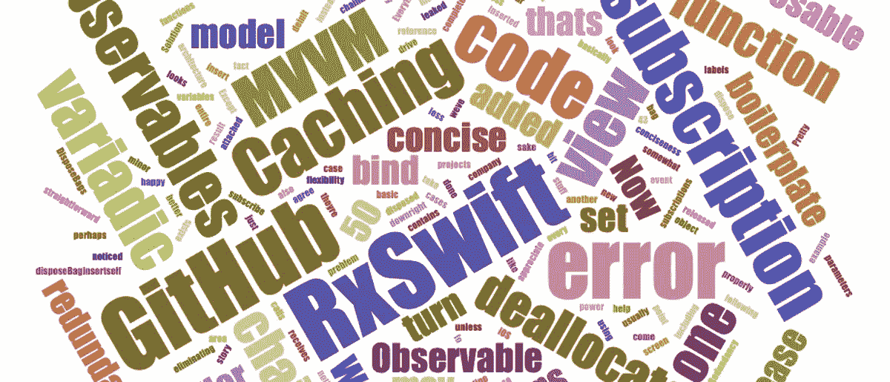

# RxSwift 和生产级代码

> 原文：<https://betterprogramming.pub/rxswift-github-search-done-right-d57aa042f97f>



## 加上其他一些我希望在我开始使用 RxSwift 时有人告诉我的事情

访问 GitHub 上的 [RxSwift 知识库，你会发现 RxSwift 威力的一个经典例子:GitHub 搜索。](https://github.com/ReactiveX/RxSwift)


在短短 18 行代码中，您实现了一个完整的用户界面，将一些搜索栏文本绑定到一个数据查询，然后将数据查询的结果直接绑定到一个表格视图。确实是很强大的东西。

但是，正如在早先的一篇文章 [RxSwift:复杂性权衡](https://medium.com/@michaellong/rxswift-the-complexity-tradeoff-61cf49e996f0)中提到的，为了简洁和清晰起见，这种样本代码进行了一些明显的权衡，并且还远远没有准备好投入生产。

## 什么是生产级代码？

首先，没有真正的错误处理代码。任何 API 错误都会被忽略，留给用户的是一个空的搜索屏幕。这远非理想。

我们当然希望向用户表明搜索正在进行中。

说到搜索，添加一个搜索缓存会很好。我们已经看到了结果，为什么还要再次使用 API 呢？

最后，所显示的搜索代码似乎是直接嵌入到视图控制器中的。这并不好——这种类型的逻辑应该出现在视图模型中(至少对 MVVM 来说是这样)。)

话说回来，支持所有这些东西会增加代码的复杂性，使其更难理解，并减少使用 RxSwift 的许多优势…不是吗？

让我们找出答案。

在这个过程中，我将展示一些 RxSwift 最佳实践、技巧和设计模式——我希望在我开始使用 RxSwift 时有人告诉过我这些事情。

# GitHub 搜索视图模型

让我们首先创建一个实现我们的搜索逻辑的视图模型。

按照我们修改后的要求，它接受一个搜索字符串，然后显示我们的搜索结果(或者一条错误消息，如果出现错误的话)。

看起来是这样的:

```
class GitHubSearchViewModel {
    public var data: Observable<[Repository]>!
    public var error: Observable<String?>!
    internal var searchService = GithubSearchService()
    public func configure(search: Observable<String>) {
        ...
    }
}
```

请注意，我们的数据和错误是作为简单的可观察对象而不是主体暴露出来的。这确保了只有我们的视图模型控制我们的视图控制器可能看到的任何事件。

此外，我们唯一的输入来自作为可观察参数传递给 configure 函数的搜索文本。这简化了代码和调试——我们现在知道只有一个地方事件会影响我们的视图模型。

例如，任何人都可以在任何时候调用一个独立且独特的`load()`函数，这增加了出现意外结果的可能性。

最后，我们还为 GithubSearchService 添加了一个变量，与原始示例中的 searchGitHub(query)函数一样，它将处理我们实际的 URLSession 数据任务请求。这是一个盲函数，所以我们也这样对待它。

总而言之，定义一个基本的视图模型只需要添加 7 行代码。

## 我们的配置功能

配置函数是最神奇的地方，所以让我们来实现它。

它包含了大部分的原始示例代码，以及一些改进错误处理的代码。

```
 public func configure(search: Observable<String>) {
        let result = search
            .flatMapLatest { [unowned self] text -> Observable<Event<[Repository]>> in
                if text.isEmpty {
                    return .just(.next([]))
                }
                return self.searchService.search(text)
                    .materialize()
            }
            .observeOn(MainScheduler.instance)
            .share()
    data = result
            .map { $0.element ?? [] }
    error = result
            .map { $0.error?.localizedDescription }
            .share()
    }
```

# 错误处理

如果你做过很多 RxSwift，或者你读过 [RxSwift:用 CompactMap](https://medium.com/@michaellong/rxswift-better-error-handling-with-compactmap-48a5d314d0f1) 更好地处理错误，上面的模式就很清楚了。

我们将异步搜索调用封装在一个`flatMapLatest`函数中，并将该函数的结果分成两个流——一个用于我们的数据，一个用于我们的错误。

我们的平面图的结果是一个`*Observable<Event<[Repository]>>*` *。我们将使用 RxSwift 的`materialize`功能将我们的数据和任何潜在的错误转化为一系列事件。这个函数代替了原始代码中简单的`.catchErrorJustReturn([])`行。*

如果搜索操作成功，我们的结果是类型`Event.next<[String]>` *。*如果出现错误，则为`Event.error(Swift.Error)` *。*在这两种情况下，我们都保护了我们的可观察流，防止任何错误逃离平面图并终止我们的事件流。(如果这还不清楚，CompactMap 文章使用`materialize`对此进行了更详细的解释。)

继续，对数据的赋值使用事件的*元素*变量从事件中提取可选数据。如果没有，我们返回一个空数组。

类似地，error 的赋值提取错误(如果有的话)。如果没有错误发生，可选的 unwrap 将为零，我们将传递它，这样任何以前的错误将被自动清除。

错误结果也是`shared()`，因为我们将在视图控制器中多次使用错误的输出。不必要的话，执行这些代码是没有意义的。

净结果:可观察值和五个数据/误差分割值。

## 活动指示器

正如我们的需求中提到的，我们希望向用户表明搜索正在进行中。如果您认为这意味着我们需要另一个可观察对象来显示我们正在处理一个请求，那么您就错了！

```
public var processing: Observable<Bool>!
```

为了支持它，我们只需要在配置函数的末尾添加两行代码。

```
processing = Observable<Bool>
    .merge( search.map { _ in true }, data.map { _ in false } )
```

这里，我们将原始的搜索事件映射到 *true* ，并使用它来触发我们的微调器。当我们在*结果*上看到一个事件，空或其他，我们将它映射到 *false* 并使用它来停止我们的旋转器旋转。

这两个事件被合并，并通过我们的单个暴露的`processing`标志发送出去。你会看到习语在 RxSwift 代码中使用了相当多的多重映射、合并事件。

又加了三行。

## 贮藏

我们想从修订后的需求列表中添加的最后一件事是某种形式的搜索结果缓存，所以我们不经常使用我们的 API。

缓存需要一个缓存，所以让我们添加一个。我们将使用一个简单的字典，将搜索关键字作为查找值:

```
internal var searchCache = [String:[Repository]]()
```

我们将在我们的`flatMapLatest`闭包内处理实现:

```
.flatMapLatest { [unowned self] text -> Observable<Event<[Repository]>> in
    if text.isEmpty {
        return .just(.next([]))
    }
    // check cache...
    let key = text.lowercased()
    if let cachedResult = self.searchCache[key] {
        return .just(.next(cachedResult))
    }
    return self.searchService.search(text)
        // cache results
        .do(onNext: { (results) in
            self.searchCache[key] = results
        })
        .materialize()
}
```

够直接了。如果我们的缓存包含来自原始搜索关键字的结果，我们只需在尝试 API 调用之前*返回它们。*

如果没有，我们进行搜索并添加一个`do(onNext: { … ))` 处理程序来捕获结果并将其添加到我们的缓存中。如果 API 调用出错，do 函数将被绕过。

如果您需要更健壮的缓存机制，您可以自由添加。只需将您的缓存请求和缓存插入函数调用插入到我们刚刚添加的代码中。

就这样，只剩下八行代码，这是我们的一个新特性所需要的最多的代码。

## 视图模型最终结果

如果您一直在跟踪，我们完成的视图模型应该是这样的:

```
class CachingGitHubSearchViewModel {
    public var data: Observable<[Repository]>!
    public var error: Observable<String?>!
    public var processing: Observable<Bool>!
    internal var searchService = GithubSearchService()
    internal var searchCache = [String:[Repository]]()
    public func configure(search: Observable<String>) {
        let result = search
            .flatMapLatest { [unowned self] text -> Observable<Event<[Repository]>> in
                if text.isEmpty {
                    return .just(.next([]))
                }
                let key = text.lowercased()
                if let cachedResult = self.searchCache[key] {
                    return .just(.next(cachedResult))
                }
                return self.searchService.search(text)
                    .do(onNext: { (results) in
                        self.searchCache[key] = results
                    })
                    .materialize()
            }
            .observeOn(MainScheduler.instance)
            .share()
    data = result
            .map { $0.element ?? [] }
    error = result
            .map { $0.error?.localizedDescription }
            .share()
    processing = Observable<Bool>
            .merge( 
               search.map { _ in true }, 
               data.map { _ in false } 
            )
    }
}
```

花点时间也注意一下我们的可观察对象是如何停留在流中的，从原始事件通过我们的处理代码直接进入我们的输出流。

这绝对是 RxSwift 的最佳实践。

## 更多代码？

比原来的代码多？当然了。事实上，几乎是两倍。但是我们添加了更好的错误处理、处理标志，同时实现了 API 缓存。

我也没有提到，添加的代码中大约有四分之一是需要将原始代码移动到视图模型中的——无论使用什么方法都是一种浪费。

# GitHub 搜索视图控制器

因为我们将大部分业务逻辑移到了视图模型中，所以我们的视图控制器应该相当简单。

的确如此。让我们看看外壳:

```
class GiHubSearchViewController: UIViewController {
    var viewModel = GitHubSearchViewModel()
    var disposeBag = DisposeBag()
    @IBOutlet var searchBar: UISearchBar!
    @IBOutlet var tableView: UITableView!
    @IBOutlet var activityIndicator: UIActivityIndicatorView!
    @IBOutlet var errorLabel: UILabel!
    override func viewDidLoad() {
        super.viewDidLoad()
        configureViewModel()
        setupObservables()
    }
   func configureViewModel() {
        ...
    }
    func setupObservables() {
        ...
    }
}
```

我们有了自己的视图模型，并实例化了一个 RxSwift `DisposeBag`。我们还有搜索栏、结果表视图、错误消息标签和活动指示器的出口。

`viewDidLoad()`函数调用 super，然后调用两个函数，一个用于配置视图模型，另一个用于绑定我们的观察对象。

请注意，无论是 RxSwift 还是其他，任何所需功能的实现都需要类定义、视图模型定义和出口。

## configureViewModel()

让我们从定义配置函数开始:

```
func configureViewModel() {
    let searchObservable = searchBar.rx.text
        .orEmpty
        .throttle(.milliseconds(500), scheduler: MainScheduler.instance)
        .distinctUntilChanged()
    viewModel.configure(search: searchObservable)
}
```

我们制作了一个可观察的搜索栏文本，并使用`orEmpty`使其成为一个值为零的字符串。`throttle`函数在发送事件之前等待半秒钟，有效地延迟了搜索，直到用户停止输入。

然后`distinctUntilChanged()`确保最终值实际上不同于之前的值，然后我们再用它来干扰我们的视图模型。

然后，我们将可观察的文本传递给视图模型。菲尼。

## setupObservables()

这是问题的核心。这个地方把我们所有的可观察事物和我们的各种观点联系在一起——这个地方给我们的表视图提供信息。一定很复杂，对吧？

你是法官:

```
func setupObservables() {
    disposeBag.insert(
        viewModel.data
            .bind(to: tableView.rx.items(cellIdentifier: "Cell")) { index, repository, cell in
                cell.textLabel?.text = repository.name
                cell.detailTextLabel?.text = repository.url
        },
        viewModel.error
            .bind(to: errorLabel.rx.text),
        viewModel.error
            .map { $0 == nil }
            .bind(to: errorLabel.rx.isHidden),
        viewModel.processing
            .bind(to: activityIndicator.rx.isAnimating)
    )
}
```

我们将存储库数据绑定到表视图，配置单元格。

我们将错误消息绑定到错误标签，并将相同的值映射到 *isHidden* 标志，因此错误标签可以适当地显示和隐藏。

我们将处理标志绑定到我们的 spinner。

注意这里我们使用了[变量 disposeBag 插入方法](https://medium.com/@michaellong/rxswifty-and-his-variadic-disposebag-1682ecceaf41)来清理代码。

然后…就这样。没有 tableView 委托。没有 tableView numberOfRows 或 cellForRowAtIndexPath 函数。

我们最终的视图控制器源代码如下:

```
class GiHubSearchViewController: UIViewController {
    var viewModel = CachingGitHubSearchViewModel()
    var disposeBag = DisposeBag()
    @IBOutlet var searchBar: UISearchBar!
    @IBOutlet var tableView: UITableView!
    @IBOutlet var activityIndicator: UIActivityIndicatorView!
    @IBOutlet var errorLabel: UILabel!
    override func viewDidLoad() {
        super.viewDidLoad()
        setupObservables()
    }
   func configureViewModel() {
        let searchObservable = searchBar.rx.text
            .orEmpty
            .throttle(.milliseconds(500), scheduler: MainScheduler.instance)
            .distinctUntilChanged()
        viewModel.configure(search: searchObservable)
    }
    func setupObservables() {
        disposeBag.insert(
            viewModel.data
                .bind(to: tableView.rx.items(cellIdentifier: "Cell")) { index, repository, cell in
                    cell.textLabel?.text = repository.name
                    cell.detailTextLabel?.text = repository.url
            },
            viewModel.error
                .bind(to: errorLabel.rx.text),
            viewModel.error
                .map { $0 == nil }
                .bind(to: errorLabel.rx.isHidden),
            viewModel.processing
                .bind(to: activityIndicator.rx.isAnimating)
        )
    }
}
```

# 完成处理程序

因此，我们采用了经典的 RxSwift GitHub 搜索演示代码，并将其转换为现代的 MVVM 生产就绪代码。

是的，代码有点长，但是它做得更多，启动起来更健壮。

我想再次强调，较长代码的很大一部分是样板类定义和 UIView 输出——无论您选择什么实现方法，RxSwift 或其他，这些都是非常必要的。

还展示了一些常见的 RxSwift 最佳实践，包括“流内”输入/输出可观察流、临时范围可观察流的使用，以及用于将输入流拆分为多个输出流的一些技术。

此外，我们还研究了这个过程中涉及的一些思维过程。

和往常一样，如果你有问题，请在下面的评论区留言，我会尽力回答。如果你想看更多这些“跟随代码”的文章，也请告诉我，或者如果你忙的话，请给我一个大拇指。

直到下次。