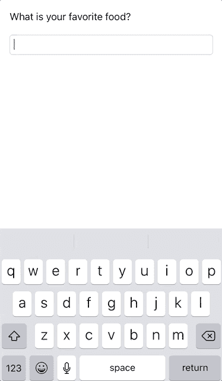

# RxSwift:让 UITextField 为 UILabel 设置一个值

> 原文：<https://betterprogramming.pub/rxswift-have-a-uitextfield-set-a-value-for-a-uilabel-31b5eb8c8a8d>

## 如何将文本字段链接到对用户输入做出反应的标签


照片由[艾丹·格兰贝里](https://unsplash.com/@atgranberry?utm_source=unsplash&utm_medium=referral&utm_content=creditCopyText)在 [Unsplash](https://unsplash.com/s/photos/type?utm_source=unsplash&utm_medium=referral&utm_content=creditCopyText) 上拍摄

RxSwift 是反应式编程的一个例子。您将使用 RxSwift 和 [RxCocoa](https://github.com/ReactiveX/RxSwift/tree/master/RxCocoa) 来实现一个`UITextField`和一个`UILabel`。你将在`UITextField`中输入你最喜欢的食物，然后在`UILabel`中看到它。

就这么简单。

# 先决条件

要跟随本教程，您需要:

*   对 Swift 的基本熟悉
*   至少 Xcode 11
*   Pod 安装 RxSwift 和 RxCocoa

# 导入

永远记住导入必要的库，在本例中是 RxSwift 和 RxCocoa。

```
import RxSwift
import RxCocoa
```

# 有约束力的

通常，在 RxSwift 中，您会将组件绑定在一起，如下所示:

```
// 1
foodTextField.rx
// 2
.controlEvent(.editingDidEnd)
// 3
.withLatestFrom(foodTextField.rx.text.orEmpty)
//4
.subscribe(onNext: { text in
    // 5
    self.foodLabel.text = "My favorite food is \(text)"
// 6
}).disposed(by: disposeBag)
```

1.  `foodTextField`其实是`UITextField`的一个`@IBOutlet`。为了使用 RxSwift，你必须在它后面插入`rx`。
2.  只有在完成编辑后，您才能触发该功能。您可以更改控制事件。
3.  这是一个运算符，它每次都使用第二个序列中的最新元素将两个可观测序列合并为一个可观测序列。然而，在这种情况下，您可以假设它总是采用最新的值。另一方面，`rx.text.orEmpty`基本上解开了可选。
4.  `onNext`将返回可观察到的序列，基本上就是你在`UITextField`上输入的任何东西。
5.  这是您将值分配到`UILabel`的地方。
6.  这基本上是内存管理，当你使用完内存后，由`deinit`为你处理内存。

# 点燃它

是时候点亮它了，这样你就能看到 RxSwift 的魔力了。您可能会得到一个错误，上面写着“使用未解析的标识符`disposeBag`”您需要首先声明该变量。

```
let disposeBag = DisposeBag()
```

将您的函数放在一个名为`setupBinding`的新函数中，并将它放在`viewDidLoad`中。

```
override func viewDidLoad() {
    super.viewDidLoad()
    setupBinding()
}
```

一切就绪后，您就为 RxSwift 效应做好了准备。

