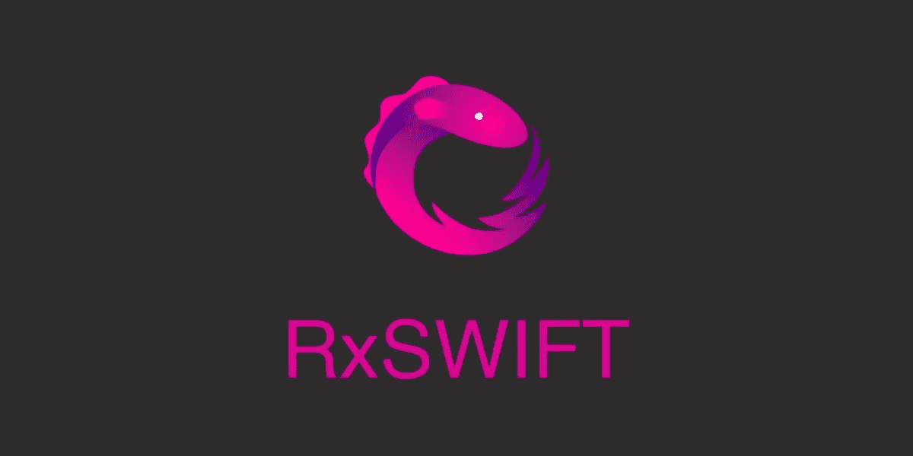
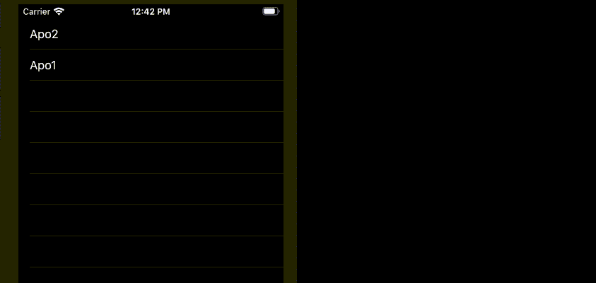
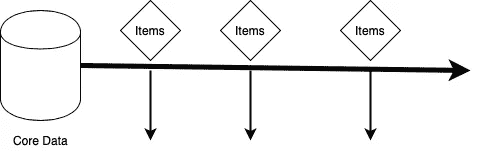
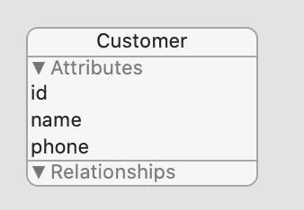

# RxSwift、可观察数据和核心数据

> 原文：<https://betterprogramming.pub/rxswift-observable-and-core-data-55ab87fc02ea>

## 创建从核心数据到用户界面的连续信息流



许多 iOS 应用程序最常见的一些用例是显示存储在核心数据中的对象。这个问题有很多解决方法，和有些真的挺好的。然而，我宁愿用函数方法来解决这个问题。

通常，我们希望更新我们的用户界面:



*   当数据库项更改时。
*   当我们向数据库添加新项目时。
*   当我们从数据库中删除项目时。

苹果为我们提供了[NSFetchedResultsController](https://developer.apple.com/documentation/coredata/nsfetchedresultscontroller)，它的工作做得相当不错。但是真的显老了。

理想情况下，我希望有一个可观察对象，它能给我当前存储的对象，并在任何更新发生时发送新的值。



# 解决办法

我把我对这个问题的解决方案命名为`CDObservable`。

```
**class** CDObservable<T>: ObservableType **where** T: NSManagedObject
```

假设我们有一个名为`Customer`的核心数据实体:



我们将用一个`FetchRequest`和一个`NSManagedObjectContext`初始化我们的`CDObservable`，并用一个`BehaviorSubject`向所有订户发送值。

代码的工作方式如下:

1.  当第一个观察者订阅这个可观察对象时，就会创建一个`NSFetchedResultsController`,它给出的每个结果都会被发送给这个观察者。
2.  如果另一个观察者订阅，它将使用相同的`NSFetchedResultsController`来获得结果。
3.  当所有观察者都放弃他们的订阅时，`NSFetchResultController`被释放。

## 从这里做什么

*   使用`RxDataSources`填充一个`tableView`:

*   使用不同的数据源更新您的`tableView`:

*   你也可以使用传统的`reload()`方法更新你的`tableView`，但是我不推荐这样做。

我有一个与 Swift Combine 类似的解决方案，但那是另一个作品。快乐编码。